<!-- audit-loop:architectural-map -->
# Architecture Map — Lbstrydom/claude-engineering-skills

- Generated: 2026-05-03T14:57:24.600Z   commit: a105e6884f1b   refresh_id: 734c05de-ba1a-4e1b-bf49-8350569205e6
- Drift score: 0 / threshold 20   status: `INSUFFICIENT_DATA`
- Domains: 16   Symbols: 837   Layering violations: 0

## Contents
- [arch-memory](#arch-memory) — 41 symbols
- [audit-orchestration](#audit-orchestration) — 59 symbols
- [brainstorm](#brainstorm) — 14 symbols
- [claudemd-management](#claudemd-management) — 30 symbols
- [cross-skill-bridge](#cross-skill-bridge) — 38 symbols
- [findings](#findings) — 22 symbols
- [install](#install) — 122 symbols
- [learning-store](#learning-store) — 99 symbols
- [memory-health](#memory-health) — 7 symbols
- [plan](#plan) — 8 symbols
- [root-scripts](#root-scripts) — 13 symbols
- [scripts](#scripts) — 17 symbols
- [shared-lib](#shared-lib) — 234 symbols
- [stores](#stores) — 21 symbols
- [tech-debt](#tech-debt) — 71 symbols
- [tests](#tests) — 41 symbols

---

## arch-memory

```mermaid
flowchart TB
subgraph dom_arch_memory ["arch-memory"]
  file_scripts_lib_symbol_index_domain_tagger_m["scripts/lib/symbol-index/domain-tagger.mjs"]:::component
  sym_scripts_lib_symbol_index_domain_tagger_m["globToRegexBody"]:::symbol
  file_scripts_lib_symbol_index_domain_tagger_m --> sym_scripts_lib_symbol_index_domain_tagger_m
  sym_scripts_lib_symbol_index_domain_tagger_m["loadDomainRules"]:::symbol
  file_scripts_lib_symbol_index_domain_tagger_m --> sym_scripts_lib_symbol_index_domain_tagger_m
  sym_scripts_lib_symbol_index_domain_tagger_m["matchGlob"]:::symbol
  file_scripts_lib_symbol_index_domain_tagger_m --> sym_scripts_lib_symbol_index_domain_tagger_m
  sym_scripts_lib_symbol_index_domain_tagger_m["tagDomain"]:::symbol
  file_scripts_lib_symbol_index_domain_tagger_m --> sym_scripts_lib_symbol_index_domain_tagger_m
  file_scripts_symbol_index_drift_mjs["scripts/symbol-index/drift.mjs"]:::component
  sym_scripts_symbol_index_drift_mjs_atomicWri["atomicWrite"]:::symbol
  file_scripts_symbol_index_drift_mjs --> sym_scripts_symbol_index_drift_mjs_atomicWri
  sym_scripts_symbol_index_drift_mjs_classify["classify"]:::symbol
  file_scripts_symbol_index_drift_mjs --> sym_scripts_symbol_index_drift_mjs_classify
  sym_scripts_symbol_index_drift_mjs_main["main"]:::symbol
  file_scripts_symbol_index_drift_mjs --> sym_scripts_symbol_index_drift_mjs_main
  sym_scripts_symbol_index_drift_mjs_parseArgs["parseArgs"]:::symbol
  file_scripts_symbol_index_drift_mjs --> sym_scripts_symbol_index_drift_mjs_parseArgs
  sym_scripts_symbol_index_drift_mjs_renderMar["renderMarkdownViaShared"]:::symbol
  file_scripts_symbol_index_drift_mjs --> sym_scripts_symbol_index_drift_mjs_renderMar
  file_scripts_symbol_index_embed_mjs["scripts/symbol-index/embed.mjs"]:::component
  sym_scripts_symbol_index_embed_mjs_compose["compose"]:::symbol
  file_scripts_symbol_index_embed_mjs --> sym_scripts_symbol_index_embed_mjs_compose
  sym_scripts_symbol_index_embed_mjs_embedBatc["embedBatch"]:::symbol
  file_scripts_symbol_index_embed_mjs --> sym_scripts_symbol_index_embed_mjs_embedBatc
  sym_scripts_symbol_index_embed_mjs_emit["emit"]:::symbol
  file_scripts_symbol_index_embed_mjs --> sym_scripts_symbol_index_embed_mjs_emit
  sym_scripts_symbol_index_embed_mjs_getGemini["getGeminiClient"]:::symbol
  file_scripts_symbol_index_embed_mjs --> sym_scripts_symbol_index_embed_mjs_getGemini
  sym_scripts_symbol_index_embed_mjs_logProgre["logProgress"]:::symbol
  file_scripts_symbol_index_embed_mjs --> sym_scripts_symbol_index_embed_mjs_logProgre
  sym_scripts_symbol_index_embed_mjs_main["main"]:::symbol
  file_scripts_symbol_index_embed_mjs --> sym_scripts_symbol_index_embed_mjs_main
  file_scripts_symbol_index_extract_mjs["scripts/symbol-index/extract.mjs"]:::component
  sym_scripts_symbol_index_extract_mjs_emit["emit"]:::symbol
  file_scripts_symbol_index_extract_mjs --> sym_scripts_symbol_index_extract_mjs_emit
  sym_scripts_symbol_index_extract_mjs_emitPro["emitProgress"]:::symbol
  file_scripts_symbol_index_extract_mjs --> sym_scripts_symbol_index_extract_mjs_emitPro
  sym_scripts_symbol_index_extract_mjs_enumera["enumerateFiles"]:::symbol
  file_scripts_symbol_index_extract_mjs --> sym_scripts_symbol_index_extract_mjs_enumera
  sym_scripts_symbol_index_extract_mjs_extract["extractGraphAndViolations"]:::symbol
  file_scripts_symbol_index_extract_mjs --> sym_scripts_symbol_index_extract_mjs_extract
  sym_scripts_symbol_index_extract_mjs_extract["extractSymbols"]:::symbol
  file_scripts_symbol_index_extract_mjs --> sym_scripts_symbol_index_extract_mjs_extract
  sym_scripts_symbol_index_extract_mjs_main["main"]:::symbol
  file_scripts_symbol_index_extract_mjs --> sym_scripts_symbol_index_extract_mjs_main
  sym_scripts_symbol_index_extract_mjs_parseAr["parseArgs"]:::symbol
  file_scripts_symbol_index_extract_mjs --> sym_scripts_symbol_index_extract_mjs_parseAr
  file_scripts_symbol_index_prune_mjs["scripts/symbol-index/prune.mjs"]:::component
  sym_scripts_symbol_index_prune_mjs_main["main"]:::symbol
  file_scripts_symbol_index_prune_mjs --> sym_scripts_symbol_index_prune_mjs_main
  sym_scripts_symbol_index_prune_mjs_parseArgs["parseArgs"]:::symbol
  file_scripts_symbol_index_prune_mjs --> sym_scripts_symbol_index_prune_mjs_parseArgs
  file_scripts_symbol_index_refresh_mjs["scripts/symbol-index/refresh.mjs"]:::component
  sym_scripts_symbol_index_refresh_mjs_gitComm["gitCommitSha"]:::symbol
  file_scripts_symbol_index_refresh_mjs --> sym_scripts_symbol_index_refresh_mjs_gitComm
  sym_scripts_symbol_index_refresh_mjs_gitDiff["gitDiffWithWorkingTree"]:::symbol
  file_scripts_symbol_index_refresh_mjs --> sym_scripts_symbol_index_refresh_mjs_gitDiff
  sym_scripts_symbol_index_refresh_mjs_isSafeG["isSafeGitRevision"]:::symbol
  file_scripts_symbol_index_refresh_mjs --> sym_scripts_symbol_index_refresh_mjs_isSafeG
  sym_scripts_symbol_index_refresh_mjs_logErr["logErr"]:::symbol
  file_scripts_symbol_index_refresh_mjs --> sym_scripts_symbol_index_refresh_mjs_logErr
  sym_scripts_symbol_index_refresh_mjs_logOk["logOk"]:::symbol
  file_scripts_symbol_index_refresh_mjs --> sym_scripts_symbol_index_refresh_mjs_logOk
  sym_scripts_symbol_index_refresh_mjs_main["main"]:::symbol
  file_scripts_symbol_index_refresh_mjs --> sym_scripts_symbol_index_refresh_mjs_main
  sym_scripts_symbol_index_refresh_mjs_parseAr["parseArgs"]:::symbol
  file_scripts_symbol_index_refresh_mjs --> sym_scripts_symbol_index_refresh_mjs_parseAr
  sym_scripts_symbol_index_refresh_mjs_runJson["runJsonLines"]:::symbol
  file_scripts_symbol_index_refresh_mjs --> sym_scripts_symbol_index_refresh_mjs_runJson
  sym_scripts_symbol_index_refresh_mjs_runWith["runWithHeartbeat"]:::symbol
  file_scripts_symbol_index_refresh_mjs --> sym_scripts_symbol_index_refresh_mjs_runWith
  file_scripts_symbol_index_render_mermaid_mjs["scripts/symbol-index/render-mermaid.mjs"]:::component
  sym_scripts_symbol_index_render_mermaid_mjs_["classify"]:::symbol
  file_scripts_symbol_index_render_mermaid_mjs --> sym_scripts_symbol_index_render_mermaid_mjs_
  sym_scripts_symbol_index_render_mermaid_mjs_["commitSha"]:::symbol
  file_scripts_symbol_index_render_mermaid_mjs --> sym_scripts_symbol_index_render_mermaid_mjs_
  sym_scripts_symbol_index_render_mermaid_mjs_["main"]:::symbol
  file_scripts_symbol_index_render_mermaid_mjs --> sym_scripts_symbol_index_render_mermaid_mjs_
  sym_scripts_symbol_index_render_mermaid_mjs_["parseArgs"]:::symbol
  file_scripts_symbol_index_render_mermaid_mjs --> sym_scripts_symbol_index_render_mermaid_mjs_
  file_scripts_symbol_index_summarise_mjs["scripts/symbol-index/summarise.mjs"]:::component
  sym_scripts_symbol_index_summarise_mjs_emit["emit"]:::symbol
  file_scripts_symbol_index_summarise_mjs --> sym_scripts_symbol_index_summarise_mjs_emit
  sym_scripts_symbol_index_summarise_mjs_logPr["logProgress"]:::symbol
  file_scripts_symbol_index_summarise_mjs --> sym_scripts_symbol_index_summarise_mjs_logPr
  sym_scripts_symbol_index_summarise_mjs_main["main"]:::symbol
  file_scripts_symbol_index_summarise_mjs --> sym_scripts_symbol_index_summarise_mjs_main
  sym_scripts_symbol_index_summarise_mjs_summa["summariseBatch"]:::symbol
  file_scripts_symbol_index_summarise_mjs --> sym_scripts_symbol_index_summarise_mjs_summa
end
classDef container fill:#f5f5f5,stroke:#333,stroke-width:2px,color:#000
classDef component fill:#e8f0ff,stroke:#3178c6,color:#000
classDef symbol fill:#fff,stroke:#999,color:#444
classDef dup fill:#ffe8d8,stroke:#c0392b,stroke-width:2px,color:#000
classDef violation fill:#ffd6d6,stroke:#c0392b,stroke-width:2px,color:#000
```

### Symbols in this domain

| Symbol | Kind | Path | Lines | Purpose |
|---|---|---|---|---|
| [`globToRegexBody`](../scripts/lib/symbol-index/domain-tagger.mjs#L51) | function | `scripts/lib/symbol-index/domain-tagger.mjs` | 51-80 | Converts a glob pattern string into the body of a regular expression, handling `**` (any chars including slashes), `*` (any chars except slashes), and literal characters. |
| [`loadDomainRules`](../scripts/lib/symbol-index/domain-tagger.mjs#L112) | function | `scripts/lib/symbol-index/domain-tagger.mjs` | 112-139 | Loads and validates domain tagging rules from a JSON file at a fixed relative path, filtering out malformed entries and logging warnings for invalid rules. |
| [`matchGlob`](../scripts/lib/symbol-index/domain-tagger.mjs#L38) | function | `scripts/lib/symbol-index/domain-tagger.mjs` | 38-49 | Tests whether a file path matches a glob pattern by normalizing both and applying anchored regex matching. |
| [`tagDomain`](../scripts/lib/symbol-index/domain-tagger.mjs#L89) | function | `scripts/lib/symbol-index/domain-tagger.mjs` | 89-96 | Finds the domain tag for a file by iterating through pattern-matching rules and returning the domain of the first matching rule. |
| [`atomicWrite`](../scripts/symbol-index/drift.mjs#L40) | function | `scripts/symbol-index/drift.mjs` | 40-46 | Atomically writes content to a file via temporary file and rename to prevent corruption. |
| [`classify`](../scripts/symbol-index/drift.mjs#L48) | function | `scripts/symbol-index/drift.mjs` | 48-52 | Classifies drift scores into GREEN/AMBER/RED status levels. |
| [`main`](../scripts/symbol-index/drift.mjs#L73) | function | `scripts/symbol-index/drift.mjs` | 73-114 | Main entry point that computes drift score, classifies status, and outputs markdown or JSON report. |
| [`parseArgs`](../scripts/symbol-index/drift.mjs#L31) | function | `scripts/symbol-index/drift.mjs` | 31-38 | Parses command-line arguments for output file and JSON format flag. |
| [`renderMarkdownViaShared`](../scripts/symbol-index/drift.mjs#L58) | function | `scripts/symbol-index/drift.mjs` | 58-71 | Renders drift issue data into markdown via shared rendering function. |
| [`compose`](../scripts/symbol-index/embed.mjs#L82) | function | `scripts/symbol-index/embed.mjs` | 82-88 | Composes stable text representation of symbol from kind, name, file, summary, and signature. |
| [`embedBatch`](../scripts/symbol-index/embed.mjs#L35) | function | `scripts/symbol-index/embed.mjs` | 35-80 | Embeds text batch using Gemini API with retry/backoff for rate-limit and transient errors. |
| [`emit`](../scripts/symbol-index/embed.mjs#L17) | function | `scripts/symbol-index/embed.mjs` | 17-17 | Writes a JSON object to stdout as a single line. |
| [`getGeminiClient`](../scripts/symbol-index/embed.mjs#L22) | function | `scripts/symbol-index/embed.mjs` | 22-28 | Returns cached or newly initialized Gemini API client if GEMINI_API_KEY is set. |
| [`logProgress`](../scripts/symbol-index/embed.mjs#L18) | function | `scripts/symbol-index/embed.mjs` | 18-18 | Writes a progress message to stderr with [embed] prefix. |
| [`main`](../scripts/symbol-index/embed.mjs#L90) | function | `scripts/symbol-index/embed.mjs` | 90-132 | Main entry point that reads symbols from stdin, batches them, embeds via Gemini, and outputs results. |
| [`emit`](../scripts/symbol-index/extract.mjs#L47) | function | `scripts/symbol-index/extract.mjs` | 47-49 | Writes a JSON object to stdout as a single line. |
| [`emitProgress`](../scripts/symbol-index/extract.mjs#L51) | function | `scripts/symbol-index/extract.mjs` | 51-53 | Writes an extraction progress message to stderr with [extract] prefix. |
| [`enumerateFiles`](../scripts/symbol-index/extract.mjs#L282) | function | `scripts/symbol-index/extract.mjs` | 282-300 | Recursively walks directory tree to enumerate source files, or returns restricted file list if provided. |
| [`extractGraphAndViolations`](../scripts/symbol-index/extract.mjs#L206) | function | `scripts/symbol-index/extract.mjs` | 206-253 | Runs dependency-cruiser on detected source directories and emits dependency violations. |
| [`extractSymbols`](../scripts/symbol-index/extract.mjs#L62) | function | `scripts/symbol-index/extract.mjs` | 62-199 | Extracts function, class, interface, enum, and type symbols from TypeScript/JavaScript files using ts-morph. |
| [`main`](../scripts/symbol-index/extract.mjs#L302) | function | `scripts/symbol-index/extract.mjs` | 302-311 | Main entry point that extracts symbols and dependency graph, then outputs summary counts. |
| [`parseArgs`](../scripts/symbol-index/extract.mjs#L35) | function | `scripts/symbol-index/extract.mjs` | 35-45 | Parses command-line arguments for root directory, file list, mode, and since-commit filter. |
| [`main`](../scripts/symbol-index/prune.mjs#L39) | function | `scripts/symbol-index/prune.mjs` | 39-120 | Main entry point that prunes old refresh runs from database based on retention class and age thresholds. |
| [`parseArgs`](../scripts/symbol-index/prune.mjs#L26) | function | `scripts/symbol-index/prune.mjs` | 26-32 | Parses command-line arguments for dry-run flag. |
| [`gitCommitSha`](../scripts/symbol-index/refresh.mjs#L68) | function | `scripts/symbol-index/refresh.mjs` | 68-71 | Returns current git HEAD commit SHA, or null if not in a git repo. |
| [`gitDiffWithWorkingTree`](../scripts/symbol-index/refresh.mjs#L92) | function | `scripts/symbol-index/refresh.mjs` | 92-125 | Uses git diff and git ls-files to enumerate files added, modified, deleted, renamed, and untracked since a commit. |
| [`isSafeGitRevision`](../scripts/symbol-index/refresh.mjs#L79) | function | `scripts/symbol-index/refresh.mjs` | 79-83 | Validates that a git revision string is safe (alphanumeric plus limited punctuation, no spaces or shell metas). |
| [`logErr`](../scripts/symbol-index/refresh.mjs#L65) | function | `scripts/symbol-index/refresh.mjs` | 65-65 | Writes an error message to stderr with [refresh] prefix. |
| [`logOk`](../scripts/symbol-index/refresh.mjs#L66) | function | `scripts/symbol-index/refresh.mjs` | 66-66 | Writes a success message to stderr with [refresh] prefix. |
| [`main`](../scripts/symbol-index/refresh.mjs#L157) | function | `scripts/symbol-index/refresh.mjs` | 157-387 | Main entry point that orchestrates full symbol index refresh: detects stack, resolves identity, extracts symbols, computes embeddings and summaries, and reports completion. |
| [`parseArgs`](../scripts/symbol-index/refresh.mjs#L54) | function | `scripts/symbol-index/refresh.mjs` | 54-63 | Parses command-line arguments for full refresh, since-commit filter, and force flag. |
| [`runJsonLines`](../scripts/symbol-index/refresh.mjs#L131) | function | `scripts/symbol-index/refresh.mjs` | 131-146 | Runs a command synchronously, captures JSON-lines output, parses each line, and returns array of objects. |
| [`runWithHeartbeat`](../scripts/symbol-index/refresh.mjs#L148) | function | `scripts/symbol-index/refresh.mjs` | 148-155 | Executes an async function while periodically sending heartbeat updates at specified intervals. |
| [`classify`](../scripts/symbol-index/render-mermaid.mjs#L44) | function | `scripts/symbol-index/render-mermaid.mjs` | 44-48 | Classifies drift scores into GREEN/AMBER/RED status levels. |
| [`commitSha`](../scripts/symbol-index/render-mermaid.mjs#L39) | function | `scripts/symbol-index/render-mermaid.mjs` | 39-42 | Returns first 12 characters of current git HEAD SHA, or null if not in a git repo. |
| [`main`](../scripts/symbol-index/render-mermaid.mjs#L50) | function | `scripts/symbol-index/render-mermaid.mjs` | 50-133 | Main entry point that renders architecture map from stored symbols and generates Mermaid diagram markdown. |
| [`parseArgs`](../scripts/symbol-index/render-mermaid.mjs#L31) | function | `scripts/symbol-index/render-mermaid.mjs` | 31-37 | Parses command-line arguments for output file path. |
| [`emit`](../scripts/symbol-index/summarise.mjs#L26) | function | `scripts/symbol-index/summarise.mjs` | 26-26 | Writes a JSON object to stdout as a single line. |
| [`logProgress`](../scripts/symbol-index/summarise.mjs#L27) | function | `scripts/symbol-index/summarise.mjs` | 27-27 | Writes a summarization progress message to stderr with [summarise] prefix. |
| [`main`](../scripts/symbol-index/summarise.mjs#L70) | function | `scripts/symbol-index/summarise.mjs` | 70-113 | Main entry point that reads symbols from stdin, batches them, calls Claude summarizer, and outputs enriched records. |
| [`summariseBatch`](../scripts/symbol-index/summarise.mjs#L33) | function | `scripts/symbol-index/summarise.mjs` | 33-68 | Batches symbols and calls Claude API to generate one-line purpose summaries for each, with fallback on API errors. |

---

## audit-orchestration

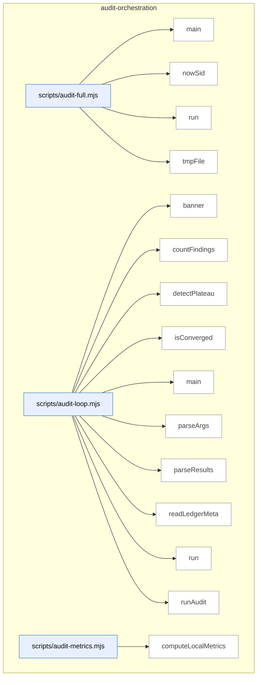

_Domain has 59 symbols (>50). Diagram shows top-15 by file order; see flat table below for the full list._

### Symbols in this domain

| Symbol | Kind | Path | Lines | Purpose |
|---|---|---|---|---|
| [`main`](../scripts/audit-full.mjs#L44) | function | `scripts/audit-full.mjs` | 44-127 | Chains GPT audit with optional Gemini review in a single pipeline, skipping Gemini only when both API keys are absent. |
| [`nowSid`](../scripts/audit-full.mjs#L31) | function | `scripts/audit-full.mjs` | 31-33 | Generates a timestamped session ID with a given prefix. |
| [`run`](../scripts/audit-full.mjs#L39) | function | `scripts/audit-full.mjs` | 39-42 | Spawns a child process synchronously and returns its exit code and signal. |
| [`tmpFile`](../scripts/audit-full.mjs#L35) | function | `scripts/audit-full.mjs` | 35-37 | Returns the full path to a temporary file by name in the system temp directory. |
| [`banner`](../scripts/audit-loop.mjs#L26) | function | `scripts/audit-loop.mjs` | 26-29 | Prints a centered banner line with styled text for section separation. |
| [`countFindings`](../scripts/audit-loop.mjs#L70) | function | `scripts/audit-loop.mjs` | 70-77 | Counts findings by severity level from audit results, returning zero counts if results are missing. |
| [`detectPlateau`](../scripts/audit-loop.mjs#L92) | function | `scripts/audit-loop.mjs` | 92-108 | Detects a plateau in progress by checking if HIGH findings decreased <30% for 2+ consecutive rounds. |
| [`isConverged`](../scripts/audit-loop.mjs#L79) | function | `scripts/audit-loop.mjs` | 79-83 | Declares convergence when no HIGH findings remain and MEDIUM findings are ≤2 (or false if audit failed). |
| [`main`](../scripts/audit-loop.mjs#L168) | function | `scripts/audit-loop.mjs` | 168-525 | <no body> |
| [`parseArgs`](../scripts/audit-loop.mjs#L128) | function | `scripts/audit-loop.mjs` | 128-164 | Parses command-line arguments into an object with defaults for audit mode, plan file, rounds, and optional flags. |
| [`parseResults`](../scripts/audit-loop.mjs#L61) | function | `scripts/audit-loop.mjs` | 61-68 | Reads and parses JSON from a file, returning null on parse failure. |
| [`readLedgerMeta`](../scripts/audit-loop.mjs#L118) | function | `scripts/audit-loop.mjs` | 118-126 | Safely reads and returns the metadata object from a JSON ledger file. |
| [`run`](../scripts/audit-loop.mjs#L31) | function | `scripts/audit-loop.mjs` | 31-44 | Executes a command synchronously with encoding, timeout, and error handling options. |
| [`runAudit`](../scripts/audit-loop.mjs#L46) | function | `scripts/audit-loop.mjs` | 46-59 | Runs openai-audit.mjs as a subprocess, capturing both stdout and stderr separately. |
| [`computeLocalMetrics`](../scripts/audit-metrics.mjs#L56) | function | `scripts/audit-metrics.mjs` | 56-72 | Extracts recent outcomes from local JSONL file and aggregates acceptance rates by pass name. |
| [`displayMetrics`](../scripts/audit-metrics.mjs#L76) | function | `scripts/audit-metrics.mjs` | 76-145 | <no body> |
| [`fetchCloudMetrics`](../scripts/audit-metrics.mjs#L37) | function | `scripts/audit-metrics.mjs` | 37-54 | Fetches audit runs, pass statistics, and findings from Supabase filtered by the past N days. |
| [`main`](../scripts/audit-metrics.mjs#L149) | function | `scripts/audit-metrics.mjs` | 149-158 | Loads cloud and local metrics, then outputs them as JSON or formatted text. |
| [`_collectMaxLengths`](../scripts/gemini-review.mjs#L100) | function | `scripts/gemini-review.mjs` | 100-118 | Recursively traverses a JSON schema to collect maximum string lengths for all fields and stores them in a map. |
| [`addSemanticIds`](../scripts/gemini-review.mjs#L805) | function | `scripts/gemini-review.mjs` | 805-813 | Assigns semantic IDs and hashes to each new finding for deduplication and tracking across runs. |
| [`applyDebtSuppression`](../scripts/gemini-review.mjs#L768) | function | `scripts/gemini-review.mjs` | 768-803 | Applies Jaccard similarity matching to suppress new findings that match pre-filtered debt topics, logging suppression details. |
| [`buildClient`](../scripts/gemini-review.mjs#L734) | function | `scripts/gemini-review.mjs` | 734-741 | Instantiates a client for the selected provider (Gemini or Claude) with appropriate API key. |
| [`callClaudeOpus`](../scripts/gemini-review.mjs#L386) | function | `scripts/gemini-review.mjs` | 386-449 | Calls Claude Opus API with timeout handling, parses JSON response, validates with Zod schema, and returns usage metrics and latency. |
| [`callGemini`](../scripts/gemini-review.mjs#L278) | function | `scripts/gemini-review.mjs` | 278-372 | Calls Gemini API with streaming to support large output tokens, accumulates response chunks, parses JSON, truncates verbose fields, and validates against a Zod schema. |
| [`emitReviewOutput`](../scripts/gemini-review.mjs#L815) | function | `scripts/gemini-review.mjs` | 815-830 | Outputs review results as JSON or markdown based on flags, writes to file if specified, and records new findings. |
| [`formatReviewResult`](../scripts/gemini-review.mjs#L574) | function | `scripts/gemini-review.mjs` | 574-637 | Formats a review result object as a markdown report including verdict, deliberation quality, architectural coherence, and lists of wrongly dismissed findings. |
| [`getReviewPrompt`](../scripts/gemini-review.mjs#L259) | function | `scripts/gemini-review.mjs` | 259-261 | Returns the active prompt for gemini-review or a default system prompt if none is set. |
| [`isJsonTruncationError`](../scripts/gemini-review.mjs#L743) | function | `scripts/gemini-review.mjs` | 743-747 | Checks if an error indicates JSON truncation during LLM response parsing. |
| [`main`](../scripts/gemini-review.mjs#L901) | function | `scripts/gemini-review.mjs` | 901-937 | Validates arguments, reads input files, selects provider, runs final review with retry logic, applies debt suppression, and outputs results. |
| [`parseReviewArgs`](../scripts/gemini-review.mjs#L693) | function | `scripts/gemini-review.mjs` | 693-704 | Parses command-line arguments for the final review script, extracting plan file, transcript file, output format, provider, and audit mode. |
| [`recordGeminiOutcomes`](../scripts/gemini-review.mjs#L877) | function | `scripts/gemini-review.mjs` | 877-899 | Records review outcomes (new findings, wrongly dismissed) and computes bandit reward based on verdict, updating the learning system. |
| [`recordNewFindings`](../scripts/gemini-review.mjs#L832) | function | `scripts/gemini-review.mjs` | 832-851 | Records new findings from the review as outcomes in the learning system with metadata for bandit tracking. |
| [`recordWronglyDismissed`](../scripts/gemini-review.mjs#L853) | function | `scripts/gemini-review.mjs` | 853-875 | Records wrongly dismissed findings as outcomes for the learning system to improve future review accuracy. |
| [`refreshCatalogAndWarn`](../scripts/gemini-review.mjs#L643) | function | `scripts/gemini-review.mjs` | 643-654 | Refreshes the live model catalog and warns if the current session's model differs from the latest available version. |
| [`runFinalReview`](../scripts/gemini-review.mjs#L462) | function | `scripts/gemini-review.mjs` | 462-570 | Extracts code file paths from a transcript, reads referenced files as context, collects debt-suppression rules, and prepares inputs for final review. |
| [`runPing`](../scripts/gemini-review.mjs#L686) | function | `scripts/gemini-review.mjs` | 686-691 | Runs ping tests for Gemini and/or Claude if their API keys are set, exiting with status indicating success or failure. |
| [`runPingClaude`](../scripts/gemini-review.mjs#L668) | function | `scripts/gemini-review.mjs` | 668-684 | Tests Claude Opus API connectivity by sending a prompt and verifying the response. |
| [`runPingGemini`](../scripts/gemini-review.mjs#L656) | function | `scripts/gemini-review.mjs` | 656-666 | Tests Gemini API connectivity by sending a prompt and verifying the response. |
| [`runReviewWithRetry`](../scripts/gemini-review.mjs#L749) | function | `scripts/gemini-review.mjs` | 749-766 | Retries final review with conciseness instruction if JSON truncation occurs, falling back to throwing the error after max attempts. |
| [`selectProvider`](../scripts/gemini-review.mjs#L706) | function | `scripts/gemini-review.mjs` | 706-732 | Selects a LLM provider (Gemini or Claude) based on CLI override or available environment variables, with error handling. |
| [`truncateToSchema`](../scripts/gemini-review.mjs#L132) | function | `scripts/gemini-review.mjs` | 132-152 | Recursively truncates object values to their schema-defined maxLength limits, tracking which fields were truncated. |
| [`_callGPTOnce`](../scripts/openai-audit.mjs#L358) | function | `scripts/openai-audit.mjs` | 358-449 | Calls OpenAI's API once with retry logic, handling reasoning effort, timeouts, and incomplete responses. |
| [`applyExclusions`](../scripts/openai-audit.mjs#L138) | function | `scripts/openai-audit.mjs` | 138-147 | Filters a file list by excluding paths matching glob patterns from the exclusion list. |
| [`cachePassResult`](../scripts/openai-audit.mjs#L534) | function | `scripts/openai-audit.mjs` | 534-542 | Writes a pass result to a JSON file in the cache directory. |
| [`cacheWaveResults`](../scripts/openai-audit.mjs#L544) | function | `scripts/openai-audit.mjs` | 544-549 | Caches multiple pass results and logs the cache location. |
| [`callGPT`](../scripts/openai-audit.mjs#L455) | function | `scripts/openai-audit.mjs` | 455-494 | Retries an OpenAI call on transient errors with exponential backoff, accumulating usage metrics across attempts. |
| [`cleanupCache`](../scripts/openai-audit.mjs#L551) | function | `scripts/openai-audit.mjs` | 551-554 | Removes the temporary cache directory and all its contents. |
| [`getPassPrompt`](../scripts/openai-audit.mjs#L337) | function | `scripts/openai-audit.mjs` | 337-341 | Returns the active/registered prompt for a pass name, falling back to the default PASS_PROMPTS table. |
| [`initResultCache`](../scripts/openai-audit.mjs#L524) | function | `scripts/openai-audit.mjs` | 524-532 | Initializes a temporary cache directory for storing intermediate pass results during an audit run. |
| [`loadExcludePatterns`](../scripts/openai-audit.mjs#L119) | function | `scripts/openai-audit.mjs` | 119-130 | Loads exclusion patterns from CLI flags and .auditignore file (one pattern per line, # for comments). |
| [`main`](../scripts/openai-audit.mjs#L1870) | function | `scripts/openai-audit.mjs` | 1870-2312 | Parses command-line arguments, refreshes the model catalog, resolves the audit model, and dispatches to either audit or rebuttal mode based on input parameters. |
| [`normalizeFindingsForOutput`](../scripts/openai-audit.mjs#L558) | function | `scripts/openai-audit.mjs` | 558-560 | Normalizes findings for output by delegating to an internal normalization function. |
| [`printCostPreflight`](../scripts/openai-audit.mjs#L75) | function | `scripts/openai-audit.mjs` | 75-93 | Prints a cost estimate for an OpenAI API call based on token counts and model pricing. |
| [`runMapReducePass`](../scripts/openai-audit.mjs#L606) | function | `scripts/openai-audit.mjs` | 606-764 | Executes the map phase of a multi-pass code audit by distributing file units to GPT with concurrency control and conditional retry logic based on whether files have changed. |
| [`runMultiPassCodeAudit`](../scripts/openai-audit.mjs#L773) | function | `scripts/openai-audit.mjs` | 773-1864 | Orchestrates a multi-pass code audit workflow that initializes caches, extracts file plans, runs sequential audit passes (structure, wiring, sustainability, scope), and merges results into a JSON report. |
| [`safeCallGPT`](../scripts/openai-audit.mjs#L500) | function | `scripts/openai-audit.mjs` | 500-513 | Wraps a GPT call in graceful degradation, returning an empty result on error instead of throwing. |
| [`shouldMapReduce`](../scripts/openai-audit.mjs#L164) | function | `scripts/openai-audit.mjs` | 164-168 | Returns true if file count or total character count exceeds map-reduce thresholds for standard analysis. |
| [`shouldMapReduceHighReasoning`](../scripts/openai-audit.mjs#L175) | function | `scripts/openai-audit.mjs` | 175-179 | Returns true if file count or total character count exceeds map-reduce thresholds for high-reasoning analysis. |
| [`validateLedgerForR2`](../scripts/openai-audit.mjs#L570) | function | `scripts/openai-audit.mjs` | 570-589 | Validates that a ledger file exists and contains valid JSON for R2 suppression, returning validity and entry count. |

---

## brainstorm

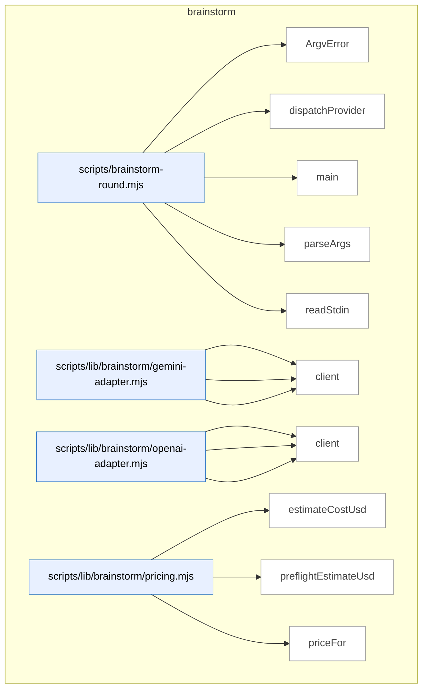

### Symbols in this domain

| Symbol | Kind | Path | Lines | Purpose |
|---|---|---|---|---|
| [`ArgvError`](../scripts/brainstorm-round.mjs#L106) | class | `scripts/brainstorm-round.mjs` | 106-108 | Custom error class for command-line argument parsing failures. |
| [`dispatchProvider`](../scripts/brainstorm-round.mjs#L209) | function | `scripts/brainstorm-round.mjs` | 209-251 | Calls a brainstorm provider (OpenAI or Gemini), handles errors, saves malformed responses to debug directory. |
| [`main`](../scripts/brainstorm-round.mjs#L116) | function | `scripts/brainstorm-round.mjs` | 116-207 | Orchestrates the brainstorm workflow: loads topic, redacts secrets, resolves model catalogs, estimates costs, dispatches API calls, and writes results. |
| [`parseArgs`](../scripts/brainstorm-round.mjs#L51) | function | `scripts/brainstorm-round.mjs` | 51-104 | Parses command-line arguments for brainstorm configuration (topic, models, tokens, output file, timeout). |
| [`readStdin`](../scripts/brainstorm-round.mjs#L110) | function | `scripts/brainstorm-round.mjs` | 110-114 | Reads and returns standard input as a UTF-8 string. |
| [`callGemini`](../scripts/lib/brainstorm/gemini-adapter.mjs#L16) | function | `scripts/lib/brainstorm/gemini-adapter.mjs` | 16-90 | Calls Gemini's generative API with timeout handling, parses response, detects safety blocks and empty responses, estimates cost. |
| [`classifyError`](../scripts/lib/brainstorm/gemini-adapter.mjs#L92) | function | `scripts/lib/brainstorm/gemini-adapter.mjs` | 92-123 | Classifies Gemini adapter errors into timeout, HTTP, or malformed categories with appropriate messaging. |
| [`client`](../scripts/lib/brainstorm/gemini-adapter.mjs#L6) | function | `scripts/lib/brainstorm/gemini-adapter.mjs` | 6-9 | Returns a cached or creates a new Gemini API client. |
| [`callOpenAI`](../scripts/lib/brainstorm/openai-adapter.mjs#L23) | function | `scripts/lib/brainstorm/openai-adapter.mjs` | 23-96 | Calls OpenAI's chat completion API with timeout handling, parses response, detects content filters and empty responses, estimates cost. |
| [`classifyError`](../scripts/lib/brainstorm/openai-adapter.mjs#L98) | function | `scripts/lib/brainstorm/openai-adapter.mjs` | 98-127 | Classifies OpenAI adapter errors into timeout, HTTP, or malformed categories with appropriate messaging. |
| [`client`](../scripts/lib/brainstorm/openai-adapter.mjs#L6) | function | `scripts/lib/brainstorm/openai-adapter.mjs` | 6-9 | Returns a cached or creates a new OpenAI API client. |
| [`estimateCostUsd`](../scripts/lib/brainstorm/pricing.mjs#L38) | function | `scripts/lib/brainstorm/pricing.mjs` | 38-41 | Estimates USD cost of an API call based on input/output token counts and model pricing rates. |
| [`preflightEstimateUsd`](../scripts/lib/brainstorm/pricing.mjs#L47) | function | `scripts/lib/brainstorm/pricing.mjs` | 47-50 | Estimates USD cost of a preflight brainstorm call based on character count and maximum output tokens. |
| [`priceFor`](../scripts/lib/brainstorm/pricing.mjs#L24) | function | `scripts/lib/brainstorm/pricing.mjs` | 24-31 | Looks up pricing rate for a model ID, with fallback for unrecognized model names. |

---

## claudemd-management

```mermaid
flowchart TB
subgraph dom_claudemd_management ["claudemd-management"]
  file_scripts_lib_claudemd_autofix_mjs["scripts/lib/claudemd/autofix.mjs"]:::component
  sym_scripts_lib_claudemd_autofix_mjs_applyFi["applyFixes"]:::symbol
  file_scripts_lib_claudemd_autofix_mjs --> sym_scripts_lib_claudemd_autofix_mjs_applyFi
  file_scripts_lib_claudemd_doc_similarity_mjs["scripts/lib/claudemd/doc-similarity.mjs"]:::component
  sym_scripts_lib_claudemd_doc_similarity_mjs_["extractParagraphs"]:::symbol
  file_scripts_lib_claudemd_doc_similarity_mjs --> sym_scripts_lib_claudemd_doc_similarity_mjs_
  sym_scripts_lib_claudemd_doc_similarity_mjs_["findSimilarParagraphs"]:::symbol
  file_scripts_lib_claudemd_doc_similarity_mjs --> sym_scripts_lib_claudemd_doc_similarity_mjs_
  sym_scripts_lib_claudemd_doc_similarity_mjs_["jaccardSimilarity"]:::symbol
  file_scripts_lib_claudemd_doc_similarity_mjs --> sym_scripts_lib_claudemd_doc_similarity_mjs_
  sym_scripts_lib_claudemd_doc_similarity_mjs_["normalizeMarkdown"]:::symbol
  file_scripts_lib_claudemd_doc_similarity_mjs --> sym_scripts_lib_claudemd_doc_similarity_mjs_
  sym_scripts_lib_claudemd_doc_similarity_mjs_["tokenize"]:::symbol
  file_scripts_lib_claudemd_doc_similarity_mjs --> sym_scripts_lib_claudemd_doc_similarity_mjs_
  file_scripts_lib_claudemd_file_scanner_mjs["scripts/lib/claudemd/file-scanner.mjs"]:::component
  sym_scripts_lib_claudemd_file_scanner_mjs_ma["matchPattern"]:::symbol
  file_scripts_lib_claudemd_file_scanner_mjs --> sym_scripts_lib_claudemd_file_scanner_mjs_ma
  sym_scripts_lib_claudemd_file_scanner_mjs_sc["scanInstructionFiles"]:::symbol
  file_scripts_lib_claudemd_file_scanner_mjs --> sym_scripts_lib_claudemd_file_scanner_mjs_sc
  sym_scripts_lib_claudemd_file_scanner_mjs_wa["walkDir"]:::symbol
  file_scripts_lib_claudemd_file_scanner_mjs --> sym_scripts_lib_claudemd_file_scanner_mjs_wa
  file_scripts_lib_claudemd_ref_checker_mjs["scripts/lib/claudemd/ref-checker.mjs"]:::component
  sym_scripts_lib_claudemd_ref_checker_mjs_bui["buildEnvVarIndex"]:::symbol
  file_scripts_lib_claudemd_ref_checker_mjs --> sym_scripts_lib_claudemd_ref_checker_mjs_bui
  sym_scripts_lib_claudemd_ref_checker_mjs_bui["buildFunctionIndex"]:::symbol
  file_scripts_lib_claudemd_ref_checker_mjs --> sym_scripts_lib_claudemd_ref_checker_mjs_bui
  sym_scripts_lib_claudemd_ref_checker_mjs_ext["extractEnvVarRefs"]:::symbol
  file_scripts_lib_claudemd_ref_checker_mjs --> sym_scripts_lib_claudemd_ref_checker_mjs_ext
  sym_scripts_lib_claudemd_ref_checker_mjs_ext["extractFileRefs"]:::symbol
  file_scripts_lib_claudemd_ref_checker_mjs --> sym_scripts_lib_claudemd_ref_checker_mjs_ext
  sym_scripts_lib_claudemd_ref_checker_mjs_ext["extractFunctionRefs"]:::symbol
  file_scripts_lib_claudemd_ref_checker_mjs --> sym_scripts_lib_claudemd_ref_checker_mjs_ext
  sym_scripts_lib_claudemd_ref_checker_mjs_res["resolveReferencedPath"]:::symbol
  file_scripts_lib_claudemd_ref_checker_mjs --> sym_scripts_lib_claudemd_ref_checker_mjs_res
  file_scripts_lib_claudemd_rules_mjs["scripts/lib/claudemd/rules.mjs"]:::component
  sym_scripts_lib_claudemd_rules_mjs_checkClau["checkClaudeAgentsSync"]:::symbol
  file_scripts_lib_claudemd_rules_mjs --> sym_scripts_lib_claudemd_rules_mjs_checkClau
  sym_scripts_lib_claudemd_rules_mjs_checkCros["checkCrossFileDuplication"]:::symbol
  file_scripts_lib_claudemd_rules_mjs --> sym_scripts_lib_claudemd_rules_mjs_checkCros
  sym_scripts_lib_claudemd_rules_mjs_checkDeep["checkDeepCodeDetail"]:::symbol
  file_scripts_lib_claudemd_rules_mjs --> sym_scripts_lib_claudemd_rules_mjs_checkDeep
  sym_scripts_lib_claudemd_rules_mjs_checkSize["checkSize"]:::symbol
  file_scripts_lib_claudemd_rules_mjs --> sym_scripts_lib_claudemd_rules_mjs_checkSize
  sym_scripts_lib_claudemd_rules_mjs_checkStal["checkStaleEnvVarRefs"]:::symbol
  file_scripts_lib_claudemd_rules_mjs --> sym_scripts_lib_claudemd_rules_mjs_checkStal
  sym_scripts_lib_claudemd_rules_mjs_checkStal["checkStaleFileRefs"]:::symbol
  file_scripts_lib_claudemd_rules_mjs --> sym_scripts_lib_claudemd_rules_mjs_checkStal
  sym_scripts_lib_claudemd_rules_mjs_checkStal["checkStaleFunctionRefs"]:::symbol
  file_scripts_lib_claudemd_rules_mjs --> sym_scripts_lib_claudemd_rules_mjs_checkStal
  sym_scripts_lib_claudemd_rules_mjs_extractHe["extractHeadings"]:::symbol
  file_scripts_lib_claudemd_rules_mjs --> sym_scripts_lib_claudemd_rules_mjs_extractHe
  sym_scripts_lib_claudemd_rules_mjs_runRules["runRules"]:::symbol
  file_scripts_lib_claudemd_rules_mjs --> sym_scripts_lib_claudemd_rules_mjs_runRules
  sym_scripts_lib_claudemd_rules_mjs_semanticI["semanticId"]:::symbol
  file_scripts_lib_claudemd_rules_mjs --> sym_scripts_lib_claudemd_rules_mjs_semanticI
  file_scripts_lib_claudemd_sarif_formatter_mjs["scripts/lib/claudemd/sarif-formatter.mjs"]:::component
  sym_scripts_lib_claudemd_sarif_formatter_mjs["buildRuleDescriptors"]:::symbol
  file_scripts_lib_claudemd_sarif_formatter_mjs --> sym_scripts_lib_claudemd_sarif_formatter_mjs
  sym_scripts_lib_claudemd_sarif_formatter_mjs["ruleDescription"]:::symbol
  file_scripts_lib_claudemd_sarif_formatter_mjs --> sym_scripts_lib_claudemd_sarif_formatter_mjs
  sym_scripts_lib_claudemd_sarif_formatter_mjs["sarifLevel"]:::symbol
  file_scripts_lib_claudemd_sarif_formatter_mjs --> sym_scripts_lib_claudemd_sarif_formatter_mjs
  sym_scripts_lib_claudemd_sarif_formatter_mjs["toSarif"]:::symbol
  file_scripts_lib_claudemd_sarif_formatter_mjs --> sym_scripts_lib_claudemd_sarif_formatter_mjs
  file_scripts_lib_claudemd_step65_hook_mjs["scripts/lib/claudemd/step65-hook.mjs"]:::component
  sym_scripts_lib_claudemd_step65_hook_mjs_run["runHygieneCheck"]:::symbol
  file_scripts_lib_claudemd_step65_hook_mjs --> sym_scripts_lib_claudemd_step65_hook_mjs_run
end
classDef container fill:#f5f5f5,stroke:#333,stroke-width:2px,color:#000
classDef component fill:#e8f0ff,stroke:#3178c6,color:#000
classDef symbol fill:#fff,stroke:#999,color:#444
classDef dup fill:#ffe8d8,stroke:#c0392b,stroke-width:2px,color:#000
classDef violation fill:#ffd6d6,stroke:#c0392b,stroke-width:2px,color:#000
```

### Symbols in this domain

| Symbol | Kind | Path | Lines | Purpose |
|---|---|---|---|---|
| [`applyFixes`](../scripts/lib/claudemd/autofix.mjs#L16) | function | `scripts/lib/claudemd/autofix.mjs` | 16-76 | Removes fixable stale file references (standalone markdown links) from instruction files, processing them bottom-up to avoid index staleness. |
| [`extractParagraphs`](../scripts/lib/claudemd/doc-similarity.mjs#L68) | function | `scripts/lib/claudemd/doc-similarity.mjs` | 68-103 | Splits content into paragraphs while respecting code block boundaries and tracking line numbers for each paragraph. |
| [`findSimilarParagraphs`](../scripts/lib/claudemd/doc-similarity.mjs#L114) | function | `scripts/lib/claudemd/doc-similarity.mjs` | 114-146 | Finds paragraphs with Jaccard similarity above a threshold by tokenizing and comparing within a minimum token count. |
| [`jaccardSimilarity`](../scripts/lib/claudemd/doc-similarity.mjs#L53) | function | `scripts/lib/claudemd/doc-similarity.mjs` | 53-61 | Computes Jaccard similarity (intersection over union) between two token sets. |
| [`normalizeMarkdown`](../scripts/lib/claudemd/doc-similarity.mjs#L24) | function | `scripts/lib/claudemd/doc-similarity.mjs` | 24-34 | Strips markdown formatting (links, code, bold, italics, headings, lists, tables) and converts text to lowercase for normalized comparison. |
| [`tokenize`](../scripts/lib/claudemd/doc-similarity.mjs#L41) | function | `scripts/lib/claudemd/doc-similarity.mjs` | 41-45 | Extracts 2+ character words from normalized text, filters out common stopwords, and returns them as a deduplicated set. |
| [`matchPattern`](../scripts/lib/claudemd/file-scanner.mjs#L72) | function | `scripts/lib/claudemd/file-scanner.mjs` | 72-93 | Tests whether a file path matches a glob pattern with support for `**/` wildcards and single-level `*` placeholders. |
| [`scanInstructionFiles`](../scripts/lib/claudemd/file-scanner.mjs#L102) | function | `scripts/lib/claudemd/file-scanner.mjs` | 102-133 | Scans for instruction files matching patterns in a repo, filters out excluded directories, and returns file metadata with content. |
| [`walkDir`](../scripts/lib/claudemd/file-scanner.mjs#L30) | function | `scripts/lib/claudemd/file-scanner.mjs` | 30-68 | Recursively walks a directory tree, matching files against glob patterns while excluding specified directories and nested fixtures. |
| [`buildEnvVarIndex`](../scripts/lib/claudemd/ref-checker.mjs#L194) | function | `scripts/lib/claudemd/ref-checker.mjs` | 194-235 | Builds an index of environment variables from .env.example and source code (process.env and os.environ usage). |
| [`buildFunctionIndex`](../scripts/lib/claudemd/ref-checker.mjs#L91) | function | `scripts/lib/claudemd/ref-checker.mjs` | 91-124 | Walks source files and builds a set of exported function/class names and Python definitions via regex matching. |
| [`extractEnvVarRefs`](../scripts/lib/claudemd/ref-checker.mjs#L165) | function | `scripts/lib/claudemd/ref-checker.mjs` | 165-187 | Extracts ALL_CAPS environment variable references in backticks from non-code-block content. |
| [`extractFileRefs`](../scripts/lib/claudemd/ref-checker.mjs#L52) | function | `scripts/lib/claudemd/ref-checker.mjs` | 52-84 | Extracts file paths from markdown links and backtick-quoted paths in non-code-block content. |
| [`extractFunctionRefs`](../scripts/lib/claudemd/ref-checker.mjs#L132) | function | `scripts/lib/claudemd/ref-checker.mjs` | 132-158 | Extracts references to functions/classes in backtick notation from non-code-block content, filtering by naming conventions. |
| [`resolveReferencedPath`](../scripts/lib/claudemd/ref-checker.mjs#L25) | function | `scripts/lib/claudemd/ref-checker.mjs` | 25-44 | Resolves relative file references to absolute paths, validates repo boundaries, and checks existence while skipping external URLs. |
| [`checkClaudeAgentsSync`](../scripts/lib/claudemd/rules.mjs#L234) | function | `scripts/lib/claudemd/rules.mjs` | 234-271 | Extracts headings from paired CLAUDE.md and AGENTS.md files and reports conflicts where the same heading has different content. |
| [`checkCrossFileDuplication`](../scripts/lib/claudemd/rules.mjs#L203) | function | `scripts/lib/claudemd/rules.mjs` | 203-232 | Compares files in overlapping directory trees using Jaccard similarity on paragraphs, reporting high-similarity matches. |
| [`checkDeepCodeDetail`](../scripts/lib/claudemd/rules.mjs#L186) | function | `scripts/lib/claudemd/rules.mjs` | 186-201 | Counts fenced code blocks and reports a violation if they exceed the configured limit per file. |
| [`checkSize`](../scripts/lib/claudemd/rules.mjs#L108) | function | `scripts/lib/claudemd/rules.mjs` | 108-122 | Reports a file size violation if it exceeds the configured byte limit. |
| [`checkStaleEnvVarRefs`](../scripts/lib/claudemd/rules.mjs#L168) | function | `scripts/lib/claudemd/rules.mjs` | 168-184 | Checks for environment variable references against an index, reporting undefined variables. |
| [`checkStaleFileRefs`](../scripts/lib/claudemd/rules.mjs#L124) | function | `scripts/lib/claudemd/rules.mjs` | 124-142 | Checks for broken file references in markdown links, reporting unresolved paths as fixable violations. |
| [`checkStaleFunctionRefs`](../scripts/lib/claudemd/rules.mjs#L144) | function | `scripts/lib/claudemd/rules.mjs` | 144-166 | Checks for function/class references in backticks against a built index, reporting missing definitions. |
| [`extractHeadings`](../scripts/lib/claudemd/rules.mjs#L278) | function | `scripts/lib/claudemd/rules.mjs` | 278-302 | Parses markdown headings (h1–h4) and groups following content under each heading. |
| [`runRules`](../scripts/lib/claudemd/rules.mjs#L44) | function | `scripts/lib/claudemd/rules.mjs` | 44-106 | Runs all configured linting rules across instruction files, building function/env-var indexes once and reporting findings. |
| [`semanticId`](../scripts/lib/claudemd/rules.mjs#L17) | function | `scripts/lib/claudemd/rules.mjs` | 17-22 | Generates a semantic fingerprint by hashing the rule ID, file path, and normalized content. |
| [`buildRuleDescriptors`](../scripts/lib/claudemd/sarif-formatter.mjs#L49) | function | `scripts/lib/claudemd/sarif-formatter.mjs` | 49-62 | Deduplicates findings by rule ID and builds SARIF rule descriptor objects with human-readable descriptions. |
| [`ruleDescription`](../scripts/lib/claudemd/sarif-formatter.mjs#L64) | function | `scripts/lib/claudemd/sarif-formatter.mjs` | 64-77 | Returns human-readable descriptions for each linting rule ID. |
| [`sarifLevel`](../scripts/lib/claudemd/sarif-formatter.mjs#L40) | function | `scripts/lib/claudemd/sarif-formatter.mjs` | 40-47 | Maps severity levels (error/warn/info) to SARIF levels (error/warning/note). |
| [`toSarif`](../scripts/lib/claudemd/sarif-formatter.mjs#L11) | function | `scripts/lib/claudemd/sarif-formatter.mjs` | 11-38 | Converts a linting report into SARIF 2.1.0 JSON format with rule metadata and result fingerprints. |
| [`runHygieneCheck`](../scripts/lib/claudemd/step65-hook.mjs#L16) | function | `scripts/lib/claudemd/step65-hook.mjs` | 16-65 | Spawns a linter subprocess, captures its JSON output, and returns exit code, parsed report, and summary status. |

---

## cross-skill-bridge

```mermaid
flowchart TB
subgraph dom_cross_skill_bridge ["cross-skill-bridge"]
  file_scripts_cross_skill_mjs["scripts/cross-skill.mjs"]:::component
  sym_scripts_cross_skill_mjs_argOption["argOption"]:::symbol
  file_scripts_cross_skill_mjs --> sym_scripts_cross_skill_mjs_argOption
  sym_scripts_cross_skill_mjs_cmdAbortRefreshR["cmdAbortRefreshRun"]:::symbol
  file_scripts_cross_skill_mjs --> sym_scripts_cross_skill_mjs_cmdAbortRefreshR
  sym_scripts_cross_skill_mjs_cmdAddPersona["cmdAddPersona"]:::symbol
  file_scripts_cross_skill_mjs --> sym_scripts_cross_skill_mjs_cmdAddPersona
  sym_scripts_cross_skill_mjs_cmdAuditEffectiv["cmdAuditEffectiveness"]:::symbol
  file_scripts_cross_skill_mjs --> sym_scripts_cross_skill_mjs_cmdAuditEffectiv
  sym_scripts_cross_skill_mjs_cmdComputeDriftS["cmdComputeDriftScore"]:::symbol
  file_scripts_cross_skill_mjs --> sym_scripts_cross_skill_mjs_cmdComputeDriftS
  sym_scripts_cross_skill_mjs_cmdDetectStack["cmdDetectStack"]:::symbol
  file_scripts_cross_skill_mjs --> sym_scripts_cross_skill_mjs_cmdDetectStack
  sym_scripts_cross_skill_mjs_cmdGetActiveRefr["cmdGetActiveRefreshId"]:::symbol
  file_scripts_cross_skill_mjs --> sym_scripts_cross_skill_mjs_cmdGetActiveRefr
  sym_scripts_cross_skill_mjs_cmdGetNeighbourh["cmdGetNeighbourhood"]:::symbol
  file_scripts_cross_skill_mjs --> sym_scripts_cross_skill_mjs_cmdGetNeighbourh
  sym_scripts_cross_skill_mjs_cmdListLayeringV["cmdListLayeringViolationsForSnapshot"]:::symbol
  file_scripts_cross_skill_mjs --> sym_scripts_cross_skill_mjs_cmdListLayeringV
  sym_scripts_cross_skill_mjs_cmdListPersonas["cmdListPersonas"]:::symbol
  file_scripts_cross_skill_mjs --> sym_scripts_cross_skill_mjs_cmdListPersonas
  sym_scripts_cross_skill_mjs_cmdListSymbolsFo["cmdListSymbolsForSnapshot"]:::symbol
  file_scripts_cross_skill_mjs --> sym_scripts_cross_skill_mjs_cmdListSymbolsFo
  sym_scripts_cross_skill_mjs_cmdListUnlockedF["cmdListUnlockedFixes"]:::symbol
  file_scripts_cross_skill_mjs --> sym_scripts_cross_skill_mjs_cmdListUnlockedF
  sym_scripts_cross_skill_mjs_cmdOpenRefreshRu["cmdOpenRefreshRun"]:::symbol
  file_scripts_cross_skill_mjs --> sym_scripts_cross_skill_mjs_cmdOpenRefreshRu
  sym_scripts_cross_skill_mjs_cmdPlanSatisfact["cmdPlanSatisfaction"]:::symbol
  file_scripts_cross_skill_mjs --> sym_scripts_cross_skill_mjs_cmdPlanSatisfact
  sym_scripts_cross_skill_mjs_cmdPublishRefres["cmdPublishRefreshRun"]:::symbol
  file_scripts_cross_skill_mjs --> sym_scripts_cross_skill_mjs_cmdPublishRefres
  sym_scripts_cross_skill_mjs_cmdRecordCorrela["cmdRecordCorrelation"]:::symbol
  file_scripts_cross_skill_mjs --> sym_scripts_cross_skill_mjs_cmdRecordCorrela
  sym_scripts_cross_skill_mjs_cmdRecordLayerin["cmdRecordLayeringViolations"]:::symbol
  file_scripts_cross_skill_mjs --> sym_scripts_cross_skill_mjs_cmdRecordLayerin
  sym_scripts_cross_skill_mjs_cmdRecordPersona["cmdRecordPersonaSession"]:::symbol
  file_scripts_cross_skill_mjs --> sym_scripts_cross_skill_mjs_cmdRecordPersona
  sym_scripts_cross_skill_mjs_cmdRecordPlanVer["cmdRecordPlanVerifyItems"]:::symbol
  file_scripts_cross_skill_mjs --> sym_scripts_cross_skill_mjs_cmdRecordPlanVer
  sym_scripts_cross_skill_mjs_cmdRecordPlanVer["cmdRecordPlanVerifyRun"]:::symbol
  file_scripts_cross_skill_mjs --> sym_scripts_cross_skill_mjs_cmdRecordPlanVer
  sym_scripts_cross_skill_mjs_cmdRecordRegress["cmdRecordRegressionSpec"]:::symbol
  file_scripts_cross_skill_mjs --> sym_scripts_cross_skill_mjs_cmdRecordRegress
  sym_scripts_cross_skill_mjs_cmdRecordRegress["cmdRecordRegressionSpecRun"]:::symbol
  file_scripts_cross_skill_mjs --> sym_scripts_cross_skill_mjs_cmdRecordRegress
  sym_scripts_cross_skill_mjs_cmdRecordShipEve["cmdRecordShipEvent"]:::symbol
  file_scripts_cross_skill_mjs --> sym_scripts_cross_skill_mjs_cmdRecordShipEve
  sym_scripts_cross_skill_mjs_cmdRecordSymbolD["cmdRecordSymbolDefinitions"]:::symbol
  file_scripts_cross_skill_mjs --> sym_scripts_cross_skill_mjs_cmdRecordSymbolD
  sym_scripts_cross_skill_mjs_cmdRecordSymbolE["cmdRecordSymbolEmbedding"]:::symbol
  file_scripts_cross_skill_mjs --> sym_scripts_cross_skill_mjs_cmdRecordSymbolE
  sym_scripts_cross_skill_mjs_cmdRecordSymbolI["cmdRecordSymbolIndex"]:::symbol
  file_scripts_cross_skill_mjs --> sym_scripts_cross_skill_mjs_cmdRecordSymbolI
  sym_scripts_cross_skill_mjs_cmdResolveRepoId["cmdResolveRepoIdentity"]:::symbol
  file_scripts_cross_skill_mjs --> sym_scripts_cross_skill_mjs_cmdResolveRepoId
  sym_scripts_cross_skill_mjs_cmdSetActiveEmbe["cmdSetActiveEmbeddingModel"]:::symbol
  file_scripts_cross_skill_mjs --> sym_scripts_cross_skill_mjs_cmdSetActiveEmbe
  sym_scripts_cross_skill_mjs_cmdUpdatePlanSta["cmdUpdatePlanStatus"]:::symbol
  file_scripts_cross_skill_mjs --> sym_scripts_cross_skill_mjs_cmdUpdatePlanSta
  sym_scripts_cross_skill_mjs_cmdUpsertPlan["cmdUpsertPlan"]:::symbol
  file_scripts_cross_skill_mjs --> sym_scripts_cross_skill_mjs_cmdUpsertPlan
  sym_scripts_cross_skill_mjs_cmdWhoami["cmdWhoami"]:::symbol
  file_scripts_cross_skill_mjs --> sym_scripts_cross_skill_mjs_cmdWhoami
  sym_scripts_cross_skill_mjs_currentBranch["currentBranch"]:::symbol
  file_scripts_cross_skill_mjs --> sym_scripts_cross_skill_mjs_currentBranch
  sym_scripts_cross_skill_mjs_currentCommitSha["currentCommitSha"]:::symbol
  file_scripts_cross_skill_mjs --> sym_scripts_cross_skill_mjs_currentCommitSha
  sym_scripts_cross_skill_mjs_emit["emit"]:::symbol
  file_scripts_cross_skill_mjs --> sym_scripts_cross_skill_mjs_emit
  sym_scripts_cross_skill_mjs_emitError["emitError"]:::symbol
  file_scripts_cross_skill_mjs --> sym_scripts_cross_skill_mjs_emitError
  sym_scripts_cross_skill_mjs_main["main"]:::symbol
  file_scripts_cross_skill_mjs --> sym_scripts_cross_skill_mjs_main
  sym_scripts_cross_skill_mjs_parsePayload["parsePayload"]:::symbol
  file_scripts_cross_skill_mjs --> sym_scripts_cross_skill_mjs_parsePayload
  sym_scripts_cross_skill_mjs_resolveRepoId["resolveRepoId"]:::symbol
  file_scripts_cross_skill_mjs --> sym_scripts_cross_skill_mjs_resolveRepoId
end
classDef container fill:#f5f5f5,stroke:#333,stroke-width:2px,color:#000
classDef component fill:#e8f0ff,stroke:#3178c6,color:#000
classDef symbol fill:#fff,stroke:#999,color:#444
classDef dup fill:#ffe8d8,stroke:#c0392b,stroke-width:2px,color:#000
classDef violation fill:#ffd6d6,stroke:#c0392b,stroke-width:2px,color:#000
```

### Symbols in this domain

| Symbol | Kind | Path | Lines | Purpose |
|---|---|---|---|---|
| [`argOption`](../scripts/cross-skill.mjs#L96) | function | `scripts/cross-skill.mjs` | 96-100 | Returns value of named command-line option flag, or null if not present. |
| [`cmdAbortRefreshRun`](../scripts/cross-skill.mjs#L511) | function | `scripts/cross-skill.mjs` | 511-521 | Aborts an in-progress refresh run with an optional reason. |
| [`cmdAddPersona`](../scripts/cross-skill.mjs#L348) | function | `scripts/cross-skill.mjs` | 348-360 | Creates or updates a persona with name, description, and app URL. |
| [`cmdAuditEffectiveness`](../scripts/cross-skill.mjs#L311) | function | `scripts/cross-skill.mjs` | 311-318 | Fetches audit effectiveness metrics (detection/fix rates) for a repository. |
| [`cmdComputeDriftScore`](../scripts/cross-skill.mjs#L615) | function | `scripts/cross-skill.mjs` | 615-626 | Computes architectural drift score comparing current state to previous baseline. |
| [`cmdDetectStack`](../scripts/cross-skill.mjs#L399) | function | `scripts/cross-skill.mjs` | 399-415 | Detects the technology stack and Python environment of a repository. |
| [`cmdGetActiveRefreshId`](../scripts/cross-skill.mjs#L431) | function | `scripts/cross-skill.mjs` | 431-447 | Retrieves the active embedding model and refresh ID for a repository. |
| [`cmdGetNeighbourhood`](../scripts/cross-skill.mjs#L449) | function | `scripts/cross-skill.mjs` | 449-477 | Finds semantically similar symbols from the codebase using vector embeddings. |
| [`cmdListLayeringViolationsForSnapshot`](../scripts/cross-skill.mjs#L602) | function | `scripts/cross-skill.mjs` | 602-613 | Lists all layering violations detected in a refresh snapshot. |
| [`cmdListPersonas`](../scripts/cross-skill.mjs#L326) | function | `scripts/cross-skill.mjs` | 326-337 | Lists all personas defined for a given app URL. |
| [`cmdListSymbolsForSnapshot`](../scripts/cross-skill.mjs#L589) | function | `scripts/cross-skill.mjs` | 589-600 | Lists all symbols indexed in a specific architecture refresh snapshot. |
| [`cmdListUnlockedFixes`](../scripts/cross-skill.mjs#L303) | function | `scripts/cross-skill.mjs` | 303-309 | Retrieves unlocked fixes that are available for deployment. |
| [`cmdOpenRefreshRun`](../scripts/cross-skill.mjs#L479) | function | `scripts/cross-skill.mjs` | 479-497 | Opens a new architecture refresh run for a repository. |
| [`cmdPlanSatisfaction`](../scripts/cross-skill.mjs#L268) | function | `scripts/cross-skill.mjs` | 268-278 | Retrieves satisfaction metrics and persistent failure records for a specific plan. |
| [`cmdPublishRefreshRun`](../scripts/cross-skill.mjs#L499) | function | `scripts/cross-skill.mjs` | 499-509 | Publishes a completed refresh run to make its findings available. |
| [`cmdRecordCorrelation`](../scripts/cross-skill.mjs#L216) | function | `scripts/cross-skill.mjs` | 216-233 | Records correlation data between a persona finding and an audit finding. |
| [`cmdRecordLayeringViolations`](../scripts/cross-skill.mjs#L563) | function | `scripts/cross-skill.mjs` | 563-575 | Records architectural layering violations detected in a refresh run. |
| [`cmdRecordPersonaSession`](../scripts/cross-skill.mjs#L384) | function | `scripts/cross-skill.mjs` | 384-397 | Records a persona session execution with findings and detection details. |
| [`cmdRecordPlanVerifyItems`](../scripts/cross-skill.mjs#L257) | function | `scripts/cross-skill.mjs` | 257-266 | Stores individual verification item results from a plan verification run. |
| [`cmdRecordPlanVerifyRun`](../scripts/cross-skill.mjs#L235) | function | `scripts/cross-skill.mjs` | 235-255 | Records verification run metrics (criteria counts and pass/fail results) for a plan. |
| [`cmdRecordRegressionSpec`](../scripts/cross-skill.mjs#L177) | function | `scripts/cross-skill.mjs` | 177-196 | Records a regression test specification with metadata about the test file and its assertions. |
| [`cmdRecordRegressionSpecRun`](../scripts/cross-skill.mjs#L198) | function | `scripts/cross-skill.mjs` | 198-214 | Logs the result of running a regression specification (pass/fail with context). |
| [`cmdRecordShipEvent`](../scripts/cross-skill.mjs#L280) | function | `scripts/cross-skill.mjs` | 280-301 | Records a shipping event with deployment outcome, blockers, and code quality metrics. |
| [`cmdRecordSymbolDefinitions`](../scripts/cross-skill.mjs#L523) | function | `scripts/cross-skill.mjs` | 523-533 | Records symbol definitions (classes, functions, etc.) discovered in a repository. |
| [`cmdRecordSymbolEmbedding`](../scripts/cross-skill.mjs#L549) | function | `scripts/cross-skill.mjs` | 549-561 | Records vector embedding for a symbol definition in a specified model. |
| [`cmdRecordSymbolIndex`](../scripts/cross-skill.mjs#L535) | function | `scripts/cross-skill.mjs` | 535-547 | Stores symbol index entries (location, type, scope) for a refresh snapshot. |
| [`cmdResolveRepoIdentity`](../scripts/cross-skill.mjs#L628) | function | `scripts/cross-skill.mjs` | 628-634 | Resolves or persists a repository's unique identity (UUID). |
| [`cmdSetActiveEmbeddingModel`](../scripts/cross-skill.mjs#L577) | function | `scripts/cross-skill.mjs` | 577-587 | Sets the active embedding model and dimension for a repository's snapshots. |
| [`cmdUpdatePlanStatus`](../scripts/cross-skill.mjs#L168) | function | `scripts/cross-skill.mjs` | 168-175 | Updates a learning plan's status in the cloud database. |
| [`cmdUpsertPlan`](../scripts/cross-skill.mjs#L150) | function | `scripts/cross-skill.mjs` | 150-166 | Upserts a plan record with path, skill, status, principles, and commit metadata, then outputs plan ID. |
| [`cmdWhoami`](../scripts/cross-skill.mjs#L417) | function | `scripts/cross-skill.mjs` | 417-427 | Returns current Git context (commit, branch) and cloud configuration status. |
| [`currentBranch`](../scripts/cross-skill.mjs#L125) | function | `scripts/cross-skill.mjs` | 125-130 | Returns current git branch name, or null if not in a git repo. |
| [`currentCommitSha`](../scripts/cross-skill.mjs#L118) | function | `scripts/cross-skill.mjs` | 118-123 | Returns current git HEAD commit SHA, or null if not in a git repo. |
| [`emit`](../scripts/cross-skill.mjs#L102) | function | `scripts/cross-skill.mjs` | 102-104 | Writes a JSON object to stdout as a single line. |
| [`emitError`](../scripts/cross-skill.mjs#L111) | function | `scripts/cross-skill.mjs` | 111-114 | Emits error JSON and exits with specified code. |
| [`main`](../scripts/cross-skill.mjs#L672) | function | `scripts/cross-skill.mjs` | 672-695 | Dispatches incoming subcommands to their handlers and manages errors. |
| [`parsePayload`](../scripts/cross-skill.mjs#L79) | function | `scripts/cross-skill.mjs` | 79-94 | Extracts JSON payload from command-line arguments via --json flag, --stdin, or bare JSON string. |
| [`resolveRepoId`](../scripts/cross-skill.mjs#L140) | function | `scripts/cross-skill.mjs` | 140-146 | Returns repoId from payload, or null if not provided. |

---

## findings

```mermaid
flowchart TB
subgraph dom_findings ["findings"]
  file_scripts_lib_findings_format_mjs["scripts/lib/findings-format.mjs"]:::component
  sym_scripts_lib_findings_format_mjs_formatFi["formatFindings"]:::symbol
  file_scripts_lib_findings_format_mjs --> sym_scripts_lib_findings_format_mjs_formatFi
  file_scripts_lib_findings_outcomes_mjs["scripts/lib/findings-outcomes.mjs"]:::component
  sym_scripts_lib_findings_outcomes_mjs_append["appendOutcome"]:::symbol
  file_scripts_lib_findings_outcomes_mjs --> sym_scripts_lib_findings_outcomes_mjs_append
  sym_scripts_lib_findings_outcomes_mjs_batchA["batchAppendOutcomes"]:::symbol
  file_scripts_lib_findings_outcomes_mjs --> sym_scripts_lib_findings_outcomes_mjs_batchA
  sym_scripts_lib_findings_outcomes_mjs_compac["compactOutcomes"]:::symbol
  file_scripts_lib_findings_outcomes_mjs --> sym_scripts_lib_findings_outcomes_mjs_compac
  sym_scripts_lib_findings_outcomes_mjs_comput["computePassEffectiveness"]:::symbol
  file_scripts_lib_findings_outcomes_mjs --> sym_scripts_lib_findings_outcomes_mjs_comput
  sym_scripts_lib_findings_outcomes_mjs_comput["computePassEWR"]:::symbol
  file_scripts_lib_findings_outcomes_mjs --> sym_scripts_lib_findings_outcomes_mjs_comput
  sym_scripts_lib_findings_outcomes_mjs_loadOu["loadOutcomes"]:::symbol
  file_scripts_lib_findings_outcomes_mjs --> sym_scripts_lib_findings_outcomes_mjs_loadOu
  sym_scripts_lib_findings_outcomes_mjs_setRep["setRepoProfileCache"]:::symbol
  file_scripts_lib_findings_outcomes_mjs --> sym_scripts_lib_findings_outcomes_mjs_setRep
  file_scripts_lib_findings_tasks_mjs["scripts/lib/findings-tasks.mjs"]:::component
  sym_scripts_lib_findings_tasks_mjs_createRem["createRemediationTask"]:::symbol
  file_scripts_lib_findings_tasks_mjs --> sym_scripts_lib_findings_tasks_mjs_createRem
  sym_scripts_lib_findings_tasks_mjs_getTaskSt["getTaskStore"]:::symbol
  file_scripts_lib_findings_tasks_mjs --> sym_scripts_lib_findings_tasks_mjs_getTaskSt
  sym_scripts_lib_findings_tasks_mjs_loadTasks["loadTasks"]:::symbol
  file_scripts_lib_findings_tasks_mjs --> sym_scripts_lib_findings_tasks_mjs_loadTasks
  sym_scripts_lib_findings_tasks_mjs_persistTa["persistTask"]:::symbol
  file_scripts_lib_findings_tasks_mjs --> sym_scripts_lib_findings_tasks_mjs_persistTa
  sym_scripts_lib_findings_tasks_mjs_trackEdit["trackEdit"]:::symbol
  file_scripts_lib_findings_tasks_mjs --> sym_scripts_lib_findings_tasks_mjs_trackEdit
  sym_scripts_lib_findings_tasks_mjs_updateTas["updateTask"]:::symbol
  file_scripts_lib_findings_tasks_mjs --> sym_scripts_lib_findings_tasks_mjs_updateTas
  sym_scripts_lib_findings_tasks_mjs_verifyTas["verifyTask"]:::symbol
  file_scripts_lib_findings_tasks_mjs --> sym_scripts_lib_findings_tasks_mjs_verifyTas
  file_scripts_lib_findings_tracker_mjs["scripts/lib/findings-tracker.mjs"]:::component
  sym_scripts_lib_findings_tracker_mjs_applyLa["applyLazyDecay"]:::symbol
  file_scripts_lib_findings_tracker_mjs --> sym_scripts_lib_findings_tracker_mjs_applyLa
  sym_scripts_lib_findings_tracker_mjs_buildPa["buildPatternKey"]:::symbol
  file_scripts_lib_findings_tracker_mjs --> sym_scripts_lib_findings_tracker_mjs_buildPa
  sym_scripts_lib_findings_tracker_mjs_effecti["effectiveSampleSize"]:::symbol
  file_scripts_lib_findings_tracker_mjs --> sym_scripts_lib_findings_tracker_mjs_effecti
  sym_scripts_lib_findings_tracker_mjs_extract["extractDimensions"]:::symbol
  file_scripts_lib_findings_tracker_mjs --> sym_scripts_lib_findings_tracker_mjs_extract
  sym_scripts_lib_findings_tracker_mjs_FalsePo["FalsePositiveTracker"]:::symbol
  file_scripts_lib_findings_tracker_mjs --> sym_scripts_lib_findings_tracker_mjs_FalsePo
  sym_scripts_lib_findings_tracker_mjs_recordW["recordWithDecay"]:::symbol
  file_scripts_lib_findings_tracker_mjs --> sym_scripts_lib_findings_tracker_mjs_recordW
  file_scripts_lib_findings_mjs["scripts/lib/findings.mjs"]:::component
  sym_scripts_lib_findings_mjs_semanticId["semanticId"]:::symbol
  file_scripts_lib_findings_mjs --> sym_scripts_lib_findings_mjs_semanticId
end
classDef container fill:#f5f5f5,stroke:#333,stroke-width:2px,color:#000
classDef component fill:#e8f0ff,stroke:#3178c6,color:#000
classDef symbol fill:#fff,stroke:#999,color:#444
classDef dup fill:#ffe8d8,stroke:#c0392b,stroke-width:2px,color:#000
classDef violation fill:#ffd6d6,stroke:#c0392b,stroke-width:2px,color:#000
```

### Symbols in this domain

| Symbol | Kind | Path | Lines | Purpose |
|---|---|---|---|---|
| [`formatFindings`](../scripts/lib/findings-format.mjs#L12) | function | `scripts/lib/findings-format.mjs` | 12-33 | Format security findings grouped by severity level with details, risks, and recommendations. |
| [`appendOutcome`](../scripts/lib/findings-outcomes.mjs#L38) | function | `scripts/lib/findings-outcomes.mjs` | 38-50 | Append a single outcome record with timestamp and repo fingerprint to a JSONL log. |
| [`batchAppendOutcomes`](../scripts/lib/findings-outcomes.mjs#L58) | function | `scripts/lib/findings-outcomes.mjs` | 58-75 | Batch append multiple outcome records atomically to a JSONL log. |
| [`compactOutcomes`](../scripts/lib/findings-outcomes.mjs#L100) | function | `scripts/lib/findings-outcomes.mjs` | 100-138 | Compact the outcomes log by backfilling legacy timestamps and optionally pruning old entries. |
| [`computePassEffectiveness`](../scripts/lib/findings-outcomes.mjs#L149) | function | `scripts/lib/findings-outcomes.mjs` | 149-187 | Compute pass effectiveness metrics using exponential decay weighted by outcome age. |
| [`computePassEWR`](../scripts/lib/findings-outcomes.mjs#L196) | function | `scripts/lib/findings-outcomes.mjs` | 196-216 | Compute effectiveness-weighted reward (EWR) for a pass using time-decayed outcome data. |
| [`loadOutcomes`](../scripts/lib/findings-outcomes.mjs#L82) | function | `scripts/lib/findings-outcomes.mjs` | 82-93 | Load all outcomes from a JSONL file, backfilling missing timestamps. |
| [`setRepoProfileCache`](../scripts/lib/findings-outcomes.mjs#L27) | function | `scripts/lib/findings-outcomes.mjs` | 27-29 | Cache the repo profile (fingerprint) for use in outcome logging. |
| [`createRemediationTask`](../scripts/lib/findings-tasks.mjs#L34) | function | `scripts/lib/findings-tasks.mjs` | 34-48 | Create a remediation task record from a finding with a semantic hash and initial state. |
| [`getTaskStore`](../scripts/lib/findings-tasks.mjs#L17) | function | `scripts/lib/findings-tasks.mjs` | 17-22 | Lazily initialize and return a singleton append-only store for remediation tasks. |
| [`loadTasks`](../scripts/lib/findings-tasks.mjs#L75) | function | `scripts/lib/findings-tasks.mjs` | 75-81 | Load all remediation tasks, deduplicating by ID and optionally filtering by run. |
| [`persistTask`](../scripts/lib/findings-tasks.mjs#L72) | function | `scripts/lib/findings-tasks.mjs` | 72-72 | Persist a task to the store by appending it. |
| [`trackEdit`](../scripts/lib/findings-tasks.mjs#L53) | function | `scripts/lib/findings-tasks.mjs` | 53-57 | Record an edit on a task, marking it as fixed with updated timestamp. |
| [`updateTask`](../scripts/lib/findings-tasks.mjs#L84) | function | `scripts/lib/findings-tasks.mjs` | 84-87 | Update a task timestamp and append the updated version to the store. |
| [`verifyTask`](../scripts/lib/findings-tasks.mjs#L62) | function | `scripts/lib/findings-tasks.mjs` | 62-67 | Mark a task as verified or regressed with verifier and timestamp metadata. |
| [`applyLazyDecay`](../scripts/lib/findings-tracker.mjs#L21) | function | `scripts/lib/findings-tracker.mjs` | 21-46 | Apply exponential decay to pattern acceptance/dismissal counts and prune stale entries. |
| [`buildPatternKey`](../scripts/lib/findings-tracker.mjs#L95) | function | `scripts/lib/findings-tracker.mjs` | 95-97 | Build a unique pattern key from dimensions by joining them with '::' separators. |
| [`effectiveSampleSize`](../scripts/lib/findings-tracker.mjs#L51) | function | `scripts/lib/findings-tracker.mjs` | 51-53 | Calculate effective sample size of a pattern as sum of decayed accepted and dismissed counts. |
| [`extractDimensions`](../scripts/lib/findings-tracker.mjs#L82) | function | `scripts/lib/findings-tracker.mjs` | 82-90 | Extract categorical dimensions (category, severity, principle, repo, file type) from a finding. |
| [`FalsePositiveTracker`](../scripts/lib/findings-tracker.mjs#L105) | class | `scripts/lib/findings-tracker.mjs` | 105-226 | Track false positive patterns with exponential decay, scoped by category, severity, principle, repo, and file type. |
| [`recordWithDecay`](../scripts/lib/findings-tracker.mjs#L59) | function | `scripts/lib/findings-tracker.mjs` | 59-75 | Record an outcome on a pattern, updating decayed counts and EMA acceptance rate. |
| [`semanticId`](../scripts/lib/findings.mjs#L27) | function | `scripts/lib/findings.mjs` | 27-40 | Generate a semantic hash for a finding based on its source kind (linter vs. manual). |

---

## install

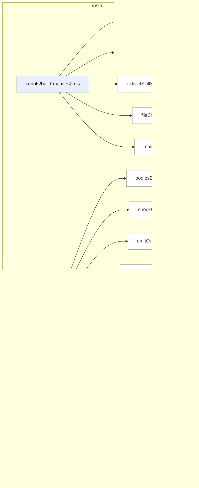

_Domain has 122 symbols (>50). Diagram shows top-15 by file order; see flat table below for the full list._

### Symbols in this domain

| Symbol | Kind | Path | Lines | Purpose |
|---|---|---|---|---|
| [`buildManifest`](../scripts/build-manifest.mjs#L99) | function | `scripts/build-manifest.mjs` | 99-163 | Builds a manifest of all skills with file inventories, checksums, and a bundleVersion hash. |
| [`extractFrontmatterBody`](../scripts/build-manifest.mjs#L49) | function | `scripts/build-manifest.mjs` | 49-54 | Extracts the YAML frontmatter body from a Markdown file, or null if malformed. |
| [`extractSkillSummary`](../scripts/build-manifest.mjs#L64) | function | `scripts/build-manifest.mjs` | 64-94 | Parses the `description` field from Markdown frontmatter, supporting both block-scalar and inline forms. |
| [`fileSha`](../scripts/build-manifest.mjs#L40) | function | `scripts/build-manifest.mjs` | 40-43 | Returns the first 12 hex digits of a file's SHA-256 hash. |
| [`main`](../scripts/build-manifest.mjs#L165) | function | `scripts/build-manifest.mjs` | 165-190 | Checks manifest freshness in `--check` mode or writes/updates the manifest file. |
| [`bodiesEqual`](../scripts/check-context-drift.mjs#L168) | function | `scripts/check-context-drift.mjs` | 168-171 | Normalizes whitespace in line arrays and compares them for semantic equality. |
| [`checkPair`](../scripts/check-context-drift.mjs#L184) | function | `scripts/check-context-drift.mjs` | 184-249 | Validates CLAUDE.md against three rules: import presence, allowlist conformance, and size cap. |
| [`emitOutput`](../scripts/check-context-drift.mjs#L346) | function | `scripts/check-context-drift.mjs` | 346-369 | Outputs findings as plain text, JSON, or SARIF format depending on the format flag. |
| [`extractH2Sections`](../scripts/check-context-drift.mjs#L141) | function | `scripts/check-context-drift.mjs` | 141-162 | Extracts all H2 sections from Markdown, ignoring headings inside code fences. |
| [`findPairs`](../scripts/check-context-drift.mjs#L261) | function | `scripts/check-context-drift.mjs` | 261-279 | Groups AGENTS.md and CLAUDE.md files by directory into comparable pairs. |
| [`hasAgentsImport`](../scripts/check-context-drift.mjs#L177) | function | `scripts/check-context-drift.mjs` | 177-180 | Checks if content has an `@./AGENTS.md` or `@AGENTS.md` import in the first 30 lines. |
| [`hashId`](../scripts/check-context-drift.mjs#L253) | function | `scripts/check-context-drift.mjs` | 253-255 | Hashes a file path and semantic key into a 16-character hex identifier. |
| [`loadConfig`](../scripts/check-context-drift.mjs#L63) | function | `scripts/check-context-drift.mjs` | 63-94 | Loads and validates `.claude-context-allowlist.json` with fallback to defaults on missing or invalid config. |
| [`main`](../scripts/check-context-drift.mjs#L371) | function | `scripts/check-context-drift.mjs` | 371-382 | Parses args, runs the drift check, emits output, and exits with code reflecting error/warning severity. |
| [`makeFenceTracker`](../scripts/check-context-drift.mjs#L108) | function | `scripts/check-context-drift.mjs` | 108-132 | Returns a stateful function that tracks whether each line is inside a Markdown code fence. |
| [`parseArgs`](../scripts/check-context-drift.mjs#L309) | function | `scripts/check-context-drift.mjs` | 309-324 | Parses command-line arguments into format, strict, and repo options. |
| [`runDriftCheck`](../scripts/check-context-drift.mjs#L288) | function | `scripts/check-context-drift.mjs` | 288-305 | Runs drift checks on all AGENTS.md/CLAUDE.md pairs and collects findings. |
| [`showHelp`](../scripts/check-context-drift.mjs#L326) | function | `scripts/check-context-drift.mjs` | 326-344 | Displays usage, examples, and configuration schema for the context-drift checker. |
| [`canResolve`](../scripts/check-deps.mjs#L53) | function | `scripts/check-deps.mjs` | 53-61 | Attempts to resolve a package name using CommonJS require.resolve, returning true if found. |
| [`loadEnv`](../scripts/check-deps.mjs#L63) | function | `scripts/check-deps.mjs` | 63-78 | Parses `.env` file and populates process.env with key-value pairs (skip comments and blank lines). |
| [`main`](../scripts/check-deps.mjs#L80) | function | `scripts/check-deps.mjs` | 80-174 | <no body> |
| [`detectMissingFromStatic`](../scripts/check-model-freshness.mjs#L149) | function | `scripts/check-model-freshness.mjs` | 149-177 | Identifies live model IDs from providers that match tier patterns but are missing from the static pool cache. |
| [`detectPrematureRemap`](../scripts/check-model-freshness.mjs#L183) | function | `scripts/check-model-freshness.mjs` | 183-208 | Flags deprecated model remappings that are premature because the provider still actively serves the original model ID. |
| [`detectSentinelDrift`](../scripts/check-model-freshness.mjs#L83) | function | `scripts/check-model-freshness.mjs` | 83-143 | Detects when static model pool is stale by comparing static and live sentinels, identifying missing tiers or mismatched picks. |
| [`emitOutput`](../scripts/check-model-freshness.mjs#L310) | function | `scripts/check-model-freshness.mjs` | 310-340 | Renders findings report in text, JSON, or SARIF format with severity aggregation and optional provider list. |
| [`hashId`](../scripts/check-model-freshness.mjs#L212) | function | `scripts/check-model-freshness.mjs` | 212-214 | Generates a stable 16-character SHA256-based identifier from a rule name and key for deduplication. |
| [`main`](../scripts/check-model-freshness.mjs#L342) | function | `scripts/check-model-freshness.mjs` | 342-353 | Parses arguments, runs freshness check, emits output, and exits with code reflecting highest severity (3=insufficient data, 1=high, 2=medium, 0=ok). |
| [`parseArgs`](../scripts/check-model-freshness.mjs#L266) | function | `scripts/check-model-freshness.mjs` | 266-280 | Parses command-line arguments for output format (text/json/sarif) and strict mode flag. |
| [`runFreshnessCheck`](../scripts/check-model-freshness.mjs#L225) | function | `scripts/check-model-freshness.mjs` | 225-262 | Orchestrates the freshness check by fetching/validating live catalogs, running detection rules, and returning findings with provider metadata. |
| [`showHelp`](../scripts/check-model-freshness.mjs#L282) | function | `scripts/check-model-freshness.mjs` | 282-308 | Prints usage documentation including options, exit codes, and required environment variables. |
| [`checkAuditApiKeys`](../scripts/check-setup.mjs#L157) | function | `scripts/check-setup.mjs` | 157-174 | Validates presence of OpenAI API key (required) and either Gemini or Anthropic key (optional for Step 7 review). |
| [`checkAuditLoop`](../scripts/check-setup.mjs#L233) | function | `scripts/check-setup.mjs` | 233-237 | <no body> |
| [`checkAuditSupabase`](../scripts/check-setup.mjs#L180) | function | `scripts/check-setup.mjs` | 180-231 | Checks Supabase audit database connection and validates required tables/views for cloud learning, reporting missing schema. |
| [`checkPersonaTest`](../scripts/check-setup.mjs#L241) | function | `scripts/check-setup.mjs` | 241-297 | Checks Persona-Test Supabase configuration including URL, anon key, repo name, and validates required persona tables/views. |
| [`checkTables`](../scripts/check-setup.mjs#L71) | function | `scripts/check-setup.mjs` | 71-78 | Queries multiple tables asynchronously to check existence, detecting missing tables via error code 42P01. |
| [`getSupabaseClient`](../scripts/check-setup.mjs#L61) | function | `scripts/check-setup.mjs` | 61-64 | Creates and returns a Supabase client for the given URL and API key. |
| [`loadEnv`](../scripts/check-setup.mjs#L42) | function | `scripts/check-setup.mjs` | 42-57 | Reads .env file from repo root, parsing key=value lines while skipping comments and handling quoted values. |
| [`main`](../scripts/check-setup.mjs#L374) | function | `scripts/check-setup.mjs` | 374-385 | Loads .env, runs async setup checks for audit-loop and persona-test, prints report, exits on failures. |
| [`printJsonReport`](../scripts/check-setup.mjs#L360) | function | `scripts/check-setup.mjs` | 360-370 | Outputs setup check report as JSON with repo metadata, environment status, and all sections. |
| [`printReport`](../scripts/check-setup.mjs#L328) | function | `scripts/check-setup.mjs` | 328-358 | Pretty-prints a multi-section setup report with icons, details, and optional fix commands to terminal. |
| [`Report`](../scripts/check-setup.mjs#L118) | class | `scripts/check-setup.mjs` | 118-153 | Collects and tracks setup check results organized by sections with pass/fail/warn/info statuses and optional fix suggestions. |
| [`shortUrl`](../scripts/check-setup.mjs#L176) | function | `scripts/check-setup.mjs` | 176-178 | Truncates a URL by removing protocol and limiting to 30 characters with ellipsis. |
| [`statusIcon`](../scripts/check-setup.mjs#L304) | function | `scripts/check-setup.mjs` | 304-313 | Returns colored status indicator string (PASS/FAIL/WARN/INFO/FIX) based on status enum. |
| [`verdictLine`](../scripts/check-setup.mjs#L315) | function | `scripts/check-setup.mjs` | 315-326 | Formats verdict line with colored failure and warning counts, or success message. |
| [`listSkills`](../scripts/check-skill-refs.mjs#L30) | function | `scripts/check-skill-refs.mjs` | 30-36 | Lists all skill directories in the skills folder, sorted alphabetically. |
| [`main`](../scripts/check-skill-refs.mjs#L38) | function | `scripts/check-skill-refs.mjs` | 38-74 | Lints one or all skills, reporting reference validation results with pass/fail counts and error details. |
| [`main`](../scripts/check-skill-updates.mjs#L25) | function | `scripts/check-skill-updates.mjs` | 25-118 | Computes local drift detection by comparing managed file SHAs against receipt, checks gitignore coverage, and reports status. |
| [`parseArgs`](../scripts/check-skill-updates.mjs#L16) | function | `scripts/check-skill-updates.mjs` | 16-23 | Extracts command-line flags for JSON output, cache bypass, and optional target directory path. |
| [`checkSync`](../scripts/check-sync.mjs#L25) | function | `scripts/check-sync.mjs` | 25-157 | Performs multi-step Supabase sync check including env validation, connection test, repo registration, and run statistics. |
| [`fail`](../scripts/check-sync.mjs#L20) | function | `scripts/check-sync.mjs` | 20-20 | Logs a FAIL status message. |
| [`finish`](../scripts/check-sync.mjs#L159) | function | `scripts/check-sync.mjs` | 159-182 | Outputs formatted verdict summary (text or JSON) and exits with code 0 for SYNCING, 1 otherwise. |
| [`info`](../scripts/check-sync.mjs#L21) | function | `scripts/check-sync.mjs` | 21-21 | Logs an INFO status message. |
| [`log`](../scripts/check-sync.mjs#L17) | function | `scripts/check-sync.mjs` | 17-17 | Conditionally writes message to stdout if not in JSON mode. |
| [`pass`](../scripts/check-sync.mjs#L19) | function | `scripts/check-sync.mjs` | 19-19 | Logs a PASS status message. |
| [`buildCopilotMergeWrite`](../scripts/install-skills.mjs#L205) | function | `scripts/install-skills.mjs` | 205-218 | Merges skill Copilot instructions into .github/copilot-instructions.md and creates a managed record. |
| [`buildSkillWrites`](../scripts/install-skills.mjs#L173) | function | `scripts/install-skills.mjs` | 173-203 | Collects files to install for a skill, validates their SHA hashes, and builds write operations with metadata. |
| [`checkConflicts`](../scripts/install-skills.mjs#L233) | function | `scripts/install-skills.mjs` | 233-245 | Detects conflicts between new writes and existing files, respecting the force flag. |
| [`computeDeletes`](../scripts/install-skills.mjs#L220) | function | `scripts/install-skills.mjs` | 220-231 | Identifies previously installed files that should be deleted by comparing new writes against old receipts. |
| [`expandSkillFiles`](../scripts/install-skills.mjs#L114) | function | `scripts/install-skills.mjs` | 114-120 | Returns the files array from manifest metadata or a default SKILL.md file for backwards compatibility. |
| [`fileShaShort`](../scripts/install-skills.mjs#L122) | function | `scripts/install-skills.mjs` | 122-124 | Computes a 12-character SHA256 hash of a buffer. |
| [`loadManifest`](../scripts/install-skills.mjs#L84) | function | `scripts/install-skills.mjs` | 84-107 | Loads and validates the skills manifest JSON file, checking schema version compatibility with the installer. |
| [`main`](../scripts/install-skills.mjs#L259) | function | `scripts/install-skills.mjs` | 259-346 | <no body> |
| [`maybeWarnGithubSkillsDeprecation`](../scripts/install-skills.mjs#L161) | function | `scripts/install-skills.mjs` | 161-171 | Warns users that .github/skills/ directory is deprecated and no longer maintained. |
| [`parseArgs`](../scripts/install-skills.mjs#L56) | function | `scripts/install-skills.mjs` | 56-78 | Parses command-line flags for the install-skills script, setting defaults for local/remote source and installation surface. |
| [`printBanner`](../scripts/install-skills.mjs#L141) | function | `scripts/install-skills.mjs` | 141-149 | Prints a formatted banner showing installer mode, configuration, and target repo information. |
| [`reconcileJournals`](../scripts/install-skills.mjs#L151) | function | `scripts/install-skills.mjs` | 151-159 | Recovers interrupted skill installations from transaction journals in multiple locations. |
| [`validateTarget`](../scripts/install-skills.mjs#L128) | function | `scripts/install-skills.mjs` | 128-139 | Validates that the target directory exists and contains git or package.json indicators of a repository. |
| [`writeReceiptsByScope`](../scripts/install-skills.mjs#L247) | function | `scripts/install-skills.mjs` | 247-257 | Partitions managed file metadata by scope (global vs repo) and writes separate receipt files. |
| [`computeFileSha`](../scripts/lib/install/conflict-detector.mjs#L13) | function | `scripts/lib/install/conflict-detector.mjs` | 13-20 | Compute a truncated SHA256 hash of a file's contents for integrity checking. |
| [`detectConflicts`](../scripts/lib/install/conflict-detector.mjs#L30) | function | `scripts/lib/install/conflict-detector.mjs` | 30-78 | Detect conflicts between planned file writes and existing files using SHAs and managed file receipts. |
| [`detectDrift`](../scripts/lib/install/conflict-detector.mjs#L86) | function | `scripts/lib/install/conflict-detector.mjs` | 86-105 | Detect drift in managed files by comparing current and expected SHA hashes. |
| [`generateAllPromptFiles`](../scripts/lib/install/copilot-prompts.mjs#L198) | function | `scripts/lib/install/copilot-prompts.mjs` | 198-229 | Scans a skills directory, generates prompt files for each skill via frontmatter/registry, and returns paths and content. |
| [`generatePromptFile`](../scripts/lib/install/copilot-prompts.mjs#L149) | function | `scripts/lib/install/copilot-prompts.mjs` | 149-187 | Generates a Copilot prompt file for a skill, including CLI invocation, skill summary, and parity notes. |
| [`parseSkillFrontmatter`](../scripts/lib/install/copilot-prompts.mjs#L115) | function | `scripts/lib/install/copilot-prompts.mjs` | 115-138 | Parses YAML frontmatter from skill markdown files, extracting name and (single/block) description fields. |
| [`shaOfManagedBlock`](../scripts/lib/install/copilot-prompts.mjs#L239) | function | `scripts/lib/install/copilot-prompts.mjs` | 239-247 | Extracts and hashes a managed prompt block (between markers) from Copilot prompt file content. |
| [`yamlQuote`](../scripts/lib/install/copilot-prompts.mjs#L104) | function | `scripts/lib/install/copilot-prompts.mjs` | 104-106 | Escapes and quotes a string for YAML output by doubling backslashes and escaping quotes. |
| [`ensureAuditDeps`](../scripts/lib/install/deps.mjs#L84) | function | `scripts/lib/install/deps.mjs` | 84-146 | Ensure audit-loop npm dependencies are installed, with dry-run and quiet modes. |
| [`findMissingDeps`](../scripts/lib/install/deps.mjs#L53) | function | `scripts/lib/install/deps.mjs` | 53-65 | Find missing required and optional npm dependencies in node_modules. |
| [`checkAuditGitignore`](../scripts/lib/install/gitignore.mjs#L151) | function | `scripts/lib/install/gitignore.mjs` | 151-170 | Checks .gitignore for presence of required audit-loop patterns, returning lists of missing and present patterns. |
| [`ensureAuditGitignore`](../scripts/lib/install/gitignore.mjs#L105) | function | `scripts/lib/install/gitignore.mjs` | 105-142 | Ensures .audit-loop patterns are in .gitignore, adding them if missing and returning summary of changes. |
| [`extractBlock`](../scripts/lib/install/merge.mjs#L64) | function | `scripts/lib/install/merge.mjs` | 64-70 | Extract the content between start and end markers in a file. |
| [`mergeBlock`](../scripts/lib/install/merge.mjs#L36) | function | `scripts/lib/install/merge.mjs` | 36-55 | Merge a managed block into a file, replacing old block or appending if markers are absent. |
| [`buildReceipt`](../scripts/lib/install/receipt.mjs#L48) | function | `scripts/lib/install/receipt.mjs` | 48-57 | Constructs a receipt object containing version, bundle info, installation timestamp, source URL, target surface, and list of managed files. |
| [`readReceipt`](../scripts/lib/install/receipt.mjs#L13) | function | `scripts/lib/install/receipt.mjs` | 13-24 | Read and validate an install receipt JSON file using a Zod schema. |
| [`writeReceipt`](../scripts/lib/install/receipt.mjs#L31) | function | `scripts/lib/install/receipt.mjs` | 31-37 | Validates and atomically writes an installation receipt to disk with process-ID-based temp file to ensure consistency. |
| [`findRepoRoot`](../scripts/lib/install/surface-paths.mjs#L14) | function | `scripts/lib/install/surface-paths.mjs` | 14-37 | Walks up the directory tree to find the outermost .git directory, falling back to package.json or the start directory. |
| [`partitionManagedFilesByScope`](../scripts/lib/install/surface-paths.mjs#L124) | function | `scripts/lib/install/surface-paths.mjs` | 124-132 | Partitions managed files into global and repo-scoped groups. |
| [`receiptPath`](../scripts/lib/install/surface-paths.mjs#L110) | function | `scripts/lib/install/surface-paths.mjs` | 110-115 | Returns the path to the installation receipt based on scope (global home directory or repo root). |
| [`resolveSkillFiles`](../scripts/lib/install/surface-paths.mjs#L79) | function | `scripts/lib/install/surface-paths.mjs` | 79-94 | Expands skill files across multiple surface targets, annotating each with surface type, scope, directory, relative path, and full file path. |
| [`resolveSkillTargets`](../scripts/lib/install/surface-paths.mjs#L46) | function | `scripts/lib/install/surface-paths.mjs` | 46-66 | Maps a skill name and target surface(s) to their installation directories and file paths across Claude (global), Copilot (repo), and Agents (repo) surfaces. |
| [`cleanupJournal`](../scripts/lib/install/transaction.mjs#L200) | function | `scripts/lib/install/transaction.mjs` | 200-203 | Best-effort cleanup of a transaction journal file. |
| [`defaultJournalPath`](../scripts/lib/install/transaction.mjs#L245) | function | `scripts/lib/install/transaction.mjs` | 245-247 | Returns the default transaction journal path as `.audit-loop-install-txn.json` in the current directory. |
| [`executeTransaction`](../scripts/lib/install/transaction.mjs#L81) | function | `scripts/lib/install/transaction.mjs` | 81-176 | <no body> |
| [`fsyncFile`](../scripts/lib/install/transaction.mjs#L49) | function | `scripts/lib/install/transaction.mjs` | 49-51 | Attempts to fsync a file descriptor, silently ignoring filesystems that don't support it. |
| [`recoverFromJournal`](../scripts/lib/install/transaction.mjs#L211) | function | `scripts/lib/install/transaction.mjs` | 211-243 | Recovers from a transaction journal by rolling forward incomplete renames or rolling back staged files, then removes the journal. |
| [`rollbackPartialTransaction`](../scripts/lib/install/transaction.mjs#L178) | function | `scripts/lib/install/transaction.mjs` | 178-198 | Removes staged temp files and restores original file snapshots to reverse a partial transaction. |
| [`shaShort`](../scripts/lib/install/transaction.mjs#L45) | function | `scripts/lib/install/transaction.mjs` | 45-47 | Computes a 12-character SHA-256 hash of a buffer for content identification. |
| [`tmpSuffix`](../scripts/lib/install/transaction.mjs#L40) | function | `scripts/lib/install/transaction.mjs` | 40-43 | Generates a collision-resistant temporary file suffix using process ID, millisecond timestamp, and random hex. |
| [`writeJournal`](../scripts/lib/install/transaction.mjs#L58) | function | `scripts/lib/install/transaction.mjs` | 58-70 | Atomically writes a transaction journal to disk with parent directory creation and fsync for durability. |
| [`computeVerdict`](../scripts/regenerate-skill-copies.mjs#L199) | function | `scripts/regenerate-skill-copies.mjs` | 199-203 | Determines the overall verdict status based on violation count and change statistics. |
| [`copyFileIfChanged`](../scripts/regenerate-skill-copies.mjs#L79) | function | `scripts/regenerate-skill-copies.mjs` | 79-91 | Copies a file if source differs from destination, reporting status (unchanged/wrote) and optionally dry-run. |
| [`emitVerdict`](../scripts/regenerate-skill-copies.mjs#L205) | function | `scripts/regenerate-skill-copies.mjs` | 205-217 | Outputs a human-readable summary of changes and violations, then exits with appropriate status code. |
| [`loadSkillsOrDie`](../scripts/regenerate-skill-copies.mjs#L66) | function | `scripts/regenerate-skill-copies.mjs` | 66-77 | Loads skill names from the source directory or exits with error if directory is missing or empty. |
| [`main`](../scripts/regenerate-skill-copies.mjs#L219) | function | `scripts/regenerate-skill-copies.mjs` | 219-247 | Orchestrates syncing of all skills and prompts to their destinations, aggregates statistics, and reports final verdict. |
| [`pruneFilesNotInSource`](../scripts/regenerate-skill-copies.mjs#L93) | function | `scripts/regenerate-skill-copies.mjs` | 93-108 | Deletes files from destination directory that no longer exist in source, reporting count. |
| [`pruneOrphanSkillDirs`](../scripts/regenerate-skill-copies.mjs#L133) | function | `scripts/regenerate-skill-copies.mjs` | 133-149 | Removes orphaned skill directories from destination roots that have no corresponding source skill. |
| [`pruneStalePrompts`](../scripts/regenerate-skill-copies.mjs#L171) | function | `scripts/regenerate-skill-copies.mjs` | 171-189 | Deletes managed prompt files from the prompt directory that are no longer expected by the source. |
| [`sha`](../scripts/regenerate-skill-copies.mjs#L48) | function | `scripts/regenerate-skill-copies.mjs` | 48-50 | Returns the first 12 characters of a SHA-256 hash for content fingerprinting. |
| [`syncCopilotPrompts`](../scripts/regenerate-skill-copies.mjs#L191) | function | `scripts/regenerate-skill-copies.mjs` | 191-197 | Generates, writes, and prunes Copilot prompt files, returning counts of operations performed. |
| [`syncSkillToDests`](../scripts/regenerate-skill-copies.mjs#L110) | function | `scripts/regenerate-skill-copies.mjs` | 110-131 | Syncs all files from a skill source to multiple destination roots, handling creates/updates/deletes. |
| [`warnGithubSkillsDeprecation`](../scripts/regenerate-skill-copies.mjs#L54) | function | `scripts/regenerate-skill-copies.mjs` | 54-64 | Warns that `.github/skills/` directory is deprecated and should be manually deleted. |
| [`writePromptFiles`](../scripts/regenerate-skill-copies.mjs#L151) | function | `scripts/regenerate-skill-copies.mjs` | 151-169 | Writes or updates prompt files at specified paths, returning counts of writes and unchanged files. |
| [`confirm`](../scripts/setup-permissions.mjs#L119) | function | `scripts/setup-permissions.mjs` | 119-128 | Prompts the user for yes/no confirmation with optional auto-yes bypass. |
| [`main`](../scripts/setup-permissions.mjs#L183) | function | `scripts/setup-permissions.mjs` | 183-280 | <no body> |
| [`mergeRules`](../scripts/setup-permissions.mjs#L134) | function | `scripts/setup-permissions.mjs` | 134-179 | Merges permission rules into settings, deduplicates wildcards, and removes rules covered by broader patterns. |
| [`readJson`](../scripts/setup-permissions.mjs#L106) | function | `scripts/setup-permissions.mjs` | 106-112 | Safely reads and parses a JSON file, returning null if it doesn't exist or is invalid. |
| [`writeJson`](../scripts/setup-permissions.mjs#L114) | function | `scripts/setup-permissions.mjs` | 114-117 | Writes a JSON object to a file, creating parent directories as needed. |
| [`buildCopilotPromptFiles`](../scripts/sync-to-repos.mjs#L216) | function | `scripts/sync-to-repos.mjs` | 216-224 | Collects all `.prompt.md` files from the `.github/prompts` directory to be synced as copilot prompt definitions. |
| [`buildSkillFiles`](../scripts/sync-to-repos.mjs#L170) | function | `scripts/sync-to-repos.mjs` | 170-182 | Builds a list of skill file paths by enumerating all skills in the source directory and optionally mirroring them to both `.claude/skills` and `.github/skills` locations. |
| [`deepMerge`](../scripts/sync-to-repos.mjs#L280) | function | `scripts/sync-to-repos.mjs` | 280-291 | Recursively merges properties from a source object into a target object, preserving nested objects while overwriting non-object values. |
| [`sha256`](../scripts/sync-to-repos.mjs#L249) | function | `scripts/sync-to-repos.mjs` | 249-256 | Computes and returns the SHA-256 hash of a file's content, or null if the file cannot be read. |
| [`unifiedDiff`](../scripts/sync-to-repos.mjs#L258) | function | `scripts/sync-to-repos.mjs` | 258-271 | Generates a unified diff between two files using `git diff --no-index`, returning the diff output or a fallback error message. |

---

## learning-store

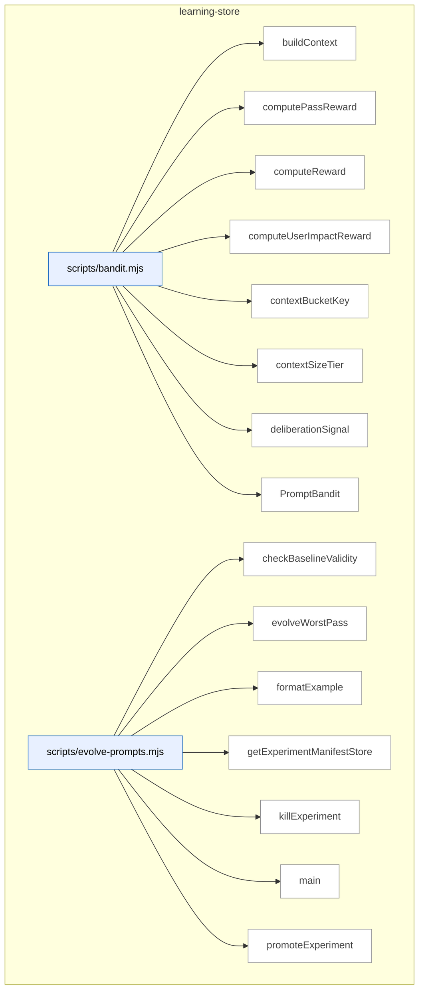

_Domain has 99 symbols (>50). Diagram shows top-15 by file order; see flat table below for the full list._

### Symbols in this domain

| Symbol | Kind | Path | Lines | Purpose |
|---|---|---|---|---|
| [`buildContext`](../scripts/bandit.mjs#L28) | function | `scripts/bandit.mjs` | 28-34 | Maps repository size and language into a context bucket object, or null if repo profile is missing. |
| [`computePassReward`](../scripts/bandit.mjs#L409) | function | `scripts/bandit.mjs` | 409-415 | Averages the reward values from all finding-edit-links in an evaluation record. |
| [`computeReward`](../scripts/bandit.mjs#L309) | function | `scripts/bandit.mjs` | 309-347 | Blends four reward signals (procedural, substantive, deliberation, user-impact) with context-dependent weights. |
| [`computeUserImpactReward`](../scripts/bandit.mjs#L358) | function | `scripts/bandit.mjs` | 358-378 | Scales base user-impact correlation by persona severity, blending unknown personas toward neutral 0.5. |
| [`contextBucketKey`](../scripts/bandit.mjs#L43) | function | `scripts/bandit.mjs` | 43-45 | Produces a cache key by combining size tier and dominant language. |
| [`contextSizeTier`](../scripts/bandit.mjs#L36) | function | `scripts/bandit.mjs` | 36-41 | Classifies character count into size tiers (small, medium, large, xlarge). |
| [`deliberationSignal`](../scripts/bandit.mjs#L385) | function | `scripts/bandit.mjs` | 385-402 | Returns a deliberation signal (0–1) boosted when Claude challenges and GPT sustains, or when GPT compromises. |
| [`PromptBandit`](../scripts/bandit.mjs#L49) | class | `scripts/bandit.mjs` | 49-292 | Multi-armed bandit engine that learns optimal prompt variants per pass and context bucket using Thompson sampling. |
| [`checkBaselineValidity`](../scripts/evolve-prompts.mjs#L340) | function | `scripts/evolve-prompts.mjs` | 340-348 | Marks an experiment as stale if its parent revision has been superseded by a newer default prompt. |
| [`evolveWorstPass`](../scripts/evolve-prompts.mjs#L92) | function | `scripts/evolve-prompts.mjs` | 92-234 | Analyzes outcome data to find the worst-performing pass by EWR, generates LLM prompt variants, and creates a new experiment if improvement is likely. |
| [`formatExample`](../scripts/evolve-prompts.mjs#L336) | function | `scripts/evolve-prompts.mjs` | 336-338 | Formats an outcome record as a single-line summary with severity, category, file, and detail snippet. |
| [`getExperimentManifestStore`](../scripts/evolve-prompts.mjs#L64) | function | `scripts/evolve-prompts.mjs` | 64-66 | Returns a file store for managing experiment manifests indexed by experiment ID. |
| [`killExperiment`](../scripts/evolve-prompts.mjs#L306) | function | `scripts/evolve-prompts.mjs` | 306-317 | Marks a prompt revision as killed and updates its experiment record. |
| [`main`](../scripts/evolve-prompts.mjs#L373) | function | `scripts/evolve-prompts.mjs` | 373-469 | Routes command-line input to evolve, review, stats, or promote/kill subcommands, loading outcomes and bandit state as needed. |
| [`promoteExperiment`](../scripts/evolve-prompts.mjs#L289) | function | `scripts/evolve-prompts.mjs` | 289-301 | Promotes a prompt revision to active status and updates the experiment record accordingly. |
| [`reconcileOrphanedExperiments`](../scripts/evolve-prompts.mjs#L353) | function | `scripts/evolve-prompts.mjs` | 353-369 | Scans the experiment manifests directory for orphaned revisions that failed during setup and logs warnings. |
| [`reviewExperiments`](../scripts/evolve-prompts.mjs#L239) | function | `scripts/evolve-prompts.mjs` | 239-284 | Loads all experiments, filters to active ones, identifies converged variants using bandit arm statistics, and returns results for promotion or killing. |
| [`showStats`](../scripts/evolve-prompts.mjs#L322) | function | `scripts/evolve-prompts.mjs` | 322-332 | Computes pass statistics (EWR), lists active experiments, and returns bandit arm performance data. |
| [`_resetClassificationColumnCache`](../scripts/learning-store.mjs#L217) | function | `scripts/learning-store.mjs` | 217-217 | Clears the cached classification column availability status. |
| [`abortRefreshRun`](../scripts/learning-store.mjs#L1598) | function | `scripts/learning-store.mjs` | 1598-1605 | Marks a refresh run as aborted with an optional error reason. |
| [`appendDebtEventsCloud`](../scripts/learning-store.mjs#L495) | function | `scripts/learning-store.mjs` | 495-523 | Inserts debt events into Supabase with idempotent upserting to prevent duplicates. |
| [`callNeighbourhoodRpc`](../scripts/learning-store.mjs#L1807) | function | `scripts/learning-store.mjs` | 1807-1823 | Calls a Supabase RPC function to find symbol definitions near a target embedding, filtered by kind and repo. |
| [`chunk`](../scripts/learning-store.mjs#L1644) | function | `scripts/learning-store.mjs` | 1644-1648 | Splits an array into chunks of size n. |
| [`computeDriftScore`](../scripts/learning-store.mjs#L1829) | function | `scripts/learning-store.mjs` | 1829-1843 | Calls a Supabase RPC function to compute a drift score between symbol versions based on similarity metrics. |
| [`copyForwardUntouchedFiles`](../scripts/learning-store.mjs#L1912) | function | `scripts/learning-store.mjs` | 1912-1958 | Copies untouched symbols from a prior refresh to a new one, optionally retagging their domain based on file path. |
| [`detectClassificationColumns`](../scripts/learning-store.mjs#L198) | function | `scripts/learning-store.mjs` | 198-214 | Checks whether the database schema supports classification columns. |
| [`getActiveEmbeddingModel`](../scripts/learning-store.mjs#L1790) | function | `scripts/learning-store.mjs` | 1790-1799 | Retrieves the active embedding model and dimension for a repository. |
| [`getActiveSnapshot`](../scripts/learning-store.mjs#L1622) | function | `scripts/learning-store.mjs` | 1622-1635 | Fetches the active refresh and embedding configuration for a repository. |
| [`getFalsePositivePatterns`](../scripts/learning-store.mjs#L836) | function | `scripts/learning-store.mjs` | 836-850 | Fetches false positive patterns marked for auto-suppression for a repository. |
| [`getPassEffectiveness`](../scripts/learning-store.mjs#L806) | function | `scripts/learning-store.mjs` | 806-831 | Retrieves pass effectiveness metrics by joining audit runs and pass stats from Supabase. |
| [`getPassTimings`](../scripts/learning-store.mjs#L306) | function | `scripts/learning-store.mjs` | 306-337 | Retrieves aggregated token and latency statistics grouped by pass name. |
| [`getPersonaSupabase`](../scripts/learning-store.mjs#L1275) | function | `scripts/learning-store.mjs` | 1275-1294 | Lazily initializes and returns a Supabase client for persona tests. |
| [`getReadClient`](../scripts/learning-store.mjs#L1489) | function | `scripts/learning-store.mjs` | 1489-1489 | Returns the read-only Supabase client. |
| [`getRepoIdByUuid`](../scripts/learning-store.mjs#L1498) | function | `scripts/learning-store.mjs` | 1498-1513 | Looks up a repository by UUID and returns its metadata and embedding settings. |
| [`getUnlockedFixes`](../scripts/learning-store.mjs#L994) | function | `scripts/learning-store.mjs` | 994-1006 | Fetches up to 20 unlocked fixes, optionally filtered by repository. |
| [`getWriteClient`](../scripts/learning-store.mjs#L1468) | function | `scripts/learning-store.mjs` | 1468-1486 | Returns a Supabase client initialized with service role credentials for writes. |
| [`heartbeatRefreshRun`](../scripts/learning-store.mjs#L1608) | function | `scripts/learning-store.mjs` | 1608-1613 | Updates a refresh run's heartbeat timestamp to signal liveness. |
| [`initLearningStore`](../scripts/learning-store.mjs#L27) | function | `scripts/learning-store.mjs` | 27-55 | Initializes connection to Supabase cloud store with credentials check. |
| [`isCloudEnabled`](../scripts/learning-store.mjs#L58) | function | `scripts/learning-store.mjs` | 58-60 | Returns whether cloud database is currently available. |
| [`isPersonaCloudEnabled`](../scripts/learning-store.mjs#L1297) | function | `scripts/learning-store.mjs` | 1297-1300 | Returns whether persona cloud storage is enabled. |
| [`listLayeringViolationsForSnapshot`](../scripts/learning-store.mjs#L1883) | function | `scripts/learning-store.mjs` | 1883-1898 | Fetches layering rule violations for a snapshot and maps them to normalized camelCase output. |
| [`listPersonasForApp`](../scripts/learning-store.mjs#L1310) | function | `scripts/learning-store.mjs` | 1310-1324 | Lists all personas associated with a specific app URL. |
| [`listSymbolsForSnapshot`](../scripts/learning-store.mjs#L1849) | function | `scripts/learning-store.mjs` | 1849-1881 | Fetches symbol records from a snapshot, filtering by kind/domain/path and mapping them to a normalized format. |
| [`loadBanditArms`](../scripts/learning-store.mjs#L625) | function | `scripts/learning-store.mjs` | 625-653 | Loads bandit arms from Supabase and reconstructs them into an indexed object. |
| [`loadFalsePositivePatterns`](../scripts/learning-store.mjs#L779) | function | `scripts/learning-store.mjs` | 779-799 | Loads repository and global false positive patterns marked for auto-suppression. |
| [`openRefreshRun`](../scripts/learning-store.mjs#L1552) | function | `scripts/learning-store.mjs` | 1552-1575 | Opens a new refresh run with a cancellation token and heartbeat timestamp. |
| [`publishRefreshRun`](../scripts/learning-store.mjs#L1585) | function | `scripts/learning-store.mjs` | 1585-1595 | Publishes a completed refresh run via RPC call with embedding model info. |
| [`readAuditEffectiveness`](../scripts/learning-store.mjs#L1087) | function | `scripts/learning-store.mjs` | 1087-1099 | Fetches audit effectiveness metrics for a repository. |
| [`readCorrelationsForFinding`](../scripts/learning-store.mjs#L1070) | function | `scripts/learning-store.mjs` | 1070-1081 | Retrieves all persona-audit correlations linked to a specific audit finding. |
| [`readCorrelationsForRun`](../scripts/learning-store.mjs#L1051) | function | `scripts/learning-store.mjs` | 1051-1062 | Retrieves all persona-audit correlations for a specific audit run. |
| [`readDebtEntriesCloud`](../scripts/learning-store.mjs#L429) | function | `scripts/learning-store.mjs` | 429-466 | Fetches debt entries from Supabase for a repository and transforms them into internal format. |
| [`readDebtEventsCloud`](../scripts/learning-store.mjs#L530) | function | `scripts/learning-store.mjs` | 530-551 | Retrieves debt events from Supabase ordered by timestamp. |
| [`readPersistentPlanFailures`](../scripts/learning-store.mjs#L1210) | function | `scripts/learning-store.mjs` | 1210-1221 | Fetches persistent failures recorded against a plan. |
| [`readPlanSatisfaction`](../scripts/learning-store.mjs#L1192) | function | `scripts/learning-store.mjs` | 1192-1204 | Retrieves satisfaction metrics for a specific remediation plan. |
| [`recordAdjudicationEvent`](../scripts/learning-store.mjs#L560) | function | `scripts/learning-store.mjs` | 560-590 | Records an adjudication event for a finding by looking up its ID and inserting the outcome. |
| [`recordFindings`](../scripts/learning-store.mjs#L222) | function | `scripts/learning-store.mjs` | 222-249 | Inserts finding records with severity, category, and optional classification data. |
| [`recordLayeringViolations`](../scripts/learning-store.mjs#L1750) | function | `scripts/learning-store.mjs` | 1750-1773 | Records architecture layering violations in batches and returns total count. |
| [`recordPassStats`](../scripts/learning-store.mjs#L254) | function | `scripts/learning-store.mjs` | 254-274 | Records aggregated statistics for a single pass execution. |
| [`recordPersonaAuditCorrelation`](../scripts/learning-store.mjs#L1025) | function | `scripts/learning-store.mjs` | 1025-1043 | Records a correlation between a persona finding and an audit finding with match scoring. |
| [`recordPersonaSession`](../scripts/learning-store.mjs#L1387) | function | `scripts/learning-store.mjs` | 1387-1452 | Records a persona test session and updates persona stats (truncated). |
| [`recordPlanVerificationItems`](../scripts/learning-store.mjs#L1166) | function | `scripts/learning-store.mjs` | 1166-1186 | Inserts individual criterion verification results for a plan run. |
| [`recordPlanVerificationRun`](../scripts/learning-store.mjs#L1122) | function | `scripts/learning-store.mjs` | 1122-1147 | Creates a plan verification run and returns its ID. |
| [`recordRegressionSpec`](../scripts/learning-store.mjs#L931) | function | `scripts/learning-store.mjs` | 931-957 | Records a regression test specification with assertions and source details. |
| [`recordRegressionSpecRun`](../scripts/learning-store.mjs#L971) | function | `scripts/learning-store.mjs` | 971-987 | Inserts a regression spec test run result with pass/fail and duration data. |
| [`recordRunComplete`](../scripts/learning-store.mjs#L153) | function | `scripts/learning-store.mjs` | 153-175 | Updates an audit run with final statistics (findings, tokens, duration). |
| [`recordRunStart`](../scripts/learning-store.mjs#L106) | function | `scripts/learning-store.mjs` | 106-133 | Creates a new audit run record with initial metadata and zero counts. |
| [`recordShipEvent`](../scripts/learning-store.mjs#L1241) | function | `scripts/learning-store.mjs` | 1241-1264 | Records a ship gate decision event with block reasons and severity counts. |
| [`recordSuppressionEvents`](../scripts/learning-store.mjs#L342) | function | `scripts/learning-store.mjs` | 342-367 | Logs suppression and reopening events for findings matching suppression topics. |
| [`recordSymbolDefinitions`](../scripts/learning-store.mjs#L1680) | function | `scripts/learning-store.mjs` | 1680-1705 | Records symbol definitions in batches and returns a map of IDs keyed by path\|name\|kind. |
| [`recordSymbolEmbedding`](../scripts/learning-store.mjs#L1734) | function | `scripts/learning-store.mjs` | 1734-1748 | Upserts a symbol embedding vector for a definition with model and dimension info. |
| [`recordSymbolIndex`](../scripts/learning-store.mjs#L1707) | function | `scripts/learning-store.mjs` | 1707-1732 | Records symbol index entries in batches and returns total count. |
| [`removeDebtEntryCloud`](../scripts/learning-store.mjs#L472) | function | `scripts/learning-store.mjs` | 472-484 | Deletes a debt entry from Supabase by repo and topic ID. |
| [`setActiveEmbeddingModel`](../scripts/learning-store.mjs#L1779) | function | `scripts/learning-store.mjs` | 1779-1787 | Sets the active embedding model and dimension for a repository. |
| [`syncBanditArms`](../scripts/learning-store.mjs#L598) | function | `scripts/learning-store.mjs` | 598-619 | Syncs multi-armed bandit arm statistics to Supabase, upserting by pass name and variant. |
| [`syncExperiments`](../scripts/learning-store.mjs#L717) | function | `scripts/learning-store.mjs` | 717-743 | Syncs prompt experiment results to Supabase, upserting by experiment ID. |
| [`syncFalsePositivePatterns`](../scripts/learning-store.mjs#L686) | function | `scripts/learning-store.mjs` | 686-709 | Syncs false positive patterns to Supabase with auto-suppress flags based on dismissal thresholds. |
| [`syncPromptRevision`](../scripts/learning-store.mjs#L753) | function | `scripts/learning-store.mjs` | 753-770 | Stores a prompt revision with SHA256 checksum to Supabase. |
| [`updatePassStatsPostDeliberation`](../scripts/learning-store.mjs#L283) | function | `scripts/learning-store.mjs` | 283-299 | Updates finding counts for all passes after deliberation completes. |
| [`updatePlanStatus`](../scripts/learning-store.mjs#L905) | function | `scripts/learning-store.mjs` | 905-912 | Updates a plan's status and timestamp in Supabase. |
| [`updateRunMeta`](../scripts/learning-store.mjs#L182) | function | `scripts/learning-store.mjs` | 182-190 | Patches specific audit run metadata fields (verdict, skip reason). |
| [`upsertDebtEntries`](../scripts/learning-store.mjs#L380) | function | `scripts/learning-store.mjs` | 380-421 | Upserts debt entries with full metadata (owner, status, classification, etc.) to the ledger. |
| [`upsertPersona`](../scripts/learning-store.mjs#L1339) | function | `scripts/learning-store.mjs` | 1339-1374 | Upserts a persona and returns whether it already existed. |
| [`upsertPlan`](../scripts/learning-store.mjs#L875) | function | `scripts/learning-store.mjs` | 875-900 | Creates or updates a remediation plan and returns its ID. |
| [`upsertPromptVariant`](../scripts/learning-store.mjs#L660) | function | `scripts/learning-store.mjs` | 660-677 | Upserts a prompt variant with usage statistics to Supabase. |
| [`upsertRepo`](../scripts/learning-store.mjs#L69) | function | `scripts/learning-store.mjs` | 69-90 | Inserts or updates a repository record with stack and audit metadata. |
| [`upsertRepoByUuid`](../scripts/learning-store.mjs#L1521) | function | `scripts/learning-store.mjs` | 1521-1543 | Upserts a repository by UUID or creates one with a fingerprint key. |
| [`withRetry`](../scripts/learning-store.mjs#L1661) | function | `scripts/learning-store.mjs` | 1661-1677 | Retries an async operation with exponential backoff for network errors. |
| [`computeAssessmentMetrics`](../scripts/meta-assess.mjs#L48) | function | `scripts/meta-assess.mjs` | 48-150 | Computes FP rate, signal quality, severity calibration, and convergence metrics over a windowed slice of outcomes. |
| [`emptyMetrics`](../scripts/meta-assess.mjs#L152) | function | `scripts/meta-assess.mjs` | 152-162 | Returns an empty metrics object for cases with zero outcomes or insufficient data. |
| [`formatAssessmentReport`](../scripts/meta-assess.mjs#L353) | function | `scripts/meta-assess.mjs` | 353-398 | Formats assessment metrics and LLM output into a Markdown report with tables and recommendations. |
| [`main`](../scripts/meta-assess.mjs#L402) | function | `scripts/meta-assess.mjs` | 402-475 | Main entry point: loads outcomes, computes metrics, optionally runs LLM assessment, and outputs report to file or stdout. |
| [`markAssessmentComplete`](../scripts/meta-assess.mjs#L190) | function | `scripts/meta-assess.mjs` | 190-198 | Updates the state file to record that an assessment completed at the current run. |
| [`runLLMAssessment`](../scripts/meta-assess.mjs#L249) | function | `scripts/meta-assess.mjs` | 249-326 | Calls Gemini or GPT with metrics and samples to generate an LLM-assisted health diagnosis and recommendations. |
| [`sampleOutcomes`](../scripts/meta-assess.mjs#L202) | function | `scripts/meta-assess.mjs` | 202-214 | Extracts and truncates recent dismissed/accepted outcome samples for LLM context. |
| [`shouldRunAssessment`](../scripts/meta-assess.mjs#L174) | function | `scripts/meta-assess.mjs` | 174-184 | Checks whether an assessment should run based on elapsed run count vs. a configured interval. |
| [`storeAssessment`](../scripts/meta-assess.mjs#L337) | function | `scripts/meta-assess.mjs` | 337-344 | Appends a timestamped assessment record to a JSONL log file. |
| [`analyzePass`](../scripts/refine-prompts.mjs#L38) | function | `scripts/refine-prompts.mjs` | 38-68 | Analyzes pass effectiveness by computing acceptance rate and error-weighted ranking. |
| [`main`](../scripts/refine-prompts.mjs#L192) | function | `scripts/refine-prompts.mjs` | 192-231 | Parses arguments and routes to pass analysis or refinement suggestion generation. |
| [`suggestRefinements`](../scripts/refine-prompts.mjs#L74) | function | `scripts/refine-prompts.mjs` | 74-190 | Generates LLM-based prompt refinement suggestions using examples of dismissed findings. |

---

## memory-health

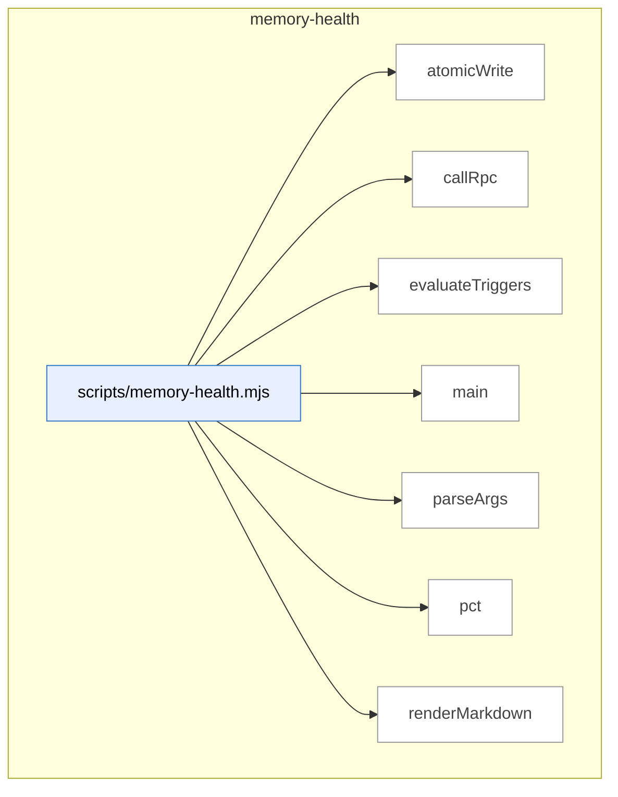

### Symbols in this domain

| Symbol | Kind | Path | Lines | Purpose |
|---|---|---|---|---|
| [`atomicWrite`](../scripts/memory-health.mjs#L193) | function | `scripts/memory-health.mjs` | 193-199 | Atomically writes a file by creating a temporary file, then renaming it to prevent corruption. |
| [`callRpc`](../scripts/memory-health.mjs#L57) | function | `scripts/memory-health.mjs` | 57-71 | Calls a Supabase RPC function to fetch memory health metrics over a rolling window. |
| [`evaluateTriggers`](../scripts/memory-health.mjs#L73) | function | `scripts/memory-health.mjs` | 73-108 | Evaluates three triggers (fuzzy re-raise rate, cluster density, recurrence) against thresholds and returns overall health status. |
| [`main`](../scripts/memory-health.mjs#L201) | function | `scripts/memory-health.mjs` | 201-235 | Orchestrates the full memory-health check: calls RPC, evaluates triggers, optionally writes/outputs report, and exits with appropriate code. |
| [`parseArgs`](../scripts/memory-health.mjs#L37) | function | `scripts/memory-health.mjs` | 37-55 | Parses command-line arguments `--out`, `--json`, and `--help` for the memory-health script. |
| [`pct`](../scripts/memory-health.mjs#L110) | function | `scripts/memory-health.mjs` | 110-112 | Formats a number as a percentage string with one decimal place. |
| [`renderMarkdown`](../scripts/memory-health.mjs#L114) | function | `scripts/memory-health.mjs` | 114-191 | Generates a Markdown health report with metrics table, trigger status, and interpretation guidance. |

---

## plan

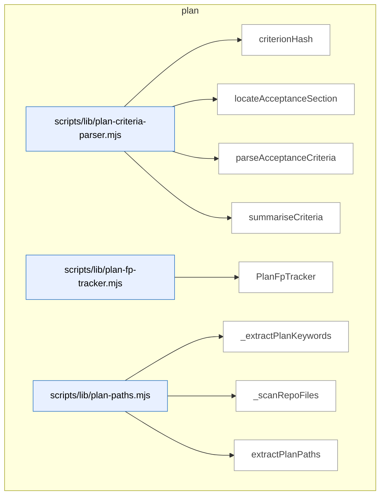

### Symbols in this domain

| Symbol | Kind | Path | Lines | Purpose |
|---|---|---|---|---|
| [`criterionHash`](../scripts/lib/plan-criteria-parser.mjs#L45) | function | `scripts/lib/plan-criteria-parser.mjs` | 45-48 | Generates a 16-character SHA256 hash of normalized severity/category/description for deduplication. |
| [`locateAcceptanceSection`](../scripts/lib/plan-criteria-parser.mjs#L56) | function | `scripts/lib/plan-criteria-parser.mjs` | 56-77 | Locates the acceptance criteria section in markdown by finding level 2-4 headings matching the criteria pattern and returns its content. |
| [`parseAcceptanceCriteria`](../scripts/lib/plan-criteria-parser.mjs#L96) | function | `scripts/lib/plan-criteria-parser.mjs` | 96-152 | Parses acceptance criteria from markdown, extracting severity/category/description and optional setup/assertion lines, with validation and error collection. |
| [`summariseCriteria`](../scripts/lib/plan-criteria-parser.mjs#L158) | function | `scripts/lib/plan-criteria-parser.mjs` | 158-166 | Counts criteria by severity level (P0-P3) and by category, returning totals. |
| [`PlanFpTracker`](../scripts/lib/plan-fp-tracker.mjs#L26) | class | `scripts/lib/plan-fp-tracker.mjs` | 26-140 | Tracks recurring false-positive findings using exponential moving average scoring and consecutive dismissal counts. |
| [`_extractPlanKeywords`](../scripts/lib/plan-paths.mjs#L101) | function | `scripts/lib/plan-paths.mjs` | 101-143 | Extracts keywords from plan markdown by parsing PascalCase identifiers, backtick-quoted names, and heading text, filtering out common noise words. |
| [`_scanRepoFiles`](../scripts/lib/plan-paths.mjs#L145) | function | `scripts/lib/plan-paths.mjs` | 145-171 | Recursively walks the repository filesystem up to depth 5, collecting source code file paths while skipping build/dependency directories and sensitive files. |
| [`extractPlanPaths`](../scripts/lib/plan-paths.mjs#L22) | function | `scripts/lib/plan-paths.mjs` | 22-97 | Extracts file paths from plan markdown using regex patterns for backtick paths, inline paths, and heading filenames, then resolves ambiguous filenames against common source directories. |

---

## root-scripts

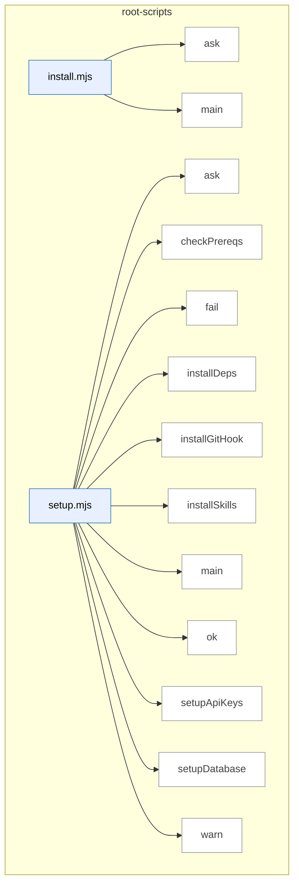

### Symbols in this domain

| Symbol | Kind | Path | Lines | Purpose |
|---|---|---|---|---|
| [`ask`](../install.mjs#L18) | function | `install.mjs` | 18-18 | Wraps readline.question in a Promise for async/await prompt handling. |
| [`main`](../install.mjs#L37) | function | `install.mjs` | 37-238 | Guides users through interactive setup by validating target directory, cloning the latest repo version, copying scripts and skills, and installing dependencies. |
| [`ask`](../setup.mjs#L25) | function | `setup.mjs` | 25-25 | Prompts the user for input and returns a promise resolving to their answer. |
| [`checkPrereqs`](../setup.mjs#L34) | function | `setup.mjs` | 34-43 | Checks Node.js and npm versions meet minimum requirements. |
| [`fail`](../setup.mjs#L30) | function | `setup.mjs` | 30-30 | Logs a failure message with a red X symbol. |
| [`installDeps`](../setup.mjs#L157) | function | `setup.mjs` | 157-164 | Installs npm dependencies via `npm install`. |
| [`installGitHook`](../setup.mjs#L168) | function | `setup.mjs` | 168-196 | Creates or updates a git post-merge hook to auto-update skills after pulls. |
| [`installSkills`](../setup.mjs#L139) | function | `setup.mjs` | 139-153 | Builds a skill manifest and installs skills to the global `~/.claude/skills/` directory. |
| [`main`](../setup.mjs#L200) | function | `setup.mjs` | 200-263 | Orchestrates a multi-step first-time setup flow for API keys, database, dependencies, skills, and hooks. |
| [`ok`](../setup.mjs#L28) | function | `setup.mjs` | 28-28 | Logs a success message with a green checkmark. |
| [`setupApiKeys`](../setup.mjs#L53) | function | `setup.mjs` | 53-80 | Interactively prompts for and saves API keys to `.env` file. |
| [`setupDatabase`](../setup.mjs#L91) | function | `setup.mjs` | 91-135 | Interactively prompts for and configures a learning database backend. |
| [`warn`](../setup.mjs#L29) | function | `setup.mjs` | 29-29 | Logs a warning message with a yellow warning symbol. |

---

## scripts

```mermaid
flowchart TB
subgraph dom_scripts ["scripts"]
  file_scripts_claudemd_lint_mjs["scripts/claudemd-lint.mjs"]:::component
  sym_scripts_claudemd_lint_mjs_loadConfig["loadConfig"]:::symbol
  file_scripts_claudemd_lint_mjs --> sym_scripts_claudemd_lint_mjs_loadConfig
  sym_scripts_claudemd_lint_mjs_main["main"]:::symbol
  file_scripts_claudemd_lint_mjs --> sym_scripts_claudemd_lint_mjs_main
  sym_scripts_claudemd_lint_mjs_parseArgs["parseArgs"]:::symbol
  file_scripts_claudemd_lint_mjs --> sym_scripts_claudemd_lint_mjs_parseArgs
  file_scripts_migrate_v3_run_metadata_mjs["scripts/migrate-v3-run-metadata.mjs"]:::component
  sym_scripts_migrate_v3_run_metadata_mjs_run["run"]:::symbol
  file_scripts_migrate_v3_run_metadata_mjs --> sym_scripts_migrate_v3_run_metadata_mjs_run
  file_scripts_phase7_check_mjs["scripts/phase7-check.mjs"]:::component
  sym_scripts_phase7_check_mjs_checkReadiness["checkReadiness"]:::symbol
  file_scripts_phase7_check_mjs --> sym_scripts_phase7_check_mjs_checkReadiness
  file_scripts_setup_github_store_mjs["scripts/setup-github-store.mjs"]:::component
  sym_scripts_setup_github_store_mjs_main["main"]:::symbol
  file_scripts_setup_github_store_mjs --> sym_scripts_setup_github_store_mjs_main
  sym_scripts_setup_github_store_mjs_parseArgs["parseArgs"]:::symbol
  file_scripts_setup_github_store_mjs --> sym_scripts_setup_github_store_mjs_parseArgs
  file_scripts_setup_postgres_mjs["scripts/setup-postgres.mjs"]:::component
  sym_scripts_setup_postgres_mjs_main["main"]:::symbol
  file_scripts_setup_postgres_mjs --> sym_scripts_setup_postgres_mjs_main
  file_scripts_setup_sqlite_mjs["scripts/setup-sqlite.mjs"]:::component
  sym_scripts_setup_sqlite_mjs_main["main"]:::symbol
  file_scripts_setup_sqlite_mjs --> sym_scripts_setup_sqlite_mjs_main
  file_scripts_sync_shared_audit_refs_mjs["scripts/sync-shared-audit-refs.mjs"]:::component
  sym_scripts_sync_shared_audit_refs_mjs_findS["findSyncTargets"]:::symbol
  file_scripts_sync_shared_audit_refs_mjs --> sym_scripts_sync_shared_audit_refs_mjs_findS
  sym_scripts_sync_shared_audit_refs_mjs_main["main"]:::symbol
  file_scripts_sync_shared_audit_refs_mjs --> sym_scripts_sync_shared_audit_refs_mjs_main
  sym_scripts_sync_shared_audit_refs_mjs_sha["sha"]:::symbol
  file_scripts_sync_shared_audit_refs_mjs --> sym_scripts_sync_shared_audit_refs_mjs_sha
  file_scripts_templates_e2e_helpers_auth_js["scripts/templates/e2e-helpers/auth.js"]:::component
  sym_scripts_templates_e2e_helpers_auth_js_lo["loginAsTestUser"]:::symbol
  file_scripts_templates_e2e_helpers_auth_js --> sym_scripts_templates_e2e_helpers_auth_js_lo
  file_scripts_templates_e2e_helpers_axe_js["scripts/templates/e2e-helpers/axe.js"]:::component
  sym_scripts_templates_e2e_helpers_axe_js_exp["expectNoA11yViolations"]:::symbol
  file_scripts_templates_e2e_helpers_axe_js --> sym_scripts_templates_e2e_helpers_axe_js_exp
  file_scripts_write_ledger_r1_mjs["scripts/write-ledger-r1.mjs"]:::component
  sym_scripts_write_ledger_r1_mjs_addEntry["addEntry"]:::symbol
  file_scripts_write_ledger_r1_mjs --> sym_scripts_write_ledger_r1_mjs_addEntry
  file_scripts_write_plan_outcomes_mjs["scripts/write-plan-outcomes.mjs"]:::component
  sym_scripts_write_plan_outcomes_mjs_main["main"]:::symbol
  file_scripts_write_plan_outcomes_mjs --> sym_scripts_write_plan_outcomes_mjs_main
  sym_scripts_write_plan_outcomes_mjs_parseArg["parseArgs"]:::symbol
  file_scripts_write_plan_outcomes_mjs --> sym_scripts_write_plan_outcomes_mjs_parseArg
end
classDef container fill:#f5f5f5,stroke:#333,stroke-width:2px,color:#000
classDef component fill:#e8f0ff,stroke:#3178c6,color:#000
classDef symbol fill:#fff,stroke:#999,color:#444
classDef dup fill:#ffe8d8,stroke:#c0392b,stroke-width:2px,color:#000
classDef violation fill:#ffd6d6,stroke:#c0392b,stroke-width:2px,color:#000
```

### Symbols in this domain

| Symbol | Kind | Path | Lines | Purpose |
|---|---|---|---|---|
| [`loadConfig`](../scripts/claudemd-lint.mjs#L48) | function | `scripts/claudemd-lint.mjs` | 48-66 | Loads JSON configuration from specified path or default .claudemd-lint.json, falling back to empty object. |
| [`main`](../scripts/claudemd-lint.mjs#L68) | function | `scripts/claudemd-lint.mjs` | 68-172 | Scans instruction files, runs linting rules, handles auto-fix mode, and outputs findings in terminal/JSON/SARIF format. |
| [`parseArgs`](../scripts/claudemd-lint.mjs#L26) | function | `scripts/claudemd-lint.mjs` | 26-46 | Parses command-line flags for output format, file destination, config path, fix mode, and confirmation flag. |
| [`run`](../scripts/migrate-v3-run-metadata.mjs#L66) | function | `scripts/migrate-v3-run-metadata.mjs` | 66-84 | Applies pending database schema migrations for v3 metadata and logs success/failure count. |
| [`checkReadiness`](../scripts/phase7-check.mjs#L12) | function | `scripts/phase7-check.mjs` | 12-64 | Checks how many audit runs have completed and reports progress toward Phase 7 readiness threshold. |
| [`main`](../scripts/setup-github-store.mjs#L26) | function | `scripts/setup-github-store.mjs` | 26-101 | <no body> |
| [`parseArgs`](../scripts/setup-github-store.mjs#L13) | function | `scripts/setup-github-store.mjs` | 13-24 | Parses command-line arguments for GitHub repository owner, name, branch, and authentication token. |
| [`main`](../scripts/setup-postgres.mjs#L17) | function | `scripts/setup-postgres.mjs` | 17-79 | <no body> |
| [`main`](../scripts/setup-sqlite.mjs#L16) | function | `scripts/setup-sqlite.mjs` | 16-70 | Initializes a SQLite database with WAL mode and foreign keys, then applies all schema migrations. |
| [`findSyncTargets`](../scripts/sync-shared-audit-refs.mjs#L71) | function | `scripts/sync-shared-audit-refs.mjs` | 71-115 | Finds canonical audit reference files and their expected/discovered consumer locations in skill directories. |
| [`main`](../scripts/sync-shared-audit-refs.mjs#L117) | function | `scripts/sync-shared-audit-refs.mjs` | 117-166 | Syncs canonical audit references to skill directories, detecting drift and optionally writing updates or checking for mismatches. |
| [`sha`](../scripts/sync-shared-audit-refs.mjs#L39) | function | `scripts/sync-shared-audit-refs.mjs` | 39-41 | Returns the first 12 characters of a SHA-256 hash of a buffer. |
| [`loginAsTestUser`](../scripts/templates/e2e-helpers/auth.js#L16) | function | `scripts/templates/e2e-helpers/auth.js` | 16-28 | Injects authentication tokens into browser local storage before page load. |
| [`expectNoA11yViolations`](../scripts/templates/e2e-helpers/axe.js#L18) | function | `scripts/templates/e2e-helpers/axe.js` | 18-40 | Runs axe-core accessibility checks and throws an error if violations are found. |
| [`addEntry`](../scripts/write-ledger-r1.mjs#L6) | function | `scripts/write-ledger-r1.mjs` | 6-25 | Populates metadata on a finding and writes a ledger entry with adjudication details. |
| [`main`](../scripts/write-plan-outcomes.mjs#L28) | function | `scripts/write-plan-outcomes.mjs` | 28-78 | Reads a result file with findings, parses outcomes JSON, and records plan tracking decisions. |
| [`parseArgs`](../scripts/write-plan-outcomes.mjs#L19) | function | `scripts/write-plan-outcomes.mjs` | 19-26 | Parses command-line arguments for `--result` and `--outcomes` flags. |

---

## shared-lib

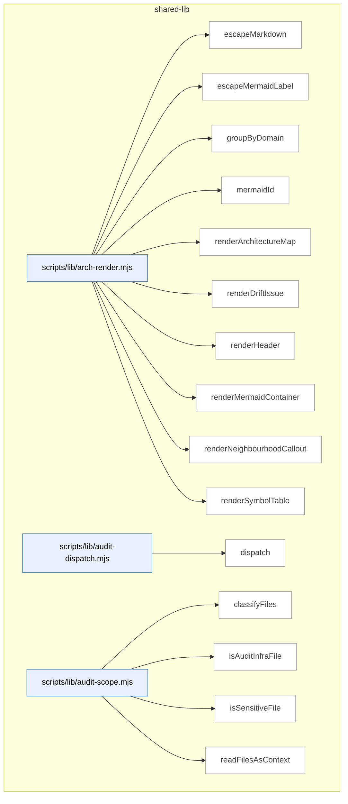

_Domain has 234 symbols (>50). Diagram shows top-15 by file order; see flat table below for the full list._

### Symbols in this domain

| Symbol | Kind | Path | Lines | Purpose |
|---|---|---|---|---|
| [`escapeMarkdown`](../scripts/lib/arch-render.mjs#L22) | function | `scripts/lib/arch-render.mjs` | 22-28 | Escapes pipe, newline, and carriage-return characters for safe inclusion in Markdown tables. |
| [`escapeMermaidLabel`](../scripts/lib/arch-render.mjs#L31) | function | `scripts/lib/arch-render.mjs` | 31-37 | Escapes quotes and angle brackets, truncates to 60 characters for safe Mermaid diagram labels. |
| [`groupByDomain`](../scripts/lib/arch-render.mjs#L45) | function | `scripts/lib/arch-render.mjs` | 45-63 | Groups symbols by domain, sorts domains alphabetically, and sorts symbols within each domain by file path then name. |
| [`mermaidId`](../scripts/lib/arch-render.mjs#L40) | function | `scripts/lib/arch-render.mjs` | 40-42 | Generates a sanitized Mermaid node identifier from a prefix and key. |
| [`renderArchitectureMap`](../scripts/lib/arch-render.mjs#L135) | function | `scripts/lib/arch-render.mjs` | 135-209 | Generates a complete architecture map document with table of contents, per-domain sections, layering violations, and regeneration instructions. |
| [`renderDriftIssue`](../scripts/lib/arch-render.mjs#L278) | function | `scripts/lib/arch-render.mjs` | 278-340 | Renders a drift report showing top duplication clusters with similarity scores, member symbols, and long-tail summary. |
| [`renderHeader`](../scripts/lib/arch-render.mjs#L121) | function | `scripts/lib/arch-render.mjs` | 121-132 | Renders the header section of an architecture map with repo name, generation timestamp, drift metrics, and summary counts. |
| [`renderMermaidContainer`](../scripts/lib/arch-render.mjs#L69) | function | `scripts/lib/arch-render.mjs` | 69-103 | Renders a Mermaid flowchart container showing a domain's symbols organized by file, with truncation notice if over 50 symbols. |
| [`renderNeighbourhoodCallout`](../scripts/lib/arch-render.mjs#L212) | function | `scripts/lib/arch-render.mjs` | 212-275 | Renders a callout block showing near-duplicate symbols from the neighbourhood index or explaining why it was skipped. |
| [`renderSymbolTable`](../scripts/lib/arch-render.mjs#L106) | function | `scripts/lib/arch-render.mjs` | 106-118 | Renders symbols as a Markdown table with kind, path, line range, and purpose summary. |
| [`dispatch`](../scripts/lib/audit-dispatch.mjs#L26) | function | `scripts/lib/audit-dispatch.mjs` | 26-48 | Parses a user input string to determine which audit skill and mode to dispatch, handling keywords like "plan", "code", "full", and markdown filenames. |
| [`classifyFiles`](../scripts/lib/audit-scope.mjs#L149) | function | `scripts/lib/audit-scope.mjs` | 149-168 | Classifies file paths into backend, frontend, and shared categories based on directory and extension patterns. |
| [`isAuditInfraFile`](../scripts/lib/audit-scope.mjs#L62) | function | `scripts/lib/audit-scope.mjs` | 62-69 | Checks whether a file is part of the audit infrastructure by verifying it lives directly in scripts/ or scripts/lib/. |
| [`isSensitiveFile`](../scripts/lib/audit-scope.mjs#L22) | function | `scripts/lib/audit-scope.mjs` | 22-25 | Checks whether a relative file path matches patterns for sensitive files like .env, secrets, and keys. |
| [`readFilesAsContext`](../scripts/lib/audit-scope.mjs#L112) | function | `scripts/lib/audit-scope.mjs` | 112-140 | Reads multiple files as concatenated markdown code blocks, respecting context budgets and excluding sensitive files. |
| [`safeReadFile`](../scripts/lib/audit-scope.mjs#L84) | function | `scripts/lib/audit-scope.mjs` | 84-98 | Safely reads a file with checks for sensitive paths, symlinks, size limits, and boundary violations. |
| [`buildRecord`](../scripts/lib/backfill-parser.mjs#L178) | function | `scripts/lib/backfill-parser.mjs` | 178-204 | Builds a finding record with inferred files, a stable topicId hash, and confidence scores for each field. |
| [`extractFilesFromText`](../scripts/lib/backfill-parser.mjs#L65) | function | `scripts/lib/backfill-parser.mjs` | 65-78 | Extracts file paths enclosed in backticks from text, keeping only those with slashes or audit paths. |
| [`extractPhaseTag`](../scripts/lib/backfill-parser.mjs#L86) | function | `scripts/lib/backfill-parser.mjs` | 86-92 | Extracts a phase tag from an audit summary filename by matching "phase-X" prefix or stripping "-audit-summary.md". |
| [`parseSummaryContent`](../scripts/lib/backfill-parser.mjs#L120) | function | `scripts/lib/backfill-parser.mjs` | 120-176 | Parses markdown audit-summary content line-by-line, extracting deferred findings in bullet or table format and building records. |
| [`parseSummaryFile`](../scripts/lib/backfill-parser.mjs#L105) | function | `scripts/lib/backfill-parser.mjs` | 105-111 | Reads a summary file and parses its content, returning findings and any diagnostics. |
| [`parseSummaryFiles`](../scripts/lib/backfill-parser.mjs#L211) | function | `scripts/lib/backfill-parser.mjs` | 211-220 | Processes multiple summary files, aggregating their records and tracking per-file diagnostics. |
| [`severityFromPrefix`](../scripts/lib/backfill-parser.mjs#L49) | function | `scripts/lib/backfill-parser.mjs` | 49-57 | Maps single-letter severity prefixes (H/M/L/T) to severity enum values. |
| [`fetch`](../scripts/lib/bootstrap-template.mjs#L28) | function | `scripts/lib/bootstrap-template.mjs` | 28-41 | Fetches an HTTPS URL with automatic redirect following and returns the response body as a string. |
| [`fetchAndCache`](../scripts/lib/bootstrap-template.mjs#L51) | function | `scripts/lib/bootstrap-template.mjs` | 51-58 | Fetches a remote script by URL, caches it locally in a directory structure, and returns the cached file path. |
| [`getCached`](../scripts/lib/bootstrap-template.mjs#L43) | function | `scripts/lib/bootstrap-template.mjs` | 43-49 | Returns a cached file path if it exists and is fresher than the TTL, otherwise returns null. |
| [`main`](../scripts/lib/bootstrap-template.mjs#L60) | function | `scripts/lib/bootstrap-template.mjs` | 60-110 | Parses command-line arguments to route bootstrap commands (install/check/version), fetches/caches remote scripts, and executes them with passthrough arguments. |
| [`buildAuditUnits`](../scripts/lib/code-analysis.mjs#L201) | function | `scripts/lib/code-analysis.mjs` | 201-239 | Scores files by token count, bins them into audit units respecting token/file limits, and chunks oversized files separately. |
| [`buildDependencyGraph`](../scripts/lib/code-analysis.mjs#L161) | function | `scripts/lib/code-analysis.mjs` | 161-188 | Builds a dependency graph by parsing import statements in all files and resolving them against the repo file set using language-specific rules. |
| [`chunkLargeFile`](../scripts/lib/code-analysis.mjs#L98) | function | `scripts/lib/code-analysis.mjs` | 98-132 | Chunks a large source file by function boundaries, grouping functions into units that respect token budgets, with fallback to line-count splitting. |
| [`estimateTokens`](../scripts/lib/code-analysis.mjs#L32) | function | `scripts/lib/code-analysis.mjs` | 32-34 | Estimates token count by dividing text character length by 4. |
| [`extractExportsOnly`](../scripts/lib/code-analysis.mjs#L142) | function | `scripts/lib/code-analysis.mjs` | 142-151 | Reads a source file, extracts only export statements matching the file's language profile, and returns a comment-prefixed export-only snippet. |
| [`extractImportBlock`](../scripts/lib/code-analysis.mjs#L46) | function | `scripts/lib/code-analysis.mjs` | 46-57 | Extracts import/module statements from the beginning of a source file up to the first function boundary. |
| [`measureContextChars`](../scripts/lib/code-analysis.mjs#L272) | function | `scripts/lib/code-analysis.mjs` | 272-282 | Sums file sizes (capped per file) from a list of file paths to measure total context character footprint. |
| [`splitAtFunctionBoundaries`](../scripts/lib/code-analysis.mjs#L66) | function | `scripts/lib/code-analysis.mjs` | 66-84 | Splits source code into chunks at function boundaries, returning each as a separate item with line numbers. |
| [`discoverDotenv`](../scripts/lib/config.mjs#L21) | function | `scripts/lib/config.mjs` | 21-55 | Discovers the .env file by walking up from CWD, then trying git root and worktree locations. |
| [`normalizeLanguage`](../scripts/lib/config.mjs#L148) | function | `scripts/lib/config.mjs` | 148-161 | Normalizes a language string to a canonical short form (js/ts/py/go/other) via alias mapping. |
| [`validatedEnum`](../scripts/lib/config.mjs#L66) | function | `scripts/lib/config.mjs` | 66-73 | Returns an enum value from environment or fallback, warning if the value is invalid. |
| [`_extractRegexFacts`](../scripts/lib/context.mjs#L89) | function | `scripts/lib/context.mjs` | 89-136 | Extracts stack/runtime, package dependencies from markdown tables and inline bold format using regex, filtering false positives. |
| [`_getClaudeMd`](../scripts/lib/context.mjs#L58) | function | `scripts/lib/context.mjs` | 58-69 | Reads CLAUDE.md or AGENTS.md from the current directory or parents, caching the result, returning empty string if not found. |
| [`_getClaudeMdPath`](../scripts/lib/context.mjs#L75) | function | `scripts/lib/context.mjs` | 75-81 | Searches for CLAUDE.md or AGENTS.md in the current directory or parents, returning the file path or null. |
| [`_getPassAddendum`](../scripts/lib/context.mjs#L247) | function | `scripts/lib/context.mjs` | 247-261 | Extracts pass-specific context sections from the Claude project instruction file, limited to 800 characters. |
| [`_llmCondense`](../scripts/lib/context.mjs#L175) | function | `scripts/lib/context.mjs` | 175-226 | Calls Claude Haiku (or Gemini Flash fallback) to condense a truncated CLAUDE.md into an audit brief summary, capping at 3000 characters. |
| [`_quickFingerprint`](../scripts/lib/context.mjs#L330) | function | `scripts/lib/context.mjs` | 330-340 | Computes a 16-character SHA256 hash of package.json and Claude.md to detect repository changes. |
| [`buildHistoryContext`](../scripts/lib/context.mjs#L637) | function | `scripts/lib/context.mjs` | 637-683 | Reads prior audit history from a JSON file and formats it as context to prevent re-raising already-resolved findings. |
| [`extractPlanForPass`](../scripts/lib/context.mjs#L606) | function | `scripts/lib/context.mjs` | 606-630 | Extracts and concatenates sections from a plan document relevant to a specific audit pass, limited to 4000 characters. |
| [`generateRepoProfile`](../scripts/lib/context.mjs#L350) | function | `scripts/lib/context.mjs` | 350-469 | Generates a comprehensive repository profile including file inventory, stack detection, and codebase classification. |
| [`getAuditBriefCache`](../scripts/lib/context.mjs#L27) | function | `scripts/lib/context.mjs` | 27-29 | Returns the cached audit brief text. |
| [`getClaudeMdCache`](../scripts/lib/context.mjs#L32) | function | `scripts/lib/context.mjs` | 32-34 | Returns the cached CLAUDE.md content string. |
| [`getRepoProfileCache`](../scripts/lib/context.mjs#L22) | function | `scripts/lib/context.mjs` | 22-24 | Returns the cached repo profile object. |
| [`initAuditBrief`](../scripts/lib/context.mjs#L479) | function | `scripts/lib/context.mjs` | 479-509 | Builds an audit brief by combining regex-extracted facts with optional LLM condensation of the project instruction file. |
| [`loadKnownFpContext`](../scripts/lib/context.mjs#L558) | function | `scripts/lib/context.mjs` | 558-591 | Loads and formats known false positives from a JSON file, filtering by pass name to prevent re-raising dismissed issues. |
| [`loadSessionCache`](../scripts/lib/context.mjs#L275) | function | `scripts/lib/context.mjs` | 275-301 | Loads and validates a session cache file, checking fingerprint staleness and restoring audit brief and repo profile. |
| [`readProjectContext`](../scripts/lib/context.mjs#L594) | function | `scripts/lib/context.mjs` | 594-598 | Returns the cached audit brief or falls back to reading the Claude project instruction file truncated to 4000 characters. |
| [`readProjectContextForPass`](../scripts/lib/context.mjs#L518) | function | `scripts/lib/context.mjs` | 518-536 | Assembles project context for a specific audit pass, including brief, pass-specific sections, and known false positive allowlist. |
| [`saveSessionCache`](../scripts/lib/context.mjs#L309) | function | `scripts/lib/context.mjs` | 309-324 | Persists audit brief and repo profile to a session cache file with a repository fingerprint for staleness detection. |
| [`_annotateBlockStyle`](../scripts/lib/diff-annotation.mjs#L79) | function | `scripts/lib/diff-annotation.mjs` | 79-113 | Annotates a source file with visual markers distinguishing changed hunks from unchanged context using block comments. |
| [`_annotateHeaderOnlyStyle`](../scripts/lib/diff-annotation.mjs#L115) | function | `scripts/lib/diff-annotation.mjs` | 115-125 | Annotates a source file with line numbers and a header note listing the changed line ranges (for header-only files). |
| [`_buildFileBlock`](../scripts/lib/diff-annotation.mjs#L154) | function | `scripts/lib/diff-annotation.mjs` | 154-178 | Builds a single file context block with syntax highlighting, diff annotations, and truncation handling. |
| [`getCommentStyle`](../scripts/lib/diff-annotation.mjs#L72) | function | `scripts/lib/diff-annotation.mjs` | 72-77 | Determines the comment style (block vs header-only) for a file based on its extension. |
| [`parseDiffFile`](../scripts/lib/diff-annotation.mjs#L23) | function | `scripts/lib/diff-annotation.mjs` | 23-60 | Parses a unified diff file to extract changed line ranges per file into a map of hunks. |
| [`readFilesAsAnnotatedContext`](../scripts/lib/diff-annotation.mjs#L138) | function | `scripts/lib/diff-annotation.mjs` | 138-152 | Reads multiple files as annotated context blocks, respecting size budgets and skipping inaccessible files. |
| [`atomicWriteFileSync`](../scripts/lib/file-io.mjs#L16) | function | `scripts/lib/file-io.mjs` | 16-30 | Atomically write data to a file by writing to a temporary file first, then renaming it to avoid partial writes on failure. |
| [`normalizePath`](../scripts/lib/file-io.mjs#L39) | function | `scripts/lib/file-io.mjs` | 39-43 | Normalize a file path to lowercase, relative to current working directory, with forward slashes. |
| [`readFileOrDie`](../scripts/lib/file-io.mjs#L55) | function | `scripts/lib/file-io.mjs` | 55-62 | Read a file synchronously, exiting the process if the file does not exist. |
| [`safeInt`](../scripts/lib/file-io.mjs#L48) | function | `scripts/lib/file-io.mjs` | 48-51 | Parse a string as a base-10 integer, returning a fallback value if parsing fails. |
| [`writeOutput`](../scripts/lib/file-io.mjs#L72) | function | `scripts/lib/file-io.mjs` | 72-83 | Output JSON data either to a file or stdout, creating parent directories as needed. |
| [`_acquireLockSync`](../scripts/lib/file-store.mjs#L38) | function | `scripts/lib/file-store.mjs` | 38-70 | Acquire an exclusive lock file synchronously with retry logic and stale lock detection. |
| [`_quarantineRecord`](../scripts/lib/file-store.mjs#L18) | function | `scripts/lib/file-store.mjs` | 18-34 | Quarantine corrupted data to a timestamped JSON file in a quarantine directory for later inspection. |
| [`_releaseLock`](../scripts/lib/file-store.mjs#L72) | function | `scripts/lib/file-store.mjs` | 72-74 | Release a lock by deleting the lock file, ignoring errors if it's already gone. |
| [`acquireLock`](../scripts/lib/file-store.mjs#L80) | function | `scripts/lib/file-store.mjs` | 80-82 | Acquire a lock synchronously using the internal lock function. |
| [`AppendOnlyStore`](../scripts/lib/file-store.mjs#L208) | class | `scripts/lib/file-store.mjs` | 208-243 | Append-only JSONL store that quarantines schema-invalid records instead of appending them. |
| [`MutexFileStore`](../scripts/lib/file-store.mjs#L117) | class | `scripts/lib/file-store.mjs` | 117-200 | Atomic read-modify-write store with mutex locking and optional Zod schema validation. |
| [`readJsonlFile`](../scripts/lib/file-store.mjs#L94) | function | `scripts/lib/file-store.mjs` | 94-109 | Parse a JSONL file line-by-line, skipping invalid JSON lines and returning an array of records. |
| [`releaseLock`](../scripts/lib/file-store.mjs#L84) | function | `scripts/lib/file-store.mjs` | 84-86 | Release a lock using the internal unlock function. |
| [`buildFileReferenceRegex`](../scripts/lib/language-profiles.mjs#L302) | function | `scripts/lib/language-profiles.mjs` | 302-308 | Builds a regex to match file references in code, supporting relative/absolute paths and multiple file extensions. |
| [`buildLanguageContext`](../scripts/lib/language-profiles.mjs#L317) | function | `scripts/lib/language-profiles.mjs` | 317-322 | Creates a language context object with a file set and detected Python package root directories. |
| [`countFilesByLanguage`](../scripts/lib/language-profiles.mjs#L247) | function | `scripts/lib/language-profiles.mjs` | 247-254 | Counts how many files belong to each language profile by extension matching. |
| [`detectDominantLanguage`](../scripts/lib/language-profiles.mjs#L260) | function | `scripts/lib/language-profiles.mjs` | 260-265 | Finds the most common language by file count, excluding unknown files. |
| [`detectPythonPackageRoots`](../scripts/lib/language-profiles.mjs#L333) | function | `scripts/lib/language-profiles.mjs` | 333-356 | Detects Python package root directories by finding __init__.py parents that aren't themselves packages. |
| [`freezeProfile`](../scripts/lib/language-profiles.mjs#L80) | function | `scripts/lib/language-profiles.mjs` | 80-89 | Deep-freezes a language profile and all its nested structure to prevent accidental mutation. |
| [`getAllProfiles`](../scripts/lib/language-profiles.mjs#L228) | function | `scripts/lib/language-profiles.mjs` | 228-230 | Returns all registered language profiles. |
| [`getProfile`](../scripts/lib/language-profiles.mjs#L232) | function | `scripts/lib/language-profiles.mjs` | 232-234 | Returns a profile object for a given language ID, or a fallback unknown profile. |
| [`getProfileForFile`](../scripts/lib/language-profiles.mjs#L236) | function | `scripts/lib/language-profiles.mjs` | 236-242 | Returns a profile for a file by matching its extension against all profiles' extension lists. |
| [`jsResolveImport`](../scripts/lib/language-profiles.mjs#L367) | function | `scripts/lib/language-profiles.mjs` | 367-389 | Resolves relative JavaScript/TypeScript imports to actual file paths, preferring extensions based on importer type. |
| [`makeRegexBoundaries`](../scripts/lib/language-profiles.mjs#L40) | function | `scripts/lib/language-profiles.mjs` | 40-48 | Returns a boundary-detector function that identifies lines matching a regex in a source file. |
| [`pyResolveImport`](../scripts/lib/language-profiles.mjs#L402) | function | `scripts/lib/language-profiles.mjs` | 402-457 | <no body> |
| [`pythonBoundaryScanner`](../scripts/lib/language-profiles.mjs#L56) | function | `scripts/lib/language-profiles.mjs` | 56-76 | Scans Python source lines to find symbol boundaries (def/class), accounting for decorator blocks above them. |
| [`batchWriteLedger`](../scripts/lib/ledger.mjs#L181) | function | `scripts/lib/ledger.mjs` | 181-205 | Batch-writes multiple ledger entries with upsert semantics, optionally merging metadata and returning insertion/update counts. |
| [`buildR2SystemPrompt`](../scripts/lib/ledger.mjs#L486) | function | `scripts/lib/ledger.mjs` | 486-488 | Builds an R2 system prompt by combining round modifiers, prior rulings block, and pass rubric. |
| [`buildRulingsBlock`](../scripts/lib/ledger.mjs#L391) | function | `scripts/lib/ledger.mjs` | 391-456 | <no body> |
| [`computeImpactSet`](../scripts/lib/ledger.mjs#L498) | function | `scripts/lib/ledger.mjs` | 498-520 | Computes the set of files impacted by changes, including files that import changed modules. |
| [`generateTopicId`](../scripts/lib/ledger.mjs#L30) | function | `scripts/lib/ledger.mjs` | 30-40 | Generates a stable 12-character topic ID from a finding's file, principle, category, pass, and semantic hash. |
| [`getFileRegex`](../scripts/lib/ledger.mjs#L21) | function | `scripts/lib/ledger.mjs` | 21-21 | Returns the file reference regex for extracting file paths from text. |
| [`jaccardSimilarity`](../scripts/lib/ledger.mjs#L243) | function | `scripts/lib/ledger.mjs` | 243-251 | Computes Jaccard similarity (intersection over union) of two tokenized strings. |
| [`mergeMetaLocked`](../scripts/lib/ledger.mjs#L160) | function | `scripts/lib/ledger.mjs` | 160-179 | Merges metadata into a locked ledger file, using file locking to prevent concurrent corruption. |
| [`populateFindingMetadata`](../scripts/lib/ledger.mjs#L215) | function | `scripts/lib/ledger.mjs` | 215-233 | Extracts affected file paths from a finding's section field using regex, sets primary file and pass, and ensures a stable semantic hash. |
| [`readLedgerJson`](../scripts/lib/ledger.mjs#L118) | function | `scripts/lib/ledger.mjs` | 118-130 | Reads and parses a ledger JSON file, returning an empty ledger if the file doesn't exist. |
| [`suppressReRaises`](../scripts/lib/ledger.mjs#L262) | function | `scripts/lib/ledger.mjs` | 262-380 | <no body> |
| [`upsertEntry`](../scripts/lib/ledger.mjs#L133) | function | `scripts/lib/ledger.mjs` | 133-157 | Validates and upserts a batch entry into a ledger, preserving ruling and remediation metadata while updating transient fields. |
| [`writeLedgerEntry`](../scripts/lib/ledger.mjs#L47) | function | `scripts/lib/ledger.mjs` | 47-93 | <no body> |
| [`computeMaxBuffer`](../scripts/lib/linter.mjs#L56) | function | `scripts/lib/linter.mjs` | 56-58 | Calculates max buffer size for tool output based on file count. |
| [`executeTools`](../scripts/lib/linter.mjs#L156) | function | `scripts/lib/linter.mjs` | 156-174 | Organizes files by tool configuration, deduplicates, and executes each tool once with all applicable files. |
| [`formatLintSummary`](../scripts/lib/linter.mjs#L324) | function | `scripts/lib/linter.mjs` | 324-358 | Formats static analysis findings summary for LLM context, condensing large sets by rule frequency and severity counts. |
| [`isToolAvailable`](../scripts/lib/linter.mjs#L77) | function | `scripts/lib/linter.mjs` | 77-84 | Tests whether a tool is available by running its availability probe command. |
| [`normalizeExternalFinding`](../scripts/lib/linter.mjs#L272) | function | `scripts/lib/linter.mjs` | 272-294 | Transforms raw tool findings into a unified report object with severity, category, and remediation guidance. |
| [`normalizeToolResults`](../scripts/lib/linter.mjs#L301) | function | `scripts/lib/linter.mjs` | 301-311 | Filters tool results by success status and accumulates normalized findings with auto-incrementing IDs. |
| [`parseEslintOutput`](../scripts/lib/linter.mjs#L178) | function | `scripts/lib/linter.mjs` | 178-205 | Parses ESLint JSON output, handling fatal parse errors separately and converting paths to relative format. |
| [`parseFlake8PylintOutput`](../scripts/lib/linter.mjs#L239) | function | `scripts/lib/linter.mjs` | 239-254 | Parses pylint/flake8 diagnostic output by pattern-matching and collects standardized issue records. |
| [`parseRuffOutput`](../scripts/lib/linter.mjs#L207) | function | `scripts/lib/linter.mjs` | 207-219 | Parses Ruff JSON output, extracting diagnostics and converting paths to relative format. |
| [`parseTscOutput`](../scripts/lib/linter.mjs#L221) | function | `scripts/lib/linter.mjs` | 221-237 | Extracts TypeScript compiler errors from formatted output using regex and returns normalized findings array. |
| [`resetExecFileSync`](../scripts/lib/linter.mjs#L67) | function | `scripts/lib/linter.mjs` | 67-67 | Restores the default execFileSync implementation. |
| [`runTool`](../scripts/lib/linter.mjs#L96) | function | `scripts/lib/linter.mjs` | 96-146 | <no body> |
| [`setExecFileSync`](../scripts/lib/linter.mjs#L65) | function | `scripts/lib/linter.mjs` | 65-65 | Sets a custom implementation for execFileSync (for testing). |
| [`incrementRunCounter`](../scripts/lib/llm-auditor.mjs#L19) | function | `scripts/lib/llm-auditor.mjs` | 19-29 | Increments a run counter in persistent state file, creating directory if needed, with graceful error handling. |
| [`callClaude`](../scripts/lib/llm-wrappers.mjs#L96) | function | `scripts/lib/llm-wrappers.mjs` | 96-125 | Calls Anthropic Claude API, extracts JSON from markdown-wrapped responses, and validates against schema. |
| [`callGemini`](../scripts/lib/llm-wrappers.mjs#L53) | function | `scripts/lib/llm-wrappers.mjs` | 53-85 | Calls Google Gemini API with JSON response schema and optional Zod validation. |
| [`createLearningAdapter`](../scripts/lib/llm-wrappers.mjs#L133) | function | `scripts/lib/llm-wrappers.mjs` | 133-163 | Creates a provider adapter that tries Gemini Flash, then Claude Haiku, then OpenAI in fallback order. |
| [`safeCallGPT`](../scripts/lib/llm-wrappers.mjs#L22) | function | `scripts/lib/llm-wrappers.mjs` | 22-42 | Calls OpenAI API with structured schema validation and returns parsed result or null on failure. |
| [`_cli`](../scripts/lib/model-resolver.mjs#L447) | function | `scripts/lib/model-resolver.mjs` | 447-495 | CLI entry point supporting 'resolve' and 'catalog' commands for introspection. |
| [`_resetCatalogCache`](../scripts/lib/model-resolver.mjs#L263) | function | `scripts/lib/model-resolver.mjs` | 263-268 | Clears all cached catalogs and deprecation-remap warnings. |
| [`compareVersions`](../scripts/lib/model-resolver.mjs#L166) | function | `scripts/lib/model-resolver.mjs` | 166-176 | Compares two parsed model versions by major/minor, then GA-over-preview, then dated-over-rolling preference. |
| [`deprecatedRemap`](../scripts/lib/model-resolver.mjs#L221) | function | `scripts/lib/model-resolver.mjs` | 221-233 | Remaps deprecated model IDs to current ones and emits one-time warning to stderr. |
| [`fetchAnthropicModels`](../scripts/lib/model-resolver.mjs#L322) | function | `scripts/lib/model-resolver.mjs` | 322-329 | Fetches Anthropic model list with required authentication headers and version string. |
| [`fetchGoogleModels`](../scripts/lib/model-resolver.mjs#L310) | function | `scripts/lib/model-resolver.mjs` | 310-320 | Fetches Google Gemini models from v1beta endpoint and strips model/ prefix. |
| [`fetchOpenAIModels`](../scripts/lib/model-resolver.mjs#L301) | function | `scripts/lib/model-resolver.mjs` | 301-308 | Fetches OpenAI's available models list via authenticated API endpoint. |
| [`fetchWithTimeout`](../scripts/lib/model-resolver.mjs#L288) | function | `scripts/lib/model-resolver.mjs` | 288-299 | Wraps fetch with timeout abort signal to prevent hanging requests. |
| [`getLiveCatalog`](../scripts/lib/model-resolver.mjs#L277) | function | `scripts/lib/model-resolver.mjs` | 277-282 | Returns live models from cache if still within TTL, otherwise empty array. |
| [`isSentinel`](../scripts/lib/model-resolver.mjs#L93) | function | `scripts/lib/model-resolver.mjs` | 93-95 | Tests if a model ID is a sentinel string mapped to a tier in the configuration table. |
| [`mergedPool`](../scripts/lib/model-resolver.mjs#L241) | function | `scripts/lib/model-resolver.mjs` | 241-247 | Merges live catalog (if fresh) with static fallback pool for a provider. |
| [`parseClaudeModel`](../scripts/lib/model-resolver.mjs#L100) | function | `scripts/lib/model-resolver.mjs` | 100-113 | Parses Claude model version string (opus/sonnet/haiku with major.minor.date) into structured object. |
| [`parseGeminiModel`](../scripts/lib/model-resolver.mjs#L116) | function | `scripts/lib/model-resolver.mjs` | 116-145 | Parses Gemini model identifier including aliases and preview variants into normalized structure. |
| [`parseOpenAIModel`](../scripts/lib/model-resolver.mjs#L148) | function | `scripts/lib/model-resolver.mjs` | 148-162 | Parses OpenAI model ID (gpt/o family with version and variant) into structured components. |
| [`pickNewestClaude`](../scripts/lib/model-resolver.mjs#L189) | function | `scripts/lib/model-resolver.mjs` | 189-195 | Selects the newest Claude tier version from a pool by version comparison. |
| [`pickNewestGemini`](../scripts/lib/model-resolver.mjs#L178) | function | `scripts/lib/model-resolver.mjs` | 178-187 | Selects the newest Gemini tier version from a pool, preferring Google's -latest alias when available. |
| [`pickNewestOpenAI`](../scripts/lib/model-resolver.mjs#L201) | function | `scripts/lib/model-resolver.mjs` | 201-211 | Selects the newest OpenAI model from pool, optionally filtering by variant (mini/turbo). |
| [`pricingKey`](../scripts/lib/model-resolver.mjs#L432) | function | `scripts/lib/model-resolver.mjs` | 432-440 | Returns a pricing-key lookup string based on model family and tier for cost calculations. |
| [`refreshModelCatalog`](../scripts/lib/model-resolver.mjs#L339) | function | `scripts/lib/model-resolver.mjs` | 339-365 | Refreshes model catalogs from all three providers in parallel with fallback to static pool on error. |
| [`resolveModel`](../scripts/lib/model-resolver.mjs#L379) | function | `scripts/lib/model-resolver.mjs` | 379-411 | Resolves a sentinel alias to an actual model ID by looking up tier in live/static pools and applying deprecation remap. |
| [`setCatalog`](../scripts/lib/model-resolver.mjs#L255) | function | `scripts/lib/model-resolver.mjs` | 255-260 | Stores a freshly-fetched model list in cache with current timestamp for a provider. |
| [`supportsReasoningEffort`](../scripts/lib/model-resolver.mjs#L419) | function | `scripts/lib/model-resolver.mjs` | 419-426 | Tests whether a model supports OpenAI's reasoning-effort parameter (o-family and gpt-5+). |
| [`cacheKey`](../scripts/lib/neighbourhood-query.mjs#L29) | function | `scripts/lib/neighbourhood-query.mjs` | 29-35 | Generates a 24-character cache key hash from intent description, model ID, and embedding dimension. |
| [`generateIntentEmbedding`](../scripts/lib/neighbourhood-query.mjs#L91) | function | `scripts/lib/neighbourhood-query.mjs` | 91-128 | Generates a vector embedding for an intent description using Gemini's embedding model, with dimension validation and caching. |
| [`getCached`](../scripts/lib/neighbourhood-query.mjs#L54) | function | `scripts/lib/neighbourhood-query.mjs` | 54-60 | Retrieves a cached embedding if it exists and hasn't exceeded its TTL. |
| [`getGeminiClient`](../scripts/lib/neighbourhood-query.mjs#L70) | function | `scripts/lib/neighbourhood-query.mjs` | 70-76 | Returns the Gemini API client singleton; returns null if GEMINI_API_KEY is unset. |
| [`getNeighbourhoodForIntent`](../scripts/lib/neighbourhood-query.mjs#L141) | function | `scripts/lib/neighbourhood-query.mjs` | 141-235 | Queries the neighbourhood index for similar symbols near a given intent using cached embeddings and vector similarity, with cloud fallback messaging. |
| [`loadCache`](../scripts/lib/neighbourhood-query.mjs#L37) | function | `scripts/lib/neighbourhood-query.mjs` | 37-45 | Loads neighbourhood embedding cache from disk; returns empty cache if file missing or corrupt. |
| [`putCached`](../scripts/lib/neighbourhood-query.mjs#L62) | function | `scripts/lib/neighbourhood-query.mjs` | 62-66 | Stores an embedding in cache with current timestamp, then persists cache to disk. |
| [`saveCache`](../scripts/lib/neighbourhood-query.mjs#L47) | function | `scripts/lib/neighbourhood-query.mjs` | 47-52 | Saves neighbourhood embedding cache to disk atomically in a repository-relative directory. |
| [`computeOutcomeReward`](../scripts/lib/outcome-sync.mjs#L161) | function | `scripts/lib/outcome-sync.mjs` | 161-167 | Computes numeric reward for a finding based on severity weight and adjudication outcome. |
| [`computePassCounts`](../scripts/lib/outcome-sync.mjs#L50) | function | `scripts/lib/outcome-sync.mjs` | 50-60 | Counts findings by pass name and adjudication outcome (accepted/dismissed/compromised). |
| [`enrichFindings`](../scripts/lib/outcome-sync.mjs#L28) | function | `scripts/lib/outcome-sync.mjs` | 28-43 | Enriches findings with adjudication outcomes, remediation states, and ruling data from ledger. |
| [`recordTriageOutcomes`](../scripts/lib/outcome-sync.mjs#L113) | function | `scripts/lib/outcome-sync.mjs` | 113-152 | Records triage outcomes locally and to cloud, returning enriched findings and pass counts. |
| [`writeCloudOutcomes`](../scripts/lib/outcome-sync.mjs#L71) | function | `scripts/lib/outcome-sync.mjs` | 71-99 | Syncs enriched findings to cloud store via adjudication events and pass statistics. |
| [`_resetCache`](../scripts/lib/owner-resolver.mjs#L75) | function | `scripts/lib/owner-resolver.mjs` | 75-78 | Clears internal codeowners cache and path tracking. |
| [`findCodeownersFile`](../scripts/lib/owner-resolver.mjs#L38) | function | `scripts/lib/owner-resolver.mjs` | 38-44 | Searches for CODEOWNERS file in standard locations (.github/, docs/, root) and returns path or null. |
| [`loadCodeownersEntries`](../scripts/lib/owner-resolver.mjs#L51) | function | `scripts/lib/owner-resolver.mjs` | 51-69 | Loads and caches CODEOWNERS file entries, re-reading on path change with error handling. |
| [`resolveOwner`](../scripts/lib/owner-resolver.mjs#L90) | function | `scripts/lib/owner-resolver.mjs` | 90-106 | Resolves owner for a file using CODEOWNERS patterns, preferring explicit override. |
| [`resolveOwners`](../scripts/lib/owner-resolver.mjs#L114) | function | `scripts/lib/owner-resolver.mjs` | 114-120 | Batch-resolves owners for multiple file paths using codeowners pattern matching. |
| [`PredictiveStrategy`](../scripts/lib/predictive-strategy.mjs#L18) | class | `scripts/lib/predictive-strategy.mjs` | 18-200 | Predicts pass execution order and resource usage based on historical statistics loaded from a learning store with 5-second timeout. |
| [`_transitionState`](../scripts/lib/prompt-registry.mjs#L140) | function | `scripts/lib/prompt-registry.mjs` | 140-151 | Updates the lifecycle state of a revision and records timestamp metadata (promotedAt, retiredAt, abandonedAt). |
| [`abandonRevision`](../scripts/lib/prompt-registry.mjs#L161) | function | `scripts/lib/prompt-registry.mjs` | 161-176 | Marks a revision as abandoned, blocking if it's still referenced by active bandit arms. |
| [`bootstrapFromConstants`](../scripts/lib/prompt-registry.mjs#L185) | function | `scripts/lib/prompt-registry.mjs` | 185-198 | Bootstraps prompt revisions from hardcoded constants, auto-promoting them if no default exists. |
| [`getActivePrompt`](../scripts/lib/prompt-registry.mjs#L104) | function | `scripts/lib/prompt-registry.mjs` | 104-109 | Returns the prompt text of the currently active revision for a pass. |
| [`getActiveRevisionId`](../scripts/lib/prompt-registry.mjs#L88) | function | `scripts/lib/prompt-registry.mjs` | 88-97 | Reads the default/active revision alias file to get the currently promoted revision ID. |
| [`listRevisions`](../scripts/lib/prompt-registry.mjs#L71) | function | `scripts/lib/prompt-registry.mjs` | 71-79 | Lists all revision IDs for a pass by reading the revisions directory and filtering JSON files. |
| [`loadRevision`](../scripts/lib/prompt-registry.mjs#L58) | function | `scripts/lib/prompt-registry.mjs` | 58-64 | Loads a prompt revision from disk by path, returning parsed JSON or null if missing. |
| [`promoteRevision`](../scripts/lib/prompt-registry.mjs#L117) | function | `scripts/lib/prompt-registry.mjs` | 117-136 | Promotes a revision to active status, transitioning the old active to retired and updating the alias pointer. |
| [`revisionId`](../scripts/lib/prompt-registry.mjs#L24) | function | `scripts/lib/prompt-registry.mjs` | 24-27 | Generates a deterministic revision ID by hashing prompt text and taking first 12 characters. |
| [`saveRevision`](../scripts/lib/prompt-registry.mjs#L38) | function | `scripts/lib/prompt-registry.mjs` | 38-50 | Saves a prompt revision to disk in JSON format with metadata and lifecycle state tracking. |
| [`buildClassificationRubric`](../scripts/lib/prompt-seeds.mjs#L81) | function | `scripts/lib/prompt-seeds.mjs` | 81-101 | Returns a markdown section describing how to populate the classification field (sonarType, effort, sourceKind, sourceName). |
| [`getVerifiableArtifacts`](../scripts/lib/release-artifacts.mjs#L43) | function | `scripts/lib/release-artifacts.mjs` | 43-45 | Returns the combined list of skills, scripts, and metadata artifacts required for release. |
| [`canonicaliseRemoteUrl`](../scripts/lib/repo-identity.mjs#L61) | function | `scripts/lib/repo-identity.mjs` | 61-78 | Normalises Git remote URLs to a canonical form (host/path) for identity hashing, handling both SSH and HTTP(S) URLs. |
| [`deriveName`](../scripts/lib/repo-identity.mjs#L108) | function | `scripts/lib/repo-identity.mjs` | 108-116 | Derives a human-readable repository name from canonical remote URL or directory basename. |
| [`gitOriginUrl`](../scripts/lib/repo-identity.mjs#L80) | function | `scripts/lib/repo-identity.mjs` | 80-89 | Extracts the Git origin URL for the repository. |
| [`gitTopLevel`](../scripts/lib/repo-identity.mjs#L91) | function | `scripts/lib/repo-identity.mjs` | 91-100 | Finds the Git repository root directory. |
| [`persistRepoIdentity`](../scripts/lib/repo-identity.mjs#L171) | function | `scripts/lib/repo-identity.mjs` | 171-179 | Persists a repository UUID to a committed identity file in the repo root. |
| [`resolveRepoIdentity`](../scripts/lib/repo-identity.mjs#L122) | function | `scripts/lib/repo-identity.mjs` | 122-162 | Resolves or derives a stable repository UUID using committed identity file, canonical origin URL, or path fallback with warnings. |
| [`uuidv5`](../scripts/lib/repo-identity.mjs#L37) | function | `scripts/lib/repo-identity.mjs` | 37-48 | Implements RFC 4122 UUIDv5 (SHA1-based) namespace hashing for deterministic identifier generation. |
| [`detectPythonEnvironmentManager`](../scripts/lib/repo-stack.mjs#L90) | function | `scripts/lib/repo-stack.mjs` | 90-96 | Detects the Python environment/package manager (poetry, uv, pipenv, venv, none) by checking for lock files and virtual environment directories. |
| [`detectPythonFramework`](../scripts/lib/repo-stack.mjs#L67) | function | `scripts/lib/repo-stack.mjs` | 67-82 | Identifies the Python framework (django, fastapi, flask, none) by scanning dependency files and checking for framework-specific files. |
| [`detectRepoStack`](../scripts/lib/repo-stack.mjs#L25) | function | `scripts/lib/repo-stack.mjs` | 25-57 | Detects the technology stack (js-ts, python, mixed, unknown) by checking for marker files and validating package.json dependencies. |
| [`createRNG`](../scripts/lib/rng.mjs#L43) | function | `scripts/lib/rng.mjs` | 43-66 | Creates an RNG interface with optional seeding; returns cryptographic random or seedable xorshift128. |
| [`randnWith`](../scripts/lib/rng.mjs#L10) | function | `scripts/lib/rng.mjs` | 10-15 | Generates a standard normal distribution sample using Box-Muller transform. |
| [`randomBetaWith`](../scripts/lib/rng.mjs#L32) | function | `scripts/lib/rng.mjs` | 32-36 | Generates a beta distribution sample by computing ratio of two gamma variates. |
| [`randomGammaWith`](../scripts/lib/rng.mjs#L18) | function | `scripts/lib/rng.mjs` | 18-29 | Generates a gamma distribution sample using acceptance-rejection method with mode-based optimization. |
| [`reservoirSample`](../scripts/lib/rng.mjs#L75) | function | `scripts/lib/rng.mjs` | 75-86 | Selects k random items from an array using reservoir sampling algorithm. |
| [`buildReducePayload`](../scripts/lib/robustness.mjs#L64) | function | `scripts/lib/robustness.mjs` | 64-100 | Summarizes findings for a constrained token budget by sorting by severity, truncating fields, and removing lowest-priority items. |
| [`classifyLlmError`](../scripts/lib/robustness.mjs#L46) | function | `scripts/lib/robustness.mjs` | 46-55 | Classifies LLM errors as retryable or permanent by checking status codes, names, and error causes. |
| [`computePassLimits`](../scripts/lib/robustness.mjs#L237) | function | `scripts/lib/robustness.mjs` | 237-265 | Computes max output tokens and timeout based on reasoning level, input context size, and generation speed estimates. |
| [`LlmError`](../scripts/lib/robustness.mjs#L32) | class | `scripts/lib/robustness.mjs` | 32-40 | Custom error class for LLM failures that carries category, usage, and retryability metadata. |
| [`normalizeFindingsForOutput`](../scripts/lib/robustness.mjs#L108) | function | `scripts/lib/robustness.mjs` | 108-122 | Deduplicates findings by semantic hash, sorts by severity, and returns normalized list. |
| [`resolveLedgerPath`](../scripts/lib/robustness.mjs#L182) | function | `scripts/lib/robustness.mjs` | 182-212 | Resolves the ledger file path from session manifest, explicit parameter, derived output name, or default location. |
| [`tryRepairJson`](../scripts/lib/robustness.mjs#L134) | function | `scripts/lib/robustness.mjs` | 134-171 | Repairs malformed JSON by balancing braces/brackets, closing unclosed strings, and handling trailing commas. |
| [`getRuleMetadata`](../scripts/lib/rule-metadata.mjs#L82) | function | `scripts/lib/rule-metadata.mjs` | 82-86 | Returns metadata (severity, effort, tags) for a rule by tool/rule ID, falling back to defaults. |
| [`backfillPrimaryFile`](../scripts/lib/sanitizer.mjs#L75) | function | `scripts/lib/sanitizer.mjs` | 75-85 | Fills in the primaryFile field for outcomes using evaluation records and finding edit links. |
| [`recencyBucket`](../scripts/lib/sanitizer.mjs#L31) | function | `scripts/lib/sanitizer.mjs` | 31-37 | Categorizes timestamp as 'recent' (<7 days), 'mid' (<30 days), or 'old' based on age. |
| [`redactSecrets`](../scripts/lib/sanitizer.mjs#L58) | function | `scripts/lib/sanitizer.mjs` | 58-67 | Redacts secrets by replacing keys/tokens/passwords and long tokens, while preserving known safe identifiers. |
| [`sanitizeOutcomes`](../scripts/lib/sanitizer.mjs#L95) | function | `scripts/lib/sanitizer.mjs` | 95-134 | Filters outcomes by file sensitivity, maps to sanitized schema, and reports dropped record counts. |
| [`sanitizePath`](../scripts/lib/sanitizer.mjs#L42) | function | `scripts/lib/sanitizer.mjs` | 42-46 | Shortens file path to last two path segments for readability. |
| [`enforceDeferredReasonRequiredFields`](../scripts/lib/schemas.mjs#L229) | function | `scripts/lib/schemas.mjs` | 229-245 | Validates that deferred entries have all required fields matching their deferredReason type. |
| [`stripJsonSchemaExtras`](../scripts/lib/schemas.mjs#L89) | function | `scripts/lib/schemas.mjs` | 89-98 | Removes Gemini-incompatible JSON Schema keys (examples, deprecated, etc.) from schema objects recursively. |
| [`zodToGeminiSchema`](../scripts/lib/schemas.mjs#L107) | function | `scripts/lib/schemas.mjs` | 107-110 | Converts a Zod schema to a JSON Schema representation and strips out non-standard extensions. |
| [`redactFields`](../scripts/lib/secret-patterns.mjs#L111) | function | `scripts/lib/secret-patterns.mjs` | 111-124 | Redacts detected secrets from specified object fields and returns the modified object with a list of which fields were redacted. |
| [`redactSecrets`](../scripts/lib/secret-patterns.mjs#L80) | function | `scripts/lib/secret-patterns.mjs` | 80-103 | Replaces secret patterns in text with redaction markers, optionally redacting only specific capture groups. |
| [`scanForSecrets`](../scripts/lib/secret-patterns.mjs#L54) | function | `scripts/lib/secret-patterns.mjs` | 54-67 | Tests text against a set of compiled regex patterns to detect whether it contains secret patterns. |
| [`containsSecrets`](../scripts/lib/sensitive-egress-gate.mjs#L79) | function | `scripts/lib/sensitive-egress-gate.mjs` | 79-89 | Scans text for embedded secrets using pattern-matching library. |
| [`gateSymbolForEgress`](../scripts/lib/sensitive-egress-gate.mjs#L117) | function | `scripts/lib/sensitive-egress-gate.mjs` | 117-128 | Gates a symbol for external egress by checking path sensitivity, extension allowlist, and secret content; returns action and reason. |
| [`isExtensionAllowlisted`](../scripts/lib/sensitive-egress-gate.mjs#L68) | function | `scripts/lib/sensitive-egress-gate.mjs` | 68-72 | Checks if a file extension is in the summarisation allowlist. |
| [`isPathSensitive`](../scripts/lib/sensitive-egress-gate.mjs#L56) | function | `scripts/lib/sensitive-egress-gate.mjs` | 56-61 | Checks if a file path matches a sensitive file denylist using glob patterns (case-insensitive, dot-matching enabled). |
| [`redactSecrets`](../scripts/lib/sensitive-egress-gate.mjs#L98) | function | `scripts/lib/sensitive-egress-gate.mjs` | 98-108 | Redacts known secret patterns from a payload string or object. |
| [`collectDirectoryMd`](../scripts/lib/skill-packaging.mjs#L83) | function | `scripts/lib/skill-packaging.mjs` | 83-114 | Recursively collects markdown files from references/ and examples/ subdirectories up to one level deep. |
| [`enumerateSkillFiles`](../scripts/lib/skill-packaging.mjs#L35) | function | `scripts/lib/skill-packaging.mjs` | 35-77 | Enumerates files and directories in a skill package, validating that only approved names and types exist. |
| [`isExcludedBasename`](../scripts/lib/skill-packaging.mjs#L116) | function | `scripts/lib/skill-packaging.mjs` | 116-118 | Tests a filename against exclusion patterns (dotfiles, temp files, etc.). |
| [`listSkillNames`](../scripts/lib/skill-packaging.mjs#L125) | function | `scripts/lib/skill-packaging.mjs` | 125-132 | Lists all skill directories that contain a SKILL.md file. |
| [`lintSkill`](../scripts/lib/skill-refs-parser.mjs#L142) | function | `scripts/lib/skill-refs-parser.mjs` | 142-215 | Lints a skill directory by checking SKILL.md exists, validating its reference table, and ensuring all referenced files exist with matching frontmatter. |
| [`locateReferenceSection`](../scripts/lib/skill-refs-parser.mjs#L31) | function | `scripts/lib/skill-refs-parser.mjs` | 31-44 | Locates the "## Reference files" section in markdown and extracts its content lines. |
| [`parseReferenceFrontmatter`](../scripts/lib/skill-refs-parser.mjs#L112) | function | `scripts/lib/skill-refs-parser.mjs` | 112-130 | Extracts the summary value from YAML frontmatter at the top of a reference file. |
| [`parseReferenceTable`](../scripts/lib/skill-refs-parser.mjs#L56) | function | `scripts/lib/skill-refs-parser.mjs` | 56-105 | Parses a markdown table under the reference-files section into structured entries with validation. |
| [`buildLedgerExclusions`](../scripts/lib/suppression-policy.mjs#L27) | function | `scripts/lib/suppression-policy.mjs` | 27-39 | Converts dismissals from an adjudication ledger into deduplication exclusion records. |
| [`deduplicateExclusions`](../scripts/lib/suppression-policy.mjs#L86) | function | `scripts/lib/suppression-policy.mjs` | 86-116 | Deduplicates exclusions by category/severity/principle, keeping ledger entries and suppressing high-confidence FP patterns. |
| [`effectiveSampleSize`](../scripts/lib/suppression-policy.mjs#L18) | function | `scripts/lib/suppression-policy.mjs` | 18-20 | Sums the decayed accepted and dismissed sample counts for a false-positive pattern. |
| [`formatPolicyForPrompt`](../scripts/lib/suppression-policy.mjs#L164) | function | `scripts/lib/suppression-policy.mjs` | 164-170 | Formats the system-prompt exclusions as a markdown section listing categories not to re-raise. |
| [`matchesFinding`](../scripts/lib/suppression-policy.mjs#L121) | function | `scripts/lib/suppression-policy.mjs` | 121-128 | Tests whether a finding's category, severity, and principle match a suppression pattern. |
| [`resolveFpPatterns`](../scripts/lib/suppression-policy.mjs#L45) | function | `scripts/lib/suppression-policy.mjs` | 45-81 | Merges local and cloud false-positive patterns into a unified list with normalized fields. |
| [`resolveSuppressionPolicy`](../scripts/lib/suppression-policy.mjs#L139) | function | `scripts/lib/suppression-policy.mjs` | 139-157 | Builds a complete suppression policy by combining ledger exclusions, false-positive patterns, and deduplication. |
| [`shouldSuppressFinding`](../scripts/lib/suppression-policy.mjs#L179) | function | `scripts/lib/suppression-policy.mjs` | 179-210 | Determines whether a finding should be suppressed by checking FP patterns hierarchically and ledger exclusions. |
| [`chunkBatches`](../scripts/lib/symbol-index.mjs#L69) | function | `scripts/lib/symbol-index.mjs` | 69-76 | Splits an array into chunks of size n. |
| [`cosineSimilarity`](../scripts/lib/symbol-index.mjs#L86) | function | `scripts/lib/symbol-index.mjs` | 86-97 | Computes cosine similarity between two numeric vectors. |
| [`normaliseBody`](../scripts/lib/symbol-index.mjs#L33) | function | `scripts/lib/symbol-index.mjs` | 33-43 | Normalises code body by stripping comments, collapsing whitespace, and trimming. |
| [`normaliseSignature`](../scripts/lib/symbol-index.mjs#L18) | function | `scripts/lib/symbol-index.mjs` | 18-24 | Normalises function/method signatures by collapsing whitespace and removing spaces around delimiters. |
| [`rankNeighbourhood`](../scripts/lib/symbol-index.mjs#L110) | function | `scripts/lib/symbol-index.mjs` | 110-125 | Ranks symbol records by combined hop distance (path match) and embedding similarity score, sorted descending, returning top k results. |
| [`recommendationFromSimilarity`](../scripts/lib/symbol-index.mjs#L132) | function | `scripts/lib/symbol-index.mjs` | 132-137 | Classifies code similarity scores into reuse/extend/justify-divergence/review recommendations. |
| [`signatureHash`](../scripts/lib/symbol-index.mjs#L52) | function | `scripts/lib/symbol-index.mjs` | 52-60 | Computes a deterministic SHA256 hash of a symbol based on normalised signature and body. |

---

## stores

```mermaid
flowchart TB
subgraph dom_stores ["stores"]
  file_scripts_lib_stores_github_store_mjs["scripts/lib/stores/github-store.mjs"]:::component
  sym_scripts_lib_stores_github_store_mjs_crea["createGitHubAdapter"]:::symbol
  file_scripts_lib_stores_github_store_mjs --> sym_scripts_lib_stores_github_store_mjs_crea
  file_scripts_lib_stores_github_git_data_api_m["scripts/lib/stores/github/git-data-api.mjs"]:::component
  sym_scripts_lib_stores_github_git_data_api_m["createGitDataApi"]:::symbol
  file_scripts_lib_stores_github_git_data_api_m --> sym_scripts_lib_stores_github_git_data_api_m
  file_scripts_lib_stores_github_github_errors_["scripts/lib/stores/github/github-errors.mjs"]:::component
  sym_scripts_lib_stores_github_github_errors_["normalizeGitHubError"]:::symbol
  file_scripts_lib_stores_github_github_errors_ --> sym_scripts_lib_stores_github_github_errors_
  file_scripts_lib_stores_github_issues_project["scripts/lib/stores/github/issues-projection.mjs"]:::component
  sym_scripts_lib_stores_github_issues_project["createIssuesProjection"]:::symbol
  file_scripts_lib_stores_github_issues_project --> sym_scripts_lib_stores_github_issues_project
  sym_scripts_lib_stores_github_issues_project["formatIssueBody"]:::symbol
  file_scripts_lib_stores_github_issues_project --> sym_scripts_lib_stores_github_issues_project
  file_scripts_lib_stores_index_mjs["scripts/lib/stores/index.mjs"]:::component
  sym_scripts_lib_stores_index_mjs_loadAdapter["loadAdapterModule"]:::symbol
  file_scripts_lib_stores_index_mjs --> sym_scripts_lib_stores_index_mjs_loadAdapter
  sym_scripts_lib_stores_index_mjs_logOnce["logOnce"]:::symbol
  file_scripts_lib_stores_index_mjs --> sym_scripts_lib_stores_index_mjs_logOnce
  sym_scripts_lib_stores_index_mjs_pickAdapter["pickAdapter"]:::symbol
  file_scripts_lib_stores_index_mjs --> sym_scripts_lib_stores_index_mjs_pickAdapter
  sym_scripts_lib_stores_index_mjs_validateExp["validateExplicitAdapter"]:::symbol
  file_scripts_lib_stores_index_mjs --> sym_scripts_lib_stores_index_mjs_validateExp
  file_scripts_lib_stores_noop_store_mjs["scripts/lib/stores/noop-store.mjs"]:::component
  sym_scripts_lib_stores_noop_store_mjs_debtLe["debtLedger"]:::symbol
  file_scripts_lib_stores_noop_store_mjs --> sym_scripts_lib_stores_noop_store_mjs_debtLe
  file_scripts_lib_stores_postgres_store_mjs["scripts/lib/stores/postgres-store.mjs"]:::component
  sym_scripts_lib_stores_postgres_store_mjs_cr["createPostgresAdapter"]:::symbol
  file_scripts_lib_stores_postgres_store_mjs --> sym_scripts_lib_stores_postgres_store_mjs_cr
  file_scripts_lib_stores_sql_factory_mjs["scripts/lib/stores/sql/factory.mjs"]:::component
  sym_scripts_lib_stores_sql_factory_mjs_asser["assertSchemaVersion"]:::symbol
  file_scripts_lib_stores_sql_factory_mjs --> sym_scripts_lib_stores_sql_factory_mjs_asser
  sym_scripts_lib_stores_sql_factory_mjs_creat["createSqlAdapter"]:::symbol
  file_scripts_lib_stores_sql_factory_mjs --> sym_scripts_lib_stores_sql_factory_mjs_creat
  file_scripts_lib_stores_sql_sql_dialect_mjs["scripts/lib/stores/sql/sql-dialect.mjs"]:::component
  sym_scripts_lib_stores_sql_sql_dialect_mjs_b["buildUpsert"]:::symbol
  file_scripts_lib_stores_sql_sql_dialect_mjs --> sym_scripts_lib_stores_sql_sql_dialect_mjs_b
  sym_scripts_lib_stores_sql_sql_dialect_mjs_e["expandTemplate"]:::symbol
  file_scripts_lib_stores_sql_sql_dialect_mjs --> sym_scripts_lib_stores_sql_sql_dialect_mjs_e
  sym_scripts_lib_stores_sql_sql_dialect_mjs_p["placeholder"]:::symbol
  file_scripts_lib_stores_sql_sql_dialect_mjs --> sym_scripts_lib_stores_sql_sql_dialect_mjs_p
  sym_scripts_lib_stores_sql_sql_dialect_mjs_q["quoteIdent"]:::symbol
  file_scripts_lib_stores_sql_sql_dialect_mjs --> sym_scripts_lib_stores_sql_sql_dialect_mjs_q
  file_scripts_lib_stores_sql_sql_errors_mjs["scripts/lib/stores/sql/sql-errors.mjs"]:::component
  sym_scripts_lib_stores_sql_sql_errors_mjs_no["normalizePostgresError"]:::symbol
  file_scripts_lib_stores_sql_sql_errors_mjs --> sym_scripts_lib_stores_sql_sql_errors_mjs_no
  sym_scripts_lib_stores_sql_sql_errors_mjs_no["normalizeSqliteError"]:::symbol
  file_scripts_lib_stores_sql_sql_errors_mjs --> sym_scripts_lib_stores_sql_sql_errors_mjs_no
  file_scripts_lib_stores_sqlite_store_mjs["scripts/lib/stores/sqlite-store.mjs"]:::component
  sym_scripts_lib_stores_sqlite_store_mjs_crea["createSqliteAdapter"]:::symbol
  file_scripts_lib_stores_sqlite_store_mjs --> sym_scripts_lib_stores_sqlite_store_mjs_crea
  file_scripts_lib_stores_supabase_store_mjs["scripts/lib/stores/supabase-store.mjs"]:::component
  sym_scripts_lib_stores_supabase_store_mjs_ge["getClient"]:::symbol
  file_scripts_lib_stores_supabase_store_mjs --> sym_scripts_lib_stores_supabase_store_mjs_ge
end
classDef container fill:#f5f5f5,stroke:#333,stroke-width:2px,color:#000
classDef component fill:#e8f0ff,stroke:#3178c6,color:#000
classDef symbol fill:#fff,stroke:#999,color:#444
classDef dup fill:#ffe8d8,stroke:#c0392b,stroke-width:2px,color:#000
classDef violation fill:#ffd6d6,stroke:#c0392b,stroke-width:2px,color:#000
```

### Symbols in this domain

| Symbol | Kind | Path | Lines | Purpose |
|---|---|---|---|---|
| [`createGitHubAdapter`](../scripts/lib/stores/github-store.mjs#L24) | function | `scripts/lib/stores/github-store.mjs` | 24-268 | <no body> |
| [`createGitDataApi`](../scripts/lib/stores/github/git-data-api.mjs#L18) | function | `scripts/lib/stores/github/git-data-api.mjs` | 18-143 | <no body> |
| [`normalizeGitHubError`](../scripts/lib/stores/github/github-errors.mjs#L11) | function | `scripts/lib/stores/github/github-errors.mjs` | 11-80 | Classifies GitHub API errors into categories (auth, rate-limit, transient, not-found) with retry guidance. |
| [`createIssuesProjection`](../scripts/lib/stores/github/issues-projection.mjs#L14) | function | `scripts/lib/stores/github/issues-projection.mjs` | 14-71 | Creates closed GitHub issues to archive audit-loop events, with a budget cap to avoid rate-limit exhaustion. |
| [`formatIssueBody`](../scripts/lib/stores/github/issues-projection.mjs#L73) | function | `scripts/lib/stores/github/issues-projection.mjs` | 73-80 | Formats an audit event as a GitHub issue body with JSON payload and metadata fields. |
| [`loadAdapterModule`](../scripts/lib/stores/index.mjs#L87) | function | `scripts/lib/stores/index.mjs` | 87-152 | Dynamically imports the store adapter module and handles missing dependencies with helpful error messages. |
| [`logOnce`](../scripts/lib/stores/index.mjs#L9) | function | `scripts/lib/stores/index.mjs` | 9-13 | Logs a message once per session key to avoid duplicate warnings. |
| [`pickAdapter`](../scripts/lib/stores/index.mjs#L23) | function | `scripts/lib/stores/index.mjs` | 23-37 | Picks the appropriate data store adapter based on AUDIT_STORE env var or legacy auto-detection. |
| [`validateExplicitAdapter`](../scripts/lib/stores/index.mjs#L44) | function | `scripts/lib/stores/index.mjs` | 44-80 | Validates that the chosen adapter name is recognized and all required environment variables are set. |
| [`debtLedger`](../scripts/lib/stores/noop-store.mjs#L11) | function | `scripts/lib/stores/noop-store.mjs` | 11-14 | Lazily imports and returns the debt-ledger module on first access. |
| [`createPostgresAdapter`](../scripts/lib/stores/postgres-store.mjs#L20) | function | `scripts/lib/stores/postgres-store.mjs` | 20-120 | <no body> |
| [`assertSchemaVersion`](../scripts/lib/stores/sql/factory.mjs#L13) | function | `scripts/lib/stores/sql/factory.mjs` | 13-34 | Verifies the database schema version matches the required version and suggests migration if needed. |
| [`createSqlAdapter`](../scripts/lib/stores/sql/factory.mjs#L43) | function | `scripts/lib/stores/sql/factory.mjs` | 43-270 | <no body> |
| [`buildUpsert`](../scripts/lib/stores/sql/sql-dialect.mjs#L43) | function | `scripts/lib/stores/sql/sql-dialect.mjs` | 43-59 | Generates a SQL INSERT … ON CONFLICT statement with dialect-specific syntax. |
| [`expandTemplate`](../scripts/lib/stores/sql/sql-dialect.mjs#L68) | function | `scripts/lib/stores/sql/sql-dialect.mjs` | 68-74 | Replaces template placeholders in SQL with dialect-specific type keywords and schema qualifiers. |
| [`placeholder`](../scripts/lib/stores/sql/sql-dialect.mjs#L27) | function | `scripts/lib/stores/sql/sql-dialect.mjs` | 27-29 | Returns the appropriate parameter placeholder string for a SQL dialect (postgres vs sqlite). |
| [`quoteIdent`](../scripts/lib/stores/sql/sql-dialect.mjs#L14) | function | `scripts/lib/stores/sql/sql-dialect.mjs` | 14-19 | Quotes and validates an SQL identifier to safely include it in queries. |
| [`normalizePostgresError`](../scripts/lib/stores/sql/sql-errors.mjs#L49) | function | `scripts/lib/stores/sql/sql-errors.mjs` | 49-89 | Classifies PostgreSQL errors into categories (transient, misconfiguration, integrity, unknown) with guidance. |
| [`normalizeSqliteError`](../scripts/lib/stores/sql/sql-errors.mjs#L20) | function | `scripts/lib/stores/sql/sql-errors.mjs` | 20-41 | Classifies SQLite errors into categories (transient, misconfiguration, integrity, unknown) with guidance. |
| [`createSqliteAdapter`](../scripts/lib/stores/sqlite-store.mjs#L24) | function | `scripts/lib/stores/sqlite-store.mjs` | 24-110 | <no body> |
| [`getClient`](../scripts/lib/stores/supabase-store.mjs#L15) | function | `scripts/lib/stores/supabase-store.mjs` | 15-27 | Lazily creates and returns a Supabase client using environment variables, or null if unavailable. |

---

## tech-debt

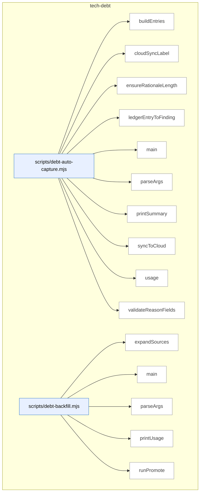

_Domain has 71 symbols (>50). Diagram shows top-15 by file order; see flat table below for the full list._

### Symbols in this domain

| Symbol | Kind | Path | Lines | Purpose |
|---|---|---|---|---|
| [`buildEntries`](../scripts/debt-auto-capture.mjs#L161) | function | `scripts/debt-auto-capture.mjs` | 161-188 | Transforms deferred ledger entries into debt capture entries with sensitivity tracking. |
| [`cloudSyncLabel`](../scripts/debt-auto-capture.mjs#L213) | function | `scripts/debt-auto-capture.mjs` | 213-216 | Returns a user-friendly label describing cloud sync status. |
| [`ensureRationaleLength`](../scripts/debt-auto-capture.mjs#L120) | function | `scripts/debt-auto-capture.mjs` | 120-128 | Pads or truncates a rationale string to meet minimum length requirements. |
| [`ledgerEntryToFinding`](../scripts/debt-auto-capture.mjs#L136) | function | `scripts/debt-auto-capture.mjs` | 136-155 | Converts a ledger entry into a finding object matching the debt schema. |
| [`main`](../scripts/debt-auto-capture.mjs#L247) | function | `scripts/debt-auto-capture.mjs` | 247-325 | <no body> |
| [`parseArgs`](../scripts/debt-auto-capture.mjs#L34) | function | `scripts/debt-auto-capture.mjs` | 34-64 | Parses command-line flags for debt capture options (ledger, reason, approver, etc.). |
| [`printSummary`](../scripts/debt-auto-capture.mjs#L218) | function | `scripts/debt-auto-capture.mjs` | 218-243 | Prints a summary table of captured entries, insertions, updates, and cloud sync results. |
| [`syncToCloud`](../scripts/debt-auto-capture.mjs#L197) | function | `scripts/debt-auto-capture.mjs` | 197-209 | Syncs captured debt entries to the cloud via Supabase if configured. |
| [`usage`](../scripts/debt-auto-capture.mjs#L66) | function | `scripts/debt-auto-capture.mjs` | 66-87 | Displays usage instructions for the debt auto-capture workflow. |
| [`validateReasonFields`](../scripts/debt-auto-capture.mjs#L96) | function | `scripts/debt-auto-capture.mjs` | 96-111 | Validates that required fields are present for the chosen deferral reason type. |
| [`expandSources`](../scripts/debt-backfill.mjs#L85) | function | `scripts/debt-backfill.mjs` | 85-107 | Expands glob patterns into a list of matching file paths. |
| [`main`](../scripts/debt-backfill.mjs#L265) | function | `scripts/debt-backfill.mjs` | 265-279 | Routes execution to stage or promote based on command-line options. |
| [`parseArgs`](../scripts/debt-backfill.mjs#L41) | function | `scripts/debt-backfill.mjs` | 41-56 | Parses command-line arguments for debt backfill staging and promotion modes. |
| [`printUsage`](../scripts/debt-backfill.mjs#L58) | function | `scripts/debt-backfill.mjs` | 58-81 | Displays usage documentation for the debt backfill workflow. |
| [`runPromote`](../scripts/debt-backfill.mjs#L160) | function | `scripts/debt-backfill.mjs` | 160-261 | Validates approved staging records and writes them to the live debt ledger. |
| [`runStage`](../scripts/debt-backfill.mjs#L111) | function | `scripts/debt-backfill.mjs` | 111-156 | Parses audit summary files and writes unapproved staging records for review. |
| [`loadBudgets`](../scripts/debt-budget-check.mjs#L66) | function | `scripts/debt-budget-check.mjs` | 66-83 | Loads budget definitions from an external file or from the ledger's budgets field. |
| [`main`](../scripts/debt-budget-check.mjs#L85) | function | `scripts/debt-budget-check.mjs` | 85-136 | <no body> |
| [`parseArgs`](../scripts/debt-budget-check.mjs#L33) | function | `scripts/debt-budget-check.mjs` | 33-45 | Parses command-line arguments for ledger path, budgets file, and output mode. |
| [`printUsage`](../scripts/debt-budget-check.mjs#L47) | function | `scripts/debt-budget-check.mjs` | 47-64 | Displays usage instructions for checking debt entries against per-path budgets. |
| [`findTouchedDebt`](../scripts/debt-pr-comment.mjs#L105) | function | `scripts/debt-pr-comment.mjs` | 105-117 | Filters debt entries to those with affected files matching the PR's changed files. |
| [`groupTouchedByFile`](../scripts/debt-pr-comment.mjs#L120) | function | `scripts/debt-pr-comment.mjs` | 120-128 | Groups touched debt entries by their primary affected file. |
| [`loadChangedFiles`](../scripts/debt-pr-comment.mjs#L222) | function | `scripts/debt-pr-comment.mjs` | 222-236 | Loads changed file paths from a comma-separated string or newline-delimited file. |
| [`main`](../scripts/debt-pr-comment.mjs#L240) | function | `scripts/debt-pr-comment.mjs` | 240-323 | Parses command-line arguments, loads changed files and debt ledger, identifies touched and recurring debt entries, and outputs a PR comment with debt information if thresholds are met. |
| [`parseArgs`](../scripts/debt-pr-comment.mjs#L53) | function | `scripts/debt-pr-comment.mjs` | 53-72 | Parses command-line arguments for generating PR comments about touched debt. |
| [`printUsage`](../scripts/debt-pr-comment.mjs#L74) | function | `scripts/debt-pr-comment.mjs` | 74-95 | Displays usage instructions for the PR comment generation workflow. |
| [`renderEntryLine`](../scripts/debt-pr-comment.mjs#L132) | function | `scripts/debt-pr-comment.mjs` | 132-150 | Renders a single debt entry as a markdown list item with severity, owner, and metadata. |
| [`renderPrComment`](../scripts/debt-pr-comment.mjs#L152) | function | `scripts/debt-pr-comment.mjs` | 152-218 | <no body> |
| [`main`](../scripts/debt-resolve.mjs#L73) | function | `scripts/debt-resolve.mjs` | 73-148 | Validates a debt entry exists, emits a 'resolved' event with rationale, removes the entry from both local and cloud ledgers, and exits with appropriate status codes. |
| [`parseArgs`](../scripts/debt-resolve.mjs#L34) | function | `scripts/debt-resolve.mjs` | 34-52 | Extracts a positional topic ID and named flags from command arguments, returning parsed options for a debt resolution script. |
| [`printUsage`](../scripts/debt-resolve.mjs#L54) | function | `scripts/debt-resolve.mjs` | 54-71 | Prints usage documentation for the debt-resolve command to stderr. |
| [`main`](../scripts/debt-review.mjs#L332) | function | `scripts/debt-review.mjs` | 332-397 | Loads the debt ledger, checks for sensitivity constraints, runs clustering (local or LLM-based), and outputs review results to file or stdout. |
| [`parseArgs`](../scripts/debt-review.mjs#L44) | function | `scripts/debt-review.mjs` | 44-60 | Parses command-line flags for the debt-review script, extracting options for local-only mode, sensitivity filtering, TTL days, and output configuration. |
| [`printUsage`](../scripts/debt-review.mjs#L62) | function | `scripts/debt-review.mjs` | 62-80 | Prints usage documentation for the debt-review command to stderr. |
| [`renderMarkdown`](../scripts/debt-review.mjs#L84) | function | `scripts/debt-review.mjs` | 84-151 | Generates a markdown report of debt review results including summary stats, budget violations, debt clusters, and ranked refactor candidates. |
| [`runLLMClustering`](../scripts/debt-review.mjs#L218) | function | `scripts/debt-review.mjs` | 218-284 | Sends debt entries to an external LLM (with sensitivity filtering) to cluster them and generate refactor recommendations with effort estimation. |
| [`runLocalClustering`](../scripts/debt-review.mjs#L155) | function | `scripts/debt-review.mjs` | 155-183 | Performs deterministic heuristic clustering of debt entries and generates refactor candidates ranked by leverage without LLM analysis. |
| [`writeTopRefactorPlanDoc`](../scripts/debt-review.mjs#L288) | function | `scripts/debt-review.mjs` | 288-328 | Writes the top-ranked refactor plan as a markdown document to docs/plans/ with targets, effort estimates, and member debt entries. |
| [`buildDebtEntry`](../scripts/lib/debt-capture.mjs#L84) | function | `scripts/lib/debt-capture.mjs` | 84-158 | Constructs a persistent debt ledger entry from a finding with sensitivity checks, secret redaction, and metadata assembly. |
| [`computeSensitivity`](../scripts/lib/debt-capture.mjs#L32) | function | `scripts/lib/debt-capture.mjs` | 32-54 | Scans a finding for sensitive data (credentials, secrets) across file paths and text fields, returning matched patterns. |
| [`suggestDeferralCandidate`](../scripts/lib/debt-capture.mjs#L171) | function | `scripts/lib/debt-capture.mjs` | 171-183 | Determines whether a finding is a candidate for deferral based on scope and severity status. |
| [`appendDebtEventsLocal`](../scripts/lib/debt-events.mjs#L34) | function | `scripts/lib/debt-events.mjs` | 34-56 | Appends validated debt events to a JSONL log file atomically, returning count of successfully written events. |
| [`deriveMetricsFromEvents`](../scripts/lib/debt-events.mjs#L107) | function | `scripts/lib/debt-events.mjs` | 107-154 | Derives occurrence metrics (surfaced count, escalation status, match counts) from an event stream, keyed by topic ID. |
| [`readDebtEventsLocal`](../scripts/lib/debt-events.mjs#L65) | function | `scripts/lib/debt-events.mjs` | 65-87 | Reads and parses debt events from a JSONL log file, validating each line and skipping malformed entries. |
| [`buildCommitUrl`](../scripts/lib/debt-git-history.mjs#L142) | function | `scripts/lib/debt-git-history.mjs` | 142-144 | Constructs a direct GitHub commit URL from a repository URL and commit SHA. |
| [`countCommitsTouchingTopic`](../scripts/lib/debt-git-history.mjs#L42) | function | `scripts/lib/debt-git-history.mjs` | 42-63 | Counts git commits that mention a topic ID in the debt ledger file using git log with -S flag. |
| [`deriveOccurrencesFromGit`](../scripts/lib/debt-git-history.mjs#L154) | function | `scripts/lib/debt-git-history.mjs` | 154-161 | Maps debt ledger entries to occurrence counts derived from git history commits. |
| [`detectGitHubRepoUrl`](../scripts/lib/debt-git-history.mjs#L119) | function | `scripts/lib/debt-git-history.mjs` | 119-134 | Detects and normalizes a GitHub repository URL from git remote origin, supporting both SSH and HTTPS formats. |
| [`findFirstDeferCommit`](../scripts/lib/debt-git-history.mjs#L76) | function | `scripts/lib/debt-git-history.mjs` | 76-108 | Finds the first commit that introduced a topic ID in the debt ledger, returning commit SHA and subject with optional GitHub URL. |
| [`findDebtByAlias`](../scripts/lib/debt-ledger.mjs#L273) | function | `scripts/lib/debt-ledger.mjs` | 273-280 | Looks up a debt entry by topic ID or semantic hash alias from a list of entries. |
| [`mergeLedgers`](../scripts/lib/debt-ledger.mjs#L252) | function | `scripts/lib/debt-ledger.mjs` | 252-262 | Merges two debt ledgers by topic ID, with session ledger entries overriding debt ledger entries. |
| [`readDebtLedger`](../scripts/lib/debt-ledger.mjs#L42) | function | `scripts/lib/debt-ledger.mjs` | 42-89 | Reads and hydrates a debt ledger JSON file with event-derived metrics (occurrences, escalation status, timestamps). |
| [`removeDebtEntry`](../scripts/lib/debt-ledger.mjs#L207) | function | `scripts/lib/debt-ledger.mjs` | 207-236 | Removes a debt entry from the ledger JSON file under a file lock, returning success status. |
| [`writeDebtEntries`](../scripts/lib/debt-ledger.mjs#L107) | function | `scripts/lib/debt-ledger.mjs` | 107-197 | Writes new or updated debt entries to the ledger JSON file under a file lock, rejecting invalid entries. |
| [`appendEvents`](../scripts/lib/debt-memory.mjs#L113) | function | `scripts/lib/debt-memory.mjs` | 113-126 | Appends debt events to the selected backend (cloud or local), returning count of written events. |
| [`loadDebtLedger`](../scripts/lib/debt-memory.mjs#L83) | function | `scripts/lib/debt-memory.mjs` | 83-100 | Loads the debt ledger with event-derived metrics from either cloud or local event source. |
| [`persistDebtEntries`](../scripts/lib/debt-memory.mjs#L140) | function | `scripts/lib/debt-memory.mjs` | 140-154 | Persists debt entries to local ledger JSON and optionally mirrors to cloud, returning write statistics. |
| [`reconcileLocalToCloud`](../scripts/lib/debt-memory.mjs#L189) | function | `scripts/lib/debt-memory.mjs` | 189-226 | Syncs unpushed local debt events to cloud backend, marking them with a reconciliation marker to prevent resyncing. |
| [`removeDebt`](../scripts/lib/debt-memory.mjs#L159) | function | `scripts/lib/debt-memory.mjs` | 159-168 | Removes a debt entry from both local and cloud backends, returning removal status for each. |
| [`selectEventSource`](../scripts/lib/debt-memory.mjs#L59) | function | `scripts/lib/debt-memory.mjs` | 59-70 | Selects the event persistence backend (cloud, local file, or disabled) based on environment and configuration. |
| [`buildLocalClusters`](../scripts/lib/debt-review-helpers.mjs#L164) | function | `scripts/lib/debt-review-helpers.mjs` | 164-204 | Builds refactoring clusters from debt entries by file locality, principle violations, and high-recurrence patterns. |
| [`computeLeverage`](../scripts/lib/debt-review-helpers.mjs#L45) | function | `scripts/lib/debt-review-helpers.mjs` | 45-57 | Computes a leverage score for a refactoring effort as impact-per-effort ratio using Sonar type weights. |
| [`countDebtByFile`](../scripts/lib/debt-review-helpers.mjs#L213) | function | `scripts/lib/debt-review-helpers.mjs` | 213-221 | Counts debt entries per affected file path, returning a map of file paths to entry counts. |
| [`findBudgetViolations`](../scripts/lib/debt-review-helpers.mjs#L238) | function | `scripts/lib/debt-review-helpers.mjs` | 238-264 | Detects budget violations by comparing actual debt counts against configured path-based budgets using glob matching. |
| [`findRecurringEntries`](../scripts/lib/debt-review-helpers.mjs#L148) | function | `scripts/lib/debt-review-helpers.mjs` | 148-152 | Filters and sorts debt entries that have surfaced in a minimum number of distinct audit runs. |
| [`findStaleEntries`](../scripts/lib/debt-review-helpers.mjs#L83) | function | `scripts/lib/debt-review-helpers.mjs` | 83-92 | Filters debt entries older than a TTL threshold in days, returning their topic IDs. |
| [`getDefaultMatcher`](../scripts/lib/debt-review-helpers.mjs#L269) | function | `scripts/lib/debt-review-helpers.mjs` | 269-280 | Lazily initializes and returns a glob file matcher function, falling back to exact-match if micromatch is unavailable. |
| [`groupByFile`](../scripts/lib/debt-review-helpers.mjs#L116) | function | `scripts/lib/debt-review-helpers.mjs` | 116-124 | Groups debt entries by their primary affected file path into a map. |
| [`groupByPrinciple`](../scripts/lib/debt-review-helpers.mjs#L131) | function | `scripts/lib/debt-review-helpers.mjs` | 131-139 | Groups debt entries by their first affected principle into a map. |
| [`oldestEntryDays`](../scripts/lib/debt-review-helpers.mjs#L97) | function | `scripts/lib/debt-review-helpers.mjs` | 97-106 | Calculates the age in days of the oldest debt entry from a given date. |
| [`rankRefactorsByLeverage`](../scripts/lib/debt-review-helpers.mjs#L65) | function | `scripts/lib/debt-review-helpers.mjs` | 65-70 | Ranks refactoring efforts by leverage score (impact-to-effort ratio) in descending order. |

---

## tests

```mermaid
flowchart TB
subgraph dom_tests ["tests"]
  file_tests_ai_context_management_test_mjs["tests/ai-context-management.test.mjs"]:::component
  sym_tests_ai_context_management_test_mjs_rea["readSkillContent"]:::symbol
  file_tests_ai_context_management_test_mjs --> sym_tests_ai_context_management_test_mjs_rea
  file_tests_audit_loop_orchestrator_test_mjs["tests/audit-loop-orchestrator.test.mjs"]:::component
  sym_tests_audit_loop_orchestrator_test_mjs_f["fakeExists"]:::symbol
  file_tests_audit_loop_orchestrator_test_mjs --> sym_tests_audit_loop_orchestrator_test_mjs_f
  file_tests_brainstorm_round_test_mjs["tests/brainstorm-round.test.mjs"]:::component
  sym_tests_brainstorm_round_test_mjs_runHelpe["runHelper"]:::symbol
  file_tests_brainstorm_round_test_mjs --> sym_tests_brainstorm_round_test_mjs_runHelpe
  file_tests_check_context_drift_test_mjs["tests/check-context-drift.test.mjs"]:::component
  sym_tests_check_context_drift_test_mjs_fx["fx"]:::symbol
  file_tests_check_context_drift_test_mjs --> sym_tests_check_context_drift_test_mjs_fx
  file_tests_claudemd_integration_test_mjs["tests/claudemd/integration.test.mjs"]:::component
  sym_tests_claudemd_integration_test_mjs_runL["runLint"]:::symbol
  file_tests_claudemd_integration_test_mjs --> sym_tests_claudemd_integration_test_mjs_runL
  file_tests_code_analysis_test_mjs["tests/code-analysis.test.mjs"]:::component
  sym_tests_code_analysis_test_mjs_writeStub["writeStub"]:::symbol
  file_tests_code_analysis_test_mjs --> sym_tests_code_analysis_test_mjs_writeStub
  file_tests_cross_skill_persona_test_mjs["tests/cross-skill-persona.test.mjs"]:::component
  sym_tests_cross_skill_persona_test_mjs_runCl["runCli"]:::symbol
  file_tests_cross_skill_persona_test_mjs --> sym_tests_cross_skill_persona_test_mjs_runCl
  file_tests_debt_budget_check_cli_test_mjs["tests/debt-budget-check-cli.test.mjs"]:::component
  sym_tests_debt_budget_check_cli_test_mjs_mak["makeEntry"]:::symbol
  file_tests_debt_budget_check_cli_test_mjs --> sym_tests_debt_budget_check_cli_test_mjs_mak
  sym_tests_debt_budget_check_cli_test_mjs_run["runCli"]:::symbol
  file_tests_debt_budget_check_cli_test_mjs --> sym_tests_debt_budget_check_cli_test_mjs_run
  sym_tests_debt_budget_check_cli_test_mjs_see["seedLedger"]:::symbol
  file_tests_debt_budget_check_cli_test_mjs --> sym_tests_debt_budget_check_cli_test_mjs_see
  file_tests_debt_git_history_test_mjs["tests/debt-git-history.test.mjs"]:::component
  sym_tests_debt_git_history_test_mjs_git["git"]:::symbol
  file_tests_debt_git_history_test_mjs --> sym_tests_debt_git_history_test_mjs_git
  sym_tests_debt_git_history_test_mjs_makeEntr["makeEntry"]:::symbol
  file_tests_debt_git_history_test_mjs --> sym_tests_debt_git_history_test_mjs_makeEntr
  sym_tests_debt_git_history_test_mjs_writeLed["writeLedger"]:::symbol
  file_tests_debt_git_history_test_mjs --> sym_tests_debt_git_history_test_mjs_writeLed
  file_tests_debt_ledger_test_mjs["tests/debt-ledger.test.mjs"]:::component
  sym_tests_debt_ledger_test_mjs_makeEntry["makeEntry"]:::symbol
  file_tests_debt_ledger_test_mjs --> sym_tests_debt_ledger_test_mjs_makeEntry
  file_tests_debt_pr_comment_cli_test_mjs["tests/debt-pr-comment-cli.test.mjs"]:::component
  sym_tests_debt_pr_comment_cli_test_mjs_makeE["makeEntry"]:::symbol
  file_tests_debt_pr_comment_cli_test_mjs --> sym_tests_debt_pr_comment_cli_test_mjs_makeE
  sym_tests_debt_pr_comment_cli_test_mjs_runCl["runCli"]:::symbol
  file_tests_debt_pr_comment_cli_test_mjs --> sym_tests_debt_pr_comment_cli_test_mjs_runCl
  sym_tests_debt_pr_comment_cli_test_mjs_seedL["seedLedger"]:::symbol
  file_tests_debt_pr_comment_cli_test_mjs --> sym_tests_debt_pr_comment_cli_test_mjs_seedL
  file_tests_debt_pr_comment_test_mjs["tests/debt-pr-comment.test.mjs"]:::component
  sym_tests_debt_pr_comment_test_mjs_makeEntry["makeEntry"]:::symbol
  file_tests_debt_pr_comment_test_mjs --> sym_tests_debt_pr_comment_test_mjs_makeEntry
  file_tests_debt_resolve_cli_test_mjs["tests/debt-resolve-cli.test.mjs"]:::component
  sym_tests_debt_resolve_cli_test_mjs_makeEntr["makeEntry"]:::symbol
  file_tests_debt_resolve_cli_test_mjs --> sym_tests_debt_resolve_cli_test_mjs_makeEntr
  sym_tests_debt_resolve_cli_test_mjs_runCli["runCli"]:::symbol
  file_tests_debt_resolve_cli_test_mjs --> sym_tests_debt_resolve_cli_test_mjs_runCli
  file_tests_debt_review_helpers_test_mjs["tests/debt-review-helpers.test.mjs"]:::component
  sym_tests_debt_review_helpers_test_mjs_makeE["makeEntry"]:::symbol
  file_tests_debt_review_helpers_test_mjs --> sym_tests_debt_review_helpers_test_mjs_makeE
  file_tests_debt_suppression_test_mjs["tests/debt-suppression.test.mjs"]:::component
  sym_tests_debt_suppression_test_mjs_debtEntr["debtEntry"]:::symbol
  file_tests_debt_suppression_test_mjs --> sym_tests_debt_suppression_test_mjs_debtEntr
  sym_tests_debt_suppression_test_mjs_makeFind["makeFinding"]:::symbol
  file_tests_debt_suppression_test_mjs --> sym_tests_debt_suppression_test_mjs_makeFind
  sym_tests_debt_suppression_test_mjs_sessionE["sessionEntry"]:::symbol
  file_tests_debt_suppression_test_mjs --> sym_tests_debt_suppression_test_mjs_sessionE
  file_tests_debt_transcript_suppression_test_m["tests/debt-transcript-suppression.test.mjs"]:::component
  sym_tests_debt_transcript_suppression_test_m["reSuppressAgainstDebt"]:::symbol
  file_tests_debt_transcript_suppression_test_m --> sym_tests_debt_transcript_suppression_test_m
  file_tests_file_io_test_mjs["tests/file-io.test.mjs"]:::component
  sym_tests_file_io_test_mjs_makeDiffMap["makeDiffMap"]:::symbol
  file_tests_file_io_test_mjs --> sym_tests_file_io_test_mjs_makeDiffMap
  file_tests_hook_arch_memory_check_test_mjs["tests/hook-arch-memory-check.test.mjs"]:::component
  sym_tests_hook_arch_memory_check_test_mjs_ru["runHook"]:::symbol
  file_tests_hook_arch_memory_check_test_mjs --> sym_tests_hook_arch_memory_check_test_mjs_ru
  file_tests_install_lifecycle_test_mjs["tests/install/lifecycle.test.mjs"]:::component
  sym_tests_install_lifecycle_test_mjs_journal["journalPath"]:::symbol
  file_tests_install_lifecycle_test_mjs --> sym_tests_install_lifecycle_test_mjs_journal
  sym_tests_install_lifecycle_test_mjs_sha12["sha12"]:::symbol
  file_tests_install_lifecycle_test_mjs --> sym_tests_install_lifecycle_test_mjs_sha12
  file_tests_meta_assess_test_mjs["tests/meta-assess.test.mjs"]:::component
  sym_tests_meta_assess_test_mjs_makeOutcome["makeOutcome"]:::symbol
  file_tests_meta_assess_test_mjs --> sym_tests_meta_assess_test_mjs_makeOutcome
  sym_tests_meta_assess_test_mjs_makeOutcomes["makeOutcomes"]:::symbol
  file_tests_meta_assess_test_mjs --> sym_tests_meta_assess_test_mjs_makeOutcomes
  file_tests_neighbourhood_query_test_mjs["tests/neighbourhood-query.test.mjs"]:::component
  sym_tests_neighbourhood_query_test_mjs_tempR["tempRoot"]:::symbol
  file_tests_neighbourhood_query_test_mjs --> sym_tests_neighbourhood_query_test_mjs_tempR
  file_tests_owner_resolver_test_mjs["tests/owner-resolver.test.mjs"]:::component
  sym_tests_owner_resolver_test_mjs_seed["seed"]:::symbol
  file_tests_owner_resolver_test_mjs --> sym_tests_owner_resolver_test_mjs_seed
  file_tests_repo_stack_test_mjs["tests/repo-stack.test.mjs"]:::component
  sym_tests_repo_stack_test_mjs_write["write"]:::symbol
  file_tests_repo_stack_test_mjs --> sym_tests_repo_stack_test_mjs_write
  file_tests_shared_test_mjs["tests/shared.test.mjs"]:::component
  sym_tests_shared_test_mjs_makeLedgerEntry["makeLedgerEntry"]:::symbol
  file_tests_shared_test_mjs --> sym_tests_shared_test_mjs_makeLedgerEntry
  file_tests_skill_packaging_test_mjs["tests/skill-packaging.test.mjs"]:::component
  sym_tests_skill_packaging_test_mjs_write["write"]:::symbol
  file_tests_skill_packaging_test_mjs --> sym_tests_skill_packaging_test_mjs_write
  file_tests_skill_refs_parser_test_mjs["tests/skill-refs-parser.test.mjs"]:::component
  sym_tests_skill_refs_parser_test_mjs_write["write"]:::symbol
  file_tests_skill_refs_parser_test_mjs --> sym_tests_skill_refs_parser_test_mjs_write
  file_tests_snapshot_retention_test_mjs["tests/snapshot-retention.test.mjs"]:::component
  sym_tests_snapshot_retention_test_mjs_classi["classifyForPrune"]:::symbol
  file_tests_snapshot_retention_test_mjs --> sym_tests_snapshot_retention_test_mjs_classi
  file_tests_stores_factory_test_mjs["tests/stores/factory.test.mjs"]:::component
  sym_tests_stores_factory_test_mjs_createMock["createMockDriver"]:::symbol
  file_tests_stores_factory_test_mjs --> sym_tests_stores_factory_test_mjs_createMock
  file_tests_sync_shared_audit_refs_test_mjs["tests/sync-shared-audit-refs.test.mjs"]:::component
  sym_tests_sync_shared_audit_refs_test_mjs_se["setupRepo"]:::symbol
  file_tests_sync_shared_audit_refs_test_mjs --> sym_tests_sync_shared_audit_refs_test_mjs_se
  sym_tests_sync_shared_audit_refs_test_mjs_te["teardown"]:::symbol
  file_tests_sync_shared_audit_refs_test_mjs --> sym_tests_sync_shared_audit_refs_test_mjs_te
end
classDef container fill:#f5f5f5,stroke:#333,stroke-width:2px,color:#000
classDef component fill:#e8f0ff,stroke:#3178c6,color:#000
classDef symbol fill:#fff,stroke:#999,color:#444
classDef dup fill:#ffe8d8,stroke:#c0392b,stroke-width:2px,color:#000
classDef violation fill:#ffd6d6,stroke:#c0392b,stroke-width:2px,color:#000
```

### Symbols in this domain

| Symbol | Kind | Path | Lines | Purpose |
|---|---|---|---|---|
| [`readSkillContent`](../tests/ai-context-management.test.mjs#L26) | function | `tests/ai-context-management.test.mjs` | 26-28 | Reads the content of a skill markdown file. |
| [`fakeExists`](../tests/audit-loop-orchestrator.test.mjs#L9) | function | `tests/audit-loop-orchestrator.test.mjs` | 9-12 | Returns a function that checks whether a given path exists in a pre-populated set of paths. |
| [`runHelper`](../tests/brainstorm-round.test.mjs#L17) | function | `tests/brainstorm-round.test.mjs` | 17-23 | Helper to spawn a Node process running specified script with input and environment variables. |
| [`fx`](../tests/check-context-drift.test.mjs#L16) | function | `tests/check-context-drift.test.mjs` | 16-18 | Returns the full path to a fixture file by name. |
| [`runLint`](../tests/claudemd/integration.test.mjs#L10) | function | `tests/claudemd/integration.test.mjs` | 10-21 | Runs a CLI command in a fixture directory and returns stdout/stderr/exit code. |
| [`writeStub`](../tests/code-analysis.test.mjs#L336) | function | `tests/code-analysis.test.mjs` | 336-339 | Writes a file of specified byte size filled with repeated characters. |
| [`runCli`](../tests/cross-skill-persona.test.mjs#L8) | function | `tests/cross-skill-persona.test.mjs` | 8-27 | Spawns a CLI process with a clean environment and returns status, stdout, stderr, and parsed JSON. |
| [`makeEntry`](../tests/debt-budget-check-cli.test.mjs#L17) | function | `tests/debt-budget-check-cli.test.mjs` | 17-28 | Creates a debt ledger entry with topic, severity, deferral details, and content metadata. |
| [`runCli`](../tests/debt-budget-check-cli.test.mjs#L35) | function | `tests/debt-budget-check-cli.test.mjs` | 35-37 | Spawns a CLI script with arguments and returns stdout/stderr/exit code. |
| [`seedLedger`](../tests/debt-budget-check-cli.test.mjs#L30) | function | `tests/debt-budget-check-cli.test.mjs` | 30-33 | Writes a ledger JSON file with version, entries, and optional budget definitions. |
| [`git`](../tests/debt-git-history.test.mjs#L25) | function | `tests/debt-git-history.test.mjs` | 25-36 | Executes git commands in a temporary directory, optionally suppressing errors. |
| [`makeEntry`](../tests/debt-git-history.test.mjs#L43) | function | `tests/debt-git-history.test.mjs` | 43-54 | Creates a debt ledger entry with deferral reason and testing metadata. |
| [`writeLedger`](../tests/debt-git-history.test.mjs#L38) | function | `tests/debt-git-history.test.mjs` | 38-41 | Writes a ledger JSON file to `.audit/tech-debt.json` in a test directory. |
| [`makeEntry`](../tests/debt-ledger.test.mjs#L23) | function | `tests/debt-ledger.test.mjs` | 23-43 | Creates a debt ledger entry with all standard fields, allowing overrides. |
| [`makeEntry`](../tests/debt-pr-comment-cli.test.mjs#L17) | function | `tests/debt-pr-comment-cli.test.mjs` | 17-28 | Creates a debt ledger entry with topic-specific category and severity. |
| [`runCli`](../tests/debt-pr-comment-cli.test.mjs#L34) | function | `tests/debt-pr-comment-cli.test.mjs` | 34-39 | Spawns a CLI script with arguments and returns stdout/stderr/exit code. |
| [`seedLedger`](../tests/debt-pr-comment-cli.test.mjs#L30) | function | `tests/debt-pr-comment-cli.test.mjs` | 30-32 | Writes a ledger JSON file containing versioned entries. |
| [`makeEntry`](../tests/debt-pr-comment.test.mjs#L14) | function | `tests/debt-pr-comment.test.mjs` | 14-25 | Creates a debt entry with deferred status and distinct run count. |
| [`makeEntry`](../tests/debt-resolve-cli.test.mjs#L20) | function | `tests/debt-resolve-cli.test.mjs` | 20-29 | Creates a debt ledger entry with standard fields for testing. |
| [`runCli`](../tests/debt-resolve-cli.test.mjs#L31) | function | `tests/debt-resolve-cli.test.mjs` | 31-36 | Spawns a CLI script with arguments and returns stdout/stderr/exit code. |
| [`makeEntry`](../tests/debt-review-helpers.test.mjs#L24) | function | `tests/debt-review-helpers.test.mjs` | 24-36 | Creates a debt entry with classification metadata and affected principles. |
| [`debtEntry`](../tests/debt-suppression.test.mjs#L42) | function | `tests/debt-suppression.test.mjs` | 42-57 | Creates a debt ledger entry with deferral and escalation flags. |
| [`makeFinding`](../tests/debt-suppression.test.mjs#L12) | function | `tests/debt-suppression.test.mjs` | 12-23 | Creates a finding object, populates its metadata, and returns it. |
| [`sessionEntry`](../tests/debt-suppression.test.mjs#L25) | function | `tests/debt-suppression.test.mjs` | 25-40 | Creates a session ledger entry with dismissal adjudication and pending remediation. |
| [`reSuppressAgainstDebt`](../tests/debt-transcript-suppression.test.mjs#L19) | function | `tests/debt-transcript-suppression.test.mjs` | 19-44 | Matches new findings against suppression context using Jaccard similarity, returning kept and debt-suppressed findings. |
| [`makeDiffMap`](../tests/file-io.test.mjs#L16) | function | `tests/file-io.test.mjs` | 16-20 | Converts an array of `[relPath, hunks]` entries into a Map suitable for diff representation. |
| [`runHook`](../tests/hook-arch-memory-check.test.mjs#L25) | function | `tests/hook-arch-memory-check.test.mjs` | 25-40 | Executes a bash hook script with timeout and captures stdout and exit code. |
| [`journalPath`](../tests/install/lifecycle.test.mjs#L14) | function | `tests/install/lifecycle.test.mjs` | 14-14 | Returns the file path for an audit transaction journal in a temporary directory. |
| [`sha12`](../tests/install/lifecycle.test.mjs#L13) | function | `tests/install/lifecycle.test.mjs` | 13-13 | Truncates a SHA-256 hash to its first 12 hexadecimal characters. |
| [`makeOutcome`](../tests/meta-assess.test.mjs#L12) | function | `tests/meta-assess.test.mjs` | 12-24 | Generates a mock security finding outcome with customizable overrides. |
| [`makeOutcomes`](../tests/meta-assess.test.mjs#L26) | function | `tests/meta-assess.test.mjs` | 26-32 | Creates an array of mock security outcomes with sequential finding IDs and timestamps. |
| [`tempRoot`](../tests/neighbourhood-query.test.mjs#L9) | function | `tests/neighbourhood-query.test.mjs` | 9-12 | Creates and returns a temporary directory for test files. |
| [`seed`](../tests/owner-resolver.test.mjs#L21) | function | `tests/owner-resolver.test.mjs` | 21-25 | Writes a CODEOWNERS file to a temporary directory structure. |
| [`write`](../tests/repo-stack.test.mjs#L14) | function | `tests/repo-stack.test.mjs` | 14-17 | Writes a file to a temporary directory, creating parent directories as needed. |
| [`makeLedgerEntry`](../tests/shared.test.mjs#L149) | function | `tests/shared.test.mjs` | 149-168 | Generates a mock ledger entry representing a security finding record with customizable overrides. |
| [`write`](../tests/skill-packaging.test.mjs#L12) | function | `tests/skill-packaging.test.mjs` | 12-16 | Writes a file to a temporary directory, creating parent directories as needed. |
| [`write`](../tests/skill-refs-parser.test.mjs#L14) | function | `tests/skill-refs-parser.test.mjs` | 14-18 | Writes a file to a temporary directory, creating parent directories as needed. |
| [`classifyForPrune`](../tests/snapshot-retention.test.mjs#L17) | function | `tests/snapshot-retention.test.mjs` | 17-25 | Classifies a refresh run for pruning based on retention class and age in days. |
| [`createMockDriver`](../tests/stores/factory.test.mjs#L6) | function | `tests/stores/factory.test.mjs` | 6-25 | Creates a minimal mock database driver that accepts queries but returns empty results. |
| [`setupRepo`](../tests/sync-shared-audit-refs.test.mjs#L11) | function | `tests/sync-shared-audit-refs.test.mjs` | 11-16 | Sets up a temporary test repository with audit and skills directory structure. |
| [`teardown`](../tests/sync-shared-audit-refs.test.mjs#L18) | function | `tests/sync-shared-audit-refs.test.mjs` | 18-21 | Deletes the temporary test repository and clears its reference. |

---

## Layering violations

_No violations detected on this snapshot._

---

## How to regenerate

```bash
npm run arch:refresh   # update the index
npm run arch:render    # regenerate this file
```

## How to interpret

- Each domain has a Mermaid diagram (containers → components → symbols) and a flat table.
- **Duplication clusters** appear with `[DUP]` in the table and the `dup` class in Mermaid.
- Layering violations appear in the dedicated section above.
- Anchor links remain stable across regenerations as long as symbol names don't change.
