<!-- audit-loop:architectural-map -->
# Architecture Map — Lbstrydom/claude-engineering-skills

- Generated: 2026-05-03T21:19:39.525Z   commit: 4cc4486daf22   refresh_id: 397b8b65-1970-469a-92eb-d4ab2d0f406d
- Drift score: 11 / threshold 20   status: `AMBER`
- Domains: 16   Symbols: 862   Layering violations: 0

## Contents
- [arch-memory](#arch-memory) — 54 symbols
- [audit-orchestration](#audit-orchestration) — 59 symbols
- [brainstorm](#brainstorm) — 14 symbols
- [claudemd-management](#claudemd-management) — 30 symbols
- [cross-skill-bridge](#cross-skill-bridge) — 40 symbols
- [findings](#findings) — 22 symbols
- [install](#install) — 122 symbols
- [learning-store](#learning-store) — 107 symbols
- [memory-health](#memory-health) — 7 symbols
- [plan](#plan) — 8 symbols
- [root-scripts](#root-scripts) — 13 symbols
- [scripts](#scripts) — 17 symbols
- [shared-lib](#shared-lib) — 235 symbols
- [stores](#stores) — 21 symbols
- [tech-debt](#tech-debt) — 71 symbols
- [tests](#tests) — 42 symbols

---

## arch-memory

> The `arch-memory` domain manages glob-based file path classification and drift analysis for tracking architectural changes—it converts glob patterns to regex rules, tags files by domain, and computes repository-wide drift scores indicating how much code deviates from documented architecture.

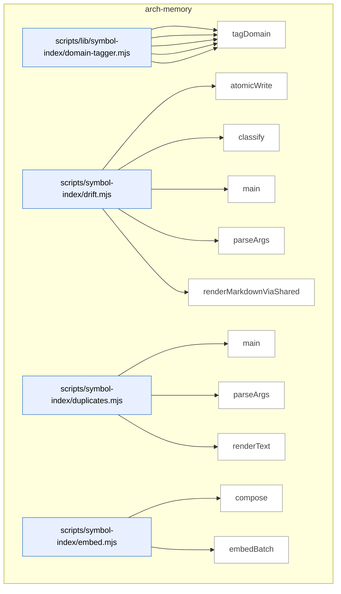

_Domain has 54 symbols (>50). Diagram shows top-15 by file order; see flat table below for the full list._

### Symbols in this domain

| Symbol | Kind | Path | Lines | Purpose | File imported by |
|---|---|---|---|---|---|
| [`computeTargetDomains`](../scripts/lib/symbol-index/domain-tagger.mjs#L114) | function | `scripts/lib/symbol-index/domain-tagger.mjs` | 114-129 | Computes which domains are targeted by a set of file paths and whether they span multiple domains. | `scripts/cross-skill.mjs`, `scripts/symbol-index/refresh.mjs` |
| [`globToRegexBody`](../scripts/lib/symbol-index/domain-tagger.mjs#L51) | function | `scripts/lib/symbol-index/domain-tagger.mjs` | 51-80 | Converts a glob pattern to a regex body, handling `**`, `*`, and literal characters with proper escaping. | `scripts/cross-skill.mjs`, `scripts/symbol-index/refresh.mjs` |
| [`loadDomainRules`](../scripts/lib/symbol-index/domain-tagger.mjs#L145) | function | `scripts/lib/symbol-index/domain-tagger.mjs` | 145-172 | Loads and validates domain tagging rules from a JSON file, returning only well-formed entries. | `scripts/cross-skill.mjs`, `scripts/symbol-index/refresh.mjs` |
| [`matchGlob`](../scripts/lib/symbol-index/domain-tagger.mjs#L38) | function | `scripts/lib/symbol-index/domain-tagger.mjs` | 38-49 | Tests if a file path matches a glob pattern by converting the pattern to an anchored regex and testing against it. | `scripts/cross-skill.mjs`, `scripts/symbol-index/refresh.mjs` |
| [`tagDomain`](../scripts/lib/symbol-index/domain-tagger.mjs#L89) | function | `scripts/lib/symbol-index/domain-tagger.mjs` | 89-96 | Returns the domain tag for a file path by testing it against a list of glob-based rules. | `scripts/cross-skill.mjs`, `scripts/symbol-index/refresh.mjs` |
| [`atomicWrite`](../scripts/symbol-index/drift.mjs#L41) | function | `scripts/symbol-index/drift.mjs` | 41-47 | Atomically writes content to a file using a temporary file and rename to prevent corruption on crash. | _(internal)_ |
| [`classify`](../scripts/symbol-index/drift.mjs#L49) | function | `scripts/symbol-index/drift.mjs` | 49-53 | Classifies a drift score as GREEN, AMBER, or RED based on thresholds at 50% and 100% of the configured limit. | _(internal)_ |
| [`main`](../scripts/symbol-index/drift.mjs#L74) | function | `scripts/symbol-index/drift.mjs` | 74-142 | Computes repository drift score, fetches top duplicate clusters, and outputs results to stdout or file. | _(internal)_ |
| [`parseArgs`](../scripts/symbol-index/drift.mjs#L32) | function | `scripts/symbol-index/drift.mjs` | 32-39 | Parses --out and --json flags from command-line arguments. | _(internal)_ |
| [`renderMarkdownViaShared`](../scripts/symbol-index/drift.mjs#L59) | function | `scripts/symbol-index/drift.mjs` | 59-72 | Extracts markdown representation of drift score from rendered issue output. | _(internal)_ |
| [`main`](../scripts/symbol-index/duplicates.mjs#L64) | function | `scripts/symbol-index/duplicates.mjs` | 64-99 | Retrieves duplicate clusters from snapshot, formats output as JSON or text, and exits with appropriate status. | _(internal)_ |
| [`parseArgs`](../scripts/symbol-index/duplicates.mjs#L30) | function | `scripts/symbol-index/duplicates.mjs` | 30-45 | Parses command-line arguments for limit and output format flags. | _(internal)_ |
| [`renderText`](../scripts/symbol-index/duplicates.mjs#L47) | function | `scripts/symbol-index/duplicates.mjs` | 47-62 | Formats duplicate symbol clusters into human-readable text with file paths and example purposes. | _(internal)_ |
| [`compose`](../scripts/symbol-index/embed.mjs#L82) | function | `scripts/symbol-index/embed.mjs` | 82-88 | Composes stable text representation of a symbol combining kind, name, file path, summary, and signature. | _(internal)_ |
| [`embedBatch`](../scripts/symbol-index/embed.mjs#L35) | function | `scripts/symbol-index/embed.mjs` | 35-80 | Batches symbol texts to Gemini embedding API with retry logic and rate-limit backoff. | _(internal)_ |
| [`emit`](../scripts/symbol-index/embed.mjs#L17) | function | `scripts/symbol-index/embed.mjs` | 17-17 | Outputs a JSON object to stdout followed by a newline. | _(internal)_ |
| [`getGeminiClient`](../scripts/symbol-index/embed.mjs#L22) | function | `scripts/symbol-index/embed.mjs` | 22-28 | Returns cached or newly instantiated Gemini client if API key is set. | _(internal)_ |
| [`logProgress`](../scripts/symbol-index/embed.mjs#L18) | function | `scripts/symbol-index/embed.mjs` | 18-18 | Logs progress message to stderr with [embed] prefix. | _(internal)_ |
| [`main`](../scripts/symbol-index/embed.mjs#L90) | function | `scripts/symbol-index/embed.mjs` | 90-132 | Reads symbols from stdin, embeds them in batches via Gemini, outputs enriched records with embeddings. | _(internal)_ |
| [`emit`](../scripts/symbol-index/extract.mjs#L47) | function | `scripts/symbol-index/extract.mjs` | 47-49 | Outputs a JSON object to stdout followed by a newline. | _(internal)_ |
| [`emitProgress`](../scripts/symbol-index/extract.mjs#L51) | function | `scripts/symbol-index/extract.mjs` | 51-53 | Logs progress message to stderr with [extract] prefix. | _(internal)_ |
| [`enumerateFiles`](../scripts/symbol-index/extract.mjs#L331) | function | `scripts/symbol-index/extract.mjs` | 331-349 | Recursively walks directory tree to enumerate all source files, respecting skip list and optional file filter. | _(internal)_ |
| [`extractGraphAndViolations`](../scripts/symbol-index/extract.mjs#L206) | function | `scripts/symbol-index/extract.mjs` | 206-272 | Runs dep-cruiser to detect architectural violations and internal dependency edges. | _(internal)_ |
| [`extractSymbols`](../scripts/symbol-index/extract.mjs#L62) | function | `scripts/symbol-index/extract.mjs` | 62-199 | Extracts function and class symbols from source files using ts-morph, filters by size and path sensitivity. | _(internal)_ |
| [`isInternalEdge`](../scripts/symbol-index/extract.mjs#L286) | function | `scripts/symbol-index/extract.mjs` | 286-302 | Determines if a dependency is internal (not npm, core, or node_modules). | _(internal)_ |
| [`main`](../scripts/symbol-index/extract.mjs#L351) | function | `scripts/symbol-index/extract.mjs` | 351-360 | Orchestrates symbol extraction and dependency analysis, then outputs combined statistics. | _(internal)_ |
| [`parseArgs`](../scripts/symbol-index/extract.mjs#L35) | function | `scripts/symbol-index/extract.mjs` | 35-45 | Parses CLI flags for root directory, file list, extraction mode, and since-commit filter. | _(internal)_ |
| [`main`](../scripts/symbol-index/prune.mjs#L39) | function | `scripts/symbol-index/prune.mjs` | 39-120 | <no body> | _(internal)_ |
| [`parseArgs`](../scripts/symbol-index/prune.mjs#L26) | function | `scripts/symbol-index/prune.mjs` | 26-32 | Parses CLI flags for dry-run mode. | _(internal)_ |
| [`gitCommitSha`](../scripts/symbol-index/refresh.mjs#L72) | function | `scripts/symbol-index/refresh.mjs` | 72-75 | Returns current git HEAD commit SHA or null if not in a git repository. | _(internal)_ |
| [`gitDiffWithWorkingTree`](../scripts/symbol-index/refresh.mjs#L96) | function | `scripts/symbol-index/refresh.mjs` | 96-129 | Parses git diff and git ls-files output to categorize file changes by status (added, modified, deleted, renamed, untracked). | _(internal)_ |
| [`isSafeGitRevision`](../scripts/symbol-index/refresh.mjs#L83) | function | `scripts/symbol-index/refresh.mjs` | 83-87 | Validates that a git revision string is safe (no spaces, shell metacharacters, or path traversal). | _(internal)_ |
| [`logErr`](../scripts/symbol-index/refresh.mjs#L69) | function | `scripts/symbol-index/refresh.mjs` | 69-69 | Logs error message to stderr with [refresh] prefix. | _(internal)_ |
| [`logOk`](../scripts/symbol-index/refresh.mjs#L70) | function | `scripts/symbol-index/refresh.mjs` | 70-70 | Logs success message to stderr with [refresh] prefix. | _(internal)_ |
| [`main`](../scripts/symbol-index/refresh.mjs#L161) | function | `scripts/symbol-index/refresh.mjs` | 161-428 | <no body> | _(internal)_ |
| [`parseArgs`](../scripts/symbol-index/refresh.mjs#L58) | function | `scripts/symbol-index/refresh.mjs` | 58-67 | Parses CLI flags for full refresh, commit range, and force mode. | _(internal)_ |
| [`runJsonLines`](../scripts/symbol-index/refresh.mjs#L135) | function | `scripts/symbol-index/refresh.mjs` | 135-150 | Spawns a subprocess, captures JSON-line output, parses and filters it. | _(internal)_ |
| [`runWithHeartbeat`](../scripts/symbol-index/refresh.mjs#L152) | function | `scripts/symbol-index/refresh.mjs` | 152-159 | Periodically sends heartbeat messages to refresh run while executing async function. | _(internal)_ |
| [`classify`](../scripts/symbol-index/render-mermaid.mjs#L45) | function | `scripts/symbol-index/render-mermaid.mjs` | 45-49 | Classifies a drift score as GREEN, AMBER, or RED based on thresholds. | _(internal)_ |
| [`commitSha`](../scripts/symbol-index/render-mermaid.mjs#L40) | function | `scripts/symbol-index/render-mermaid.mjs` | 40-43 | Returns first 12 characters of current git HEAD commit SHA or null. | _(internal)_ |
| [`main`](../scripts/symbol-index/render-mermaid.mjs#L51) | function | `scripts/symbol-index/render-mermaid.mjs` | 51-180 | <no body> | _(internal)_ |
| [`parseArgs`](../scripts/symbol-index/render-mermaid.mjs#L32) | function | `scripts/symbol-index/render-mermaid.mjs` | 32-38 | Parses CLI flags for output file path. | _(internal)_ |
| [`cacheHit`](../scripts/symbol-index/summarise-domains.mjs#L54) | function | `scripts/symbol-index/summarise-domains.mjs` | 54-61 | Determines if cached domain summary is still valid by comparing hashes and metadata. | `scripts/symbol-index/render-mermaid.mjs` |
| [`callHaiku`](../scripts/symbol-index/summarise-domains.mjs#L63) | function | `scripts/symbol-index/summarise-domains.mjs` | 63-91 | Calls Anthropic Claude API with timeout and signal handling, returning response with token usage and latency. | `scripts/symbol-index/render-mermaid.mjs` |
| [`computeCompositionHash`](../scripts/symbol-index/summarise-domains.mjs#L41) | function | `scripts/symbol-index/summarise-domains.mjs` | 41-46 | Computes a 16-character hash of symbol composition for cache invalidation. | `scripts/symbol-index/render-mermaid.mjs` |
| [`main`](../scripts/symbol-index/summarise-domains.mjs#L167) | function | `scripts/symbol-index/summarise-domains.mjs` | 167-199 | Resolves repo identity, snapshot, and invokes summariseDomains; emits JSON results to stdout. | `scripts/symbol-index/render-mermaid.mjs` |
| [`PROMPT_TEMPLATE`](../scripts/symbol-index/summarise-domains.mjs#L35) | function | `scripts/symbol-index/summarise-domains.mjs` | 35-39 | Generates a prompt template for Claude to summarize a domain's purpose based on sample symbols. | `scripts/symbol-index/render-mermaid.mjs` |
| [`summariseDomains`](../scripts/symbol-index/summarise-domains.mjs#L105) | function | `scripts/symbol-index/summarise-domains.mjs` | 105-164 | <no body> | `scripts/symbol-index/render-mermaid.mjs` |
| [`symbolCountDeltaOk`](../scripts/symbol-index/summarise-domains.mjs#L48) | function | `scripts/symbol-index/summarise-domains.mjs` | 48-52 | Checks if symbol count delta between runs is within 20% tolerance. | `scripts/symbol-index/render-mermaid.mjs` |
| [`validateSummary`](../scripts/symbol-index/summarise-domains.mjs#L93) | function | `scripts/symbol-index/summarise-domains.mjs` | 93-99 | Validates that a generated summary is a string between 20 and 400 characters. | `scripts/symbol-index/render-mermaid.mjs` |
| [`emit`](../scripts/symbol-index/summarise.mjs#L26) | function | `scripts/symbol-index/summarise.mjs` | 26-26 | Outputs a JSON object to stdout followed by a newline. | _(internal)_ |
| [`logProgress`](../scripts/symbol-index/summarise.mjs#L27) | function | `scripts/symbol-index/summarise.mjs` | 27-27 | Logs progress message to stderr with [summarise] prefix. | _(internal)_ |
| [`main`](../scripts/symbol-index/summarise.mjs#L70) | function | `scripts/symbol-index/summarise.mjs` | 70-113 | Reads symbols from stdin, batches them for summarization via Claude, emits enriched records. | _(internal)_ |
| [`summariseBatch`](../scripts/symbol-index/summarise.mjs#L33) | function | `scripts/symbol-index/summarise.mjs` | 33-68 | Batches symbols to Anthropic Claude for purpose summarization, parsing numbered list output. | _(internal)_ |

---

## audit-orchestration

> The `audit-orchestration` domain orchestrates multi-model security audits by sequencing OpenAI and Gemini review processes, executing them with timeouts, and tracking convergence toward acceptable finding thresholds (zero HIGH, ≤2 MEDIUM severity issues).

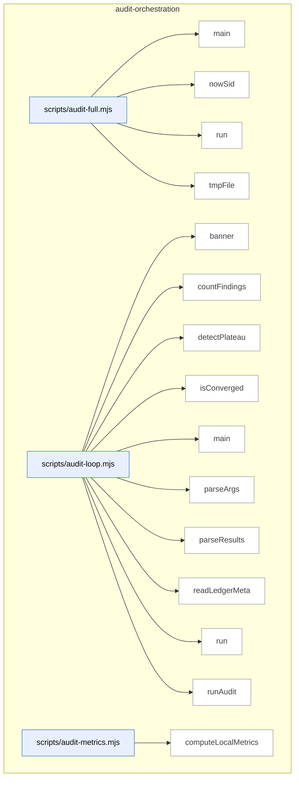

_Domain has 59 symbols (>50). Diagram shows top-15 by file order; see flat table below for the full list._

### Symbols in this domain

| Symbol | Kind | Path | Lines | Purpose | File imported by |
|---|---|---|---|---|---|
| [`main`](../scripts/audit-full.mjs#L44) | function | `scripts/audit-full.mjs` | 44-127 | Runs OpenAI audit followed by Gemini review in sequence, with optional final review skip. | _(internal)_ |
| [`nowSid`](../scripts/audit-full.mjs#L31) | function | `scripts/audit-full.mjs` | 31-33 | Generates a timestamped session ID with a given prefix. | _(internal)_ |
| [`run`](../scripts/audit-full.mjs#L39) | function | `scripts/audit-full.mjs` | 39-42 | Spawns a child process synchronously and returns its exit code and signal. | _(internal)_ |
| [`tmpFile`](../scripts/audit-full.mjs#L35) | function | `scripts/audit-full.mjs` | 35-37 | Returns the path to a temporary file in the system temp directory. | _(internal)_ |
| [`banner`](../scripts/audit-loop.mjs#L26) | function | `scripts/audit-loop.mjs` | 26-29 | Prints a centered banner with decorative lines around the given text. | _(internal)_ |
| [`countFindings`](../scripts/audit-loop.mjs#L70) | function | `scripts/audit-loop.mjs` | 70-77 | Counts findings by severity level and returns aggregate statistics with failure flag. | _(internal)_ |
| [`detectPlateau`](../scripts/audit-loop.mjs#L92) | function | `scripts/audit-loop.mjs` | 92-108 | Detects performance plateau when HIGH finding reduction drops below 30% for two consecutive rounds. | _(internal)_ |
| [`isConverged`](../scripts/audit-loop.mjs#L79) | function | `scripts/audit-loop.mjs` | 79-83 | Determines if audit results meet convergence criteria (zero HIGH and ≤2 MEDIUM findings). | _(internal)_ |
| [`main`](../scripts/audit-loop.mjs#L168) | function | `scripts/audit-loop.mjs` | 168-525 | Main audit loop orchestrator that repeatedly runs audits, checks convergence, detects plateaus, and optionally invokes Gemini review. | _(internal)_ |
| [`parseArgs`](../scripts/audit-loop.mjs#L128) | function | `scripts/audit-loop.mjs` | 128-164 | Parses command-line arguments into an audit configuration object with defaults. | _(internal)_ |
| [`parseResults`](../scripts/audit-loop.mjs#L61) | function | `scripts/audit-loop.mjs` | 61-68 | Parses and returns JSON from an audit results file, or null if parsing fails. | _(internal)_ |
| [`readLedgerMeta`](../scripts/audit-loop.mjs#L118) | function | `scripts/audit-loop.mjs` | 118-126 | Reads and returns metadata from an audit ledger file. | _(internal)_ |
| [`run`](../scripts/audit-loop.mjs#L31) | function | `scripts/audit-loop.mjs` | 31-44 | Executes a shell command with a timeout and returns stdout, optionally ignoring errors. | _(internal)_ |
| [`runAudit`](../scripts/audit-loop.mjs#L46) | function | `scripts/audit-loop.mjs` | 46-59 | Runs the OpenAI audit script with a 10-minute timeout and captures success/failure. | _(internal)_ |
| [`computeLocalMetrics`](../scripts/audit-metrics.mjs#L56) | function | `scripts/audit-metrics.mjs` | 56-72 | Computes local metrics from outcomes JSONL file, grouping adjudication results by pass name. | _(internal)_ |
| [`displayMetrics`](../scripts/audit-metrics.mjs#L76) | function | `scripts/audit-metrics.mjs` | 76-145 | Formats and displays audit metrics including run summary, pass effectiveness, and finding distribution. | _(internal)_ |
| [`fetchCloudMetrics`](../scripts/audit-metrics.mjs#L37) | function | `scripts/audit-metrics.mjs` | 37-54 | Fetches audit run metrics, pass statistics, and findings from Supabase for the last N days. | _(internal)_ |
| [`main`](../scripts/audit-metrics.mjs#L149) | function | `scripts/audit-metrics.mjs` | 149-158 | Fetches cloud and local metrics, outputting as JSON or formatted display. | _(internal)_ |
| [`_collectMaxLengths`](../scripts/gemini-review.mjs#L100) | function | `scripts/gemini-review.mjs` | 100-118 | <no body> | _(internal)_ |
| [`addSemanticIds`](../scripts/gemini-review.mjs#L805) | function | `scripts/gemini-review.mjs` | 805-813 | Assigns semantic IDs and hashes to each new finding for deduplication and tracking. | _(internal)_ |
| [`applyDebtSuppression`](../scripts/gemini-review.mjs#L768) | function | `scripts/gemini-review.mjs` | 768-803 | Filters review findings by comparing them against pre-filtered debt topics using Jaccard similarity to suppress re-raised debt. | _(internal)_ |
| [`buildClient`](../scripts/gemini-review.mjs#L734) | function | `scripts/gemini-review.mjs` | 734-741 | Builds an API client for the selected provider (Gemini or Claude) with appropriate credentials. | _(internal)_ |
| [`callClaudeOpus`](../scripts/gemini-review.mjs#L386) | function | `scripts/gemini-review.mjs` | 386-449 | Calls the Claude Opus API with a timeout to generate a JSON-structured review, parses and validates the response. | _(internal)_ |
| [`callGemini`](../scripts/gemini-review.mjs#L278) | function | `scripts/gemini-review.mjs` | 278-372 | Calls the Gemini API with streaming to generate a JSON-structured review, accumulates chunks, validates against schema, and truncates verbose fields. | _(internal)_ |
| [`emitReviewOutput`](../scripts/gemini-review.mjs#L815) | function | `scripts/gemini-review.mjs` | 815-830 | Outputs the review result as JSON (if --json or --out flag) or as formatted markdown. | _(internal)_ |
| [`formatReviewResult`](../scripts/gemini-review.mjs#L574) | function | `scripts/gemini-review.mjs` | 574-637 | Formats the review result as a markdown document with verdict, deliberation quality, architectural coherence, wrongly dismissed findings, and new findings. | _(internal)_ |
| [`getReviewPrompt`](../scripts/gemini-review.mjs#L259) | function | `scripts/gemini-review.mjs` | 259-261 | Retrieves the active review prompt variant or falls back to the default system prompt. | _(internal)_ |
| [`isJsonTruncationError`](../scripts/gemini-review.mjs#L743) | function | `scripts/gemini-review.mjs` | 743-747 | Checks if an error message indicates JSON truncation/parsing failure. | _(internal)_ |
| [`main`](../scripts/gemini-review.mjs#L901) | function | `scripts/gemini-review.mjs` | 901-937 | Orchestrates code review workflow by parsing arguments, loading plan and transcript files, invoking the review engine, and outputting results. | _(internal)_ |
| [`parseReviewArgs`](../scripts/gemini-review.mjs#L693) | function | `scripts/gemini-review.mjs` | 693-704 | Parses command-line arguments for the review subcommand, extracting plan file, transcript file, output options, and provider override. | _(internal)_ |
| [`recordGeminiOutcomes`](../scripts/gemini-review.mjs#L877) | function | `scripts/gemini-review.mjs` | 877-899 | Aggregates new findings, wrongly dismissed findings, and verdict into learning outcomes and updates the prompt bandit reward model. | _(internal)_ |
| [`recordNewFindings`](../scripts/gemini-review.mjs#L832) | function | `scripts/gemini-review.mjs` | 832-851 | Records newly found issues as outcomes in the audit log for learning feedback. | _(internal)_ |
| [`recordWronglyDismissed`](../scripts/gemini-review.mjs#L853) | function | `scripts/gemini-review.mjs` | 853-875 | Records wrongly dismissed findings as outcomes to improve future classification. | _(internal)_ |
| [`refreshCatalogAndWarn`](../scripts/gemini-review.mjs#L643) | function | `scripts/gemini-review.mjs` | 643-654 | Refreshes the model catalog and warns if a newer recommended model version is available since session start. | _(internal)_ |
| [`runFinalReview`](../scripts/gemini-review.mjs#L462) | function | `scripts/gemini-review.mjs` | 462-570 | Extracts code files from a plan and transcript, reads their contents for context, and includes debt-suppression history if available. | _(internal)_ |
| [`runPing`](../scripts/gemini-review.mjs#L686) | function | `scripts/gemini-review.mjs` | 686-691 | Attempts to ping available providers (Gemini and/or Claude) to verify at least one is configured. | _(internal)_ |
| [`runPingClaude`](../scripts/gemini-review.mjs#L668) | function | `scripts/gemini-review.mjs` | 668-684 | Pings the Claude Opus API with a test message to verify connectivity and credentials. | _(internal)_ |
| [`runPingGemini`](../scripts/gemini-review.mjs#L656) | function | `scripts/gemini-review.mjs` | 656-666 | Pings the Gemini API with a test message to verify connectivity and credentials. | _(internal)_ |
| [`runReviewWithRetry`](../scripts/gemini-review.mjs#L749) | function | `scripts/gemini-review.mjs` | 749-766 | Retries the final review with a conciseness instruction if JSON truncation occurs. | _(internal)_ |
| [`selectProvider`](../scripts/gemini-review.mjs#L706) | function | `scripts/gemini-review.mjs` | 706-732 | Selects a provider (Gemini or Claude) based on environment variables and command-line overrides, with validation. | _(internal)_ |
| [`truncateToSchema`](../scripts/gemini-review.mjs#L132) | function | `scripts/gemini-review.mjs` | 132-152 | Recursively traverses an object and applies schema-defined maxLength truncations to all string fields. | _(internal)_ |
| [`_callGPTOnce`](../scripts/openai-audit.mjs#L358) | function | `scripts/openai-audit.mjs` | 358-449 | Executes a single OpenAI API call with structured output, timeout, and abort handling, detecting incomplete responses and extracting token usage. | _(internal)_ |
| [`applyExclusions`](../scripts/openai-audit.mjs#L138) | function | `scripts/openai-audit.mjs` | 138-147 | Filters a file list by removing paths matching glob patterns from exclude list, reporting count of excluded files. | _(internal)_ |
| [`cachePassResult`](../scripts/openai-audit.mjs#L534) | function | `scripts/openai-audit.mjs` | 534-542 | Writes a pass result to a JSON file in the cache directory, silently skipping if cache unavailable. | _(internal)_ |
| [`cacheWaveResults`](../scripts/openai-audit.mjs#L544) | function | `scripts/openai-audit.mjs` | 544-549 | Caches multiple pass results to disk and logs the cache directory location. | _(internal)_ |
| [`callGPT`](../scripts/openai-audit.mjs#L455) | function | `scripts/openai-audit.mjs` | 455-494 | Wraps GPT calls with retry logic, accumulating usage across attempts and applying exponential backoff with jitter for rate-limit errors. | _(internal)_ |
| [`cleanupCache`](../scripts/openai-audit.mjs#L551) | function | `scripts/openai-audit.mjs` | 551-554 | Deletes the temporary pass result cache directory and all contents. | _(internal)_ |
| [`getPassPrompt`](../scripts/openai-audit.mjs#L337) | function | `scripts/openai-audit.mjs` | 337-341 | Returns the active registered prompt for a pass name, falling back to the static PASS_PROMPTS table. | _(internal)_ |
| [`initResultCache`](../scripts/openai-audit.mjs#L524) | function | `scripts/openai-audit.mjs` | 524-532 | Creates a temporary cache directory for pass results, stored per-process in the output directory or system temp. | _(internal)_ |
| [`loadExcludePatterns`](../scripts/openai-audit.mjs#L119) | function | `scripts/openai-audit.mjs` | 119-130 | Loads exclude patterns from CLI arguments and `.auditignore` file, filtering one pattern per line while skipping comments. | _(internal)_ |
| [`main`](../scripts/openai-audit.mjs#L1870) | function | `scripts/openai-audit.mjs` | 1870-2312 | Refreshes the live model catalog, parses audit mode and file arguments, validates prerequisites, and orchestrates multi-pass code audit with rounds and optional suppression. | _(internal)_ |
| [`normalizeFindingsForOutput`](../scripts/openai-audit.mjs#L558) | function | `scripts/openai-audit.mjs` | 558-560 | Normalizes findings array for output using a helper function with semantic ID deduplication. | _(internal)_ |
| [`printCostPreflight`](../scripts/openai-audit.mjs#L75) | function | `scripts/openai-audit.mjs` | 75-93 | Estimates and logs the cost of an OpenAI API call based on model pricing, token counts, and reasoning effort before execution. | _(internal)_ |
| [`runMapReducePass`](../scripts/openai-audit.mjs#L606) | function | `scripts/openai-audit.mjs` | 606-764 | Splits files into audit units and runs map-reduce in parallel with concurrency limit, skipping retries for unchanged files in later rounds. | _(internal)_ |
| [`runMultiPassCodeAudit`](../scripts/openai-audit.mjs#L773) | function | `scripts/openai-audit.mjs` | 773-1864 | <no body> | _(internal)_ |
| [`safeCallGPT`](../scripts/openai-audit.mjs#L500) | function | `scripts/openai-audit.mjs` | 500-513 | Safely calls GPT with graceful degradation, returning empty result on failure without throwing. | _(internal)_ |
| [`shouldMapReduce`](../scripts/openai-audit.mjs#L164) | function | `scripts/openai-audit.mjs` | 164-168 | Decides whether to use map-reduce based on file count or total character size exceeding configured thresholds. | _(internal)_ |
| [`shouldMapReduceHighReasoning`](../scripts/openai-audit.mjs#L175) | function | `scripts/openai-audit.mjs` | 175-179 | Decides whether to use map-reduce for high-reasoning models based on file count or character size against higher thresholds. | _(internal)_ |
| [`validateLedgerForR2`](../scripts/openai-audit.mjs#L570) | function | `scripts/openai-audit.mjs` | 570-589 | Validates a ledger file exists and is parseable JSON before R2+ suppression, warning if missing or corrupted. | _(internal)_ |

---

## brainstorm

> The `brainstorm` domain orchestrates AI-powered ideation by parsing CLI arguments, routing requests to OpenAI or Gemini APIs with timeout/error handling, and structuring responses while detecting safety blocks and malformed outputs.

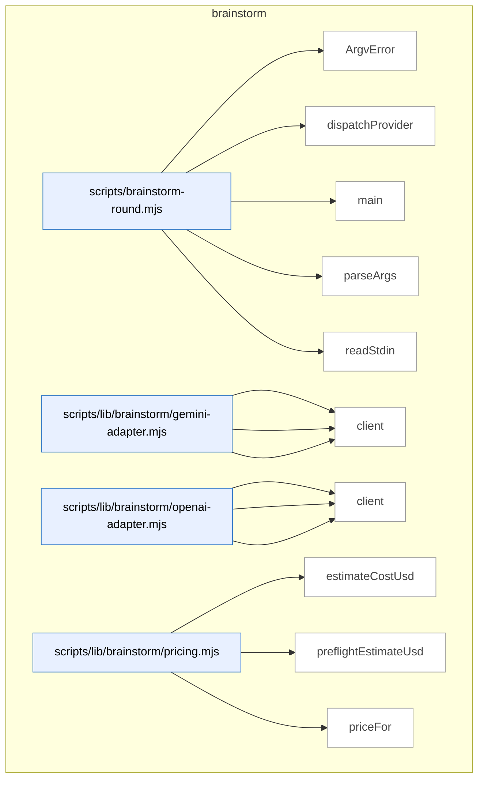

### Symbols in this domain

| Symbol | Kind | Path | Lines | Purpose | File imported by |
|---|---|---|---|---|---|
| [`ArgvError`](../scripts/brainstorm-round.mjs#L106) | class | `scripts/brainstorm-round.mjs` | 106-108 | <no body> | _(internal)_ |
| [`dispatchProvider`](../scripts/brainstorm-round.mjs#L209) | function | `scripts/brainstorm-round.mjs` | 209-251 | Routes brainstorm request to OpenAI or Gemini provider with error handling and debug payload logging. | _(internal)_ |
| [`main`](../scripts/brainstorm-round.mjs#L116) | function | `scripts/brainstorm-round.mjs` | 116-207 | Orchestrates brainstorm by parsing args, redacting secrets, resolving models, estimating costs, and dispatching to providers. | _(internal)_ |
| [`parseArgs`](../scripts/brainstorm-round.mjs#L51) | function | `scripts/brainstorm-round.mjs` | 51-104 | Parses command-line flags for brainstorm topic, model selection, token limits, and output path. | _(internal)_ |
| [`readStdin`](../scripts/brainstorm-round.mjs#L110) | function | `scripts/brainstorm-round.mjs` | 110-114 | Reads and returns the complete stdin input as a UTF-8 string. | _(internal)_ |
| [`callGemini`](../scripts/lib/brainstorm/gemini-adapter.mjs#L16) | function | `scripts/lib/brainstorm/gemini-adapter.mjs` | 16-90 | Calls Gemini API with timeout, abort control, and structured response—detects safety blocks, empty responses, and errors. | `scripts/brainstorm-round.mjs` |
| [`classifyError`](../scripts/lib/brainstorm/gemini-adapter.mjs#L92) | function | `scripts/lib/brainstorm/gemini-adapter.mjs` | 92-123 | Classifies Gemini adapter errors into timeout, HTTP error, or malformed categories with appropriate messages. | `scripts/brainstorm-round.mjs` |
| [`client`](../scripts/lib/brainstorm/gemini-adapter.mjs#L6) | function | `scripts/lib/brainstorm/gemini-adapter.mjs` | 6-9 | Lazily initializes and returns a Google Generative AI client singleton. | `scripts/brainstorm-round.mjs` |
| [`callOpenAI`](../scripts/lib/brainstorm/openai-adapter.mjs#L23) | function | `scripts/lib/brainstorm/openai-adapter.mjs` | 23-96 | Calls OpenAI chat API with timeout, abort control, and structured response—detects content filters, empty responses, and errors. | `scripts/brainstorm-round.mjs` |
| [`classifyError`](../scripts/lib/brainstorm/openai-adapter.mjs#L98) | function | `scripts/lib/brainstorm/openai-adapter.mjs` | 98-127 | Classifies OpenAI adapter errors into timeout, HTTP error, or malformed categories with appropriate messages. | `scripts/brainstorm-round.mjs` |
| [`client`](../scripts/lib/brainstorm/openai-adapter.mjs#L6) | function | `scripts/lib/brainstorm/openai-adapter.mjs` | 6-9 | Lazily initializes and returns an OpenAI client singleton. | `scripts/brainstorm-round.mjs` |
| [`estimateCostUsd`](../scripts/lib/brainstorm/pricing.mjs#L38) | function | `scripts/lib/brainstorm/pricing.mjs` | 38-41 | Estimates USD cost for a generation based on input/output token counts and looked-up model pricing. | `scripts/brainstorm-round.mjs`, `scripts/lib/brainstorm/gemini-adapter.mjs`, `scripts/lib/brainstorm/openai-adapter.mjs` |
| [`preflightEstimateUsd`](../scripts/lib/brainstorm/pricing.mjs#L47) | function | `scripts/lib/brainstorm/pricing.mjs` | 47-50 | Pre-estimates USD cost for a hypothetical generation from input character count and maximum output tokens. | `scripts/brainstorm-round.mjs`, `scripts/lib/brainstorm/gemini-adapter.mjs`, `scripts/lib/brainstorm/openai-adapter.mjs` |
| [`priceFor`](../scripts/lib/brainstorm/pricing.mjs#L24) | function | `scripts/lib/brainstorm/pricing.mjs` | 24-31 | Looks up price rates for a model ID, with prefix fallback to FALLBACK rate if exact match not found. | `scripts/brainstorm-round.mjs`, `scripts/lib/brainstorm/gemini-adapter.mjs`, `scripts/lib/brainstorm/openai-adapter.mjs` |

---

## claudemd-management

> The `claudemd-management` domain scans repositories for instruction files (CLAUDE.md, SKILL.md, etc.), detects duplicate content across documents using token-based similarity analysis, and automatically removes stale markdown links while preserving embedded references.

```mermaid
flowchart TB
subgraph dom_claudemd_management ["claudemd-management"]
  file_scripts_lib_claudemd_autofix_mjs["scripts/lib/claudemd/autofix.mjs"]:::component
  sym_scripts_lib_claudemd_autofix_mjs_applyFi["applyFixes"]:::symbol
  file_scripts_lib_claudemd_autofix_mjs --> sym_scripts_lib_claudemd_autofix_mjs_applyFi
  file_scripts_lib_claudemd_doc_similarity_mjs["scripts/lib/claudemd/doc-similarity.mjs"]:::component
  sym_scripts_lib_claudemd_doc_similarity_mjs_["extractParagraphs"]:::symbol
  file_scripts_lib_claudemd_doc_similarity_mjs --> sym_scripts_lib_claudemd_doc_similarity_mjs_
  sym_scripts_lib_claudemd_doc_similarity_mjs_["findSimilarParagraphs"]:::symbol
  file_scripts_lib_claudemd_doc_similarity_mjs --> sym_scripts_lib_claudemd_doc_similarity_mjs_
  sym_scripts_lib_claudemd_doc_similarity_mjs_["jaccardSimilarity"]:::symbol
  file_scripts_lib_claudemd_doc_similarity_mjs --> sym_scripts_lib_claudemd_doc_similarity_mjs_
  sym_scripts_lib_claudemd_doc_similarity_mjs_["normalizeMarkdown"]:::symbol
  file_scripts_lib_claudemd_doc_similarity_mjs --> sym_scripts_lib_claudemd_doc_similarity_mjs_
  sym_scripts_lib_claudemd_doc_similarity_mjs_["tokenize"]:::symbol
  file_scripts_lib_claudemd_doc_similarity_mjs --> sym_scripts_lib_claudemd_doc_similarity_mjs_
  file_scripts_lib_claudemd_file_scanner_mjs["scripts/lib/claudemd/file-scanner.mjs"]:::component
  sym_scripts_lib_claudemd_file_scanner_mjs_ma["matchPattern"]:::symbol
  file_scripts_lib_claudemd_file_scanner_mjs --> sym_scripts_lib_claudemd_file_scanner_mjs_ma
  sym_scripts_lib_claudemd_file_scanner_mjs_sc["scanInstructionFiles"]:::symbol
  file_scripts_lib_claudemd_file_scanner_mjs --> sym_scripts_lib_claudemd_file_scanner_mjs_sc
  sym_scripts_lib_claudemd_file_scanner_mjs_wa["walkDir"]:::symbol
  file_scripts_lib_claudemd_file_scanner_mjs --> sym_scripts_lib_claudemd_file_scanner_mjs_wa
  file_scripts_lib_claudemd_ref_checker_mjs["scripts/lib/claudemd/ref-checker.mjs"]:::component
  sym_scripts_lib_claudemd_ref_checker_mjs_bui["buildEnvVarIndex"]:::symbol
  file_scripts_lib_claudemd_ref_checker_mjs --> sym_scripts_lib_claudemd_ref_checker_mjs_bui
  sym_scripts_lib_claudemd_ref_checker_mjs_bui["buildFunctionIndex"]:::symbol
  file_scripts_lib_claudemd_ref_checker_mjs --> sym_scripts_lib_claudemd_ref_checker_mjs_bui
  sym_scripts_lib_claudemd_ref_checker_mjs_ext["extractEnvVarRefs"]:::symbol
  file_scripts_lib_claudemd_ref_checker_mjs --> sym_scripts_lib_claudemd_ref_checker_mjs_ext
  sym_scripts_lib_claudemd_ref_checker_mjs_ext["extractFileRefs"]:::symbol
  file_scripts_lib_claudemd_ref_checker_mjs --> sym_scripts_lib_claudemd_ref_checker_mjs_ext
  sym_scripts_lib_claudemd_ref_checker_mjs_ext["extractFunctionRefs"]:::symbol
  file_scripts_lib_claudemd_ref_checker_mjs --> sym_scripts_lib_claudemd_ref_checker_mjs_ext
  sym_scripts_lib_claudemd_ref_checker_mjs_res["resolveReferencedPath"]:::symbol
  file_scripts_lib_claudemd_ref_checker_mjs --> sym_scripts_lib_claudemd_ref_checker_mjs_res
  file_scripts_lib_claudemd_rules_mjs["scripts/lib/claudemd/rules.mjs"]:::component
  sym_scripts_lib_claudemd_rules_mjs_checkClau["checkClaudeAgentsSync"]:::symbol
  file_scripts_lib_claudemd_rules_mjs --> sym_scripts_lib_claudemd_rules_mjs_checkClau
  sym_scripts_lib_claudemd_rules_mjs_checkCros["checkCrossFileDuplication"]:::symbol
  file_scripts_lib_claudemd_rules_mjs --> sym_scripts_lib_claudemd_rules_mjs_checkCros
  sym_scripts_lib_claudemd_rules_mjs_checkDeep["checkDeepCodeDetail"]:::symbol
  file_scripts_lib_claudemd_rules_mjs --> sym_scripts_lib_claudemd_rules_mjs_checkDeep
  sym_scripts_lib_claudemd_rules_mjs_checkSize["checkSize"]:::symbol
  file_scripts_lib_claudemd_rules_mjs --> sym_scripts_lib_claudemd_rules_mjs_checkSize
  sym_scripts_lib_claudemd_rules_mjs_checkStal["checkStaleEnvVarRefs"]:::symbol
  file_scripts_lib_claudemd_rules_mjs --> sym_scripts_lib_claudemd_rules_mjs_checkStal
  sym_scripts_lib_claudemd_rules_mjs_checkStal["checkStaleFileRefs"]:::symbol
  file_scripts_lib_claudemd_rules_mjs --> sym_scripts_lib_claudemd_rules_mjs_checkStal
  sym_scripts_lib_claudemd_rules_mjs_checkStal["checkStaleFunctionRefs"]:::symbol
  file_scripts_lib_claudemd_rules_mjs --> sym_scripts_lib_claudemd_rules_mjs_checkStal
  sym_scripts_lib_claudemd_rules_mjs_extractHe["extractHeadings"]:::symbol
  file_scripts_lib_claudemd_rules_mjs --> sym_scripts_lib_claudemd_rules_mjs_extractHe
  sym_scripts_lib_claudemd_rules_mjs_runRules["runRules"]:::symbol
  file_scripts_lib_claudemd_rules_mjs --> sym_scripts_lib_claudemd_rules_mjs_runRules
  sym_scripts_lib_claudemd_rules_mjs_semanticI["semanticId"]:::symbol
  file_scripts_lib_claudemd_rules_mjs --> sym_scripts_lib_claudemd_rules_mjs_semanticI
  file_scripts_lib_claudemd_sarif_formatter_mjs["scripts/lib/claudemd/sarif-formatter.mjs"]:::component
  sym_scripts_lib_claudemd_sarif_formatter_mjs["buildRuleDescriptors"]:::symbol
  file_scripts_lib_claudemd_sarif_formatter_mjs --> sym_scripts_lib_claudemd_sarif_formatter_mjs
  sym_scripts_lib_claudemd_sarif_formatter_mjs["ruleDescription"]:::symbol
  file_scripts_lib_claudemd_sarif_formatter_mjs --> sym_scripts_lib_claudemd_sarif_formatter_mjs
  sym_scripts_lib_claudemd_sarif_formatter_mjs["sarifLevel"]:::symbol
  file_scripts_lib_claudemd_sarif_formatter_mjs --> sym_scripts_lib_claudemd_sarif_formatter_mjs
  sym_scripts_lib_claudemd_sarif_formatter_mjs["toSarif"]:::symbol
  file_scripts_lib_claudemd_sarif_formatter_mjs --> sym_scripts_lib_claudemd_sarif_formatter_mjs
  file_scripts_lib_claudemd_step65_hook_mjs["scripts/lib/claudemd/step65-hook.mjs"]:::component
  sym_scripts_lib_claudemd_step65_hook_mjs_run["runHygieneCheck"]:::symbol
  file_scripts_lib_claudemd_step65_hook_mjs --> sym_scripts_lib_claudemd_step65_hook_mjs_run
end
classDef container fill:#f5f5f5,stroke:#333,stroke-width:2px,color:#000
classDef component fill:#e8f0ff,stroke:#3178c6,color:#000
classDef symbol fill:#fff,stroke:#999,color:#444
classDef dup fill:#ffe8d8,stroke:#c0392b,stroke-width:2px,color:#000
classDef violation fill:#ffd6d6,stroke:#c0392b,stroke-width:2px,color:#000
```

### Symbols in this domain

| Symbol | Kind | Path | Lines | Purpose | File imported by |
|---|---|---|---|---|---|
| [`applyFixes`](../scripts/lib/claudemd/autofix.mjs#L16) | function | `scripts/lib/claudemd/autofix.mjs` | 16-76 | Applies automatic fixes to audit findings—removes stale standalone markdown links from files in place or as dry-run, skipping embedded references. | `scripts/claudemd-lint.mjs` |
| [`extractParagraphs`](../scripts/lib/claudemd/doc-similarity.mjs#L68) | function | `scripts/lib/claudemd/doc-similarity.mjs` | 68-103 | Extracts paragraphs from markdown content, skipping code blocks and preserving line numbers for each paragraph. | `scripts/lib/claudemd/rules.mjs` |
| [`findSimilarParagraphs`](../scripts/lib/claudemd/doc-similarity.mjs#L114) | function | `scripts/lib/claudemd/doc-similarity.mjs` | 114-146 | Finds similar paragraph pairs across two documents using Jaccard token similarity above a threshold. | `scripts/lib/claudemd/rules.mjs` |
| [`jaccardSimilarity`](../scripts/lib/claudemd/doc-similarity.mjs#L53) | function | `scripts/lib/claudemd/doc-similarity.mjs` | 53-61 | Computes Jaccard similarity between two token sets (intersection over union). | `scripts/lib/claudemd/rules.mjs` |
| [`normalizeMarkdown`](../scripts/lib/claudemd/doc-similarity.mjs#L24) | function | `scripts/lib/claudemd/doc-similarity.mjs` | 24-34 | Normalizes markdown by stripping links, code, formatting markers, and headings, then lowercasing for similarity comparison. | `scripts/lib/claudemd/rules.mjs` |
| [`tokenize`](../scripts/lib/claudemd/doc-similarity.mjs#L41) | function | `scripts/lib/claudemd/doc-similarity.mjs` | 41-45 | Tokenizes normalized text into a set of words (2+ chars, excluding stopwords) for document similarity analysis. | `scripts/lib/claudemd/rules.mjs` |
| [`matchPattern`](../scripts/lib/claudemd/file-scanner.mjs#L72) | function | `scripts/lib/claudemd/file-scanner.mjs` | 72-93 | Matches a file path against a glob-style pattern supporting `**/` anywhere matching and `*` single-segment wildcards. | `scripts/check-context-drift.mjs`, `scripts/claudemd-lint.mjs`, `scripts/lib/claudemd/ref-checker.mjs` |
| [`scanInstructionFiles`](../scripts/lib/claudemd/file-scanner.mjs#L102) | function | `scripts/lib/claudemd/file-scanner.mjs` | 102-133 | Scans a repo for instruction files (CLAUDE.md, AGENTS.md, SKILL.md) with customizable exclusions, returning file content and metadata. | `scripts/check-context-drift.mjs`, `scripts/claudemd-lint.mjs`, `scripts/lib/claudemd/ref-checker.mjs` |
| [`walkDir`](../scripts/lib/claudemd/file-scanner.mjs#L30) | function | `scripts/lib/claudemd/file-scanner.mjs` | 30-68 | Recursively walks a directory to find files matching instruction file patterns (e.g., CLAUDE.md, SKILL.md), excluding specified directories. | `scripts/check-context-drift.mjs`, `scripts/claudemd-lint.mjs`, `scripts/lib/claudemd/ref-checker.mjs` |
| [`buildEnvVarIndex`](../scripts/lib/claudemd/ref-checker.mjs#L194) | function | `scripts/lib/claudemd/ref-checker.mjs` | 194-235 | Builds an index of environment variables from .env.example and process.env/os.environ references in source code. | `scripts/lib/claudemd/rules.mjs` |
| [`buildFunctionIndex`](../scripts/lib/claudemd/ref-checker.mjs#L91) | function | `scripts/lib/claudemd/ref-checker.mjs` | 91-124 | Indexes exported functions and classes from all source code files (JS/TS/Python) across the repo. | `scripts/lib/claudemd/rules.mjs` |
| [`extractEnvVarRefs`](../scripts/lib/claudemd/ref-checker.mjs#L165) | function | `scripts/lib/claudemd/ref-checker.mjs` | 165-187 | Extracts environment variable references (ALL_CAPS_WITH_UNDERSCORES pattern) from backtick-quoted text in markdown. | `scripts/lib/claudemd/rules.mjs` |
| [`extractFileRefs`](../scripts/lib/claudemd/ref-checker.mjs#L52) | function | `scripts/lib/claudemd/ref-checker.mjs` | 52-84 | Extracts file references from markdown (link hrefs and backtick paths) while skipping code blocks. | `scripts/lib/claudemd/rules.mjs` |
| [`extractFunctionRefs`](../scripts/lib/claudemd/ref-checker.mjs#L132) | function | `scripts/lib/claudemd/ref-checker.mjs` | 132-158 | Extracts function and class name references from backtick-quoted identifiers in markdown while skipping code blocks. | `scripts/lib/claudemd/rules.mjs` |
| [`resolveReferencedPath`](../scripts/lib/claudemd/ref-checker.mjs#L25) | function | `scripts/lib/claudemd/ref-checker.mjs` | 25-44 | Resolves a markdown link target to an absolute repo path, skipping external URLs and rejecting paths escaping the repo root. | `scripts/lib/claudemd/rules.mjs` |
| [`checkClaudeAgentsSync`](../scripts/lib/claudemd/rules.mjs#L234) | function | `scripts/lib/claudemd/rules.mjs` | 234-271 | Finds conflicting headings between CLAUDE.md and AGENTS.md files. | `scripts/claudemd-lint.mjs` |
| [`checkCrossFileDuplication`](../scripts/lib/claudemd/rules.mjs#L203) | function | `scripts/lib/claudemd/rules.mjs` | 203-232 | Detects duplicate paragraphs across files in the same directory tree. | `scripts/claudemd-lint.mjs` |
| [`checkDeepCodeDetail`](../scripts/lib/claudemd/rules.mjs#L186) | function | `scripts/lib/claudemd/rules.mjs` | 186-201 | Flags files with too many fenced code blocks in instruction documents. | `scripts/claudemd-lint.mjs` |
| [`checkSize`](../scripts/lib/claudemd/rules.mjs#L108) | function | `scripts/lib/claudemd/rules.mjs` | 108-122 | Checks if a documentation file exceeds a configured byte limit and reports a non-fixable finding if so. | `scripts/claudemd-lint.mjs` |
| [`checkStaleEnvVarRefs`](../scripts/lib/claudemd/rules.mjs#L168) | function | `scripts/lib/claudemd/rules.mjs` | 168-184 | Checks markdown environment variable references against an index and reports undefined variables. | `scripts/claudemd-lint.mjs` |
| [`checkStaleFileRefs`](../scripts/lib/claudemd/rules.mjs#L124) | function | `scripts/lib/claudemd/rules.mjs` | 124-142 | Checks markdown file references for existence and reports stale/missing file findings with fixable flag. | `scripts/claudemd-lint.mjs` |
| [`checkStaleFunctionRefs`](../scripts/lib/claudemd/rules.mjs#L144) | function | `scripts/lib/claudemd/rules.mjs` | 144-166 | Checks markdown function/class name references against an index and reports undefined references. | `scripts/claudemd-lint.mjs` |
| [`extractHeadings`](../scripts/lib/claudemd/rules.mjs#L278) | function | `scripts/lib/claudemd/rules.mjs` | 278-302 | Extracts markdown headings and their content into a Map. | `scripts/claudemd-lint.mjs` |
| [`runRules`](../scripts/lib/claudemd/rules.mjs#L44) | function | `scripts/lib/claudemd/rules.mjs` | 44-106 | Runs a suite of claudemd hygiene rules against documentation files, building indexes once and checking size, stale refs, and deep code detail. | `scripts/claudemd-lint.mjs` |
| [`semanticId`](../scripts/lib/claudemd/rules.mjs#L17) | function | `scripts/lib/claudemd/rules.mjs` | 17-22 | Generates a deterministic semantic ID for a finding by hashing rule, file path, and normalized content. | `scripts/claudemd-lint.mjs` |
| [`buildRuleDescriptors`](../scripts/lib/claudemd/sarif-formatter.mjs#L49) | function | `scripts/lib/claudemd/sarif-formatter.mjs` | 49-62 | Deduplicates and formats rule descriptors for SARIF output. | `scripts/check-context-drift.mjs`, `scripts/check-model-freshness.mjs`, `scripts/claudemd-lint.mjs` |
| [`ruleDescription`](../scripts/lib/claudemd/sarif-formatter.mjs#L64) | function | `scripts/lib/claudemd/sarif-formatter.mjs` | 64-77 | Returns human-readable descriptions for each linting rule ID. | `scripts/check-context-drift.mjs`, `scripts/check-model-freshness.mjs`, `scripts/claudemd-lint.mjs` |
| [`sarifLevel`](../scripts/lib/claudemd/sarif-formatter.mjs#L40) | function | `scripts/lib/claudemd/sarif-formatter.mjs` | 40-47 | Maps severity levels to SARIF-compatible level strings. | `scripts/check-context-drift.mjs`, `scripts/check-model-freshness.mjs`, `scripts/claudemd-lint.mjs` |
| [`toSarif`](../scripts/lib/claudemd/sarif-formatter.mjs#L11) | function | `scripts/lib/claudemd/sarif-formatter.mjs` | 11-38 | Converts linting findings into SARIF format for tool integration. | `scripts/check-context-drift.mjs`, `scripts/check-model-freshness.mjs`, `scripts/claudemd-lint.mjs` |
| [`runHygieneCheck`](../scripts/lib/claudemd/step65-hook.mjs#L16) | function | `scripts/lib/claudemd/step65-hook.mjs` | 16-65 | Executes the linter subprocess and parses results into a summary report. | _(internal)_ |

---

## cross-skill-bridge

> The `cross-skill-bridge` domain provides CLI argument parsing, Git metadata retrieval, and cloud storage integration for skill execution—enabling skills to log plans, update their status, and record regression specs across a distributed system.

```mermaid
flowchart TB
subgraph dom_cross_skill_bridge ["cross-skill-bridge"]
  file_scripts_cross_skill_mjs["scripts/cross-skill.mjs"]:::component
  sym_scripts_cross_skill_mjs_argOption["argOption"]:::symbol
  file_scripts_cross_skill_mjs --> sym_scripts_cross_skill_mjs_argOption
  sym_scripts_cross_skill_mjs_cmdAbortRefreshR["cmdAbortRefreshRun"]:::symbol
  file_scripts_cross_skill_mjs --> sym_scripts_cross_skill_mjs_cmdAbortRefreshR
  sym_scripts_cross_skill_mjs_cmdAddPersona["cmdAddPersona"]:::symbol
  file_scripts_cross_skill_mjs --> sym_scripts_cross_skill_mjs_cmdAddPersona
  sym_scripts_cross_skill_mjs_cmdAuditEffectiv["cmdAuditEffectiveness"]:::symbol
  file_scripts_cross_skill_mjs --> sym_scripts_cross_skill_mjs_cmdAuditEffectiv
  sym_scripts_cross_skill_mjs_cmdComputeDriftS["cmdComputeDriftScore"]:::symbol
  file_scripts_cross_skill_mjs --> sym_scripts_cross_skill_mjs_cmdComputeDriftS
  sym_scripts_cross_skill_mjs_cmdComputeTarget["cmdComputeTargetDomains"]:::symbol
  file_scripts_cross_skill_mjs --> sym_scripts_cross_skill_mjs_cmdComputeTarget
  sym_scripts_cross_skill_mjs_cmdDetectStack["cmdDetectStack"]:::symbol
  file_scripts_cross_skill_mjs --> sym_scripts_cross_skill_mjs_cmdDetectStack
  sym_scripts_cross_skill_mjs_cmdGetActiveRefr["cmdGetActiveRefreshId"]:::symbol
  file_scripts_cross_skill_mjs --> sym_scripts_cross_skill_mjs_cmdGetActiveRefr
  sym_scripts_cross_skill_mjs_cmdGetCallersFor["cmdGetCallersForFile"]:::symbol
  file_scripts_cross_skill_mjs --> sym_scripts_cross_skill_mjs_cmdGetCallersFor
  sym_scripts_cross_skill_mjs_cmdGetNeighbourh["cmdGetNeighbourhood"]:::symbol
  file_scripts_cross_skill_mjs --> sym_scripts_cross_skill_mjs_cmdGetNeighbourh
  sym_scripts_cross_skill_mjs_cmdListLayeringV["cmdListLayeringViolationsForSnapshot"]:::symbol
  file_scripts_cross_skill_mjs --> sym_scripts_cross_skill_mjs_cmdListLayeringV
  sym_scripts_cross_skill_mjs_cmdListPersonas["cmdListPersonas"]:::symbol
  file_scripts_cross_skill_mjs --> sym_scripts_cross_skill_mjs_cmdListPersonas
  sym_scripts_cross_skill_mjs_cmdListSymbolsFo["cmdListSymbolsForSnapshot"]:::symbol
  file_scripts_cross_skill_mjs --> sym_scripts_cross_skill_mjs_cmdListSymbolsFo
  sym_scripts_cross_skill_mjs_cmdListUnlockedF["cmdListUnlockedFixes"]:::symbol
  file_scripts_cross_skill_mjs --> sym_scripts_cross_skill_mjs_cmdListUnlockedF
  sym_scripts_cross_skill_mjs_cmdOpenRefreshRu["cmdOpenRefreshRun"]:::symbol
  file_scripts_cross_skill_mjs --> sym_scripts_cross_skill_mjs_cmdOpenRefreshRu
  sym_scripts_cross_skill_mjs_cmdPlanSatisfact["cmdPlanSatisfaction"]:::symbol
  file_scripts_cross_skill_mjs --> sym_scripts_cross_skill_mjs_cmdPlanSatisfact
  sym_scripts_cross_skill_mjs_cmdPublishRefres["cmdPublishRefreshRun"]:::symbol
  file_scripts_cross_skill_mjs --> sym_scripts_cross_skill_mjs_cmdPublishRefres
  sym_scripts_cross_skill_mjs_cmdRecordCorrela["cmdRecordCorrelation"]:::symbol
  file_scripts_cross_skill_mjs --> sym_scripts_cross_skill_mjs_cmdRecordCorrela
  sym_scripts_cross_skill_mjs_cmdRecordLayerin["cmdRecordLayeringViolations"]:::symbol
  file_scripts_cross_skill_mjs --> sym_scripts_cross_skill_mjs_cmdRecordLayerin
  sym_scripts_cross_skill_mjs_cmdRecordPersona["cmdRecordPersonaSession"]:::symbol
  file_scripts_cross_skill_mjs --> sym_scripts_cross_skill_mjs_cmdRecordPersona
  sym_scripts_cross_skill_mjs_cmdRecordPlanVer["cmdRecordPlanVerifyItems"]:::symbol
  file_scripts_cross_skill_mjs --> sym_scripts_cross_skill_mjs_cmdRecordPlanVer
  sym_scripts_cross_skill_mjs_cmdRecordPlanVer["cmdRecordPlanVerifyRun"]:::symbol
  file_scripts_cross_skill_mjs --> sym_scripts_cross_skill_mjs_cmdRecordPlanVer
  sym_scripts_cross_skill_mjs_cmdRecordRegress["cmdRecordRegressionSpec"]:::symbol
  file_scripts_cross_skill_mjs --> sym_scripts_cross_skill_mjs_cmdRecordRegress
  sym_scripts_cross_skill_mjs_cmdRecordRegress["cmdRecordRegressionSpecRun"]:::symbol
  file_scripts_cross_skill_mjs --> sym_scripts_cross_skill_mjs_cmdRecordRegress
  sym_scripts_cross_skill_mjs_cmdRecordShipEve["cmdRecordShipEvent"]:::symbol
  file_scripts_cross_skill_mjs --> sym_scripts_cross_skill_mjs_cmdRecordShipEve
  sym_scripts_cross_skill_mjs_cmdRecordSymbolD["cmdRecordSymbolDefinitions"]:::symbol
  file_scripts_cross_skill_mjs --> sym_scripts_cross_skill_mjs_cmdRecordSymbolD
  sym_scripts_cross_skill_mjs_cmdRecordSymbolE["cmdRecordSymbolEmbedding"]:::symbol
  file_scripts_cross_skill_mjs --> sym_scripts_cross_skill_mjs_cmdRecordSymbolE
  sym_scripts_cross_skill_mjs_cmdRecordSymbolI["cmdRecordSymbolIndex"]:::symbol
  file_scripts_cross_skill_mjs --> sym_scripts_cross_skill_mjs_cmdRecordSymbolI
  sym_scripts_cross_skill_mjs_cmdResolveRepoId["cmdResolveRepoIdentity"]:::symbol
  file_scripts_cross_skill_mjs --> sym_scripts_cross_skill_mjs_cmdResolveRepoId
  sym_scripts_cross_skill_mjs_cmdSetActiveEmbe["cmdSetActiveEmbeddingModel"]:::symbol
  file_scripts_cross_skill_mjs --> sym_scripts_cross_skill_mjs_cmdSetActiveEmbe
  sym_scripts_cross_skill_mjs_cmdUpdatePlanSta["cmdUpdatePlanStatus"]:::symbol
  file_scripts_cross_skill_mjs --> sym_scripts_cross_skill_mjs_cmdUpdatePlanSta
  sym_scripts_cross_skill_mjs_cmdUpsertPlan["cmdUpsertPlan"]:::symbol
  file_scripts_cross_skill_mjs --> sym_scripts_cross_skill_mjs_cmdUpsertPlan
  sym_scripts_cross_skill_mjs_cmdWhoami["cmdWhoami"]:::symbol
  file_scripts_cross_skill_mjs --> sym_scripts_cross_skill_mjs_cmdWhoami
  sym_scripts_cross_skill_mjs_currentBranch["currentBranch"]:::symbol
  file_scripts_cross_skill_mjs --> sym_scripts_cross_skill_mjs_currentBranch
  sym_scripts_cross_skill_mjs_currentCommitSha["currentCommitSha"]:::symbol
  file_scripts_cross_skill_mjs --> sym_scripts_cross_skill_mjs_currentCommitSha
  sym_scripts_cross_skill_mjs_emit["emit"]:::symbol
  file_scripts_cross_skill_mjs --> sym_scripts_cross_skill_mjs_emit
  sym_scripts_cross_skill_mjs_emitError["emitError"]:::symbol
  file_scripts_cross_skill_mjs --> sym_scripts_cross_skill_mjs_emitError
  sym_scripts_cross_skill_mjs_main["main"]:::symbol
  file_scripts_cross_skill_mjs --> sym_scripts_cross_skill_mjs_main
  sym_scripts_cross_skill_mjs_parsePayload["parsePayload"]:::symbol
  file_scripts_cross_skill_mjs --> sym_scripts_cross_skill_mjs_parsePayload
  sym_scripts_cross_skill_mjs_resolveRepoId["resolveRepoId"]:::symbol
  file_scripts_cross_skill_mjs --> sym_scripts_cross_skill_mjs_resolveRepoId
end
classDef container fill:#f5f5f5,stroke:#333,stroke-width:2px,color:#000
classDef component fill:#e8f0ff,stroke:#3178c6,color:#000
classDef symbol fill:#fff,stroke:#999,color:#444
classDef dup fill:#ffe8d8,stroke:#c0392b,stroke-width:2px,color:#000
classDef violation fill:#ffd6d6,stroke:#c0392b,stroke-width:2px,color:#000
```

### Symbols in this domain

| Symbol | Kind | Path | Lines | Purpose | File imported by |
|---|---|---|---|---|---|
| [`argOption`](../scripts/cross-skill.mjs#L96) | function | `scripts/cross-skill.mjs` | 96-100 | Retrieves the value following a named CLI option flag (e.g., --name value). | _(internal)_ |
| [`cmdAbortRefreshRun`](../scripts/cross-skill.mjs#L590) | function | `scripts/cross-skill.mjs` | 590-600 | Aborts an in-progress refresh run with optional reason. | _(internal)_ |
| [`cmdAddPersona`](../scripts/cross-skill.mjs#L348) | function | `scripts/cross-skill.mjs` | 348-360 | Upserts a persona with name, description, and app URL, returning the persona ID. | _(internal)_ |
| [`cmdAuditEffectiveness`](../scripts/cross-skill.mjs#L311) | function | `scripts/cross-skill.mjs` | 311-318 | Reads and returns audit effectiveness metrics for a repository. | _(internal)_ |
| [`cmdComputeDriftScore`](../scripts/cross-skill.mjs#L694) | function | `scripts/cross-skill.mjs` | 694-705 | Computes drift score comparing current snapshot to baseline. | _(internal)_ |
| [`cmdComputeTargetDomains`](../scripts/cross-skill.mjs#L449) | function | `scripts/cross-skill.mjs` | 449-461 | Computes target domains for given file paths using loaded domain rules. | _(internal)_ |
| [`cmdDetectStack`](../scripts/cross-skill.mjs#L399) | function | `scripts/cross-skill.mjs` | 399-415 | Detects repository tech stack and optional Python environment manager. | _(internal)_ |
| [`cmdGetActiveRefreshId`](../scripts/cross-skill.mjs#L431) | function | `scripts/cross-skill.mjs` | 431-447 | Retrieves active refresh ID and embedding model details for a repository UUID. | _(internal)_ |
| [`cmdGetCallersForFile`](../scripts/cross-skill.mjs#L463) | function | `scripts/cross-skill.mjs` | 463-526 | <no body> | _(internal)_ |
| [`cmdGetNeighbourhood`](../scripts/cross-skill.mjs#L528) | function | `scripts/cross-skill.mjs` | 528-556 | Retrieves neighbourhood candidates for a symbol query across repositories. | _(internal)_ |
| [`cmdListLayeringViolationsForSnapshot`](../scripts/cross-skill.mjs#L681) | function | `scripts/cross-skill.mjs` | 681-692 | Lists architecture layering violations for a refresh snapshot. | _(internal)_ |
| [`cmdListPersonas`](../scripts/cross-skill.mjs#L326) | function | `scripts/cross-skill.mjs` | 326-337 | Lists personas for a given app URL with optional cloud validation. | _(internal)_ |
| [`cmdListSymbolsForSnapshot`](../scripts/cross-skill.mjs#L668) | function | `scripts/cross-skill.mjs` | 668-679 | Lists all symbols in a snapshot with optional filtering. | _(internal)_ |
| [`cmdListUnlockedFixes`](../scripts/cross-skill.mjs#L303) | function | `scripts/cross-skill.mjs` | 303-309 | Lists unlocked fixes from the learning store for a given repository. | _(internal)_ |
| [`cmdOpenRefreshRun`](../scripts/cross-skill.mjs#L558) | function | `scripts/cross-skill.mjs` | 558-576 | Opens a new refresh run for a repository and creates it if needed. | _(internal)_ |
| [`cmdPlanSatisfaction`](../scripts/cross-skill.mjs#L268) | function | `scripts/cross-skill.mjs` | 268-278 | Reads and returns plan satisfaction metrics and persistent failure list for a plan. | _(internal)_ |
| [`cmdPublishRefreshRun`](../scripts/cross-skill.mjs#L578) | function | `scripts/cross-skill.mjs` | 578-588 | Publishes a completed refresh run to activate its snapshot. | _(internal)_ |
| [`cmdRecordCorrelation`](../scripts/cross-skill.mjs#L216) | function | `scripts/cross-skill.mjs` | 216-233 | Records correlation between persona findings and audit findings with match scores. | _(internal)_ |
| [`cmdRecordLayeringViolations`](../scripts/cross-skill.mjs#L642) | function | `scripts/cross-skill.mjs` | 642-654 | Records architecture layering violations for a refresh run. | _(internal)_ |
| [`cmdRecordPersonaSession`](../scripts/cross-skill.mjs#L384) | function | `scripts/cross-skill.mjs` | 384-397 | Records a persona session with validation and returns session metadata. | _(internal)_ |
| [`cmdRecordPlanVerifyItems`](../scripts/cross-skill.mjs#L257) | function | `scripts/cross-skill.mjs` | 257-266 | Records individual verification items for a plan verification run. | _(internal)_ |
| [`cmdRecordPlanVerifyRun`](../scripts/cross-skill.mjs#L235) | function | `scripts/cross-skill.mjs` | 235-255 | Records plan verification run with criteria counts and returns a run ID. | _(internal)_ |
| [`cmdRecordRegressionSpec`](../scripts/cross-skill.mjs#L177) | function | `scripts/cross-skill.mjs` | 177-196 | Records a regression spec with description, assertion count, and source information to cloud storage if enabled, returning the spec ID. | _(internal)_ |
| [`cmdRecordRegressionSpecRun`](../scripts/cross-skill.mjs#L198) | function | `scripts/cross-skill.mjs` | 198-214 | Records regression spec run results to the learning store with pass/fail status and metadata. | _(internal)_ |
| [`cmdRecordShipEvent`](../scripts/cross-skill.mjs#L280) | function | `scripts/cross-skill.mjs` | 280-301 | Records a ship event with outcome, blockers, and metadata about the release. | _(internal)_ |
| [`cmdRecordSymbolDefinitions`](../scripts/cross-skill.mjs#L602) | function | `scripts/cross-skill.mjs` | 602-612 | Records symbol definitions for a repository and returns a mapping. | _(internal)_ |
| [`cmdRecordSymbolEmbedding`](../scripts/cross-skill.mjs#L628) | function | `scripts/cross-skill.mjs` | 628-640 | Records vector embedding for a symbol definition. | _(internal)_ |
| [`cmdRecordSymbolIndex`](../scripts/cross-skill.mjs#L614) | function | `scripts/cross-skill.mjs` | 614-626 | Records symbol index rows for a refresh run. | _(internal)_ |
| [`cmdResolveRepoIdentity`](../scripts/cross-skill.mjs#L707) | function | `scripts/cross-skill.mjs` | 707-713 | Resolves repository identity from filesystem and optionally persists it. | _(internal)_ |
| [`cmdSetActiveEmbeddingModel`](../scripts/cross-skill.mjs#L656) | function | `scripts/cross-skill.mjs` | 656-666 | Sets the active embedding model and dimension for a repository. | _(internal)_ |
| [`cmdUpdatePlanStatus`](../scripts/cross-skill.mjs#L168) | function | `scripts/cross-skill.mjs` | 168-175 | Updates an existing plan's status in cloud storage if enabled, returning success indicator. | _(internal)_ |
| [`cmdUpsertPlan`](../scripts/cross-skill.mjs#L150) | function | `scripts/cross-skill.mjs` | 150-166 | Upserts a plan record with path, skill name, status, and metadata to cloud storage if enabled, returning the plan ID. | _(internal)_ |
| [`cmdWhoami`](../scripts/cross-skill.mjs#L417) | function | `scripts/cross-skill.mjs` | 417-427 | Returns current environment status including commit, branch, and cloud configuration. | _(internal)_ |
| [`currentBranch`](../scripts/cross-skill.mjs#L125) | function | `scripts/cross-skill.mjs` | 125-130 | Returns the current Git branch name by running git rev-parse --abbrev-ref HEAD, or null if Git fails. | _(internal)_ |
| [`currentCommitSha`](../scripts/cross-skill.mjs#L118) | function | `scripts/cross-skill.mjs` | 118-123 | Returns the current Git commit SHA by running git rev-parse HEAD, or null if Git fails. | _(internal)_ |
| [`emit`](../scripts/cross-skill.mjs#L102) | function | `scripts/cross-skill.mjs` | 102-104 | Writes a JSON-stringified object to stdout followed by newline. | _(internal)_ |
| [`emitError`](../scripts/cross-skill.mjs#L111) | function | `scripts/cross-skill.mjs` | 111-114 | Emits a JSON error response with code and message, then exits with specified exit code. | _(internal)_ |
| [`main`](../scripts/cross-skill.mjs#L753) | function | `scripts/cross-skill.mjs` | 753-776 | Routes subcommands to handlers and executes the requested operation. | _(internal)_ |
| [`parsePayload`](../scripts/cross-skill.mjs#L79) | function | `scripts/cross-skill.mjs` | 79-94 | Extracts JSON payload from CLI arguments via --json flag, --stdin stream, or bare JSON string as final argument. | _(internal)_ |
| [`resolveRepoId`](../scripts/cross-skill.mjs#L140) | function | `scripts/cross-skill.mjs` | 140-146 | Returns payload.repoId if present, otherwise null (allowing skills to query audit_repos by name when available). | _(internal)_ |

---

## findings

> The `findings` domain formats security findings by severity and logs their outcomes over time, computing acceptance rates and effectiveness metrics while tracking associated remediation tasks.

```mermaid
flowchart TB
subgraph dom_findings ["findings"]
  file_scripts_lib_findings_format_mjs["scripts/lib/findings-format.mjs"]:::component
  sym_scripts_lib_findings_format_mjs_formatFi["formatFindings"]:::symbol
  file_scripts_lib_findings_format_mjs --> sym_scripts_lib_findings_format_mjs_formatFi
  file_scripts_lib_findings_outcomes_mjs["scripts/lib/findings-outcomes.mjs"]:::component
  sym_scripts_lib_findings_outcomes_mjs_append["appendOutcome"]:::symbol
  file_scripts_lib_findings_outcomes_mjs --> sym_scripts_lib_findings_outcomes_mjs_append
  sym_scripts_lib_findings_outcomes_mjs_batchA["batchAppendOutcomes"]:::symbol
  file_scripts_lib_findings_outcomes_mjs --> sym_scripts_lib_findings_outcomes_mjs_batchA
  sym_scripts_lib_findings_outcomes_mjs_compac["compactOutcomes"]:::symbol
  file_scripts_lib_findings_outcomes_mjs --> sym_scripts_lib_findings_outcomes_mjs_compac
  sym_scripts_lib_findings_outcomes_mjs_comput["computePassEffectiveness"]:::symbol
  file_scripts_lib_findings_outcomes_mjs --> sym_scripts_lib_findings_outcomes_mjs_comput
  sym_scripts_lib_findings_outcomes_mjs_comput["computePassEWR"]:::symbol
  file_scripts_lib_findings_outcomes_mjs --> sym_scripts_lib_findings_outcomes_mjs_comput
  sym_scripts_lib_findings_outcomes_mjs_loadOu["loadOutcomes"]:::symbol
  file_scripts_lib_findings_outcomes_mjs --> sym_scripts_lib_findings_outcomes_mjs_loadOu
  sym_scripts_lib_findings_outcomes_mjs_setRep["setRepoProfileCache"]:::symbol
  file_scripts_lib_findings_outcomes_mjs --> sym_scripts_lib_findings_outcomes_mjs_setRep
  file_scripts_lib_findings_tasks_mjs["scripts/lib/findings-tasks.mjs"]:::component
  sym_scripts_lib_findings_tasks_mjs_createRem["createRemediationTask"]:::symbol
  file_scripts_lib_findings_tasks_mjs --> sym_scripts_lib_findings_tasks_mjs_createRem
  sym_scripts_lib_findings_tasks_mjs_getTaskSt["getTaskStore"]:::symbol
  file_scripts_lib_findings_tasks_mjs --> sym_scripts_lib_findings_tasks_mjs_getTaskSt
  sym_scripts_lib_findings_tasks_mjs_loadTasks["loadTasks"]:::symbol
  file_scripts_lib_findings_tasks_mjs --> sym_scripts_lib_findings_tasks_mjs_loadTasks
  sym_scripts_lib_findings_tasks_mjs_persistTa["persistTask"]:::symbol
  file_scripts_lib_findings_tasks_mjs --> sym_scripts_lib_findings_tasks_mjs_persistTa
  sym_scripts_lib_findings_tasks_mjs_trackEdit["trackEdit"]:::symbol
  file_scripts_lib_findings_tasks_mjs --> sym_scripts_lib_findings_tasks_mjs_trackEdit
  sym_scripts_lib_findings_tasks_mjs_updateTas["updateTask"]:::symbol
  file_scripts_lib_findings_tasks_mjs --> sym_scripts_lib_findings_tasks_mjs_updateTas
  sym_scripts_lib_findings_tasks_mjs_verifyTas["verifyTask"]:::symbol
  file_scripts_lib_findings_tasks_mjs --> sym_scripts_lib_findings_tasks_mjs_verifyTas
  file_scripts_lib_findings_tracker_mjs["scripts/lib/findings-tracker.mjs"]:::component
  sym_scripts_lib_findings_tracker_mjs_applyLa["applyLazyDecay"]:::symbol
  file_scripts_lib_findings_tracker_mjs --> sym_scripts_lib_findings_tracker_mjs_applyLa
  sym_scripts_lib_findings_tracker_mjs_buildPa["buildPatternKey"]:::symbol
  file_scripts_lib_findings_tracker_mjs --> sym_scripts_lib_findings_tracker_mjs_buildPa
  sym_scripts_lib_findings_tracker_mjs_effecti["effectiveSampleSize"]:::symbol
  file_scripts_lib_findings_tracker_mjs --> sym_scripts_lib_findings_tracker_mjs_effecti
  sym_scripts_lib_findings_tracker_mjs_extract["extractDimensions"]:::symbol
  file_scripts_lib_findings_tracker_mjs --> sym_scripts_lib_findings_tracker_mjs_extract
  sym_scripts_lib_findings_tracker_mjs_FalsePo["FalsePositiveTracker"]:::symbol
  file_scripts_lib_findings_tracker_mjs --> sym_scripts_lib_findings_tracker_mjs_FalsePo
  sym_scripts_lib_findings_tracker_mjs_recordW["recordWithDecay"]:::symbol
  file_scripts_lib_findings_tracker_mjs --> sym_scripts_lib_findings_tracker_mjs_recordW
  file_scripts_lib_findings_mjs["scripts/lib/findings.mjs"]:::component
  sym_scripts_lib_findings_mjs_semanticId["semanticId"]:::symbol
  file_scripts_lib_findings_mjs --> sym_scripts_lib_findings_mjs_semanticId
end
classDef container fill:#f5f5f5,stroke:#333,stroke-width:2px,color:#000
classDef component fill:#e8f0ff,stroke:#3178c6,color:#000
classDef symbol fill:#fff,stroke:#999,color:#444
classDef dup fill:#ffe8d8,stroke:#c0392b,stroke-width:2px,color:#000
classDef violation fill:#ffd6d6,stroke:#c0392b,stroke-width:2px,color:#000
```

### Symbols in this domain

| Symbol | Kind | Path | Lines | Purpose | File imported by |
|---|---|---|---|---|---|
| [`formatFindings`](../scripts/lib/findings-format.mjs#L12) | function | `scripts/lib/findings-format.mjs` | 12-33 | Formats findings into markdown grouped by severity with risk, principles, and recommendations. | `scripts/lib/findings.mjs` |
| [`appendOutcome`](../scripts/lib/findings-outcomes.mjs#L38) | function | `scripts/lib/findings-outcomes.mjs` | 38-50 | Appends a single outcome record with timestamp and repo fingerprint to a JSONL log. | `scripts/audit-metrics.mjs`, `scripts/lib/findings.mjs`, `scripts/lib/outcome-sync.mjs` |
| [`batchAppendOutcomes`](../scripts/lib/findings-outcomes.mjs#L58) | function | `scripts/lib/findings-outcomes.mjs` | 58-75 | Atomically appends multiple outcome records to a JSONL log with timestamps. | `scripts/audit-metrics.mjs`, `scripts/lib/findings.mjs`, `scripts/lib/outcome-sync.mjs` |
| [`compactOutcomes`](../scripts/lib/findings-outcomes.mjs#L100) | function | `scripts/lib/findings-outcomes.mjs` | 100-138 | Backfills legacy outcomes with timestamps and prunes stale entries based on age. | `scripts/audit-metrics.mjs`, `scripts/lib/findings.mjs`, `scripts/lib/outcome-sync.mjs` |
| [`computePassEffectiveness`](../scripts/lib/findings-outcomes.mjs#L149) | function | `scripts/lib/findings-outcomes.mjs` | 149-187 | Computes weighted acceptance rate and signal score for a pass using exponential decay. | `scripts/audit-metrics.mjs`, `scripts/lib/findings.mjs`, `scripts/lib/outcome-sync.mjs` |
| [`computePassEWR`](../scripts/lib/findings-outcomes.mjs#L196) | function | `scripts/lib/findings-outcomes.mjs` | 196-216 | Computes effective weighted reward (EWR) for a pass with confidence based on recency weighting. | `scripts/audit-metrics.mjs`, `scripts/lib/findings.mjs`, `scripts/lib/outcome-sync.mjs` |
| [`loadOutcomes`](../scripts/lib/findings-outcomes.mjs#L82) | function | `scripts/lib/findings-outcomes.mjs` | 82-93 | Loads all outcome records from the log file and backfills missing timestamps. | `scripts/audit-metrics.mjs`, `scripts/lib/findings.mjs`, `scripts/lib/outcome-sync.mjs` |
| [`setRepoProfileCache`](../scripts/lib/findings-outcomes.mjs#L27) | function | `scripts/lib/findings-outcomes.mjs` | 27-29 | Caches a repository profile for use in outcome logging. | `scripts/audit-metrics.mjs`, `scripts/lib/findings.mjs`, `scripts/lib/outcome-sync.mjs` |
| [`createRemediationTask`](../scripts/lib/findings-tasks.mjs#L34) | function | `scripts/lib/findings-tasks.mjs` | 34-48 | Creates a remediation task record from a finding with a semantic hash and initial state. | `scripts/lib/findings.mjs` |
| [`getTaskStore`](../scripts/lib/findings-tasks.mjs#L17) | function | `scripts/lib/findings-tasks.mjs` | 17-22 | Lazily initializes and returns an append-only store for remediation tasks. | `scripts/lib/findings.mjs` |
| [`loadTasks`](../scripts/lib/findings-tasks.mjs#L75) | function | `scripts/lib/findings-tasks.mjs` | 75-81 | Loads all tasks from store, deduplicates by taskId, and optionally filters by runId. | `scripts/lib/findings.mjs` |
| [`persistTask`](../scripts/lib/findings-tasks.mjs#L72) | function | `scripts/lib/findings-tasks.mjs` | 72-72 | Persists a task object to the task store. | `scripts/lib/findings.mjs` |
| [`trackEdit`](../scripts/lib/findings-tasks.mjs#L53) | function | `scripts/lib/findings-tasks.mjs` | 53-57 | Records an edit to a task with timestamp and marks remediation as fixed. | `scripts/lib/findings.mjs` |
| [`updateTask`](../scripts/lib/findings-tasks.mjs#L84) | function | `scripts/lib/findings-tasks.mjs` | 84-87 | Updates task timestamp and appends it to the store. | `scripts/lib/findings.mjs` |
| [`verifyTask`](../scripts/lib/findings-tasks.mjs#L62) | function | `scripts/lib/findings-tasks.mjs` | 62-67 | Updates task verification status, verifier info, and timestamps based on pass/fail result. | `scripts/lib/findings.mjs` |
| [`applyLazyDecay`](../scripts/lib/findings-tracker.mjs#L21) | function | `scripts/lib/findings-tracker.mjs` | 21-46 | Applies exponential decay to acceptance/dismissal counts based on elapsed time and half-life. | `scripts/lib/findings.mjs` |
| [`buildPatternKey`](../scripts/lib/findings-tracker.mjs#L95) | function | `scripts/lib/findings-tracker.mjs` | 95-97 | Constructs a colon-delimited pattern key from dimension values including scope. | `scripts/lib/findings.mjs` |
| [`effectiveSampleSize`](../scripts/lib/findings-tracker.mjs#L51) | function | `scripts/lib/findings-tracker.mjs` | 51-53 | Returns the sum of decayed accepted and dismissed counts. | `scripts/lib/findings.mjs` |
| [`extractDimensions`](../scripts/lib/findings-tracker.mjs#L82) | function | `scripts/lib/findings-tracker.mjs` | 82-90 | Extracts and normalizes category, principle, severity, repo, and file extension dimensions from a finding. | `scripts/lib/findings.mjs` |
| [`FalsePositiveTracker`](../scripts/lib/findings-tracker.mjs#L105) | class | `scripts/lib/findings-tracker.mjs` | 105-226 | <no body> | `scripts/lib/findings.mjs` |
| [`recordWithDecay`](../scripts/lib/findings-tracker.mjs#L59) | function | `scripts/lib/findings-tracker.mjs` | 59-75 | Records a new outcome (accepted/dismissed) and updates exponential moving average with decay applied. | `scripts/lib/findings.mjs` |
| [`semanticId`](../scripts/lib/findings.mjs#L27) | function | `scripts/lib/findings.mjs` | 27-40 | Generates a short semantic hash of a finding based on linter rule/file or generic content. | `scripts/evolve-prompts.mjs`, `scripts/gemini-review.mjs`, `scripts/lib/context.mjs`, +7 more |

---

## install

> The `install` domain generates and validates a manifest of skill definitions (extracting metadata, hashes, and summaries from markdown files) and detects drift between documented and actual skill implementations by comparing markdown sections.

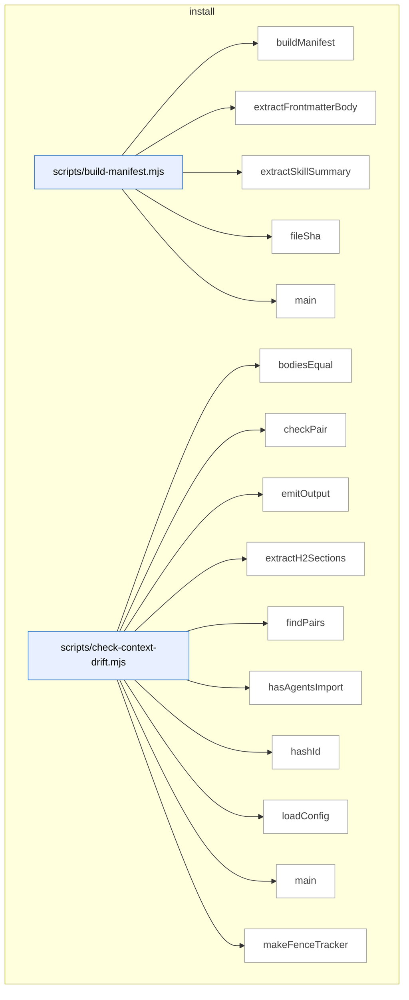

_Domain has 122 symbols (>50). Diagram shows top-15 by file order; see flat table below for the full list._

### Symbols in this domain

| Symbol | Kind | Path | Lines | Purpose | File imported by |
|---|---|---|---|---|---|
| [`buildManifest`](../scripts/build-manifest.mjs#L99) | function | `scripts/build-manifest.mjs` | 99-163 | Builds a manifest of all skills with file lists, SHAs, summaries, and a bundleVersion hash. | _(internal)_ |
| [`extractFrontmatterBody`](../scripts/build-manifest.mjs#L49) | function | `scripts/build-manifest.mjs` | 49-54 | Extracts YAML frontmatter body between triple-dashes from markdown content. | _(internal)_ |
| [`extractSkillSummary`](../scripts/build-manifest.mjs#L64) | function | `scripts/build-manifest.mjs` | 64-94 | Parses frontmatter to extract the skill description field (block or inline form), truncating to 100 characters. | _(internal)_ |
| [`fileSha`](../scripts/build-manifest.mjs#L40) | function | `scripts/build-manifest.mjs` | 40-43 | Computes a 12-character SHA256 hash of a file's content. | _(internal)_ |
| [`main`](../scripts/build-manifest.mjs#L165) | function | `scripts/build-manifest.mjs` | 165-190 | Validates or regenerates skills.manifest.json, checking bundle freshness and reporting schema version. | _(internal)_ |
| [`bodiesEqual`](../scripts/check-context-drift.mjs#L168) | function | `scripts/check-context-drift.mjs` | 168-171 | Compares two text bodies after normalizing whitespace for semantic equality. | _(internal)_ |
| [`checkPair`](../scripts/check-context-drift.mjs#L184) | function | `scripts/check-context-drift.mjs` | 184-249 | Validates CLAUDE.md against drift rules: import presence, allowlist compliance, size cap, and section body matching. | _(internal)_ |
| [`emitOutput`](../scripts/check-context-drift.mjs#L346) | function | `scripts/check-context-drift.mjs` | 346-369 | Outputs findings in text, JSON, or SARIF format with severity-based aggregation. | _(internal)_ |
| [`extractH2Sections`](../scripts/check-context-drift.mjs#L141) | function | `scripts/check-context-drift.mjs` | 141-162 | Extracts H2 sections from markdown content, respecting code fence boundaries. | _(internal)_ |
| [`findPairs`](../scripts/check-context-drift.mjs#L261) | function | `scripts/check-context-drift.mjs` | 261-279 | Builds pairs of AGENTS.md and CLAUDE.md files from a flat file list grouped by directory. | _(internal)_ |
| [`hasAgentsImport`](../scripts/check-context-drift.mjs#L177) | function | `scripts/check-context-drift.mjs` | 177-180 | Checks if content imports AGENTS.md via @import directive in the first 30 lines. | _(internal)_ |
| [`hashId`](../scripts/check-context-drift.mjs#L253) | function | `scripts/check-context-drift.mjs` | 253-255 | Creates a deterministic 16-character semantic hash from a file path and rule key. | _(internal)_ |
| [`loadConfig`](../scripts/check-context-drift.mjs#L63) | function | `scripts/check-context-drift.mjs` | 63-94 | Loads and validates configuration from .claude-context-allowlist.json, returning defaults on parse failure. | _(internal)_ |
| [`main`](../scripts/check-context-drift.mjs#L371) | function | `scripts/check-context-drift.mjs` | 371-382 | Parses CLI arguments and runs a context-drift check, then exits with appropriate codes based on error/warning severity. | _(internal)_ |
| [`makeFenceTracker`](../scripts/check-context-drift.mjs#L108) | function | `scripts/check-context-drift.mjs` | 108-132 | Tracks entry/exit from code fences (``` or ~~~) to ignore headings inside code blocks. | _(internal)_ |
| [`parseArgs`](../scripts/check-context-drift.mjs#L309) | function | `scripts/check-context-drift.mjs` | 309-324 | Parses command-line arguments for repo path, output format, and strictness flag. | _(internal)_ |
| [`runDriftCheck`](../scripts/check-context-drift.mjs#L288) | function | `scripts/check-context-drift.mjs` | 288-305 | Runs drift checks on all AGENTS/CLAUDE pairs and aggregates findings. | _(internal)_ |
| [`showHelp`](../scripts/check-context-drift.mjs#L326) | function | `scripts/check-context-drift.mjs` | 326-344 | Prints usage help and configuration guide for the drift check tool. | _(internal)_ |
| [`canResolve`](../scripts/check-deps.mjs#L53) | function | `scripts/check-deps.mjs` | 53-61 | Tests whether a Node.js package can be resolved without throwing an error. | _(internal)_ |
| [`loadEnv`](../scripts/check-deps.mjs#L63) | function | `scripts/check-deps.mjs` | 63-78 | Reads a .env file from the current working directory and populates process.env with its key-value pairs, skipping comments and blank lines. | _(internal)_ |
| [`main`](../scripts/check-deps.mjs#L80) | function | `scripts/check-deps.mjs` | 80-174 | Audits required and optional npm packages plus environment variables, outputting results in JSON or human-readable format with exit codes based on missing dependencies. | _(internal)_ |
| [`detectMissingFromStatic`](../scripts/check-model-freshness.mjs#L149) | function | `scripts/check-model-freshness.mjs` | 149-177 | Identifies models in live provider catalogs that match tier patterns but are missing from STATIC_POOL, reporting them as potential offline-resolution gaps. | _(internal)_ |
| [`detectPrematureRemap`](../scripts/check-model-freshness.mjs#L183) | function | `scripts/check-model-freshness.mjs` | 183-208 | Flags deprecated model remappings that are still actively served by providers, suggesting they may be premature or undocumented. | _(internal)_ |
| [`detectSentinelDrift`](../scripts/check-model-freshness.mjs#L83) | function | `scripts/check-model-freshness.mjs` | 83-143 | Detects drift between static model pool and live provider catalogs by resolving sentinels with both caches, identifying stale or missing models. | _(internal)_ |
| [`emitOutput`](../scripts/check-model-freshness.mjs#L310) | function | `scripts/check-model-freshness.mjs` | 310-340 | Outputs model freshness findings in JSON, SARIF, or human-readable format, displaying provider coverage and severity summaries. | _(internal)_ |
| [`hashId`](../scripts/check-model-freshness.mjs#L212) | function | `scripts/check-model-freshness.mjs` | 212-214 | Hashes a rule identifier and key into a 16-character SHA256 digest for deduplicating semantic findings. | _(internal)_ |
| [`main`](../scripts/check-model-freshness.mjs#L342) | function | `scripts/check-model-freshness.mjs` | 342-353 | Parses CLI args, runs freshness check, emits output, and exits with code 3 for no providers, 1 for errors, 2 for warnings, or 0 for success. | _(internal)_ |
| [`parseArgs`](../scripts/check-model-freshness.mjs#L266) | function | `scripts/check-model-freshness.mjs` | 266-280 | Parses command-line arguments for format, strict mode, and help, validating that format is one of text/json/sarif. | _(internal)_ |
| [`runFreshnessCheck`](../scripts/check-model-freshness.mjs#L225) | function | `scripts/check-model-freshness.mjs` | 225-262 | Fetches live model catalogs from providers (or uses cached/empty if refresh disabled), validates schema, and runs drift detection rules. | _(internal)_ |
| [`showHelp`](../scripts/check-model-freshness.mjs#L282) | function | `scripts/check-model-freshness.mjs` | 282-308 | Displays usage information, exit codes, environment variables, and instructions for model freshness checking. | _(internal)_ |
| [`checkAuditApiKeys`](../scripts/check-setup.mjs#L157) | function | `scripts/check-setup.mjs` | 157-174 | Validates API keys (OpenAI required, Gemini/Anthropic optional) and logs pass/warn/fail statuses for audit prerequisites. | _(internal)_ |
| [`checkAuditLoop`](../scripts/check-setup.mjs#L233) | function | `scripts/check-setup.mjs` | 233-237 | Reports on audit-loop setup by checking API keys and Supabase tables. | _(internal)_ |
| [`checkAuditSupabase`](../scripts/check-setup.mjs#L180) | function | `scripts/check-setup.mjs` | 180-231 | Validates Supabase audit configuration including URL, keys, required tables, and views (debt_summary), reporting creation instructions for missing schema. | _(internal)_ |
| [`checkPersonaTest`](../scripts/check-setup.mjs#L241) | function | `scripts/check-setup.mjs` | 241-297 | Validates persona-test Supabase configuration including URL, anonymous key, repo name, and required tables/views for session memory. | _(internal)_ |
| [`checkTables`](../scripts/check-setup.mjs#L71) | function | `scripts/check-setup.mjs` | 71-78 | Checks existence of multiple database tables by querying each with a limit-0 select, detecting PostgreSQL "does not exist" errors. | _(internal)_ |
| [`getSupabaseClient`](../scripts/check-setup.mjs#L61) | function | `scripts/check-setup.mjs` | 61-64 | Creates and returns a Supabase client using provided URL and anonymous key. | _(internal)_ |
| [`loadEnv`](../scripts/check-setup.mjs#L42) | function | `scripts/check-setup.mjs` | 42-57 | Reads and parses a .env file from a specified repository path, returning a key-value object. | _(internal)_ |
| [`main`](../scripts/check-setup.mjs#L374) | function | `scripts/check-setup.mjs` | 374-385 | Loads .env variables, creates a report object, runs audit-loop and persona-test checks, then prints or outputs JSON report. | _(internal)_ |
| [`printJsonReport`](../scripts/check-setup.mjs#L360) | function | `scripts/check-setup.mjs` | 360-370 | Outputs the setup check report as JSON including repo name, path, environment file status, and section details. | _(internal)_ |
| [`printReport`](../scripts/check-setup.mjs#L328) | function | `scripts/check-setup.mjs` | 328-358 | Prints a formatted setup check report with sections, status icons, details, and fix commands, displaying overall verdict. | _(internal)_ |
| [`Report`](../scripts/check-setup.mjs#L118) | class | `scripts/check-setup.mjs` | 118-153 | Stores setup check results with sections and items, tracking failures and warnings, with methods to add pass/fail/warn/info/fix entries. | _(internal)_ |
| [`shortUrl`](../scripts/check-setup.mjs#L176) | function | `scripts/check-setup.mjs` | 176-178 | Truncates a URL by removing protocol and limiting length to 30 characters with ellipsis. | _(internal)_ |
| [`statusIcon`](../scripts/check-setup.mjs#L304) | function | `scripts/check-setup.mjs` | 304-313 | Returns an ANSI-colored status icon (PASS/FAIL/WARN/INFO/FIX) for terminal display. | _(internal)_ |
| [`verdictLine`](../scripts/check-setup.mjs#L315) | function | `scripts/check-setup.mjs` | 315-326 | Generates a human-readable verdict line summarizing failure and warning counts with appropriate coloring. | _(internal)_ |
| [`listSkills`](../scripts/check-skill-refs.mjs#L30) | function | `scripts/check-skill-refs.mjs` | 30-36 | Lists all skill directories in SKILLS_DIR by reading filesystem and filtering for directories, sorted alphabetically. | _(internal)_ |
| [`main`](../scripts/check-skill-refs.mjs#L38) | function | `scripts/check-skill-refs.mjs` | 38-74 | Lints one or more skills by directory, reporting pass/fail with entry counts and aggregating results with colored output. | _(internal)_ |
| [`main`](../scripts/check-skill-updates.mjs#L25) | function | `scripts/check-skill-updates.mjs` | 25-118 | <no body> | _(internal)_ |
| [`parseArgs`](../scripts/check-skill-updates.mjs#L16) | function | `scripts/check-skill-updates.mjs` | 16-23 | Parses command-line arguments for JSON output, no-cache flag, and optional target directory path. | _(internal)_ |
| [`checkSync`](../scripts/check-sync.mjs#L25) | function | `scripts/check-sync.mjs` | 25-157 | <no body> | _(internal)_ |
| [`fail`](../scripts/check-sync.mjs#L20) | function | `scripts/check-sync.mjs` | 20-20 | Logs a [FAIL] status message. | _(internal)_ |
| [`finish`](../scripts/check-sync.mjs#L159) | function | `scripts/check-sync.mjs` | 159-182 | Prints a formatted sync check verdict with fix suggestions or outputs JSON report, exiting with 0 for SYNCING or 1 otherwise. | _(internal)_ |
| [`info`](../scripts/check-sync.mjs#L21) | function | `scripts/check-sync.mjs` | 21-21 | Logs an [INFO] status message. | _(internal)_ |
| [`log`](../scripts/check-sync.mjs#L17) | function | `scripts/check-sync.mjs` | 17-17 | Writes a message to stdout unless in JSON mode. | _(internal)_ |
| [`pass`](../scripts/check-sync.mjs#L19) | function | `scripts/check-sync.mjs` | 19-19 | Logs a [PASS] status message. | _(internal)_ |
| [`buildCopilotMergeWrite`](../scripts/install-skills.mjs#L205) | function | `scripts/install-skills.mjs` | 205-218 | Merges skill instructions into the copilot-instructions.md file and records the merged result with SHA tracking. | _(internal)_ |
| [`buildSkillWrites`](../scripts/install-skills.mjs#L173) | function | `scripts/install-skills.mjs` | 173-203 | Builds write operations for skill files by resolving paths, validating SHA integrity, and recording managed file metadata. | _(internal)_ |
| [`checkConflicts`](../scripts/install-skills.mjs#L233) | function | `scripts/install-skills.mjs` | 233-245 | Detects conflicts between incoming writes and previous receipts, separating repo-scoped and global-scoped conflicts. | _(internal)_ |
| [`computeDeletes`](../scripts/install-skills.mjs#L220) | function | `scripts/install-skills.mjs` | 220-231 | Identifies files from previous receipts that are no longer in the new write list, collecting them for deletion. | _(internal)_ |
| [`expandSkillFiles`](../scripts/install-skills.mjs#L114) | function | `scripts/install-skills.mjs` | 114-120 | Expands a skill's file list from manifest metadata, falling back to a legacy single-file format if needed. | _(internal)_ |
| [`fileShaShort`](../scripts/install-skills.mjs#L122) | function | `scripts/install-skills.mjs` | 122-124 | Computes a 12-character SHA256 hash of a buffer for file integrity verification. | _(internal)_ |
| [`loadManifest`](../scripts/install-skills.mjs#L84) | function | `scripts/install-skills.mjs` | 84-107 | Loads and validates the skills manifest JSON file, checking schema version compatibility and exiting on parse errors. | _(internal)_ |
| [`main`](../scripts/install-skills.mjs#L259) | function | `scripts/install-skills.mjs` | 259-346 | <no body> | _(internal)_ |
| [`maybeWarnGithubSkillsDeprecation`](../scripts/install-skills.mjs#L161) | function | `scripts/install-skills.mjs` | 161-171 | Warns about deprecated .github/skills/ directory and suggests passing --keep-github-skills to preserve it. | _(internal)_ |
| [`parseArgs`](../scripts/install-skills.mjs#L56) | function | `scripts/install-skills.mjs` | 56-78 | Parses command-line arguments into an options object with defaults for local/remote mode, surface targets, skills filter, and installation flags. | _(internal)_ |
| [`printBanner`](../scripts/install-skills.mjs#L141) | function | `scripts/install-skills.mjs` | 141-149 | Prints installation banner showing mode, surface, target repo, and any dry-run or cross-repo notices. | _(internal)_ |
| [`reconcileJournals`](../scripts/install-skills.mjs#L151) | function | `scripts/install-skills.mjs` | 151-159 | Recovers from journal files tracking previous installation transactions, reporting rolled-forward or rolled-back changes. | _(internal)_ |
| [`validateTarget`](../scripts/install-skills.mjs#L128) | function | `scripts/install-skills.mjs` | 128-139 | Validates that the target directory exists and contains git or package.json markers, warning if neither is found. | _(internal)_ |
| [`writeReceiptsByScope`](../scripts/install-skills.mjs#L247) | function | `scripts/install-skills.mjs` | 247-257 | Writes installation receipts to disk partitioned by scope, recording manifest version and managed files. | _(internal)_ |
| [`computeFileSha`](../scripts/lib/install/conflict-detector.mjs#L13) | function | `scripts/lib/install/conflict-detector.mjs` | 13-20 | Computes a 12-character SHA256 hash of a file's content, returning null on read error. | `scripts/check-skill-updates.mjs`, `scripts/install-skills.mjs` |
| [`detectConflicts`](../scripts/lib/install/conflict-detector.mjs#L30) | function | `scripts/lib/install/conflict-detector.mjs` | 30-78 | Partitions planned file writes into safe and conflicted based on receipt history and SHA comparison. | `scripts/check-skill-updates.mjs`, `scripts/install-skills.mjs` |
| [`detectDrift`](../scripts/lib/install/conflict-detector.mjs#L86) | function | `scripts/lib/install/conflict-detector.mjs` | 86-105 | Detects drift in managed files by comparing expected vs actual SHA hashes. | `scripts/check-skill-updates.mjs`, `scripts/install-skills.mjs` |
| [`generateAllPromptFiles`](../scripts/lib/install/copilot-prompts.mjs#L198) | function | `scripts/lib/install/copilot-prompts.mjs` | 198-229 | Scans skill directories and generates prompt files for each skill with registry validation. | `scripts/regenerate-skill-copies.mjs` |
| [`generatePromptFile`](../scripts/lib/install/copilot-prompts.mjs#L149) | function | `scripts/lib/install/copilot-prompts.mjs` | 149-187 | Generates a Copilot-compatible prompt file with skill metadata and CLI usage instructions. | `scripts/regenerate-skill-copies.mjs` |
| [`parseSkillFrontmatter`](../scripts/lib/install/copilot-prompts.mjs#L115) | function | `scripts/lib/install/copilot-prompts.mjs` | 115-138 | Parses YAML frontmatter from skill markdown to extract name and description fields. | `scripts/regenerate-skill-copies.mjs` |
| [`shaOfManagedBlock`](../scripts/lib/install/copilot-prompts.mjs#L239) | function | `scripts/lib/install/copilot-prompts.mjs` | 239-247 | Extracts and hashes the managed block content between markers. | `scripts/regenerate-skill-copies.mjs` |
| [`yamlQuote`](../scripts/lib/install/copilot-prompts.mjs#L104) | function | `scripts/lib/install/copilot-prompts.mjs` | 104-106 | Escapes and quotes a string for safe YAML literal syntax. | `scripts/regenerate-skill-copies.mjs` |
| [`ensureAuditDeps`](../scripts/lib/install/deps.mjs#L84) | function | `scripts/lib/install/deps.mjs` | 84-146 | Ensures audit-loop dependencies are installed, with dry-run and quiet modes. | `scripts/install-skills.mjs`, `scripts/sync-to-repos.mjs` |
| [`findMissingDeps`](../scripts/lib/install/deps.mjs#L53) | function | `scripts/lib/install/deps.mjs` | 53-65 | Checks for missing required and optional npm dependencies in node_modules. | `scripts/install-skills.mjs`, `scripts/sync-to-repos.mjs` |
| [`checkAuditGitignore`](../scripts/lib/install/gitignore.mjs#L152) | function | `scripts/lib/install/gitignore.mjs` | 152-171 | Checks .gitignore for presence of required patterns and returns missing/present lists. | `scripts/check-skill-updates.mjs`, `scripts/install-skills.mjs` |
| [`ensureAuditGitignore`](../scripts/lib/install/gitignore.mjs#L106) | function | `scripts/lib/install/gitignore.mjs` | 106-143 | Adds or creates .gitignore with required audit-loop patterns. | `scripts/check-skill-updates.mjs`, `scripts/install-skills.mjs` |
| [`extractBlock`](../scripts/lib/install/merge.mjs#L64) | function | `scripts/lib/install/merge.mjs` | 64-70 | Extracts the content between start and end markers from a file. | `scripts/install-skills.mjs` |
| [`mergeBlock`](../scripts/lib/install/merge.mjs#L36) | function | `scripts/lib/install/merge.mjs` | 36-55 | Merges a managed block into a file, replacing existing markers or appending if none exist. | `scripts/install-skills.mjs` |
| [`buildReceipt`](../scripts/lib/install/receipt.mjs#L48) | function | `scripts/lib/install/receipt.mjs` | 48-57 | Constructs an install receipt object with version, bundle info, and managed files list. | `scripts/check-skill-updates.mjs`, `scripts/install-skills.mjs` |
| [`readReceipt`](../scripts/lib/install/receipt.mjs#L13) | function | `scripts/lib/install/receipt.mjs` | 13-24 | Reads and validates an install receipt from JSON file. | `scripts/check-skill-updates.mjs`, `scripts/install-skills.mjs` |
| [`writeReceipt`](../scripts/lib/install/receipt.mjs#L31) | function | `scripts/lib/install/receipt.mjs` | 31-37 | Validates and atomically writes an install receipt with temp-rename pattern. | `scripts/check-skill-updates.mjs`, `scripts/install-skills.mjs` |
| [`findRepoRoot`](../scripts/lib/install/surface-paths.mjs#L14) | function | `scripts/lib/install/surface-paths.mjs` | 14-37 | Finds the outermost .git directory or package.json as repo root, walking up from a start directory. | `scripts/check-skill-updates.mjs`, `scripts/install-skills.mjs` |
| [`partitionManagedFilesByScope`](../scripts/lib/install/surface-paths.mjs#L124) | function | `scripts/lib/install/surface-paths.mjs` | 124-132 | Partitions managed files into global and repo-scoped lists. | `scripts/check-skill-updates.mjs`, `scripts/install-skills.mjs` |
| [`receiptPath`](../scripts/lib/install/surface-paths.mjs#L110) | function | `scripts/lib/install/surface-paths.mjs` | 110-115 | Returns the path to the install receipt, global or repo-scoped based on scope parameter. | `scripts/check-skill-updates.mjs`, `scripts/install-skills.mjs` |
| [`resolveSkillFiles`](../scripts/lib/install/surface-paths.mjs#L79) | function | `scripts/lib/install/surface-paths.mjs` | 79-94 | Expands skill files across multiple surfaces and scopes with full file paths. | `scripts/check-skill-updates.mjs`, `scripts/install-skills.mjs` |
| [`resolveSkillTargets`](../scripts/lib/install/surface-paths.mjs#L46) | function | `scripts/lib/install/surface-paths.mjs` | 46-66 | Resolves target installation directories for a skill across specified surfaces (claude/copilot/agents). | `scripts/check-skill-updates.mjs`, `scripts/install-skills.mjs` |
| [`cleanupJournal`](../scripts/lib/install/transaction.mjs#L200) | function | `scripts/lib/install/transaction.mjs` | 200-203 | Removes the transaction journal file on best-effort basis. | `scripts/install-skills.mjs` |
| [`defaultJournalPath`](../scripts/lib/install/transaction.mjs#L245) | function | `scripts/lib/install/transaction.mjs` | 245-247 | Returns the default transaction journal path in the current directory. | `scripts/install-skills.mjs` |
| [`executeTransaction`](../scripts/lib/install/transaction.mjs#L81) | function | `scripts/lib/install/transaction.mjs` | 81-176 | <no body> | `scripts/install-skills.mjs` |
| [`fsyncFile`](../scripts/lib/install/transaction.mjs#L49) | function | `scripts/lib/install/transaction.mjs` | 49-51 | Calls fsync on a file descriptor with best-effort error suppression. | `scripts/install-skills.mjs` |
| [`recoverFromJournal`](../scripts/lib/install/transaction.mjs#L211) | function | `scripts/lib/install/transaction.mjs` | 211-243 | Recovers from a partial transaction journal by rolling forward renames or rolling back staged files. | `scripts/install-skills.mjs` |
| [`rollbackPartialTransaction`](../scripts/lib/install/transaction.mjs#L178) | function | `scripts/lib/install/transaction.mjs` | 178-198 | Reverts completed file renames to their original snapshots on transaction failure. | `scripts/install-skills.mjs` |
| [`shaShort`](../scripts/lib/install/transaction.mjs#L45) | function | `scripts/lib/install/transaction.mjs` | 45-47 | Computes a 12-character SHA256 hash of a buffer. | `scripts/install-skills.mjs` |
| [`tmpSuffix`](../scripts/lib/install/transaction.mjs#L40) | function | `scripts/lib/install/transaction.mjs` | 40-43 | Generates a unique temporary file suffix using PID, millisecond timestamp, and random hex. | `scripts/install-skills.mjs` |
| [`writeJournal`](../scripts/lib/install/transaction.mjs#L58) | function | `scripts/lib/install/transaction.mjs` | 58-70 | Atomically writes a JSON journal entry to disk with fsync and temp-rename. | `scripts/install-skills.mjs` |
| [`computeVerdict`](../scripts/regenerate-skill-copies.mjs#L199) | function | `scripts/regenerate-skill-copies.mjs` | 199-203 | Determines final verdict (VIOLATIONS, CHANGES, or IN SYNC) based on error count and file changes. | _(internal)_ |
| [`copyFileIfChanged`](../scripts/regenerate-skill-copies.mjs#L79) | function | `scripts/regenerate-skill-copies.mjs` | 79-91 | Copies a file from source to destination if content differs, reporting status (unchanged/wrote) and skipping if in dry-run mode. | _(internal)_ |
| [`emitVerdict`](../scripts/regenerate-skill-copies.mjs#L205) | function | `scripts/regenerate-skill-copies.mjs` | 205-217 | Outputs summary of writes, prunes, violations, and verdict; exits with error code if violations found or check mode detected changes. | _(internal)_ |
| [`loadSkillsOrDie`](../scripts/regenerate-skill-copies.mjs#L66) | function | `scripts/regenerate-skill-copies.mjs` | 66-77 | Loads skill names from source directory, exiting with error if directory missing or empty. | _(internal)_ |
| [`main`](../scripts/regenerate-skill-copies.mjs#L219) | function | `scripts/regenerate-skill-copies.mjs` | 219-247 | Iterates over skills to sync each to destinations, prunes orphan directories, syncs Copilot prompts, and emits final verdict. | _(internal)_ |
| [`pruneFilesNotInSource`](../scripts/regenerate-skill-copies.mjs#L93) | function | `scripts/regenerate-skill-copies.mjs` | 93-108 | Prunes files in a destination directory that don't exist in the source set, reporting deletes and skipping in dry-run mode. | _(internal)_ |
| [`pruneOrphanSkillDirs`](../scripts/regenerate-skill-copies.mjs#L133) | function | `scripts/regenerate-skill-copies.mjs` | 133-149 | Removes orphan skill directories from destination roots that don't exist in the source skill set, respecting dry-run mode. | _(internal)_ |
| [`pruneStalePrompts`](../scripts/regenerate-skill-copies.mjs#L171) | function | `scripts/regenerate-skill-copies.mjs` | 171-189 | Deletes managed prompt files (marked with audit-loop-bundle comment) from a directory that are no longer in the expected set, skipping in dry-run mode. | _(internal)_ |
| [`sha`](../scripts/regenerate-skill-copies.mjs#L48) | function | `scripts/regenerate-skill-copies.mjs` | 48-50 | Computes a 12-character SHA-256 hash of a buffer. | _(internal)_ |
| [`syncCopilotPrompts`](../scripts/regenerate-skill-copies.mjs#L191) | function | `scripts/regenerate-skill-copies.mjs` | 191-197 | Syncs Copilot prompts by writing generated entries and pruning stale managed files, returning write/delete counts. | _(internal)_ |
| [`syncSkillToDests`](../scripts/regenerate-skill-copies.mjs#L110) | function | `scripts/regenerate-skill-copies.mjs` | 110-131 | Syncs a single skill's files to all destination roots, handling source enumeration errors and pruning orphan files per destination. | _(internal)_ |
| [`warnGithubSkillsDeprecation`](../scripts/regenerate-skill-copies.mjs#L54) | function | `scripts/regenerate-skill-copies.mjs` | 54-64 | Warns that `.github/skills/` directory is deprecated and no longer maintained, advising manual deletion after confirming disuse. | _(internal)_ |
| [`writePromptFiles`](../scripts/regenerate-skill-copies.mjs#L151) | function | `scripts/regenerate-skill-copies.mjs` | 151-169 | Writes prompt file entries to disk, tracking expected paths and skipping unchanged files, reporting writes and creates. | _(internal)_ |
| [`confirm`](../scripts/setup-permissions.mjs#L119) | function | `scripts/setup-permissions.mjs` | 119-128 | Prompts user for Y/n confirmation via stdin, returning true if yes or skipped (unless AUTO_YES), or bypassing if auto-yes mode. | _(internal)_ |
| [`main`](../scripts/setup-permissions.mjs#L183) | function | `scripts/setup-permissions.mjs` | 183-280 | Reads project and user-level Claude settings, merges audit-loop permission rules, displays added/removed changes, and writes if confirmed. | _(internal)_ |
| [`mergeRules`](../scripts/setup-permissions.mjs#L134) | function | `scripts/setup-permissions.mjs` | 134-179 | Merges new permission rules into Claude Code settings, deduplicates, cleans up rules covered by wildcards, and merges deny rules. | _(internal)_ |
| [`readJson`](../scripts/setup-permissions.mjs#L106) | function | `scripts/setup-permissions.mjs` | 106-112 | Reads and parses a JSON file, returning null if file doesn't exist or JSON is invalid. | _(internal)_ |
| [`writeJson`](../scripts/setup-permissions.mjs#L114) | function | `scripts/setup-permissions.mjs` | 114-117 | Writes a JSON object to a file with pretty-printing and 2-space indentation, creating parent directories as needed. | _(internal)_ |
| [`buildCopilotPromptFiles`](../scripts/sync-to-repos.mjs#L218) | function | `scripts/sync-to-repos.mjs` | 218-226 | Collects markdown prompt files from `.github/prompts/` directory. | _(internal)_ |
| [`buildSkillFiles`](../scripts/sync-to-repos.mjs#L172) | function | `scripts/sync-to-repos.mjs` | 172-184 | Lists all skill source files and returns their relative paths for synchronization targets. | _(internal)_ |
| [`deepMerge`](../scripts/sync-to-repos.mjs#L282) | function | `scripts/sync-to-repos.mjs` | 282-293 | Recursively merges source object properties into target object, preserving nested objects. | _(internal)_ |
| [`sha256`](../scripts/sync-to-repos.mjs#L251) | function | `scripts/sync-to-repos.mjs` | 251-258 | Computes SHA-256 hash of a file's contents, returning null on error. | _(internal)_ |
| [`unifiedDiff`](../scripts/sync-to-repos.mjs#L260) | function | `scripts/sync-to-repos.mjs` | 260-273 | Generates a unified diff between two files using git diff. | _(internal)_ |

---

## learning-store

> Optimizes prompt selection and evolution for code audits using multi-armed bandits and Thompson sampling, with contextual bucketing by repository size/language, and iteratively improves worst-performing prompts based on multi-factor reward signals from audit outcomes.

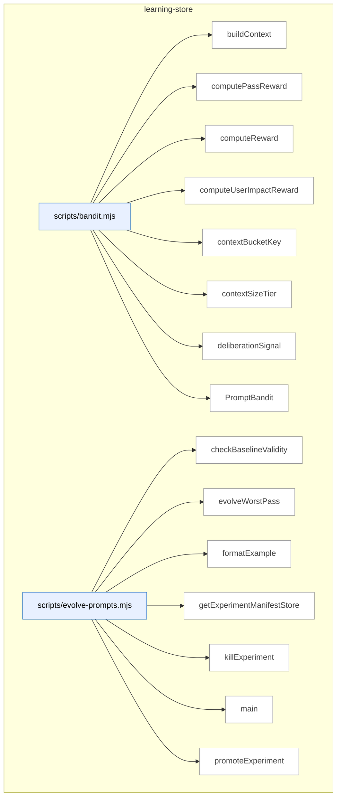

_Domain has 107 symbols (>50). Diagram shows top-15 by file order; see flat table below for the full list._

### Symbols in this domain

| Symbol | Kind | Path | Lines | Purpose | File imported by |
|---|---|---|---|---|---|
| [`buildContext`](../scripts/bandit.mjs#L28) | function | `scripts/bandit.mjs` | 28-34 | Extracts repository context (size tier and dominant language) from profile data. | `scripts/evolve-prompts.mjs`, `scripts/gemini-review.mjs`, `scripts/meta-assess.mjs`, +1 more |
| [`computePassReward`](../scripts/bandit.mjs#L409) | function | `scripts/bandit.mjs` | 409-415 | Averages finding-level rewards across all linked edits in an evaluation record. | `scripts/evolve-prompts.mjs`, `scripts/gemini-review.mjs`, `scripts/meta-assess.mjs`, +1 more |
| [`computeReward`](../scripts/bandit.mjs#L309) | function | `scripts/bandit.mjs` | 309-347 | Computes a multi-factor reward signal (procedural, substantive, deliberation, user-impact) for audit resolution outcomes. | `scripts/evolve-prompts.mjs`, `scripts/gemini-review.mjs`, `scripts/meta-assess.mjs`, +1 more |
| [`computeUserImpactReward`](../scripts/bandit.mjs#L358) | function | `scripts/bandit.mjs` | 358-378 | Calculates user-impact reward weighted by correlation type and persona severity. | `scripts/evolve-prompts.mjs`, `scripts/gemini-review.mjs`, `scripts/meta-assess.mjs`, +1 more |
| [`contextBucketKey`](../scripts/bandit.mjs#L43) | function | `scripts/bandit.mjs` | 43-45 | Creates a cache key combining size tier and dominant language. | `scripts/evolve-prompts.mjs`, `scripts/gemini-review.mjs`, `scripts/meta-assess.mjs`, +1 more |
| [`contextSizeTier`](../scripts/bandit.mjs#L36) | function | `scripts/bandit.mjs` | 36-41 | Classifies repository size into small, medium, large, or xlarge tier based on character count. | `scripts/evolve-prompts.mjs`, `scripts/gemini-review.mjs`, `scripts/meta-assess.mjs`, +1 more |
| [`deliberationSignal`](../scripts/bandit.mjs#L385) | function | `scripts/bandit.mjs` | 385-402 | Assigns a deliberation quality score based on Claude position, GPT ruling, and rationale quality. | `scripts/evolve-prompts.mjs`, `scripts/gemini-review.mjs`, `scripts/meta-assess.mjs`, +1 more |
| [`PromptBandit`](../scripts/bandit.mjs#L49) | class | `scripts/bandit.mjs` | 49-292 | Multi-armed bandit engine that selects prompt variants using Thompson sampling, contextually bucketed by repo size and language. | `scripts/evolve-prompts.mjs`, `scripts/gemini-review.mjs`, `scripts/meta-assess.mjs`, +1 more |
| [`checkBaselineValidity`](../scripts/evolve-prompts.mjs#L340) | function | `scripts/evolve-prompts.mjs` | 340-348 | Checks if an experiment's parent revision is still the current default; marks it stale if not. | _(internal)_ |
| [`evolveWorstPass`](../scripts/evolve-prompts.mjs#L92) | function | `scripts/evolve-prompts.mjs` | 92-234 | Analyzes pass performance using the EWR metric, identifies the worst-performing pass, and initiates prompt evolution if needed. | _(internal)_ |
| [`formatExample`](../scripts/evolve-prompts.mjs#L336) | function | `scripts/evolve-prompts.mjs` | 336-338 | Formats a single outcome example as a human-readable one-liner with severity, category, file, and detail preview. | _(internal)_ |
| [`getExperimentManifestStore`](../scripts/evolve-prompts.mjs#L64) | function | `scripts/evolve-prompts.mjs` | 64-66 | Returns a file-backed mutex store for managing experiment manifests by experiment ID. | _(internal)_ |
| [`killExperiment`](../scripts/evolve-prompts.mjs#L306) | function | `scripts/evolve-prompts.mjs` | 306-317 | Abandons an experiment and marks it as killed in the experiment store. | _(internal)_ |
| [`main`](../scripts/evolve-prompts.mjs#L373) | function | `scripts/evolve-prompts.mjs` | 373-469 | Main entry point that dispatches to evolve, review-experiments, promote, kill, or stats subcommands with appropriate setup. | _(internal)_ |
| [`promoteExperiment`](../scripts/evolve-prompts.mjs#L289) | function | `scripts/evolve-prompts.mjs` | 289-301 | Promotes a successful experiment's revision to become the active default prompt for a pass. | _(internal)_ |
| [`reconcileOrphanedExperiments`](../scripts/evolve-prompts.mjs#L353) | function | `scripts/evolve-prompts.mjs` | 353-369 | Scans for orphaned experiment manifests that failed to complete and logs cleanup opportunities. | _(internal)_ |
| [`reviewExperiments`](../scripts/evolve-prompts.mjs#L239) | function | `scripts/evolve-prompts.mjs` | 239-284 | Reviews active experiments for convergence and collects statistics on pass performance and bandit arm status. | _(internal)_ |
| [`showStats`](../scripts/evolve-prompts.mjs#L322) | function | `scripts/evolve-prompts.mjs` | 322-332 | Aggregates pass statistics, active experiments, and bandit arm statistics for display. | _(internal)_ |
| [`_resetClassificationColumnCache`](../scripts/learning-store.mjs#L217) | function | `scripts/learning-store.mjs` | 217-217 | Resets the classification column cache, forcing re-detection on next use. | `scripts/audit-loop.mjs`, `scripts/cross-skill.mjs`, `scripts/debt-auto-capture.mjs`, +9 more |
| [`abortRefreshRun`](../scripts/learning-store.mjs#L1598) | function | `scripts/learning-store.mjs` | 1598-1605 | Marks a refresh run as aborted with an optional error reason. | `scripts/audit-loop.mjs`, `scripts/cross-skill.mjs`, `scripts/debt-auto-capture.mjs`, +9 more |
| [`appendDebtEventsCloud`](../scripts/learning-store.mjs#L495) | function | `scripts/learning-store.mjs` | 495-523 | Appends debt event records with idempotent upsert to track topic lifecycle events across runs. | `scripts/audit-loop.mjs`, `scripts/cross-skill.mjs`, `scripts/debt-auto-capture.mjs`, +9 more |
| [`callNeighbourhoodRpc`](../scripts/learning-store.mjs#L1821) | function | `scripts/learning-store.mjs` | 1821-1837 | Queries the symbol_neighbourhood RPC to find semantically similar symbols. | `scripts/audit-loop.mjs`, `scripts/cross-skill.mjs`, `scripts/debt-auto-capture.mjs`, +9 more |
| [`chunk`](../scripts/learning-store.mjs#L1658) | function | `scripts/learning-store.mjs` | 1658-1662 | Splits an array into chunks of size n. | `scripts/audit-loop.mjs`, `scripts/cross-skill.mjs`, `scripts/debt-auto-capture.mjs`, +9 more |
| [`computeDriftScore`](../scripts/learning-store.mjs#L1843) | function | `scripts/learning-store.mjs` | 1843-1857 | Calls the drift_score RPC to compute architectural drift metrics. | `scripts/audit-loop.mjs`, `scripts/cross-skill.mjs`, `scripts/debt-auto-capture.mjs`, +9 more |
| [`copyForwardImports`](../scripts/learning-store.mjs#L1899) | function | `scripts/learning-store.mjs` | 1899-1932 | Copies forward untouched import edges from a prior refresh run, filtering by touched file set. | `scripts/audit-loop.mjs`, `scripts/cross-skill.mjs`, `scripts/debt-auto-capture.mjs`, +9 more |
| [`copyForwardUntouchedFiles`](../scripts/learning-store.mjs#L2147) | function | `scripts/learning-store.mjs` | 2147-2193 | <no body> | `scripts/audit-loop.mjs`, `scripts/cross-skill.mjs`, `scripts/debt-auto-capture.mjs`, +9 more |
| [`detectClassificationColumns`](../scripts/learning-store.mjs#L198) | function | `scripts/learning-store.mjs` | 198-214 | Checks if the database schema supports classification columns, caching the result to avoid repeated queries. | `scripts/audit-loop.mjs`, `scripts/cross-skill.mjs`, `scripts/debt-auto-capture.mjs`, +9 more |
| [`getActiveEmbeddingModel`](../scripts/learning-store.mjs#L1804) | function | `scripts/learning-store.mjs` | 1804-1813 | Retrieves the current active embedding model and dimension for a repository. | `scripts/audit-loop.mjs`, `scripts/cross-skill.mjs`, `scripts/debt-auto-capture.mjs`, +9 more |
| [`getActiveSnapshot`](../scripts/learning-store.mjs#L1622) | function | `scripts/learning-store.mjs` | 1622-1649 | Retrieves the active snapshot ID and embedding model for a repo, including import graph status. | `scripts/audit-loop.mjs`, `scripts/cross-skill.mjs`, `scripts/debt-auto-capture.mjs`, +9 more |
| [`getDomainSummaries`](../scripts/learning-store.mjs#L2030) | function | `scripts/learning-store.mjs` | 2030-2048 | Retrieves all domain summaries for a repository as a map. | `scripts/audit-loop.mjs`, `scripts/cross-skill.mjs`, `scripts/debt-auto-capture.mjs`, +9 more |
| [`getFalsePositivePatterns`](../scripts/learning-store.mjs#L836) | function | `scripts/learning-store.mjs` | 836-850 | Retrieves false positive patterns for a specific repo that are marked for auto-suppression. | `scripts/audit-loop.mjs`, `scripts/cross-skill.mjs`, `scripts/debt-auto-capture.mjs`, +9 more |
| [`getImportersForFiles`](../scripts/learning-store.mjs#L1981) | function | `scripts/learning-store.mjs` | 1981-1998 | Fetches all files that import a given set of paths, grouped and sorted. | `scripts/audit-loop.mjs`, `scripts/cross-skill.mjs`, `scripts/debt-auto-capture.mjs`, +9 more |
| [`getImportGraphPopulated`](../scripts/learning-store.mjs#L1961) | function | `scripts/learning-store.mjs` | 1961-1969 | Checks whether a refresh run has its import graph fully populated. | `scripts/audit-loop.mjs`, `scripts/cross-skill.mjs`, `scripts/debt-auto-capture.mjs`, +9 more |
| [`getPassEffectiveness`](../scripts/learning-store.mjs#L806) | function | `scripts/learning-store.mjs` | 806-831 | Fetches pass effectiveness metrics across all runs for a repo, aggregating findings and acceptance data. | `scripts/audit-loop.mjs`, `scripts/cross-skill.mjs`, `scripts/debt-auto-capture.mjs`, +9 more |
| [`getPassTimings`](../scripts/learning-store.mjs#L306) | function | `scripts/learning-store.mjs` | 306-337 | Aggregates pass timing statistics across all historical runs, returning average tokens and latency per pass. | `scripts/audit-loop.mjs`, `scripts/cross-skill.mjs`, `scripts/debt-auto-capture.mjs`, +9 more |
| [`getPersonaSupabase`](../scripts/learning-store.mjs#L1275) | function | `scripts/learning-store.mjs` | 1275-1294 | Initializes and caches a Supabase client for persona cloud features using environment credentials. | `scripts/audit-loop.mjs`, `scripts/cross-skill.mjs`, `scripts/debt-auto-capture.mjs`, +9 more |
| [`getReadClient`](../scripts/learning-store.mjs#L1489) | function | `scripts/learning-store.mjs` | 1489-1489 | Returns the cached read-only Supabase client. | `scripts/audit-loop.mjs`, `scripts/cross-skill.mjs`, `scripts/debt-auto-capture.mjs`, +9 more |
| [`getRepoIdByUuid`](../scripts/learning-store.mjs#L1498) | function | `scripts/learning-store.mjs` | 1498-1513 | Looks up a repository by UUID and returns its ID and embedding configuration. | `scripts/audit-loop.mjs`, `scripts/cross-skill.mjs`, `scripts/debt-auto-capture.mjs`, +9 more |
| [`getTopDuplicateClusters`](../scripts/learning-store.mjs#L2058) | function | `scripts/learning-store.mjs` | 2058-2078 | Calls the top_duplicate_clusters RPC and returns formatted cluster results. | `scripts/audit-loop.mjs`, `scripts/cross-skill.mjs`, `scripts/debt-auto-capture.mjs`, +9 more |
| [`getUnlockedFixes`](../scripts/learning-store.mjs#L994) | function | `scripts/learning-store.mjs` | 994-1006 | Retrieves up to 20 unlocked fixes from the database, optionally filtered by repo. | `scripts/audit-loop.mjs`, `scripts/cross-skill.mjs`, `scripts/debt-auto-capture.mjs`, +9 more |
| [`getWriteClient`](../scripts/learning-store.mjs#L1468) | function | `scripts/learning-store.mjs` | 1468-1486 | Creates and returns a service-role Supabase client for write operations, throwing if credentials are missing. | `scripts/audit-loop.mjs`, `scripts/cross-skill.mjs`, `scripts/debt-auto-capture.mjs`, +9 more |
| [`heartbeatRefreshRun`](../scripts/learning-store.mjs#L1608) | function | `scripts/learning-store.mjs` | 1608-1613 | Updates the heartbeat timestamp of an in-flight refresh run. | `scripts/audit-loop.mjs`, `scripts/cross-skill.mjs`, `scripts/debt-auto-capture.mjs`, +9 more |
| [`initLearningStore`](../scripts/learning-store.mjs#L27) | function | `scripts/learning-store.mjs` | 27-55 | Initializes Supabase client for cloud-based audit data storage, falling back to local mode on connection failure. | `scripts/audit-loop.mjs`, `scripts/cross-skill.mjs`, `scripts/debt-auto-capture.mjs`, +9 more |
| [`isCloudEnabled`](../scripts/learning-store.mjs#L58) | function | `scripts/learning-store.mjs` | 58-60 | Returns whether cloud storage is currently enabled and connected. | `scripts/audit-loop.mjs`, `scripts/cross-skill.mjs`, `scripts/debt-auto-capture.mjs`, +9 more |
| [`isPersonaCloudEnabled`](../scripts/learning-store.mjs#L1297) | function | `scripts/learning-store.mjs` | 1297-1300 | Checks whether persona cloud functionality is enabled. | `scripts/audit-loop.mjs`, `scripts/cross-skill.mjs`, `scripts/debt-auto-capture.mjs`, +9 more |
| [`listLayeringViolationsForSnapshot`](../scripts/learning-store.mjs#L2118) | function | `scripts/learning-store.mjs` | 2118-2133 | Lists all architectural layering violations for a refresh run. | `scripts/audit-loop.mjs`, `scripts/cross-skill.mjs`, `scripts/debt-auto-capture.mjs`, +9 more |
| [`listPersonasForApp`](../scripts/learning-store.mjs#L1310) | function | `scripts/learning-store.mjs` | 1310-1324 | Lists all personas associated with a given application URL. | `scripts/audit-loop.mjs`, `scripts/cross-skill.mjs`, `scripts/debt-auto-capture.mjs`, +9 more |
| [`listSymbolsForSnapshot`](../scripts/learning-store.mjs#L2084) | function | `scripts/learning-store.mjs` | 2084-2116 | Paginates and lists symbol index entries for a snapshot with optional filtering by kind, domain, or file prefix. | `scripts/audit-loop.mjs`, `scripts/cross-skill.mjs`, `scripts/debt-auto-capture.mjs`, +9 more |
| [`loadBanditArms`](../scripts/learning-store.mjs#L625) | function | `scripts/learning-store.mjs` | 625-653 | Loads bandit arms from cloud, reconstructing the in-memory arm dictionary by pass and context bucket. | `scripts/audit-loop.mjs`, `scripts/cross-skill.mjs`, `scripts/debt-auto-capture.mjs`, +9 more |
| [`loadFalsePositivePatterns`](../scripts/learning-store.mjs#L779) | function | `scripts/learning-store.mjs` | 779-799 | Loads false positive patterns for a repo and global defaults that are flagged for auto-suppression. | `scripts/audit-loop.mjs`, `scripts/cross-skill.mjs`, `scripts/debt-auto-capture.mjs`, +9 more |
| [`markImportGraphPopulated`](../scripts/learning-store.mjs#L1943) | function | `scripts/learning-store.mjs` | 1943-1951 | Marks a refresh run's import graph as fully populated. | `scripts/audit-loop.mjs`, `scripts/cross-skill.mjs`, `scripts/debt-auto-capture.mjs`, +9 more |
| [`openRefreshRun`](../scripts/learning-store.mjs#L1552) | function | `scripts/learning-store.mjs` | 1552-1575 | Opens a new refresh run transaction, checking for conflicts and returning a cancellation token. | `scripts/audit-loop.mjs`, `scripts/cross-skill.mjs`, `scripts/debt-auto-capture.mjs`, +9 more |
| [`publishRefreshRun`](../scripts/learning-store.mjs#L1585) | function | `scripts/learning-store.mjs` | 1585-1595 | Publishes a completed refresh run via RPC, making it the active snapshot. | `scripts/audit-loop.mjs`, `scripts/cross-skill.mjs`, `scripts/debt-auto-capture.mjs`, +9 more |
| [`readAuditEffectiveness`](../scripts/learning-store.mjs#L1087) | function | `scripts/learning-store.mjs` | 1087-1099 | Retrieves audit effectiveness metrics for a given repository. | `scripts/audit-loop.mjs`, `scripts/cross-skill.mjs`, `scripts/debt-auto-capture.mjs`, +9 more |
| [`readCorrelationsForFinding`](../scripts/learning-store.mjs#L1070) | function | `scripts/learning-store.mjs` | 1070-1081 | Fetches persona audit correlations linked to a specific audit finding from the database. | `scripts/audit-loop.mjs`, `scripts/cross-skill.mjs`, `scripts/debt-auto-capture.mjs`, +9 more |
| [`readCorrelationsForRun`](../scripts/learning-store.mjs#L1051) | function | `scripts/learning-store.mjs` | 1051-1062 | Reads all persona-audit correlations for a specific audit run from cloud storage. | `scripts/audit-loop.mjs`, `scripts/cross-skill.mjs`, `scripts/debt-auto-capture.mjs`, +9 more |
| [`readDebtEntriesCloud`](../scripts/learning-store.mjs#L429) | function | `scripts/learning-store.mjs` | 429-466 | Reads all debt entries for a repo from cloud storage, mapping database rows back to internal format. | `scripts/audit-loop.mjs`, `scripts/cross-skill.mjs`, `scripts/debt-auto-capture.mjs`, +9 more |
| [`readDebtEventsCloud`](../scripts/learning-store.mjs#L530) | function | `scripts/learning-store.mjs` | 530-551 | Reads all debt events for a repo ordered by timestamp, mapping database rows to internal event format. | `scripts/audit-loop.mjs`, `scripts/cross-skill.mjs`, `scripts/debt-auto-capture.mjs`, +9 more |
| [`readPersistentPlanFailures`](../scripts/learning-store.mjs#L1210) | function | `scripts/learning-store.mjs` | 1210-1221 | Fetches persistent failure records for a given plan. | `scripts/audit-loop.mjs`, `scripts/cross-skill.mjs`, `scripts/debt-auto-capture.mjs`, +9 more |
| [`readPlanSatisfaction`](../scripts/learning-store.mjs#L1192) | function | `scripts/learning-store.mjs` | 1192-1204 | Retrieves satisfaction metrics for a specific plan. | `scripts/audit-loop.mjs`, `scripts/cross-skill.mjs`, `scripts/debt-auto-capture.mjs`, +9 more |
| [`recordAdjudicationEvent`](../scripts/learning-store.mjs#L560) | function | `scripts/learning-store.mjs` | 560-590 | Records an adjudication event linking a finding to its outcome, remediation state, and ruling. | `scripts/audit-loop.mjs`, `scripts/cross-skill.mjs`, `scripts/debt-auto-capture.mjs`, +9 more |
| [`recordFindings`](../scripts/learning-store.mjs#L222) | function | `scripts/learning-store.mjs` | 222-249 | Records audit findings with optional sonar classification fields, truncating details to 600 characters. | `scripts/audit-loop.mjs`, `scripts/cross-skill.mjs`, `scripts/debt-auto-capture.mjs`, +9 more |
| [`recordLayeringViolations`](../scripts/learning-store.mjs#L1764) | function | `scripts/learning-store.mjs` | 1764-1787 | Batch-upserts architectural layering violation records. | `scripts/audit-loop.mjs`, `scripts/cross-skill.mjs`, `scripts/debt-auto-capture.mjs`, +9 more |
| [`recordPassStats`](../scripts/learning-store.mjs#L254) | function | `scripts/learning-store.mjs` | 254-274 | Records aggregate statistics for a pass including token counts, latency, and reasoning effort. | `scripts/audit-loop.mjs`, `scripts/cross-skill.mjs`, `scripts/debt-auto-capture.mjs`, +9 more |
| [`recordPersonaAuditCorrelation`](../scripts/learning-store.mjs#L1025) | function | `scripts/learning-store.mjs` | 1025-1043 | Upserts a correlation record linking a persona finding to an audit finding with match score and type. | `scripts/audit-loop.mjs`, `scripts/cross-skill.mjs`, `scripts/debt-auto-capture.mjs`, +9 more |
| [`recordPersonaSession`](../scripts/learning-store.mjs#L1387) | function | `scripts/learning-store.mjs` | 1387-1452 | Inserts a persona test session with upsert logic and updates persona stats. | `scripts/audit-loop.mjs`, `scripts/cross-skill.mjs`, `scripts/debt-auto-capture.mjs`, +9 more |
| [`recordPlanVerificationItems`](../scripts/learning-store.mjs#L1166) | function | `scripts/learning-store.mjs` | 1166-1186 | Batch-inserts individual verification test results for a plan run. | `scripts/audit-loop.mjs`, `scripts/cross-skill.mjs`, `scripts/debt-auto-capture.mjs`, +9 more |
| [`recordPlanVerificationRun`](../scripts/learning-store.mjs#L1122) | function | `scripts/learning-store.mjs` | 1122-1147 | Inserts a new plan verification run record and returns its auto-generated ID. | `scripts/audit-loop.mjs`, `scripts/cross-skill.mjs`, `scripts/debt-auto-capture.mjs`, +9 more |
| [`recordRegressionSpec`](../scripts/learning-store.mjs#L931) | function | `scripts/learning-store.mjs` | 931-957 | Upserts a regression specification record with assertion counts, contract types, and source finding reference. | `scripts/audit-loop.mjs`, `scripts/cross-skill.mjs`, `scripts/debt-auto-capture.mjs`, +9 more |
| [`recordRegressionSpecRun`](../scripts/learning-store.mjs#L971) | function | `scripts/learning-store.mjs` | 971-987 | Records a regression spec execution run with pass/fail result, captured regression flag, and optional error. | `scripts/audit-loop.mjs`, `scripts/cross-skill.mjs`, `scripts/debt-auto-capture.mjs`, +9 more |
| [`recordRunComplete`](../scripts/learning-store.mjs#L153) | function | `scripts/learning-store.mjs` | 153-175 | Updates an audit run with final statistics including findings counts, cost, duration, and AI verdict. | `scripts/audit-loop.mjs`, `scripts/cross-skill.mjs`, `scripts/debt-auto-capture.mjs`, +9 more |
| [`recordRunStart`](../scripts/learning-store.mjs#L106) | function | `scripts/learning-store.mjs` | 106-133 | Creates an audit run record with initial stats and returns its ID for subsequent data correlation. | `scripts/audit-loop.mjs`, `scripts/cross-skill.mjs`, `scripts/debt-auto-capture.mjs`, +9 more |
| [`recordShipEvent`](../scripts/learning-store.mjs#L1241) | function | `scripts/learning-store.mjs` | 1241-1264 | Records a ship gate event with outcome, blockers, and override information. | `scripts/audit-loop.mjs`, `scripts/cross-skill.mjs`, `scripts/debt-auto-capture.mjs`, +9 more |
| [`recordSuppressionEvents`](../scripts/learning-store.mjs#L342) | function | `scripts/learning-store.mjs` | 342-367 | Records suppression and reopening events for findings, tracking matched topics and match scores. | `scripts/audit-loop.mjs`, `scripts/cross-skill.mjs`, `scripts/debt-auto-capture.mjs`, +9 more |
| [`recordSymbolDefinitions`](../scripts/learning-store.mjs#L1694) | function | `scripts/learning-store.mjs` | 1694-1719 | Batch-upserts symbol definitions and returns a map of (path\|name\|kind) → database ID. | `scripts/audit-loop.mjs`, `scripts/cross-skill.mjs`, `scripts/debt-auto-capture.mjs`, +9 more |
| [`recordSymbolEmbedding`](../scripts/learning-store.mjs#L1748) | function | `scripts/learning-store.mjs` | 1748-1762 | Upserts a single symbol embedding vector with retry logic. | `scripts/audit-loop.mjs`, `scripts/cross-skill.mjs`, `scripts/debt-auto-capture.mjs`, +9 more |
| [`recordSymbolFileImports`](../scripts/learning-store.mjs#L1868) | function | `scripts/learning-store.mjs` | 1868-1887 | Batch-upserts file-level import edges into the symbol import graph. | `scripts/audit-loop.mjs`, `scripts/cross-skill.mjs`, `scripts/debt-auto-capture.mjs`, +9 more |
| [`recordSymbolIndex`](../scripts/learning-store.mjs#L1721) | function | `scripts/learning-store.mjs` | 1721-1746 | Batch-upserts symbol index entries linking definitions to file locations. | `scripts/audit-loop.mjs`, `scripts/cross-skill.mjs`, `scripts/debt-auto-capture.mjs`, +9 more |
| [`removeDebtEntryCloud`](../scripts/learning-store.mjs#L472) | function | `scripts/learning-store.mjs` | 472-484 | Deletes a debt entry by topic ID, verifying SHA before removal if needed. | `scripts/audit-loop.mjs`, `scripts/cross-skill.mjs`, `scripts/debt-auto-capture.mjs`, +9 more |
| [`setActiveEmbeddingModel`](../scripts/learning-store.mjs#L1793) | function | `scripts/learning-store.mjs` | 1793-1801 | Updates the active embedding model and dimension for a repository. | `scripts/audit-loop.mjs`, `scripts/cross-skill.mjs`, `scripts/debt-auto-capture.mjs`, +9 more |
| [`syncBanditArms`](../scripts/learning-store.mjs#L598) | function | `scripts/learning-store.mjs` | 598-619 | Syncs multi-armed bandit arm state to cloud with alpha/beta parameters and pull counts. | `scripts/audit-loop.mjs`, `scripts/cross-skill.mjs`, `scripts/debt-auto-capture.mjs`, +9 more |
| [`syncExperiments`](../scripts/learning-store.mjs#L717) | function | `scripts/learning-store.mjs` | 717-743 | Syncs prompt experiment records to cloud with parent/final stats and status. | `scripts/audit-loop.mjs`, `scripts/cross-skill.mjs`, `scripts/debt-auto-capture.mjs`, +9 more |
| [`syncFalsePositivePatterns`](../scripts/learning-store.mjs#L686) | function | `scripts/learning-store.mjs` | 686-709 | Syncs false positive patterns to cloud with dismissal counts and auto-suppression flags. | `scripts/audit-loop.mjs`, `scripts/cross-skill.mjs`, `scripts/debt-auto-capture.mjs`, +9 more |
| [`syncPromptRevision`](../scripts/learning-store.mjs#L753) | function | `scripts/learning-store.mjs` | 753-770 | Upserts a prompt revision with text and SHA256 checksum, marking promotion timestamp. | `scripts/audit-loop.mjs`, `scripts/cross-skill.mjs`, `scripts/debt-auto-capture.mjs`, +9 more |
| [`updatePassStatsPostDeliberation`](../scripts/learning-store.mjs#L283) | function | `scripts/learning-store.mjs` | 283-299 | Updates pass statistics post-deliberation with final acceptance, dismissal, and compromise counts. | `scripts/audit-loop.mjs`, `scripts/cross-skill.mjs`, `scripts/debt-auto-capture.mjs`, +9 more |
| [`updatePlanStatus`](../scripts/learning-store.mjs#L905) | function | `scripts/learning-store.mjs` | 905-912 | Updates a plan's status field with current timestamp. | `scripts/audit-loop.mjs`, `scripts/cross-skill.mjs`, `scripts/debt-auto-capture.mjs`, +9 more |
| [`updateRunMeta`](../scripts/learning-store.mjs#L182) | function | `scripts/learning-store.mjs` | 182-190 | Updates selective run metadata fields like skip reason or gemini verdict without full replacement. | `scripts/audit-loop.mjs`, `scripts/cross-skill.mjs`, `scripts/debt-auto-capture.mjs`, +9 more |
| [`upsertDebtEntries`](../scripts/learning-store.mjs#L380) | function | `scripts/learning-store.mjs` | 380-421 | Upserts debt entries with full metadata including severity, classification, deferral info, and approvals. | `scripts/audit-loop.mjs`, `scripts/cross-skill.mjs`, `scripts/debt-auto-capture.mjs`, +9 more |
| [`upsertDomainSummary`](../scripts/learning-store.mjs#L2005) | function | `scripts/learning-store.mjs` | 2005-2021 | Upserts a domain summary with composition metadata. | `scripts/audit-loop.mjs`, `scripts/cross-skill.mjs`, `scripts/debt-auto-capture.mjs`, +9 more |
| [`upsertPersona`](../scripts/learning-store.mjs#L1339) | function | `scripts/learning-store.mjs` | 1339-1374 | Creates or updates a persona record and returns its ID and whether it already existed. | `scripts/audit-loop.mjs`, `scripts/cross-skill.mjs`, `scripts/debt-auto-capture.mjs`, +9 more |
| [`upsertPlan`](../scripts/learning-store.mjs#L875) | function | `scripts/learning-store.mjs` | 875-900 | Upserts a plan record with skill, status, principles, and focus areas, returning its ID. | `scripts/audit-loop.mjs`, `scripts/cross-skill.mjs`, `scripts/debt-auto-capture.mjs`, +9 more |
| [`upsertPromptVariant`](../scripts/learning-store.mjs#L660) | function | `scripts/learning-store.mjs` | 660-677 | Upserts a prompt variant record with usage statistics and effectiveness metrics. | `scripts/audit-loop.mjs`, `scripts/cross-skill.mjs`, `scripts/debt-auto-capture.mjs`, +9 more |
| [`upsertRepo`](../scripts/learning-store.mjs#L69) | function | `scripts/learning-store.mjs` | 69-90 | Upserts a repository profile record with fingerprint, name, stack info, and audit timestamp. | `scripts/audit-loop.mjs`, `scripts/cross-skill.mjs`, `scripts/debt-auto-capture.mjs`, +9 more |
| [`upsertRepoByUuid`](../scripts/learning-store.mjs#L1521) | function | `scripts/learning-store.mjs` | 1521-1543 | Inserts or updates a repository by UUID, handling backward-compatible fingerprint fallback. | `scripts/audit-loop.mjs`, `scripts/cross-skill.mjs`, `scripts/debt-auto-capture.mjs`, +9 more |
| [`withRetry`](../scripts/learning-store.mjs#L1675) | function | `scripts/learning-store.mjs` | 1675-1691 | Retries an async function with exponential backoff for network errors. | `scripts/audit-loop.mjs`, `scripts/cross-skill.mjs`, `scripts/debt-auto-capture.mjs`, +9 more |
| [`computeAssessmentMetrics`](../scripts/meta-assess.mjs#L48) | function | `scripts/meta-assess.mjs` | 48-150 | Computes assessment metrics including FP rates by pass, signal quality, severity calibration, and convergence speed over a window. | `scripts/audit-loop.mjs` |
| [`emptyMetrics`](../scripts/meta-assess.mjs#L152) | function | `scripts/meta-assess.mjs` | 152-162 | Returns a zero-valued metrics object when there are no outcomes to assess. | `scripts/audit-loop.mjs` |
| [`formatAssessmentReport`](../scripts/meta-assess.mjs#L353) | function | `scripts/meta-assess.mjs` | 353-398 | Formats audit-loop meta-assessment metrics and diagnostic findings into a markdown report with tables, FP rates by pass, and actionable recommendations. | `scripts/audit-loop.mjs` |
| [`main`](../scripts/meta-assess.mjs#L402) | function | `scripts/meta-assess.mjs` | 402-475 | Parses CLI arguments and loads outcome data to compute and output assessment metrics, optionally skipping if not due based on run interval. | `scripts/audit-loop.mjs` |
| [`markAssessmentComplete`](../scripts/meta-assess.mjs#L190) | function | `scripts/meta-assess.mjs` | 190-198 | Updates the assessment state file to record when the last assessment completed. | `scripts/audit-loop.mjs` |
| [`runLLMAssessment`](../scripts/meta-assess.mjs#L249) | function | `scripts/meta-assess.mjs` | 249-326 | Calls an LLM (Gemini or GPT) with metrics and samples to generate a narrative assessment report. | `scripts/audit-loop.mjs` |
| [`sampleOutcomes`](../scripts/meta-assess.mjs#L202) | function | `scripts/meta-assess.mjs` | 202-214 | Extracts recent dismissed and accepted outcomes by category, limiting and truncating for LLM analysis. | `scripts/audit-loop.mjs` |
| [`shouldRunAssessment`](../scripts/meta-assess.mjs#L174) | function | `scripts/meta-assess.mjs` | 174-184 | Checks whether enough runs have elapsed since the last assessment to trigger a new one. | `scripts/audit-loop.mjs` |
| [`storeAssessment`](../scripts/meta-assess.mjs#L337) | function | `scripts/meta-assess.mjs` | 337-344 | Appends an assessment result record to a jsonl log file for historical tracking. | `scripts/audit-loop.mjs` |
| [`analyzePass`](../scripts/refine-prompts.mjs#L38) | function | `scripts/refine-prompts.mjs` | 38-68 | Loads outcomes for a pass and computes acceptance rate, EWR, and dismissed-finding categories to analyze pass effectiveness. | _(internal)_ |
| [`main`](../scripts/refine-prompts.mjs#L192) | function | `scripts/refine-prompts.mjs` | 192-231 | Parses arguments, loads outcomes, displays per-pass stats and EWR, and optionally triggers prompt refinement suggestions with API key. | _(internal)_ |
| [`suggestRefinements`](../scripts/refine-prompts.mjs#L74) | function | `scripts/refine-prompts.mjs` | 74-190 | Generates prompt refinement suggestions using an external LLM based on dismissed findings and pass statistics, sanitizing outcomes before API calls. | _(internal)_ |

---

## memory-health

> The `memory-health` domain monitors Postgres memory performance by fetching metrics via RPC, evaluating three triggers (fuzzy re-raise rate, cluster density, recurrence) against thresholds, and outputting results as JSON or markdown.

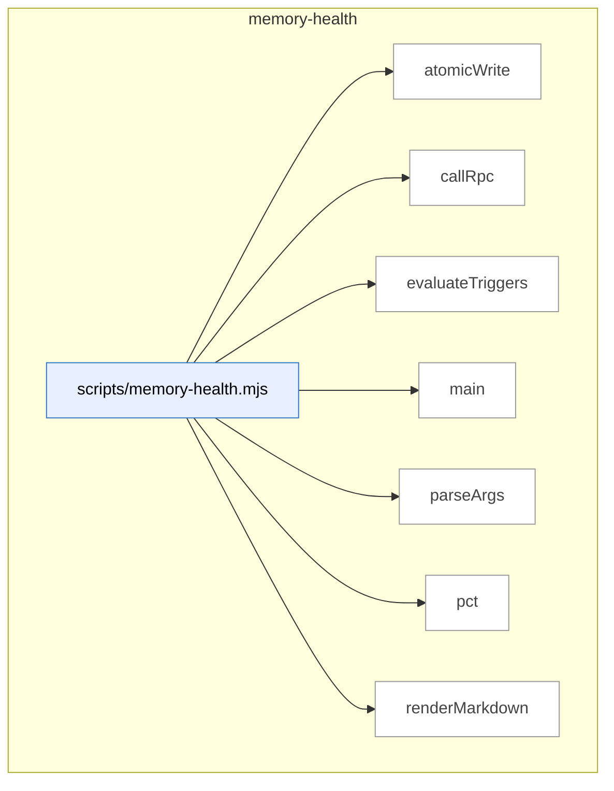

### Symbols in this domain

| Symbol | Kind | Path | Lines | Purpose | File imported by |
|---|---|---|---|---|---|
| [`atomicWrite`](../scripts/memory-health.mjs#L193) | function | `scripts/memory-health.mjs` | 193-199 | Atomically writes a file using a temporary file and rename to prevent partial writes. | _(internal)_ |
| [`callRpc`](../scripts/memory-health.mjs#L57) | function | `scripts/memory-health.mjs` | 57-71 | Calls a Supabase RPC function to fetch memory health metrics over a configurable window. | _(internal)_ |
| [`evaluateTriggers`](../scripts/memory-health.mjs#L73) | function | `scripts/memory-health.mjs` | 73-108 | Evaluates three memory-health triggers (fuzzy re-raise rate, cluster density, recurrence) against thresholds. | _(internal)_ |
| [`main`](../scripts/memory-health.mjs#L201) | function | `scripts/memory-health.mjs` | 201-235 | Main entry point: fetches metrics, evaluates triggers, outputs JSON/markdown, and exits with appropriate code. | _(internal)_ |
| [`parseArgs`](../scripts/memory-health.mjs#L37) | function | `scripts/memory-health.mjs` | 37-55 | Parses CLI arguments for memory-health script, supporting --out, --json, and --help flags. | _(internal)_ |
| [`pct`](../scripts/memory-health.mjs#L110) | function | `scripts/memory-health.mjs` | 110-112 | Formats a decimal number as a percentage string with one decimal place. | _(internal)_ |
| [`renderMarkdown`](../scripts/memory-health.mjs#L114) | function | `scripts/memory-health.mjs` | 114-191 | Renders memory-health metrics and evaluation results as a markdown document with tables and status indicators. | _(internal)_ |

---

## plan

> The `plan` domain parses markdown acceptance criteria sections from planning documents, generates content hashes for tracking changes, and scans repository files to extract plan-related keywords and paths for project management workflows.

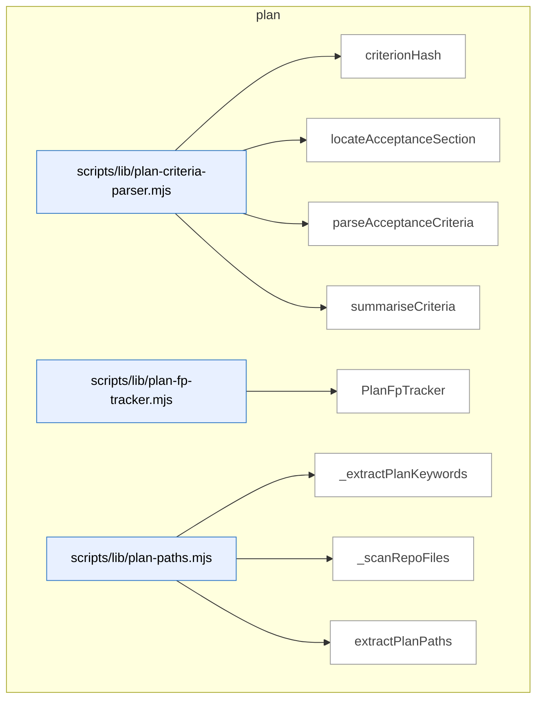

### Symbols in this domain

| Symbol | Kind | Path | Lines | Purpose | File imported by |
|---|---|---|---|---|---|
| [`criterionHash`](../scripts/lib/plan-criteria-parser.mjs#L45) | function | `scripts/lib/plan-criteria-parser.mjs` | 45-48 | Generates a 16-character SHA256-based hash from a criterion's severity, category, and description. | _(internal)_ |
| [`locateAcceptanceSection`](../scripts/lib/plan-criteria-parser.mjs#L56) | function | `scripts/lib/plan-criteria-parser.mjs` | 56-77 | Locates the "Acceptance Criteria" markdown section by heading level, returning start index and content lines. | _(internal)_ |
| [`parseAcceptanceCriteria`](../scripts/lib/plan-criteria-parser.mjs#L96) | function | `scripts/lib/plan-criteria-parser.mjs` | 96-152 | <no body> | _(internal)_ |
| [`summariseCriteria`](../scripts/lib/plan-criteria-parser.mjs#L158) | function | `scripts/lib/plan-criteria-parser.mjs` | 158-166 | Summarizes parsed criteria by counting total, severity distribution, and category distribution. | _(internal)_ |
| [`PlanFpTracker`](../scripts/lib/plan-fp-tracker.mjs#L26) | class | `scripts/lib/plan-fp-tracker.mjs` | 26-140 | <no body> | `scripts/openai-audit.mjs`, `scripts/write-plan-outcomes.mjs` |
| [`_extractPlanKeywords`](../scripts/lib/plan-paths.mjs#L101) | function | `scripts/lib/plan-paths.mjs` | 101-143 | <no body> | `scripts/lib/file-io.mjs` |
| [`_scanRepoFiles`](../scripts/lib/plan-paths.mjs#L145) | function | `scripts/lib/plan-paths.mjs` | 145-171 | Recursively walks the repository directory tree, collecting code files while skipping common build and dependency directories. | `scripts/lib/file-io.mjs` |
| [`extractPlanPaths`](../scripts/lib/plan-paths.mjs#L22) | function | `scripts/lib/plan-paths.mjs` | 22-97 | <no body> | `scripts/lib/file-io.mjs` |

---

## root-scripts

> Automates initial setup and installation by cloning the repository, validating prerequisites, configuring API keys and databases, and installing skills globally.

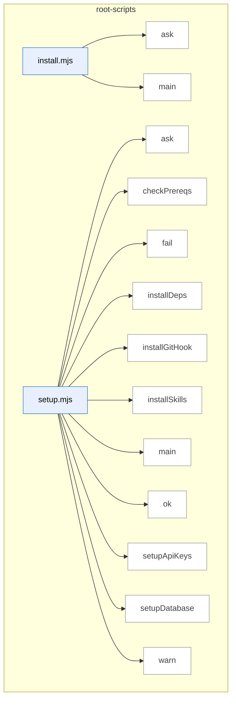

### Symbols in this domain

| Symbol | Kind | Path | Lines | Purpose | File imported by |
|---|---|---|---|---|---|
| [`ask`](../install.mjs#L18) | function | `install.mjs` | 18-18 | Prompts the user for input and returns a promise resolving to their answer. | _(internal)_ |
| [`main`](../install.mjs#L37) | function | `install.mjs` | 37-238 | Orchestrates installation by cloning the repository, copying scripts and skills, installing dependencies, and validating the setup. | _(internal)_ |
| [`ask`](../setup.mjs#L25) | function | `setup.mjs` | 25-25 | Prompts user with a question and returns promise resolving to their input. | _(internal)_ |
| [`checkPrereqs`](../setup.mjs#L34) | function | `setup.mjs` | 34-43 | Checks Node.js version is 18+ and npm is available. | _(internal)_ |
| [`fail`](../setup.mjs#L30) | function | `setup.mjs` | 30-30 | Logs an error message with red X symbol. | _(internal)_ |
| [`installDeps`](../setup.mjs#L157) | function | `setup.mjs` | 157-164 | Installs npm dependencies with 2-minute timeout. | _(internal)_ |
| [`installGitHook`](../setup.mjs#L168) | function | `setup.mjs` | 168-196 | Creates or updates a git post-merge hook to auto-update skills on pull. | _(internal)_ |
| [`installSkills`](../setup.mjs#L139) | function | `setup.mjs` | 139-153 | Builds manifest and installs skills globally to ~/.claude/skills/ with force flag. | _(internal)_ |
| [`main`](../setup.mjs#L200) | function | `setup.mjs` | 200-263 | Orchestrates full setup workflow: prerequisites, API keys, database, dependencies, skills, and git hook. | _(internal)_ |
| [`ok`](../setup.mjs#L28) | function | `setup.mjs` | 28-28 | Logs a success message with green checkmark. | _(internal)_ |
| [`setupApiKeys`](../setup.mjs#L53) | function | `setup.mjs` | 53-80 | Prompts user to configure API keys in .env file, marking required vs optional. | _(internal)_ |
| [`setupDatabase`](../setup.mjs#L91) | function | `setup.mjs` | 91-135 | Guides user through selecting and configuring a learning database backend (in-memory, SQLite, Postgres, or Supabase). | _(internal)_ |
| [`warn`](../setup.mjs#L29) | function | `setup.mjs` | 29-29 | Logs a warning message with yellow warning icon. | _(internal)_ |

---

## scripts

> The `scripts` domain provides CLI utilities for database setup (PostgreSQL, SQLite), schema migrations, GitHub repository configuration for audit event storage, and linting operations with configuration management.

```mermaid
flowchart TB
subgraph dom_scripts ["scripts"]
  file_scripts_claudemd_lint_mjs["scripts/claudemd-lint.mjs"]:::component
  sym_scripts_claudemd_lint_mjs_loadConfig["loadConfig"]:::symbol
  file_scripts_claudemd_lint_mjs --> sym_scripts_claudemd_lint_mjs_loadConfig
  sym_scripts_claudemd_lint_mjs_main["main"]:::symbol
  file_scripts_claudemd_lint_mjs --> sym_scripts_claudemd_lint_mjs_main
  sym_scripts_claudemd_lint_mjs_parseArgs["parseArgs"]:::symbol
  file_scripts_claudemd_lint_mjs --> sym_scripts_claudemd_lint_mjs_parseArgs
  file_scripts_migrate_v3_run_metadata_mjs["scripts/migrate-v3-run-metadata.mjs"]:::component
  sym_scripts_migrate_v3_run_metadata_mjs_run["run"]:::symbol
  file_scripts_migrate_v3_run_metadata_mjs --> sym_scripts_migrate_v3_run_metadata_mjs_run
  file_scripts_phase7_check_mjs["scripts/phase7-check.mjs"]:::component
  sym_scripts_phase7_check_mjs_checkReadiness["checkReadiness"]:::symbol
  file_scripts_phase7_check_mjs --> sym_scripts_phase7_check_mjs_checkReadiness
  file_scripts_setup_github_store_mjs["scripts/setup-github-store.mjs"]:::component
  sym_scripts_setup_github_store_mjs_main["main"]:::symbol
  file_scripts_setup_github_store_mjs --> sym_scripts_setup_github_store_mjs_main
  sym_scripts_setup_github_store_mjs_parseArgs["parseArgs"]:::symbol
  file_scripts_setup_github_store_mjs --> sym_scripts_setup_github_store_mjs_parseArgs
  file_scripts_setup_postgres_mjs["scripts/setup-postgres.mjs"]:::component
  sym_scripts_setup_postgres_mjs_main["main"]:::symbol
  file_scripts_setup_postgres_mjs --> sym_scripts_setup_postgres_mjs_main
  file_scripts_setup_sqlite_mjs["scripts/setup-sqlite.mjs"]:::component
  sym_scripts_setup_sqlite_mjs_main["main"]:::symbol
  file_scripts_setup_sqlite_mjs --> sym_scripts_setup_sqlite_mjs_main
  file_scripts_sync_shared_audit_refs_mjs["scripts/sync-shared-audit-refs.mjs"]:::component
  sym_scripts_sync_shared_audit_refs_mjs_findS["findSyncTargets"]:::symbol
  file_scripts_sync_shared_audit_refs_mjs --> sym_scripts_sync_shared_audit_refs_mjs_findS
  sym_scripts_sync_shared_audit_refs_mjs_main["main"]:::symbol
  file_scripts_sync_shared_audit_refs_mjs --> sym_scripts_sync_shared_audit_refs_mjs_main
  sym_scripts_sync_shared_audit_refs_mjs_sha["sha"]:::symbol
  file_scripts_sync_shared_audit_refs_mjs --> sym_scripts_sync_shared_audit_refs_mjs_sha
  file_scripts_templates_e2e_helpers_auth_js["scripts/templates/e2e-helpers/auth.js"]:::component
  sym_scripts_templates_e2e_helpers_auth_js_lo["loginAsTestUser"]:::symbol
  file_scripts_templates_e2e_helpers_auth_js --> sym_scripts_templates_e2e_helpers_auth_js_lo
  file_scripts_templates_e2e_helpers_axe_js["scripts/templates/e2e-helpers/axe.js"]:::component
  sym_scripts_templates_e2e_helpers_axe_js_exp["expectNoA11yViolations"]:::symbol
  file_scripts_templates_e2e_helpers_axe_js --> sym_scripts_templates_e2e_helpers_axe_js_exp
  file_scripts_write_ledger_r1_mjs["scripts/write-ledger-r1.mjs"]:::component
  sym_scripts_write_ledger_r1_mjs_addEntry["addEntry"]:::symbol
  file_scripts_write_ledger_r1_mjs --> sym_scripts_write_ledger_r1_mjs_addEntry
  file_scripts_write_plan_outcomes_mjs["scripts/write-plan-outcomes.mjs"]:::component
  sym_scripts_write_plan_outcomes_mjs_main["main"]:::symbol
  file_scripts_write_plan_outcomes_mjs --> sym_scripts_write_plan_outcomes_mjs_main
  sym_scripts_write_plan_outcomes_mjs_parseArg["parseArgs"]:::symbol
  file_scripts_write_plan_outcomes_mjs --> sym_scripts_write_plan_outcomes_mjs_parseArg
end
classDef container fill:#f5f5f5,stroke:#333,stroke-width:2px,color:#000
classDef component fill:#e8f0ff,stroke:#3178c6,color:#000
classDef symbol fill:#fff,stroke:#999,color:#444
classDef dup fill:#ffe8d8,stroke:#c0392b,stroke-width:2px,color:#000
classDef violation fill:#ffd6d6,stroke:#c0392b,stroke-width:2px,color:#000
```

### Symbols in this domain

| Symbol | Kind | Path | Lines | Purpose | File imported by |
|---|---|---|---|---|---|
| [`loadConfig`](../scripts/claudemd-lint.mjs#L48) | function | `scripts/claudemd-lint.mjs` | 48-66 | Loads linting configuration from specified path or default .claudemd-lint.json, returning empty object if neither exists or on parse error. | _(internal)_ |
| [`main`](../scripts/claudemd-lint.mjs#L68) | function | `scripts/claudemd-lint.mjs` | 68-172 | <no body> | _(internal)_ |
| [`parseArgs`](../scripts/claudemd-lint.mjs#L26) | function | `scripts/claudemd-lint.mjs` | 26-46 | Parses command-line arguments for format, output file, config path, fix mode, and yes-to-all flag. | _(internal)_ |
| [`run`](../scripts/migrate-v3-run-metadata.mjs#L66) | function | `scripts/migrate-v3-run-metadata.mjs` | 66-84 | Connects to PostgreSQL and applies database schema migrations, exiting with error code if any fail. | _(internal)_ |
| [`checkReadiness`](../scripts/phase7-check.mjs#L12) | function | `scripts/phase7-check.mjs` | 12-64 | Counts unique audit runs from outcome timestamps (5-min gaps indicate new runs) and displays Phase 7 readiness progress toward ML-based pass selection. | _(internal)_ |
| [`main`](../scripts/setup-github-store.mjs#L26) | function | `scripts/setup-github-store.mjs` | 26-101 | Sets up a GitHub repository with an orphan branch to store audit events as JSON files, creating initial schema file. | _(internal)_ |
| [`parseArgs`](../scripts/setup-github-store.mjs#L13) | function | `scripts/setup-github-store.mjs` | 13-24 | Parses command-line arguments for owner, repo, branch, and token with defaults for GitHub store setup. | _(internal)_ |
| [`main`](../scripts/setup-postgres.mjs#L17) | function | `scripts/setup-postgres.mjs` | 17-79 | Connects to PostgreSQL, creates schema and applies SQL migrations from schema directory with template expansion for dialect. | _(internal)_ |
| [`main`](../scripts/setup-sqlite.mjs#L16) | function | `scripts/setup-sqlite.mjs` | 16-70 | Connects to SQLite database with WAL mode and foreign keys, applies schema migrations from directory with template expansion. | _(internal)_ |
| [`findSyncTargets`](../scripts/sync-shared-audit-refs.mjs#L71) | function | `scripts/sync-shared-audit-refs.mjs` | 71-115 | Finds canonical and target file pairs for syncing shared audit references across skills. | _(internal)_ |
| [`main`](../scripts/sync-shared-audit-refs.mjs#L117) | function | `scripts/sync-shared-audit-refs.mjs` | 117-166 | Syncs canonical audit references to skill directories, reporting changes or drift in check mode. | _(internal)_ |
| [`sha`](../scripts/sync-shared-audit-refs.mjs#L39) | function | `scripts/sync-shared-audit-refs.mjs` | 39-41 | Returns first 12 characters of SHA256 hash of a buffer. | _(internal)_ |
| [`loginAsTestUser`](../scripts/templates/e2e-helpers/auth.js#L16) | function | `scripts/templates/e2e-helpers/auth.js` | 16-28 | Injects authentication token and cellar ID into browser localStorage for test login. | _(internal)_ |
| [`expectNoA11yViolations`](../scripts/templates/e2e-helpers/axe.js#L18) | function | `scripts/templates/e2e-helpers/axe.js` | 18-40 | Runs axe-core accessibility audit and throws if WCAG violations are found. | _(internal)_ |
| [`addEntry`](../scripts/write-ledger-r1.mjs#L6) | function | `scripts/write-ledger-r1.mjs` | 6-25 | Records a security finding in the audit ledger with outcome and remediation metadata. | _(internal)_ |
| [`main`](../scripts/write-plan-outcomes.mjs#L28) | function | `scripts/write-plan-outcomes.mjs` | 28-78 | Reads result JSON, applies outcome actions (dismiss/fix/defer/rebut) to findings, and records them in tracker. | _(internal)_ |
| [`parseArgs`](../scripts/write-plan-outcomes.mjs#L19) | function | `scripts/write-plan-outcomes.mjs` | 19-26 | Parses command-line arguments for `--result` and `--outcomes` file paths. | _(internal)_ |

---

## shared-lib

> The `shared-lib` domain generates architecture documentation by rendering Markdown reports with Mermaid diagrams, symbol tables, and dependency metadata—escaping special characters and formatting symbols grouped by domain for readability.

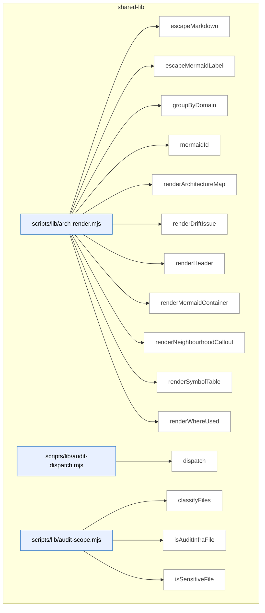

_Domain has 235 symbols (>50). Diagram shows top-15 by file order; see flat table below for the full list._

### Symbols in this domain

| Symbol | Kind | Path | Lines | Purpose | File imported by |
|---|---|---|---|---|---|
| [`escapeMarkdown`](../scripts/lib/arch-render.mjs#L22) | function | `scripts/lib/arch-render.mjs` | 22-28 | Escapes special Markdown characters (pipe, newline) in text. | `scripts/symbol-index/drift.mjs`, `scripts/symbol-index/render-mermaid.mjs` |
| [`escapeMermaidLabel`](../scripts/lib/arch-render.mjs#L31) | function | `scripts/lib/arch-render.mjs` | 31-37 | Escapes special Mermaid characters (quotes, angle brackets) and truncates to 60 characters. | `scripts/symbol-index/drift.mjs`, `scripts/symbol-index/render-mermaid.mjs` |
| [`groupByDomain`](../scripts/lib/arch-render.mjs#L45) | function | `scripts/lib/arch-render.mjs` | 45-63 | Groups symbols by domain tag, sorts domains alphabetically and symbols by file path then name. | `scripts/symbol-index/drift.mjs`, `scripts/symbol-index/render-mermaid.mjs` |
| [`mermaidId`](../scripts/lib/arch-render.mjs#L40) | function | `scripts/lib/arch-render.mjs` | 40-42 | Converts a key to a safe Mermaid node identifier with prefix. | `scripts/symbol-index/drift.mjs`, `scripts/symbol-index/render-mermaid.mjs` |
| [`renderArchitectureMap`](../scripts/lib/arch-render.mjs#L171) | function | `scripts/lib/arch-render.mjs` | 171-286 | Generates a markdown architecture document with domain-grouped symbols, a table of contents, per-domain diagrams and symbol tables, and optional truncation warnings. | `scripts/symbol-index/drift.mjs`, `scripts/symbol-index/render-mermaid.mjs` |
| [`renderDriftIssue`](../scripts/lib/arch-render.mjs#L360) | function | `scripts/lib/arch-render.mjs` | 360-422 | Produces a markdown drift report listing top duplication clusters with member symbols, paths, and similarity scores, plus a collapsible tail of lower-priority items. | `scripts/symbol-index/drift.mjs`, `scripts/symbol-index/render-mermaid.mjs` |
| [`renderHeader`](../scripts/lib/arch-render.mjs#L157) | function | `scripts/lib/arch-render.mjs` | 157-168 | Generates the header section of an architecture map report with metadata and statistics. | `scripts/symbol-index/drift.mjs`, `scripts/symbol-index/render-mermaid.mjs` |
| [`renderMermaidContainer`](../scripts/lib/arch-render.mjs#L69) | function | `scripts/lib/arch-render.mjs` | 69-103 | Renders a Mermaid flowchart subgraph for a domain with up to 15 symbols, marking duplicates. | `scripts/symbol-index/drift.mjs`, `scripts/symbol-index/render-mermaid.mjs` |
| [`renderNeighbourhoodCallout`](../scripts/lib/arch-render.mjs#L289) | function | `scripts/lib/arch-render.mjs` | 289-357 | Renders a callout section describing neighbourhood similarity search results, including status (offline/error/no-matches/found), candidate rankings, and recommendations. | `scripts/symbol-index/drift.mjs`, `scripts/symbol-index/render-mermaid.mjs` |
| [`renderSymbolTable`](../scripts/lib/arch-render.mjs#L114) | function | `scripts/lib/arch-render.mjs` | 114-138 | Renders a Markdown table of symbols with kind, path, lines, purpose, and optional "where used" column. | `scripts/symbol-index/drift.mjs`, `scripts/symbol-index/render-mermaid.mjs` |
| [`renderWhereUsed`](../scripts/lib/arch-render.mjs#L140) | function | `scripts/lib/arch-render.mjs` | 140-154 | Formats a list of file importers for a given file with truncation at 3 items. | `scripts/symbol-index/drift.mjs`, `scripts/symbol-index/render-mermaid.mjs` |
| [`dispatch`](../scripts/lib/audit-dispatch.mjs#L26) | function | `scripts/lib/audit-dispatch.mjs` | 26-48 | Parses user input to dispatch audit tasks—recognizes mode keywords (plan/code/full), file paths to existing .md files, or free-form task descriptions. | _(internal)_ |
| [`classifyFiles`](../scripts/lib/audit-scope.mjs#L149) | function | `scripts/lib/audit-scope.mjs` | 149-168 | Classifies file paths into backend, frontend, or shared categories using pattern matching against common directory structures. | `scripts/lib/diff-annotation.mjs`, `scripts/lib/file-io.mjs`, `scripts/lib/plan-paths.mjs` |
| [`isAuditInfraFile`](../scripts/lib/audit-scope.mjs#L62) | function | `scripts/lib/audit-scope.mjs` | 62-69 | Identifies audit infrastructure files by checking if a path is directly under scripts/ or scripts/lib/ and has a whitelisted basename. | `scripts/lib/diff-annotation.mjs`, `scripts/lib/file-io.mjs`, `scripts/lib/plan-paths.mjs` |
| [`isSensitiveFile`](../scripts/lib/audit-scope.mjs#L22) | function | `scripts/lib/audit-scope.mjs` | 22-25 | Checks if a relative file path matches sensitive file patterns (env files, secrets, keys). | `scripts/lib/diff-annotation.mjs`, `scripts/lib/file-io.mjs`, `scripts/lib/plan-paths.mjs` |
| [`readFilesAsContext`](../scripts/lib/audit-scope.mjs#L112) | function | `scripts/lib/audit-scope.mjs` | 112-140 | Batches multiple file reads into a single markdown context block, respecting per-file and total size budgets, and tracking omitted and sensitive files. | `scripts/lib/diff-annotation.mjs`, `scripts/lib/file-io.mjs`, `scripts/lib/plan-paths.mjs` |
| [`safeReadFile`](../scripts/lib/audit-scope.mjs#L84) | function | `scripts/lib/audit-scope.mjs` | 84-98 | Safely reads a file while enforcing repo boundaries, size limits, and filtering sensitive files, returning content or null on failure. | `scripts/lib/diff-annotation.mjs`, `scripts/lib/file-io.mjs`, `scripts/lib/plan-paths.mjs` |
| [`buildRecord`](../scripts/lib/backfill-parser.mjs#L178) | function | `scripts/lib/backfill-parser.mjs` | 178-204 | Builds a structured audit finding record with inferred file paths, suggested topic ID hash, and confidence scores for each parsed field. | `scripts/debt-backfill.mjs` |
| [`extractFilesFromText`](../scripts/lib/backfill-parser.mjs#L65) | function | `scripts/lib/backfill-parser.mjs` | 65-78 | Extracts file paths from backtick-quoted text, filtering out bare identifiers to reduce noise. | `scripts/debt-backfill.mjs` |
| [`extractPhaseTag`](../scripts/lib/backfill-parser.mjs#L86) | function | `scripts/lib/backfill-parser.mjs` | 86-92 | Extracts a phase tag from audit summary filenames (e.g., "phase-a" or falls back to stem before "-audit-summary"). | `scripts/debt-backfill.mjs` |
| [`parseSummaryContent`](../scripts/lib/backfill-parser.mjs#L120) | function | `scripts/lib/backfill-parser.mjs` | 120-176 | Parses audit summary markdown content to extract deferred-section findings in bullet or table format, yielding records with finding IDs and severity. | `scripts/debt-backfill.mjs` |
| [`parseSummaryFile`](../scripts/lib/backfill-parser.mjs#L105) | function | `scripts/lib/backfill-parser.mjs` | 105-111 | Reads and parses a single audit summary file, delegating content parsing to a shared handler. | `scripts/debt-backfill.mjs` |
| [`parseSummaryFiles`](../scripts/lib/backfill-parser.mjs#L211) | function | `scripts/lib/backfill-parser.mjs` | 211-220 | Batch-parses multiple audit summary files and aggregates their findings into a single record list with per-file diagnostics. | `scripts/debt-backfill.mjs` |
| [`severityFromPrefix`](../scripts/lib/backfill-parser.mjs#L49) | function | `scripts/lib/backfill-parser.mjs` | 49-57 | Maps single-letter severity prefixes (H/M/L/T) to standardized severity levels for audit findings. | `scripts/debt-backfill.mjs` |
| [`fetch`](../scripts/lib/bootstrap-template.mjs#L28) | function | `scripts/lib/bootstrap-template.mjs` | 28-41 | Fetches content from an HTTPS URL with redirect support and error handling. | _(internal)_ |
| [`fetchAndCache`](../scripts/lib/bootstrap-template.mjs#L51) | function | `scripts/lib/bootstrap-template.mjs` | 51-58 | Fetches a script from a remote URL and caches it locally under a sanitized filename. | _(internal)_ |
| [`getCached`](../scripts/lib/bootstrap-template.mjs#L43) | function | `scripts/lib/bootstrap-template.mjs` | 43-49 | Checks if a cached script exists and is fresh (within TTL), returning the path or null. | _(internal)_ |
| [`main`](../scripts/lib/bootstrap-template.mjs#L60) | function | `scripts/lib/bootstrap-template.mjs` | 60-110 | CLI entry point for bootstrap tool—handles install/check/version/help commands, using cache when available and spawning remote scripts with pass-through arguments. | _(internal)_ |
| [`buildAuditUnits`](../scripts/lib/code-analysis.mjs#L201) | function | `scripts/lib/code-analysis.mjs` | 201-239 | Packs files into audit units respecting token and file count limits. | `scripts/openai-audit.mjs`, `scripts/shared.mjs` |
| [`buildDependencyGraph`](../scripts/lib/code-analysis.mjs#L161) | function | `scripts/lib/code-analysis.mjs` | 161-188 | Maps file dependencies by parsing imports and resolving paths. | `scripts/openai-audit.mjs`, `scripts/shared.mjs` |
| [`chunkLargeFile`](../scripts/lib/code-analysis.mjs#L98) | function | `scripts/lib/code-analysis.mjs` | 98-132 | Divides large files into token-bounded chunks with imports preserved. | `scripts/openai-audit.mjs`, `scripts/shared.mjs` |
| [`estimateTokens`](../scripts/lib/code-analysis.mjs#L32) | function | `scripts/lib/code-analysis.mjs` | 32-34 | Estimates token count from text length using a 4-character-per-token ratio. | `scripts/openai-audit.mjs`, `scripts/shared.mjs` |
| [`extractExportsOnly`](../scripts/lib/code-analysis.mjs#L142) | function | `scripts/lib/code-analysis.mjs` | 142-151 | Extracts only export declarations from a file in a language-specific manner. | `scripts/openai-audit.mjs`, `scripts/shared.mjs` |
| [`extractImportBlock`](../scripts/lib/code-analysis.mjs#L46) | function | `scripts/lib/code-analysis.mjs` | 46-57 | Extracts imports from source code up to the first function boundary. | `scripts/openai-audit.mjs`, `scripts/shared.mjs` |
| [`measureContextChars`](../scripts/lib/code-analysis.mjs#L272) | function | `scripts/lib/code-analysis.mjs` | 272-282 | Sums up character counts across files capped by a per-file maximum. | `scripts/openai-audit.mjs`, `scripts/shared.mjs` |
| [`splitAtFunctionBoundaries`](../scripts/lib/code-analysis.mjs#L66) | function | `scripts/lib/code-analysis.mjs` | 66-84 | Splits source code into chunks at function boundaries with line numbers. | `scripts/openai-audit.mjs`, `scripts/shared.mjs` |
| [`discoverDotenv`](../scripts/lib/config.mjs#L21) | function | `scripts/lib/config.mjs` | 21-55 | Searches for .env file in parent directories and git repository root. | `scripts/bandit.mjs`, `scripts/debt-review.mjs`, `scripts/evolve-prompts.mjs`, +19 more |
| [`normalizeLanguage`](../scripts/lib/config.mjs#L148) | function | `scripts/lib/config.mjs` | 148-161 | Normalizes programming language names to canonical short forms. | `scripts/bandit.mjs`, `scripts/debt-review.mjs`, `scripts/evolve-prompts.mjs`, +19 more |
| [`validatedEnum`](../scripts/lib/config.mjs#L66) | function | `scripts/lib/config.mjs` | 66-73 | Validates environment variable against allowed values with fallback. | `scripts/bandit.mjs`, `scripts/debt-review.mjs`, `scripts/evolve-prompts.mjs`, +19 more |
| [`_extractRegexFacts`](../scripts/lib/context.mjs#L89) | function | `scripts/lib/context.mjs` | 89-136 | <no body> | `scripts/check-sync.mjs`, `scripts/debt-auto-capture.mjs`, `scripts/debt-resolve.mjs`, +3 more |
| [`_getClaudeMd`](../scripts/lib/context.mjs#L58) | function | `scripts/lib/context.mjs` | 58-69 | Reads CLAUDE.md or alternates from disk with caching. | `scripts/check-sync.mjs`, `scripts/debt-auto-capture.mjs`, `scripts/debt-resolve.mjs`, +3 more |
| [`_getClaudeMdPath`](../scripts/lib/context.mjs#L75) | function | `scripts/lib/context.mjs` | 75-81 | Locates CLAUDE.md or alternate instruction file path. | `scripts/check-sync.mjs`, `scripts/debt-auto-capture.mjs`, `scripts/debt-resolve.mjs`, +3 more |
| [`_getPassAddendum`](../scripts/lib/context.mjs#L247) | function | `scripts/lib/context.mjs` | 247-261 | Extracts relevant sections from CLAUDE.md for a specific audit pass. | `scripts/check-sync.mjs`, `scripts/debt-auto-capture.mjs`, `scripts/debt-resolve.mjs`, +3 more |
| [`_llmCondense`](../scripts/lib/context.mjs#L175) | function | `scripts/lib/context.mjs` | 175-226 | Calls Claude Haiku or Gemini Flash to condense guidelines into an audit brief. | `scripts/check-sync.mjs`, `scripts/debt-auto-capture.mjs`, `scripts/debt-resolve.mjs`, +3 more |
| [`_quickFingerprint`](../scripts/lib/context.mjs#L330) | function | `scripts/lib/context.mjs` | 330-340 | Computes lightweight SHA256 fingerprint of package.json and instruction file. | `scripts/check-sync.mjs`, `scripts/debt-auto-capture.mjs`, `scripts/debt-resolve.mjs`, +3 more |
| [`buildHistoryContext`](../scripts/lib/context.mjs#L637) | function | `scripts/lib/context.mjs` | 637-683 | <no body> | `scripts/check-sync.mjs`, `scripts/debt-auto-capture.mjs`, `scripts/debt-resolve.mjs`, +3 more |
| [`extractPlanForPass`](../scripts/lib/context.mjs#L606) | function | `scripts/lib/context.mjs` | 606-630 | Extracts pass-relevant sections from plan content. | `scripts/check-sync.mjs`, `scripts/debt-auto-capture.mjs`, `scripts/debt-resolve.mjs`, +3 more |
| [`generateRepoProfile`](../scripts/lib/context.mjs#L350) | function | `scripts/lib/context.mjs` | 350-469 | <no body> | `scripts/check-sync.mjs`, `scripts/debt-auto-capture.mjs`, `scripts/debt-resolve.mjs`, +3 more |
| [`getAuditBriefCache`](../scripts/lib/context.mjs#L27) | function | `scripts/lib/context.mjs` | 27-29 | Returns the cached audit brief string. | `scripts/check-sync.mjs`, `scripts/debt-auto-capture.mjs`, `scripts/debt-resolve.mjs`, +3 more |
| [`getClaudeMdCache`](../scripts/lib/context.mjs#L32) | function | `scripts/lib/context.mjs` | 32-34 | Returns the cached CLAUDE.md file content. | `scripts/check-sync.mjs`, `scripts/debt-auto-capture.mjs`, `scripts/debt-resolve.mjs`, +3 more |
| [`getRepoProfileCache`](../scripts/lib/context.mjs#L22) | function | `scripts/lib/context.mjs` | 22-24 | Returns the cached repository profile object. | `scripts/check-sync.mjs`, `scripts/debt-auto-capture.mjs`, `scripts/debt-resolve.mjs`, +3 more |
| [`initAuditBrief`](../scripts/lib/context.mjs#L479) | function | `scripts/lib/context.mjs` | 479-509 | Generates or assembles an audit brief from project instructions. | `scripts/check-sync.mjs`, `scripts/debt-auto-capture.mjs`, `scripts/debt-resolve.mjs`, +3 more |
| [`loadKnownFpContext`](../scripts/lib/context.mjs#L558) | function | `scripts/lib/context.mjs` | 558-591 | Loads known false-positive patterns from JSON file for a given pass. | `scripts/check-sync.mjs`, `scripts/debt-auto-capture.mjs`, `scripts/debt-resolve.mjs`, +3 more |
| [`loadSessionCache`](../scripts/lib/context.mjs#L275) | function | `scripts/lib/context.mjs` | 275-301 | Loads session cache from disk if fingerprint matches current repo state. | `scripts/check-sync.mjs`, `scripts/debt-auto-capture.mjs`, `scripts/debt-resolve.mjs`, +3 more |
| [`readProjectContext`](../scripts/lib/context.mjs#L594) | function | `scripts/lib/context.mjs` | 594-598 | Returns audit brief or raw CLAUDE.md fallback (4000 char limit). | `scripts/check-sync.mjs`, `scripts/debt-auto-capture.mjs`, `scripts/debt-resolve.mjs`, +3 more |
| [`readProjectContextForPass`](../scripts/lib/context.mjs#L518) | function | `scripts/lib/context.mjs` | 518-536 | Reads cached brief with pass-specific context and known false positives. | `scripts/check-sync.mjs`, `scripts/debt-auto-capture.mjs`, `scripts/debt-resolve.mjs`, +3 more |
| [`saveSessionCache`](../scripts/lib/context.mjs#L309) | function | `scripts/lib/context.mjs` | 309-324 | Saves audit brief and repo profile to session cache file. | `scripts/check-sync.mjs`, `scripts/debt-auto-capture.mjs`, `scripts/debt-resolve.mjs`, +3 more |
| [`_annotateBlockStyle`](../scripts/lib/diff-annotation.mjs#L79) | function | `scripts/lib/diff-annotation.mjs` | 79-113 | Annotates source code with markers for changed and unchanged sections using block-style comments. | `scripts/lib/file-io.mjs` |
| [`_annotateHeaderOnlyStyle`](../scripts/lib/diff-annotation.mjs#L115) | function | `scripts/lib/diff-annotation.mjs` | 115-125 | Annotates source code with line numbers and changed line ranges in a header comment. | `scripts/lib/file-io.mjs` |
| [`_buildFileBlock`](../scripts/lib/diff-annotation.mjs#L154) | function | `scripts/lib/diff-annotation.mjs` | 154-178 | Constructs a markdown code block for a single file with optional diff annotations. | `scripts/lib/file-io.mjs` |
| [`getCommentStyle`](../scripts/lib/diff-annotation.mjs#L72) | function | `scripts/lib/diff-annotation.mjs` | 72-77 | Determines comment style (block or header-only) based on file extension. | `scripts/lib/file-io.mjs` |
| [`parseDiffFile`](../scripts/lib/diff-annotation.mjs#L23) | function | `scripts/lib/diff-annotation.mjs` | 23-60 | Parses a unified diff file into a map of file paths with changed line ranges. | `scripts/lib/file-io.mjs` |
| [`readFilesAsAnnotatedContext`](../scripts/lib/diff-annotation.mjs#L138) | function | `scripts/lib/diff-annotation.mjs` | 138-152 | Builds and returns a concatenated context string of annotated file blocks up to size limits. | `scripts/lib/file-io.mjs` |
| [`atomicWriteFileSync`](../scripts/lib/file-io.mjs#L16) | function | `scripts/lib/file-io.mjs` | 16-30 | Atomically writes data to a file using a temporary file and rename to prevent corruption. | `scripts/brainstorm-round.mjs`, `scripts/gemini-review.mjs`, `scripts/lib/code-analysis.mjs`, +20 more |
| [`normalizePath`](../scripts/lib/file-io.mjs#L39) | function | `scripts/lib/file-io.mjs` | 39-43 | Normalizes a file path to lowercase forward-slash format relative to current working directory. | `scripts/brainstorm-round.mjs`, `scripts/gemini-review.mjs`, `scripts/lib/code-analysis.mjs`, +20 more |
| [`readFileOrDie`](../scripts/lib/file-io.mjs#L55) | function | `scripts/lib/file-io.mjs` | 55-62 | Reads a file or terminates the process if the file does not exist. | `scripts/brainstorm-round.mjs`, `scripts/gemini-review.mjs`, `scripts/lib/code-analysis.mjs`, +20 more |
| [`safeInt`](../scripts/lib/file-io.mjs#L48) | function | `scripts/lib/file-io.mjs` | 48-51 | Safely parses an integer from a value with a fallback default. | `scripts/brainstorm-round.mjs`, `scripts/gemini-review.mjs`, `scripts/lib/code-analysis.mjs`, +20 more |
| [`writeOutput`](../scripts/lib/file-io.mjs#L72) | function | `scripts/lib/file-io.mjs` | 72-83 | Writes JSON output to a file or stdout with an optional summary message. | `scripts/brainstorm-round.mjs`, `scripts/gemini-review.mjs`, `scripts/lib/code-analysis.mjs`, +20 more |
| [`_acquireLockSync`](../scripts/lib/file-store.mjs#L38) | function | `scripts/lib/file-store.mjs` | 38-70 | Acquires an exclusive lock via filesystem with stale lock detection and retry logic. | `scripts/bandit.mjs`, `scripts/evolve-prompts.mjs`, `scripts/lib/findings-outcomes.mjs`, +4 more |
| [`_quarantineRecord`](../scripts/lib/file-store.mjs#L18) | function | `scripts/lib/file-store.mjs` | 18-34 | Quarantines corrupted data to a timestamped JSON file for inspection. | `scripts/bandit.mjs`, `scripts/evolve-prompts.mjs`, `scripts/lib/findings-outcomes.mjs`, +4 more |
| [`_releaseLock`](../scripts/lib/file-store.mjs#L72) | function | `scripts/lib/file-store.mjs` | 72-74 | Releases a file lock by deleting the lock file. | `scripts/bandit.mjs`, `scripts/evolve-prompts.mjs`, `scripts/lib/findings-outcomes.mjs`, +4 more |
| [`acquireLock`](../scripts/lib/file-store.mjs#L80) | function | `scripts/lib/file-store.mjs` | 80-82 | Public wrapper that acquires a synchronous lock. | `scripts/bandit.mjs`, `scripts/evolve-prompts.mjs`, `scripts/lib/findings-outcomes.mjs`, +4 more |
| [`AppendOnlyStore`](../scripts/lib/file-store.mjs#L208) | class | `scripts/lib/file-store.mjs` | 208-243 | <no body> | `scripts/bandit.mjs`, `scripts/evolve-prompts.mjs`, `scripts/lib/findings-outcomes.mjs`, +4 more |
| [`MutexFileStore`](../scripts/lib/file-store.mjs#L117) | class | `scripts/lib/file-store.mjs` | 117-200 | <no body> | `scripts/bandit.mjs`, `scripts/evolve-prompts.mjs`, `scripts/lib/findings-outcomes.mjs`, +4 more |
| [`readJsonlFile`](../scripts/lib/file-store.mjs#L94) | function | `scripts/lib/file-store.mjs` | 94-109 | Reads a JSONL file into an array of parsed objects, skipping invalid lines. | `scripts/bandit.mjs`, `scripts/evolve-prompts.mjs`, `scripts/lib/findings-outcomes.mjs`, +4 more |
| [`releaseLock`](../scripts/lib/file-store.mjs#L84) | function | `scripts/lib/file-store.mjs` | 84-86 | Public wrapper that releases a lock. | `scripts/bandit.mjs`, `scripts/evolve-prompts.mjs`, `scripts/lib/findings-outcomes.mjs`, +4 more |
| [`buildFileReferenceRegex`](../scripts/lib/language-profiles.mjs#L302) | function | `scripts/lib/language-profiles.mjs` | 302-308 | Creates a regex pattern that matches file paths in various formats (relative, absolute, with extensions) for extraction from text. | `scripts/lib/code-analysis.mjs`, `scripts/lib/ledger.mjs`, `scripts/lib/linter.mjs`, +3 more |
| [`buildLanguageContext`](../scripts/lib/language-profiles.mjs#L317) | function | `scripts/lib/language-profiles.mjs` | 317-322 | Assembles a context object containing the repository's file set and detected Python package root directories. | `scripts/lib/code-analysis.mjs`, `scripts/lib/ledger.mjs`, `scripts/lib/linter.mjs`, +3 more |
| [`countFilesByLanguage`](../scripts/lib/language-profiles.mjs#L247) | function | `scripts/lib/language-profiles.mjs` | 247-254 | Counts files by language ID based on profile lookup. | `scripts/lib/code-analysis.mjs`, `scripts/lib/ledger.mjs`, `scripts/lib/linter.mjs`, +3 more |
| [`detectDominantLanguage`](../scripts/lib/language-profiles.mjs#L260) | function | `scripts/lib/language-profiles.mjs` | 260-265 | Finds the most common language ID in a file list, excluding unknown. | `scripts/lib/code-analysis.mjs`, `scripts/lib/ledger.mjs`, `scripts/lib/linter.mjs`, +3 more |
| [`detectPythonPackageRoots`](../scripts/lib/language-profiles.mjs#L333) | function | `scripts/lib/language-profiles.mjs` | 333-356 | Identifies Python package root directories by finding parent directories of `__init__.py`/`__init__.pyi` files that are not themselves packages. | `scripts/lib/code-analysis.mjs`, `scripts/lib/ledger.mjs`, `scripts/lib/linter.mjs`, +3 more |
| [`freezeProfile`](../scripts/lib/language-profiles.mjs#L80) | function | `scripts/lib/language-profiles.mjs` | 80-89 | Deep-freezes a language profile object and all its nested structures to prevent accidental mutations. | `scripts/lib/code-analysis.mjs`, `scripts/lib/ledger.mjs`, `scripts/lib/linter.mjs`, +3 more |
| [`getAllProfiles`](../scripts/lib/language-profiles.mjs#L228) | function | `scripts/lib/language-profiles.mjs` | 228-230 | Returns all language profile definitions. | `scripts/lib/code-analysis.mjs`, `scripts/lib/ledger.mjs`, `scripts/lib/linter.mjs`, +3 more |
| [`getProfile`](../scripts/lib/language-profiles.mjs#L232) | function | `scripts/lib/language-profiles.mjs` | 232-234 | Returns the language profile for a given language ID or unknown profile. | `scripts/lib/code-analysis.mjs`, `scripts/lib/ledger.mjs`, `scripts/lib/linter.mjs`, +3 more |
| [`getProfileForFile`](../scripts/lib/language-profiles.mjs#L236) | function | `scripts/lib/language-profiles.mjs` | 236-242 | Looks up language profile by file extension. | `scripts/lib/code-analysis.mjs`, `scripts/lib/ledger.mjs`, `scripts/lib/linter.mjs`, +3 more |
| [`jsResolveImport`](../scripts/lib/language-profiles.mjs#L367) | function | `scripts/lib/language-profiles.mjs` | 367-389 | Resolves relative JavaScript imports by trying candidate paths with language-aware extension ordering (TypeScript-first or JavaScript-first). | `scripts/lib/code-analysis.mjs`, `scripts/lib/ledger.mjs`, `scripts/lib/linter.mjs`, +3 more |
| [`makeRegexBoundaries`](../scripts/lib/language-profiles.mjs#L40) | function | `scripts/lib/language-profiles.mjs` | 40-48 | Creates a boundary detector that finds line indices matching a regex pattern. | `scripts/lib/code-analysis.mjs`, `scripts/lib/ledger.mjs`, `scripts/lib/linter.mjs`, +3 more |
| [`pyResolveImport`](../scripts/lib/language-profiles.mjs#L402) | function | `scripts/lib/language-profiles.mjs` | 402-457 | <no body> | `scripts/lib/code-analysis.mjs`, `scripts/lib/ledger.mjs`, `scripts/lib/linter.mjs`, +3 more |
| [`pythonBoundaryScanner`](../scripts/lib/language-profiles.mjs#L56) | function | `scripts/lib/language-profiles.mjs` | 56-76 | Scans Python code to identify function/class boundaries, grouping decorators with their definitions. | `scripts/lib/code-analysis.mjs`, `scripts/lib/ledger.mjs`, `scripts/lib/linter.mjs`, +3 more |
| [`batchWriteLedger`](../scripts/lib/ledger.mjs#L181) | function | `scripts/lib/ledger.mjs` | 181-205 | Batch-writes multiple entries to a ledger file, tracking insertion/update counts and rejections. | `scripts/gemini-review.mjs`, `scripts/lib/outcome-sync.mjs`, `scripts/lib/plan-fp-tracker.mjs`, +2 more |
| [`buildR2SystemPrompt`](../scripts/lib/ledger.mjs#L486) | function | `scripts/lib/ledger.mjs` | 486-488 | Combines round modifier, prior rulings, and pass rubric into a unified system prompt for R2 deliberation. | `scripts/gemini-review.mjs`, `scripts/lib/outcome-sync.mjs`, `scripts/lib/plan-fp-tracker.mjs`, +2 more |
| [`buildRulingsBlock`](../scripts/lib/ledger.mjs#L391) | function | `scripts/lib/ledger.mjs` | 391-456 | Builds a formatted markdown block summarizing prior rulings (dismissed, adjusted, fixed findings) from the ledger scoped to the current pass. | `scripts/gemini-review.mjs`, `scripts/lib/outcome-sync.mjs`, `scripts/lib/plan-fp-tracker.mjs`, +2 more |
| [`computeImpactSet`](../scripts/lib/ledger.mjs#L498) | function | `scripts/lib/ledger.mjs` | 498-520 | Computes the set of files transitively affected by changes by detecting import relationships. | `scripts/gemini-review.mjs`, `scripts/lib/outcome-sync.mjs`, `scripts/lib/plan-fp-tracker.mjs`, +2 more |
| [`generateTopicId`](../scripts/lib/ledger.mjs#L30) | function | `scripts/lib/ledger.mjs` | 30-40 | Generates a deterministic 12-character hex ID for a finding based on its file, principle, category, pass, and semantic hash. | `scripts/gemini-review.mjs`, `scripts/lib/outcome-sync.mjs`, `scripts/lib/plan-fp-tracker.mjs`, +2 more |
| [`getFileRegex`](../scripts/lib/ledger.mjs#L21) | function | `scripts/lib/ledger.mjs` | 21-21 | Returns the file reference regex for extracting file paths from finding descriptions. | `scripts/gemini-review.mjs`, `scripts/lib/outcome-sync.mjs`, `scripts/lib/plan-fp-tracker.mjs`, +2 more |
| [`jaccardSimilarity`](../scripts/lib/ledger.mjs#L243) | function | `scripts/lib/ledger.mjs` | 243-251 | Computes Jaccard similarity between two strings by tokenizing and comparing intersection over union. | `scripts/gemini-review.mjs`, `scripts/lib/outcome-sync.mjs`, `scripts/lib/plan-fp-tracker.mjs`, +2 more |
| [`mergeMetaLocked`](../scripts/lib/ledger.mjs#L160) | function | `scripts/lib/ledger.mjs` | 160-179 | Acquires a file lock, merges metadata into a ledger file, and releases the lock. | `scripts/gemini-review.mjs`, `scripts/lib/outcome-sync.mjs`, `scripts/lib/plan-fp-tracker.mjs`, +2 more |
| [`populateFindingMetadata`](../scripts/lib/ledger.mjs#L215) | function | `scripts/lib/ledger.mjs` | 215-233 | Extracts file paths from a finding's section using regex and populates derived metadata fields. | `scripts/gemini-review.mjs`, `scripts/lib/outcome-sync.mjs`, `scripts/lib/plan-fp-tracker.mjs`, +2 more |
| [`readLedgerJson`](../scripts/lib/ledger.mjs#L118) | function | `scripts/lib/ledger.mjs` | 118-130 | Reads and parses a ledger JSON file, returning an empty ledger if the file doesn't exist. | `scripts/gemini-review.mjs`, `scripts/lib/outcome-sync.mjs`, `scripts/lib/plan-fp-tracker.mjs`, +2 more |
| [`suppressReRaises`](../scripts/lib/ledger.mjs#L262) | function | `scripts/lib/ledger.mjs` | 262-380 | <no body> | `scripts/gemini-review.mjs`, `scripts/lib/outcome-sync.mjs`, `scripts/lib/plan-fp-tracker.mjs`, +2 more |
| [`upsertEntry`](../scripts/lib/ledger.mjs#L133) | function | `scripts/lib/ledger.mjs` | 133-157 | Validates and upserts a batch entry into an in-memory ledger map, tracking first/last seen rounds. | `scripts/gemini-review.mjs`, `scripts/lib/outcome-sync.mjs`, `scripts/lib/plan-fp-tracker.mjs`, +2 more |
| [`writeLedgerEntry`](../scripts/lib/ledger.mjs#L47) | function | `scripts/lib/ledger.mjs` | 47-93 | Validates and upserts a ledger entry into persistent storage, backing up the file if corrupted. | `scripts/gemini-review.mjs`, `scripts/lib/outcome-sync.mjs`, `scripts/lib/plan-fp-tracker.mjs`, +2 more |
| [`computeMaxBuffer`](../scripts/lib/linter.mjs#L56) | function | `scripts/lib/linter.mjs` | 56-58 | Scales tool output buffer size based on number of audited files. | `scripts/openai-audit.mjs`, `scripts/shared.mjs` |
| [`executeTools`](../scripts/lib/linter.mjs#L156) | function | `scripts/lib/linter.mjs` | 156-174 | Groups tools by ID across all files and executes each tool once on its associated file set. | `scripts/openai-audit.mjs`, `scripts/shared.mjs` |
| [`formatLintSummary`](../scripts/lib/linter.mjs#L324) | function | `scripts/lib/linter.mjs` | 324-358 | Formats linter findings into a concise markdown block, either listing all findings or summarizing by rule count. | `scripts/openai-audit.mjs`, `scripts/shared.mjs` |
| [`isToolAvailable`](../scripts/lib/linter.mjs#L77) | function | `scripts/lib/linter.mjs` | 77-84 | Tests if a tool is available by attempting to run its availability probe command. | `scripts/openai-audit.mjs`, `scripts/shared.mjs` |
| [`normalizeExternalFinding`](../scripts/lib/linter.mjs#L272) | function | `scripts/lib/linter.mjs` | 272-294 | Converts a raw tool finding into a normalized finding object with severity, category, risk, and metadata. | `scripts/openai-audit.mjs`, `scripts/shared.mjs` |
| [`normalizeToolResults`](../scripts/lib/linter.mjs#L301) | function | `scripts/lib/linter.mjs` | 301-311 | Filters tool results by status and flattens raw findings into normalized findings with auto-indexing. | `scripts/openai-audit.mjs`, `scripts/shared.mjs` |
| [`parseEslintOutput`](../scripts/lib/linter.mjs#L178) | function | `scripts/lib/linter.mjs` | 178-205 | Parses ESLint JSON output into normalized findings, treating fatal parse errors as a distinct rule. | `scripts/openai-audit.mjs`, `scripts/shared.mjs` |
| [`parseFlake8PylintOutput`](../scripts/lib/linter.mjs#L239) | function | `scripts/lib/linter.mjs` | 239-254 | Parses Pylint/Flake8 output using regex to extract file, line, rule code, and message. | `scripts/openai-audit.mjs`, `scripts/shared.mjs` |
| [`parseRuffOutput`](../scripts/lib/linter.mjs#L207) | function | `scripts/lib/linter.mjs` | 207-219 | Parses Ruff JSON output into normalized findings with file paths and error codes. | `scripts/openai-audit.mjs`, `scripts/shared.mjs` |
| [`parseTscOutput`](../scripts/lib/linter.mjs#L221) | function | `scripts/lib/linter.mjs` | 221-237 | Parses TypeScript compiler output (non-pretty format) using regex to extract file, line, column, and error codes. | `scripts/openai-audit.mjs`, `scripts/shared.mjs` |
| [`resetExecFileSync`](../scripts/lib/linter.mjs#L67) | function | `scripts/lib/linter.mjs` | 67-67 | Restores the global exec function to its original implementation. | `scripts/openai-audit.mjs`, `scripts/shared.mjs` |
| [`runTool`](../scripts/lib/linter.mjs#L96) | function | `scripts/lib/linter.mjs` | 96-146 | <no body> | `scripts/openai-audit.mjs`, `scripts/shared.mjs` |
| [`setExecFileSync`](../scripts/lib/linter.mjs#L65) | function | `scripts/lib/linter.mjs` | 65-65 | Replaces the global exec function with a test mock. | `scripts/openai-audit.mjs`, `scripts/shared.mjs` |
| [`incrementRunCounter`](../scripts/lib/llm-auditor.mjs#L19) | function | `scripts/lib/llm-auditor.mjs` | 19-29 | Increments a persistent run counter and records the last execution timestamp in a state file. | `scripts/openai-audit.mjs` |
| [`callClaude`](../scripts/lib/llm-wrappers.mjs#L96) | function | `scripts/lib/llm-wrappers.mjs` | 96-125 | Calls Anthropic Claude API with system prompt and message, extracting JSON from response and validating against schema. | `scripts/evolve-prompts.mjs` |
| [`callGemini`](../scripts/lib/llm-wrappers.mjs#L53) | function | `scripts/lib/llm-wrappers.mjs` | 53-85 | Calls Google Gemini API with system instruction, JSON schema, and optional Zod validation of the response. | `scripts/evolve-prompts.mjs` |
| [`createLearningAdapter`](../scripts/lib/llm-wrappers.mjs#L133) | function | `scripts/lib/llm-wrappers.mjs` | 133-163 | Creates an adapter that tries multiple LLM providers (Gemini → Claude → OpenAI) in fallback order for structured generation. | `scripts/evolve-prompts.mjs` |
| [`safeCallGPT`](../scripts/lib/llm-wrappers.mjs#L22) | function | `scripts/lib/llm-wrappers.mjs` | 22-42 | Calls OpenAI's API with structured output parsing via Zod schema and returns parsed result with usage metrics. | `scripts/evolve-prompts.mjs` |
| [`_cli`](../scripts/lib/model-resolver.mjs#L447) | function | `scripts/lib/model-resolver.mjs` | 447-495 | Provides CLI commands to resolve sentinels to actual models or display live vs. static model catalogs. | `scripts/brainstorm-round.mjs`, `scripts/check-model-freshness.mjs`, `scripts/gemini-review.mjs`, +5 more |
| [`_resetCatalogCache`](../scripts/lib/model-resolver.mjs#L263) | function | `scripts/lib/model-resolver.mjs` | 263-268 | Clears all cached catalogs and remapping warnings to reset model resolver state. | `scripts/brainstorm-round.mjs`, `scripts/check-model-freshness.mjs`, `scripts/gemini-review.mjs`, +5 more |
| [`compareVersions`](../scripts/lib/model-resolver.mjs#L166) | function | `scripts/lib/model-resolver.mjs` | 166-176 | Compares two parsed model objects by major/minor version, preferring GA over preview and aliases over snapshots. | `scripts/brainstorm-round.mjs`, `scripts/check-model-freshness.mjs`, `scripts/gemini-review.mjs`, +5 more |
| [`deprecatedRemap`](../scripts/lib/model-resolver.mjs#L221) | function | `scripts/lib/model-resolver.mjs` | 221-233 | Remaps a deprecated model ID to a current one, logging a warning on first occurrence. | `scripts/brainstorm-round.mjs`, `scripts/check-model-freshness.mjs`, `scripts/gemini-review.mjs`, +5 more |
| [`fetchAnthropicModels`](../scripts/lib/model-resolver.mjs#L322) | function | `scripts/lib/model-resolver.mjs` | 322-329 | Retrieves the list of available Claude models from Anthropic's API using an API key header. | `scripts/brainstorm-round.mjs`, `scripts/check-model-freshness.mjs`, `scripts/gemini-review.mjs`, +5 more |
| [`fetchGoogleModels`](../scripts/lib/model-resolver.mjs#L310) | function | `scripts/lib/model-resolver.mjs` | 310-320 | Fetches the list of available Gemini models from Google's API and strips the `models/` prefix from each name. | `scripts/brainstorm-round.mjs`, `scripts/check-model-freshness.mjs`, `scripts/gemini-review.mjs`, +5 more |
| [`fetchOpenAIModels`](../scripts/lib/model-resolver.mjs#L301) | function | `scripts/lib/model-resolver.mjs` | 301-308 | Retrieves the list of available model IDs from OpenAI's API using an authorization bearer token. | `scripts/brainstorm-round.mjs`, `scripts/check-model-freshness.mjs`, `scripts/gemini-review.mjs`, +5 more |
| [`fetchWithTimeout`](../scripts/lib/model-resolver.mjs#L288) | function | `scripts/lib/model-resolver.mjs` | 288-299 | Fetches a URL with an abort timeout, clearing the timer whether the request succeeds or fails. | `scripts/brainstorm-round.mjs`, `scripts/check-model-freshness.mjs`, `scripts/gemini-review.mjs`, +5 more |
| [`getLiveCatalog`](../scripts/lib/model-resolver.mjs#L277) | function | `scripts/lib/model-resolver.mjs` | 277-282 | Retrieves cached model IDs for a provider if the cache is still fresh (within TTL). | `scripts/brainstorm-round.mjs`, `scripts/check-model-freshness.mjs`, `scripts/gemini-review.mjs`, +5 more |
| [`isSentinel`](../scripts/lib/model-resolver.mjs#L93) | function | `scripts/lib/model-resolver.mjs` | 93-95 | Checks if a model ID is a sentinel value (tier name like 'latest' or 'auto') rather than a concrete model. | `scripts/brainstorm-round.mjs`, `scripts/check-model-freshness.mjs`, `scripts/gemini-review.mjs`, +5 more |
| [`mergedPool`](../scripts/lib/model-resolver.mjs#L241) | function | `scripts/lib/model-resolver.mjs` | 241-247 | Merges live models from cached catalog with static fallback pool for a given provider. | `scripts/brainstorm-round.mjs`, `scripts/check-model-freshness.mjs`, `scripts/gemini-review.mjs`, +5 more |
| [`parseClaudeModel`](../scripts/lib/model-resolver.mjs#L100) | function | `scripts/lib/model-resolver.mjs` | 100-113 | Parses a Claude model ID string into provider, family, tier, version, and date components. | `scripts/brainstorm-round.mjs`, `scripts/check-model-freshness.mjs`, `scripts/gemini-review.mjs`, +5 more |
| [`parseGeminiModel`](../scripts/lib/model-resolver.mjs#L116) | function | `scripts/lib/model-resolver.mjs` | 116-145 | Parses a Gemini model ID (including alias forms) into provider, family, tier, version, and preview/suffix flags. | `scripts/brainstorm-round.mjs`, `scripts/check-model-freshness.mjs`, `scripts/gemini-review.mjs`, +5 more |
| [`parseOpenAIModel`](../scripts/lib/model-resolver.mjs#L148) | function | `scripts/lib/model-resolver.mjs` | 148-162 | Parses an OpenAI model ID into provider, family, version, and variant (mini/nano/turbo/preview) components. | `scripts/brainstorm-round.mjs`, `scripts/check-model-freshness.mjs`, `scripts/gemini-review.mjs`, +5 more |
| [`pickNewestClaude`](../scripts/lib/model-resolver.mjs#L189) | function | `scripts/lib/model-resolver.mjs` | 189-195 | Selects the newest Claude model of a given tier from a pool by parsing and comparing versions. | `scripts/brainstorm-round.mjs`, `scripts/check-model-freshness.mjs`, `scripts/gemini-review.mjs`, +5 more |
| [`pickNewestGemini`](../scripts/lib/model-resolver.mjs#L178) | function | `scripts/lib/model-resolver.mjs` | 178-187 | Selects the newest Gemini model of a given tier from a pool, prioritizing Google's official `-latest` alias. | `scripts/brainstorm-round.mjs`, `scripts/check-model-freshness.mjs`, `scripts/gemini-review.mjs`, +5 more |
| [`pickNewestOpenAI`](../scripts/lib/model-resolver.mjs#L201) | function | `scripts/lib/model-resolver.mjs` | 201-211 | Selects the newest OpenAI model matching a family and optional variant from a pool. | `scripts/brainstorm-round.mjs`, `scripts/check-model-freshness.mjs`, `scripts/gemini-review.mjs`, +5 more |
| [`pricingKey`](../scripts/lib/model-resolver.mjs#L432) | function | `scripts/lib/model-resolver.mjs` | 432-440 | Returns a standardized pricing lookup key for a model based on its family and tier. | `scripts/brainstorm-round.mjs`, `scripts/check-model-freshness.mjs`, `scripts/gemini-review.mjs`, +5 more |
| [`refreshModelCatalog`](../scripts/lib/model-resolver.mjs#L339) | function | `scripts/lib/model-resolver.mjs` | 339-365 | Attempts to fetch live model catalogs from OpenAI, Google, and Anthropic in parallel, falling back to static pools on failure. | `scripts/brainstorm-round.mjs`, `scripts/check-model-freshness.mjs`, `scripts/gemini-review.mjs`, +5 more |
| [`resolveModel`](../scripts/lib/model-resolver.mjs#L379) | function | `scripts/lib/model-resolver.mjs` | 379-411 | Resolves a model sentinel (like "gpt-4-latest") to an actual model ID, using live catalogs first then static fallbacks, with provider-specific picker functions. | `scripts/brainstorm-round.mjs`, `scripts/check-model-freshness.mjs`, `scripts/gemini-review.mjs`, +5 more |
| [`setCatalog`](../scripts/lib/model-resolver.mjs#L255) | function | `scripts/lib/model-resolver.mjs` | 255-260 | Stores a fresh list of available model IDs for a provider in the catalog cache. | `scripts/brainstorm-round.mjs`, `scripts/check-model-freshness.mjs`, `scripts/gemini-review.mjs`, +5 more |
| [`supportsReasoningEffort`](../scripts/lib/model-resolver.mjs#L419) | function | `scripts/lib/model-resolver.mjs` | 419-426 | Determines whether a model supports the `reasoning_effort` parameter (o1/o3 families and gpt-5+). | `scripts/brainstorm-round.mjs`, `scripts/check-model-freshness.mjs`, `scripts/gemini-review.mjs`, +5 more |
| [`cacheKey`](../scripts/lib/neighbourhood-query.mjs#L29) | function | `scripts/lib/neighbourhood-query.mjs` | 29-35 | Generates a SHA256-based cache key from intent description, model, and embedding dimension. | `scripts/cross-skill.mjs` |
| [`generateIntentEmbedding`](../scripts/lib/neighbourhood-query.mjs#L91) | function | `scripts/lib/neighbourhood-query.mjs` | 91-128 | Calls Gemini's embedding API to generate a vector for an intent description, validating dimensionality and returning usage metrics. | `scripts/cross-skill.mjs` |
| [`getCached`](../scripts/lib/neighbourhood-query.mjs#L54) | function | `scripts/lib/neighbourhood-query.mjs` | 54-60 | Retrieves a cached embedding vector if it exists and hasn't exceeded its TTL. | `scripts/cross-skill.mjs` |
| [`getGeminiClient`](../scripts/lib/neighbourhood-query.mjs#L70) | function | `scripts/lib/neighbourhood-query.mjs` | 70-76 | Returns a singleton Gemini client initialized with the API key, or null if the key is missing. | `scripts/cross-skill.mjs` |
| [`getNeighbourhoodForIntent`](../scripts/lib/neighbourhood-query.mjs#L141) | function | `scripts/lib/neighbourhood-query.mjs` | 141-235 | <no body> | `scripts/cross-skill.mjs` |
| [`loadCache`](../scripts/lib/neighbourhood-query.mjs#L37) | function | `scripts/lib/neighbourhood-query.mjs` | 37-45 | Loads a JSON cache file from disk, returning an empty cache structure if the file doesn't exist or is corrupted. | `scripts/cross-skill.mjs` |
| [`putCached`](../scripts/lib/neighbourhood-query.mjs#L62) | function | `scripts/lib/neighbourhood-query.mjs` | 62-66 | Stores an embedding vector in the cache with a timestamp. | `scripts/cross-skill.mjs` |
| [`saveCache`](../scripts/lib/neighbourhood-query.mjs#L47) | function | `scripts/lib/neighbourhood-query.mjs` | 47-52 | Saves the cache object to disk atomically with directory creation. | `scripts/cross-skill.mjs` |
| [`computeOutcomeReward`](../scripts/lib/outcome-sync.mjs#L161) | function | `scripts/lib/outcome-sync.mjs` | 161-167 | Calculates outcome reward based on severity weight and adjudication outcome. | _(internal)_ |
| [`computePassCounts`](../scripts/lib/outcome-sync.mjs#L50) | function | `scripts/lib/outcome-sync.mjs` | 50-60 | Counts findings by pass and adjudication outcome (accepted, dismissed, severity-adjusted). | _(internal)_ |
| [`enrichFindings`](../scripts/lib/outcome-sync.mjs#L28) | function | `scripts/lib/outcome-sync.mjs` | 28-43 | Enriches findings with topic IDs and adjudication metadata from a ledger, defaulting pending outcomes. | _(internal)_ |
| [`recordTriageOutcomes`](../scripts/lib/outcome-sync.mjs#L113) | function | `scripts/lib/outcome-sync.mjs` | 113-152 | Records triage outcomes both to cloud storage and locally as a batch JSONL file, computing rewards based on severity. | _(internal)_ |
| [`writeCloudOutcomes`](../scripts/lib/outcome-sync.mjs#L71) | function | `scripts/lib/outcome-sync.mjs` | 71-99 | Writes enriched findings and pass statistics to a cloud store, recording adjudication events and run completion. | _(internal)_ |
| [`_resetCache`](../scripts/lib/owner-resolver.mjs#L75) | function | `scripts/lib/owner-resolver.mjs` | 75-78 | Clears the cached CODEOWNERS data. | `scripts/lib/debt-capture.mjs`, `scripts/shared.mjs` |
| [`findCodeownersFile`](../scripts/lib/owner-resolver.mjs#L38) | function | `scripts/lib/owner-resolver.mjs` | 38-44 | Searches for a CODEOWNERS file in standard locations (.github/CODEOWNERS, CODEOWNERS, docs/CODEOWNERS). | `scripts/lib/debt-capture.mjs`, `scripts/shared.mjs` |
| [`loadCodeownersEntries`](../scripts/lib/owner-resolver.mjs#L51) | function | `scripts/lib/owner-resolver.mjs` | 51-69 | Loads and caches CODEOWNERS entries from disk, returning null on file not found or parse errors. | `scripts/lib/debt-capture.mjs`, `scripts/shared.mjs` |
| [`resolveOwner`](../scripts/lib/owner-resolver.mjs#L90) | function | `scripts/lib/owner-resolver.mjs` | 90-106 | Matches a file path against CODEOWNERS entries to resolve its owner, using an explicit override if provided. | `scripts/lib/debt-capture.mjs`, `scripts/shared.mjs` |
| [`resolveOwners`](../scripts/lib/owner-resolver.mjs#L114) | function | `scripts/lib/owner-resolver.mjs` | 114-120 | Resolves owners for multiple file paths by calling `resolveOwner` for each and returning a Map. | `scripts/lib/debt-capture.mjs`, `scripts/shared.mjs` |
| [`PredictiveStrategy`](../scripts/lib/predictive-strategy.mjs#L18) | class | `scripts/lib/predictive-strategy.mjs` | 18-200 | <no body> | _(internal)_ |
| [`_transitionState`](../scripts/lib/prompt-registry.mjs#L140) | function | `scripts/lib/prompt-registry.mjs` | 140-151 | Updates a revision's lifecycle state (promoted, retired, abandoned) and sets corresponding timestamps. | `scripts/evolve-prompts.mjs`, `scripts/gemini-review.mjs`, `scripts/openai-audit.mjs`, +1 more |
| [`abandonRevision`](../scripts/lib/prompt-registry.mjs#L161) | function | `scripts/lib/prompt-registry.mjs` | 161-176 | Abandons a revision if it's not referenced by active bandit arms, returning a status object. | `scripts/evolve-prompts.mjs`, `scripts/gemini-review.mjs`, `scripts/openai-audit.mjs`, +1 more |
| [`bootstrapFromConstants`](../scripts/lib/prompt-registry.mjs#L185) | function | `scripts/lib/prompt-registry.mjs` | 185-198 | Bootstraps the prompt registry from hardcoded pass prompts, creating revisions and promoting them if no default exists. | `scripts/evolve-prompts.mjs`, `scripts/gemini-review.mjs`, `scripts/openai-audit.mjs`, +1 more |
| [`getActivePrompt`](../scripts/lib/prompt-registry.mjs#L104) | function | `scripts/lib/prompt-registry.mjs` | 104-109 | Gets the active prompt text by loading the revision pointed to by the default alias. | `scripts/evolve-prompts.mjs`, `scripts/gemini-review.mjs`, `scripts/openai-audit.mjs`, +1 more |
| [`getActiveRevisionId`](../scripts/lib/prompt-registry.mjs#L88) | function | `scripts/lib/prompt-registry.mjs` | 88-97 | Retrieves the active revision ID by reading a `default.json` alias file for the pass. | `scripts/evolve-prompts.mjs`, `scripts/gemini-review.mjs`, `scripts/openai-audit.mjs`, +1 more |
| [`listRevisions`](../scripts/lib/prompt-registry.mjs#L71) | function | `scripts/lib/prompt-registry.mjs` | 71-79 | Lists all revision IDs (files starting with "rev-") in a pass's revision directory. | `scripts/evolve-prompts.mjs`, `scripts/gemini-review.mjs`, `scripts/openai-audit.mjs`, +1 more |
| [`loadRevision`](../scripts/lib/prompt-registry.mjs#L58) | function | `scripts/lib/prompt-registry.mjs` | 58-64 | Loads a prompt revision JSON file from disk, returning null if not found or corrupted. | `scripts/evolve-prompts.mjs`, `scripts/gemini-review.mjs`, `scripts/openai-audit.mjs`, +1 more |
| [`promoteRevision`](../scripts/lib/prompt-registry.mjs#L117) | function | `scripts/lib/prompt-registry.mjs` | 117-136 | Promotes a revision to active (via the default alias), retiring the old active revision if different. | `scripts/evolve-prompts.mjs`, `scripts/gemini-review.mjs`, `scripts/openai-audit.mjs`, +1 more |
| [`revisionId`](../scripts/lib/prompt-registry.mjs#L24) | function | `scripts/lib/prompt-registry.mjs` | 24-27 | Generates a short content-addressed revision ID using the first 12 characters of a SHA256 hash of the prompt text. | `scripts/evolve-prompts.mjs`, `scripts/gemini-review.mjs`, `scripts/openai-audit.mjs`, +1 more |
| [`saveRevision`](../scripts/lib/prompt-registry.mjs#L38) | function | `scripts/lib/prompt-registry.mjs` | 38-50 | Saves a prompt revision to disk as JSON in a pass-specific directory, skipping if the ID already exists. | `scripts/evolve-prompts.mjs`, `scripts/gemini-review.mjs`, `scripts/openai-audit.mjs`, +1 more |
| [`buildClassificationRubric`](../scripts/lib/prompt-seeds.mjs#L81) | function | `scripts/lib/prompt-seeds.mjs` | 81-101 | Builds markdown text describing classification fields (sonarType, effort, sourceKind, sourceName) for findings. | `scripts/gemini-review.mjs`, `scripts/openai-audit.mjs` |
| [`getVerifiableArtifacts`](../scripts/lib/release-artifacts.mjs#L43) | function | `scripts/lib/release-artifacts.mjs` | 43-45 | Returns the full list of verifiable release artifacts (skills, scripts, and metadata files). | _(internal)_ |
| [`canonicaliseRemoteUrl`](../scripts/lib/repo-identity.mjs#L61) | function | `scripts/lib/repo-identity.mjs` | 61-78 | Normalizes a Git remote URL (SSH or HTTPS) to a lowercase "host/path" canonical form. | `scripts/cross-skill.mjs`, `scripts/symbol-index/drift.mjs`, `scripts/symbol-index/duplicates.mjs`, +3 more |
| [`deriveName`](../scripts/lib/repo-identity.mjs#L108) | function | `scripts/lib/repo-identity.mjs` | 108-116 | Extracts a repository name from its canonical remote URL or falls back to directory basename. | `scripts/cross-skill.mjs`, `scripts/symbol-index/drift.mjs`, `scripts/symbol-index/duplicates.mjs`, +3 more |
| [`gitOriginUrl`](../scripts/lib/repo-identity.mjs#L80) | function | `scripts/lib/repo-identity.mjs` | 80-89 | Retrieves the git remote origin URL for a repository directory. | `scripts/cross-skill.mjs`, `scripts/symbol-index/drift.mjs`, `scripts/symbol-index/duplicates.mjs`, +3 more |
| [`gitTopLevel`](../scripts/lib/repo-identity.mjs#L91) | function | `scripts/lib/repo-identity.mjs` | 91-100 | Retrieves the top-level directory path of a git repository. | `scripts/cross-skill.mjs`, `scripts/symbol-index/drift.mjs`, `scripts/symbol-index/duplicates.mjs`, +3 more |
| [`persistRepoIdentity`](../scripts/lib/repo-identity.mjs#L171) | function | `scripts/lib/repo-identity.mjs` | 171-179 | Persists a repository UUID to a committed file in the git repository. | `scripts/cross-skill.mjs`, `scripts/symbol-index/drift.mjs`, `scripts/symbol-index/duplicates.mjs`, +3 more |
| [`resolveRepoIdentity`](../scripts/lib/repo-identity.mjs#L122) | function | `scripts/lib/repo-identity.mjs` | 122-162 | Resolves a repository's unique identity from git origin, committed file, or path fallback. | `scripts/cross-skill.mjs`, `scripts/symbol-index/drift.mjs`, `scripts/symbol-index/duplicates.mjs`, +3 more |
| [`uuidv5`](../scripts/lib/repo-identity.mjs#L37) | function | `scripts/lib/repo-identity.mjs` | 37-48 | Generates a UUID v5 from a namespace UUID and name using SHA1 hashing per RFC 4122. | `scripts/cross-skill.mjs`, `scripts/symbol-index/drift.mjs`, `scripts/symbol-index/duplicates.mjs`, +3 more |
| [`detectPythonEnvironmentManager`](../scripts/lib/repo-stack.mjs#L90) | function | `scripts/lib/repo-stack.mjs` | 90-96 | Detects the Python environment manager (Poetry, uv, Pipenv, venv, or none). | `scripts/cross-skill.mjs`, `scripts/symbol-index/refresh.mjs` |
| [`detectPythonFramework`](../scripts/lib/repo-stack.mjs#L67) | function | `scripts/lib/repo-stack.mjs` | 67-82 | Identifies the Python framework (Django, FastAPI, Flask, or none) from dependency files. | `scripts/cross-skill.mjs`, `scripts/symbol-index/refresh.mjs` |
| [`detectRepoStack`](../scripts/lib/repo-stack.mjs#L25) | function | `scripts/lib/repo-stack.mjs` | 25-57 | Detects the programming language stack (JavaScript/TypeScript, Python, or mixed) in a directory. | `scripts/cross-skill.mjs`, `scripts/symbol-index/refresh.mjs` |
| [`createRNG`](../scripts/lib/rng.mjs#L43) | function | `scripts/lib/rng.mjs` | 43-66 | Creates a seedable or unseeded RNG with random and beta distribution methods. | `scripts/bandit.mjs`, `scripts/evolve-prompts.mjs`, `scripts/refine-prompts.mjs`, +1 more |
| [`randnWith`](../scripts/lib/rng.mjs#L10) | function | `scripts/lib/rng.mjs` | 10-15 | Generates a normally-distributed random number using Box-Muller transform. | `scripts/bandit.mjs`, `scripts/evolve-prompts.mjs`, `scripts/refine-prompts.mjs`, +1 more |
| [`randomBetaWith`](../scripts/lib/rng.mjs#L32) | function | `scripts/lib/rng.mjs` | 32-36 | Generates a beta-distributed random number from two gamma-distributed samples. | `scripts/bandit.mjs`, `scripts/evolve-prompts.mjs`, `scripts/refine-prompts.mjs`, +1 more |
| [`randomGammaWith`](../scripts/lib/rng.mjs#L18) | function | `scripts/lib/rng.mjs` | 18-29 | Generates a gamma-distributed random number using Marsaglia and Tsang's method. | `scripts/bandit.mjs`, `scripts/evolve-prompts.mjs`, `scripts/refine-prompts.mjs`, +1 more |
| [`reservoirSample`](../scripts/lib/rng.mjs#L75) | function | `scripts/lib/rng.mjs` | 75-86 | Selects a random sample of k items from a list using the reservoir sampling algorithm. | `scripts/bandit.mjs`, `scripts/evolve-prompts.mjs`, `scripts/refine-prompts.mjs`, +1 more |
| [`buildReducePayload`](../scripts/lib/robustness.mjs#L64) | function | `scripts/lib/robustness.mjs` | 64-100 | Builds a compact JSON payload of findings within a token budget by truncating and deduplicating. | `scripts/lib/plan-fp-tracker.mjs`, `scripts/openai-audit.mjs` |
| [`classifyLlmError`](../scripts/lib/robustness.mjs#L46) | function | `scripts/lib/robustness.mjs` | 46-55 | Classifies an LLM error as retryable or permanent with category and HTTP status mapping. | `scripts/lib/plan-fp-tracker.mjs`, `scripts/openai-audit.mjs` |
| [`computePassLimits`](../scripts/lib/robustness.mjs#L237) | function | `scripts/lib/robustness.mjs` | 237-265 | Computes token limits and timeout milliseconds for LLM calls based on reasoning level and input size. | `scripts/lib/plan-fp-tracker.mjs`, `scripts/openai-audit.mjs` |
| [`LlmError`](../scripts/lib/robustness.mjs#L32) | class | `scripts/lib/robustness.mjs` | 32-40 | Custom error class for LLM-specific failures with category, usage, and retryability metadata. | `scripts/lib/plan-fp-tracker.mjs`, `scripts/openai-audit.mjs` |
| [`normalizeFindingsForOutput`](../scripts/lib/robustness.mjs#L108) | function | `scripts/lib/robustness.mjs` | 108-122 | Deduplicates findings by semantic hash and sorts by severity and ID. | `scripts/lib/plan-fp-tracker.mjs`, `scripts/openai-audit.mjs` |
| [`resolveLedgerPath`](../scripts/lib/robustness.mjs#L182) | function | `scripts/lib/robustness.mjs` | 182-212 | Resolves the ledger file path based on session ID, explicit config, or round number. | `scripts/lib/plan-fp-tracker.mjs`, `scripts/openai-audit.mjs` |
| [`tryRepairJson`](../scripts/lib/robustness.mjs#L134) | function | `scripts/lib/robustness.mjs` | 134-171 | Attempts to repair malformed JSON by closing unclosed brackets, strings, and handling edge cases. | `scripts/lib/plan-fp-tracker.mjs`, `scripts/openai-audit.mjs` |
| [`getRuleMetadata`](../scripts/lib/rule-metadata.mjs#L82) | function | `scripts/lib/rule-metadata.mjs` | 82-86 | Retrieves metadata for a linting rule from a registry, falling back to defaults. | `scripts/lib/linter.mjs`, `scripts/shared.mjs` |
| [`backfillPrimaryFile`](../scripts/lib/sanitizer.mjs#L75) | function | `scripts/lib/sanitizer.mjs` | 75-85 | Backfills the primaryFile field in outcomes using evaluation records with matching semantic hashes. | `scripts/evolve-prompts.mjs`, `scripts/refine-prompts.mjs`, `scripts/shared.mjs` |
| [`recencyBucket`](../scripts/lib/sanitizer.mjs#L31) | function | `scripts/lib/sanitizer.mjs` | 31-37 | Categorizes a timestamp as "recent" (< 7 days), "mid" (< 30 days), or "old". | `scripts/evolve-prompts.mjs`, `scripts/refine-prompts.mjs`, `scripts/shared.mjs` |
| [`redactSecrets`](../scripts/lib/sanitizer.mjs#L58) | function | `scripts/lib/sanitizer.mjs` | 58-67 | Redacts API keys, tokens, secrets, passwords, and private key blocks from text. | `scripts/evolve-prompts.mjs`, `scripts/refine-prompts.mjs`, `scripts/shared.mjs` |
| [`sanitizeOutcomes`](../scripts/lib/sanitizer.mjs#L95) | function | `scripts/lib/sanitizer.mjs` | 95-134 | Filters and sanitizes outcomes by removing sensitive files, redacting secrets, and validating against schema. | `scripts/evolve-prompts.mjs`, `scripts/refine-prompts.mjs`, `scripts/shared.mjs` |
| [`sanitizePath`](../scripts/lib/sanitizer.mjs#L42) | function | `scripts/lib/sanitizer.mjs` | 42-46 | Extracts the last two path segments (or one if shorter) from a file path for display. | `scripts/evolve-prompts.mjs`, `scripts/refine-prompts.mjs`, `scripts/shared.mjs` |
| [`enforceDeferredReasonRequiredFields`](../scripts/lib/schemas.mjs#L229) | function | `scripts/lib/schemas.mjs` | 229-245 | Validates that deferred entries include all required fields for their deferredReason type. | `scripts/cross-skill.mjs`, `scripts/debt-review.mjs`, `scripts/evolve-prompts.mjs`, +7 more |
| [`stripJsonSchemaExtras`](../scripts/lib/schemas.mjs#L89) | function | `scripts/lib/schemas.mjs` | 89-98 | Removes JSON Schema keys unsupported by Google Gemini API from a schema object. | `scripts/cross-skill.mjs`, `scripts/debt-review.mjs`, `scripts/evolve-prompts.mjs`, +7 more |
| [`zodToGeminiSchema`](../scripts/lib/schemas.mjs#L107) | function | `scripts/lib/schemas.mjs` | 107-110 | Converts a Zod schema to a Gemini-compatible JSON schema. | `scripts/cross-skill.mjs`, `scripts/debt-review.mjs`, `scripts/evolve-prompts.mjs`, +7 more |
| [`redactFields`](../scripts/lib/secret-patterns.mjs#L111) | function | `scripts/lib/secret-patterns.mjs` | 111-124 | Redacts specified object fields containing secrets and returns the modified object and matches. | `scripts/brainstorm-round.mjs`, `scripts/lib/debt-capture.mjs`, `scripts/lib/sensitive-egress-gate.mjs`, +1 more |
| [`redactSecrets`](../scripts/lib/secret-patterns.mjs#L80) | function | `scripts/lib/secret-patterns.mjs` | 80-103 | Redacts secret patterns in text with placeholder labels, preserving context or capturing groups. | `scripts/brainstorm-round.mjs`, `scripts/lib/debt-capture.mjs`, `scripts/lib/sensitive-egress-gate.mjs`, +1 more |
| [`scanForSecrets`](../scripts/lib/secret-patterns.mjs#L54) | function | `scripts/lib/secret-patterns.mjs` | 54-67 | Scans text for secret patterns and returns matched pattern names without modifying the text. | `scripts/brainstorm-round.mjs`, `scripts/lib/debt-capture.mjs`, `scripts/lib/sensitive-egress-gate.mjs`, +1 more |
| [`containsSecrets`](../scripts/lib/sensitive-egress-gate.mjs#L79) | function | `scripts/lib/sensitive-egress-gate.mjs` | 79-89 | Checks if text content matches known secret patterns using pattern scanning. | `scripts/symbol-index/extract.mjs`, `scripts/symbol-index/summarise.mjs` |
| [`gateSymbolForEgress`](../scripts/lib/sensitive-egress-gate.mjs#L117) | function | `scripts/lib/sensitive-egress-gate.mjs` | 117-128 | Determines whether to skip, redact, or send a file for egress based on path, extension, and content. | `scripts/symbol-index/extract.mjs`, `scripts/symbol-index/summarise.mjs` |
| [`isExtensionAllowlisted`](../scripts/lib/sensitive-egress-gate.mjs#L68) | function | `scripts/lib/sensitive-egress-gate.mjs` | 68-72 | Checks if a file extension is in the allowlist for summarization. | `scripts/symbol-index/extract.mjs`, `scripts/symbol-index/summarise.mjs` |
| [`isPathSensitive`](../scripts/lib/sensitive-egress-gate.mjs#L56) | function | `scripts/lib/sensitive-egress-gate.mjs` | 56-61 | Checks if a file path matches the sensitive egress denylist using glob patterns. | `scripts/symbol-index/extract.mjs`, `scripts/symbol-index/summarise.mjs` |
| [`redactSecrets`](../scripts/lib/sensitive-egress-gate.mjs#L98) | function | `scripts/lib/sensitive-egress-gate.mjs` | 98-108 | Redacts secrets from a string or JSON payload and returns the sanitized text. | `scripts/symbol-index/extract.mjs`, `scripts/symbol-index/summarise.mjs` |
| [`collectDirectoryMd`](../scripts/lib/skill-packaging.mjs#L83) | function | `scripts/lib/skill-packaging.mjs` | 83-114 | Recursively collects markdown files from allowed subdirectories (up to one nesting level). | `scripts/build-manifest.mjs`, `scripts/regenerate-skill-copies.mjs`, `scripts/sync-to-repos.mjs` |
| [`enumerateSkillFiles`](../scripts/lib/skill-packaging.mjs#L35) | function | `scripts/lib/skill-packaging.mjs` | 35-77 | Enumerates all allowed files and markdown files in a skill directory, reporting violations if strict mode is enabled. | `scripts/build-manifest.mjs`, `scripts/regenerate-skill-copies.mjs`, `scripts/sync-to-repos.mjs` |
| [`isExcludedBasename`](../scripts/lib/skill-packaging.mjs#L116) | function | `scripts/lib/skill-packaging.mjs` | 116-118 | Checks if a filename matches the excluded basename patterns for skills. | `scripts/build-manifest.mjs`, `scripts/regenerate-skill-copies.mjs`, `scripts/sync-to-repos.mjs` |
| [`listSkillNames`](../scripts/lib/skill-packaging.mjs#L125) | function | `scripts/lib/skill-packaging.mjs` | 125-132 | Lists all skill directories that contain a SKILL.md file. | `scripts/build-manifest.mjs`, `scripts/regenerate-skill-copies.mjs`, `scripts/sync-to-repos.mjs` |
| [`lintSkill`](../scripts/lib/skill-refs-parser.mjs#L142) | function | `scripts/lib/skill-refs-parser.mjs` | 142-215 | Validates a skill directory's structure, reference file entries, and frontmatter consistency. | `scripts/check-skill-refs.mjs` |
| [`locateReferenceSection`](../scripts/lib/skill-refs-parser.mjs#L31) | function | `scripts/lib/skill-refs-parser.mjs` | 31-44 | Locates and extracts lines from the "## Reference files" section in a markdown document. | `scripts/check-skill-refs.mjs` |
| [`parseReferenceFrontmatter`](../scripts/lib/skill-refs-parser.mjs#L112) | function | `scripts/lib/skill-refs-parser.mjs` | 112-130 | Extracts and validates the "summary:" key from YAML frontmatter at the top of a markdown file. | `scripts/check-skill-refs.mjs` |
| [`parseReferenceTable`](../scripts/lib/skill-refs-parser.mjs#L56) | function | `scripts/lib/skill-refs-parser.mjs` | 56-105 | Parses a markdown reference table and validates file paths, summaries, and "read when" columns. | `scripts/check-skill-refs.mjs` |
| [`buildLedgerExclusions`](../scripts/lib/suppression-policy.mjs#L27) | function | `scripts/lib/suppression-policy.mjs` | 27-39 | Extracts dismissed ledger entries into exclusion records with topic, category, severity, and principle info. | `scripts/shared.mjs` |
| [`deduplicateExclusions`](../scripts/lib/suppression-policy.mjs#L86) | function | `scripts/lib/suppression-policy.mjs` | 86-116 | Removes duplicate exclusions by key, then adds suppressed false-positive patterns meeting sample size and EMA thresholds. | `scripts/shared.mjs` |
| [`effectiveSampleSize`](../scripts/lib/suppression-policy.mjs#L18) | function | `scripts/lib/suppression-policy.mjs` | 18-20 | Sums the decayed accepted and dismissed counts for a false-positive pattern to get effective sample size. | `scripts/shared.mjs` |
| [`formatPolicyForPrompt`](../scripts/lib/suppression-policy.mjs#L164) | function | `scripts/lib/suppression-policy.mjs` | 164-170 | Formats suppression policy exclusions as a block of text for inclusion in system prompts. | `scripts/shared.mjs` |
| [`matchesFinding`](../scripts/lib/suppression-policy.mjs#L121) | function | `scripts/lib/suppression-policy.mjs` | 121-128 | Checks if a finding matches a suppression pattern by comparing normalized category, severity, and principle fields. | `scripts/shared.mjs` |
| [`resolveFpPatterns`](../scripts/lib/suppression-policy.mjs#L45) | function | `scripts/lib/suppression-policy.mjs` | 45-81 | Merges local false-positive patterns with cloud patterns, deduplicating by category/severity/principle and marking scope. | `scripts/shared.mjs` |
| [`resolveSuppressionPolicy`](../scripts/lib/suppression-policy.mjs#L139) | function | `scripts/lib/suppression-policy.mjs` | 139-157 | Builds a complete suppression policy combining ledger exclusions and false-positive patterns with deduplication. | `scripts/shared.mjs` |
| [`shouldSuppressFinding`](../scripts/lib/suppression-policy.mjs#L179) | function | `scripts/lib/suppression-policy.mjs` | 179-210 | Determines whether a finding should be suppressed by checking FP patterns with hierarchical scope resolution, then ledger exclusions. | `scripts/shared.mjs` |
| [`chunkBatches`](../scripts/lib/symbol-index.mjs#L69) | function | `scripts/lib/symbol-index.mjs` | 69-76 | Splits an array into chunks of size n, returning an array of sub-arrays. | `scripts/lib/neighbourhood-query.mjs`, `scripts/symbol-index/embed.mjs`, `scripts/symbol-index/extract.mjs`, +1 more |
| [`cosineSimilarity`](../scripts/lib/symbol-index.mjs#L86) | function | `scripts/lib/symbol-index.mjs` | 86-97 | Computes cosine similarity between two numeric vectors. | `scripts/lib/neighbourhood-query.mjs`, `scripts/symbol-index/embed.mjs`, `scripts/symbol-index/extract.mjs`, +1 more |
| [`normaliseBody`](../scripts/lib/symbol-index.mjs#L33) | function | `scripts/lib/symbol-index.mjs` | 33-43 | Normalizes function body text by removing comments and collapsing whitespace for consistent hashing. | `scripts/lib/neighbourhood-query.mjs`, `scripts/symbol-index/embed.mjs`, `scripts/symbol-index/extract.mjs`, +1 more |
| [`normaliseSignature`](../scripts/lib/symbol-index.mjs#L18) | function | `scripts/lib/symbol-index.mjs` | 18-24 | Normalizes a function signature by collapsing whitespace and removing spaces around punctuation. | `scripts/lib/neighbourhood-query.mjs`, `scripts/symbol-index/embed.mjs`, `scripts/symbol-index/extract.mjs`, +1 more |
| [`rankNeighbourhood`](../scripts/lib/symbol-index.mjs#L110) | function | `scripts/lib/symbol-index.mjs` | 110-125 | Ranks symbol records by hop distance and embedding similarity, returning the top k candidates. | `scripts/lib/neighbourhood-query.mjs`, `scripts/symbol-index/embed.mjs`, `scripts/symbol-index/extract.mjs`, +1 more |
| [`recommendationFromSimilarity`](../scripts/lib/symbol-index.mjs#L132) | function | `scripts/lib/symbol-index.mjs` | 132-137 | Maps embedding similarity scores to a recommendation level: reuse, extend, justify-divergence, or review. | `scripts/lib/neighbourhood-query.mjs`, `scripts/symbol-index/embed.mjs`, `scripts/symbol-index/extract.mjs`, +1 more |
| [`signatureHash`](../scripts/lib/symbol-index.mjs#L52) | function | `scripts/lib/symbol-index.mjs` | 52-60 | Computes a SHA256 hash of a symbol by hashing the normalized signature and body together. | `scripts/lib/neighbourhood-query.mjs`, `scripts/symbol-index/embed.mjs`, `scripts/symbol-index/extract.mjs`, +1 more |

---

## stores

> The `stores` domain provides pluggable audit storage adapters (GitHub, Supabase, no-op) that persist audit-loop events, with utilities for adapter selection, error normalization, and GitHub-specific functionality like atomic multi-file commits and issue archival.

```mermaid
flowchart TB
subgraph dom_stores ["stores"]
  file_scripts_lib_stores_github_store_mjs["scripts/lib/stores/github-store.mjs"]:::component
  sym_scripts_lib_stores_github_store_mjs_crea["createGitHubAdapter"]:::symbol
  file_scripts_lib_stores_github_store_mjs --> sym_scripts_lib_stores_github_store_mjs_crea
  file_scripts_lib_stores_github_git_data_api_m["scripts/lib/stores/github/git-data-api.mjs"]:::component
  sym_scripts_lib_stores_github_git_data_api_m["createGitDataApi"]:::symbol
  file_scripts_lib_stores_github_git_data_api_m --> sym_scripts_lib_stores_github_git_data_api_m
  file_scripts_lib_stores_github_github_errors_["scripts/lib/stores/github/github-errors.mjs"]:::component
  sym_scripts_lib_stores_github_github_errors_["normalizeGitHubError"]:::symbol
  file_scripts_lib_stores_github_github_errors_ --> sym_scripts_lib_stores_github_github_errors_
  file_scripts_lib_stores_github_issues_project["scripts/lib/stores/github/issues-projection.mjs"]:::component
  sym_scripts_lib_stores_github_issues_project["createIssuesProjection"]:::symbol
  file_scripts_lib_stores_github_issues_project --> sym_scripts_lib_stores_github_issues_project
  sym_scripts_lib_stores_github_issues_project["formatIssueBody"]:::symbol
  file_scripts_lib_stores_github_issues_project --> sym_scripts_lib_stores_github_issues_project
  file_scripts_lib_stores_index_mjs["scripts/lib/stores/index.mjs"]:::component
  sym_scripts_lib_stores_index_mjs_loadAdapter["loadAdapterModule"]:::symbol
  file_scripts_lib_stores_index_mjs --> sym_scripts_lib_stores_index_mjs_loadAdapter
  sym_scripts_lib_stores_index_mjs_logOnce["logOnce"]:::symbol
  file_scripts_lib_stores_index_mjs --> sym_scripts_lib_stores_index_mjs_logOnce
  sym_scripts_lib_stores_index_mjs_pickAdapter["pickAdapter"]:::symbol
  file_scripts_lib_stores_index_mjs --> sym_scripts_lib_stores_index_mjs_pickAdapter
  sym_scripts_lib_stores_index_mjs_validateExp["validateExplicitAdapter"]:::symbol
  file_scripts_lib_stores_index_mjs --> sym_scripts_lib_stores_index_mjs_validateExp
  file_scripts_lib_stores_noop_store_mjs["scripts/lib/stores/noop-store.mjs"]:::component
  sym_scripts_lib_stores_noop_store_mjs_debtLe["debtLedger"]:::symbol
  file_scripts_lib_stores_noop_store_mjs --> sym_scripts_lib_stores_noop_store_mjs_debtLe
  file_scripts_lib_stores_postgres_store_mjs["scripts/lib/stores/postgres-store.mjs"]:::component
  sym_scripts_lib_stores_postgres_store_mjs_cr["createPostgresAdapter"]:::symbol
  file_scripts_lib_stores_postgres_store_mjs --> sym_scripts_lib_stores_postgres_store_mjs_cr
  file_scripts_lib_stores_sql_factory_mjs["scripts/lib/stores/sql/factory.mjs"]:::component
  sym_scripts_lib_stores_sql_factory_mjs_asser["assertSchemaVersion"]:::symbol
  file_scripts_lib_stores_sql_factory_mjs --> sym_scripts_lib_stores_sql_factory_mjs_asser
  sym_scripts_lib_stores_sql_factory_mjs_creat["createSqlAdapter"]:::symbol
  file_scripts_lib_stores_sql_factory_mjs --> sym_scripts_lib_stores_sql_factory_mjs_creat
  file_scripts_lib_stores_sql_sql_dialect_mjs["scripts/lib/stores/sql/sql-dialect.mjs"]:::component
  sym_scripts_lib_stores_sql_sql_dialect_mjs_b["buildUpsert"]:::symbol
  file_scripts_lib_stores_sql_sql_dialect_mjs --> sym_scripts_lib_stores_sql_sql_dialect_mjs_b
  sym_scripts_lib_stores_sql_sql_dialect_mjs_e["expandTemplate"]:::symbol
  file_scripts_lib_stores_sql_sql_dialect_mjs --> sym_scripts_lib_stores_sql_sql_dialect_mjs_e
  sym_scripts_lib_stores_sql_sql_dialect_mjs_p["placeholder"]:::symbol
  file_scripts_lib_stores_sql_sql_dialect_mjs --> sym_scripts_lib_stores_sql_sql_dialect_mjs_p
  sym_scripts_lib_stores_sql_sql_dialect_mjs_q["quoteIdent"]:::symbol
  file_scripts_lib_stores_sql_sql_dialect_mjs --> sym_scripts_lib_stores_sql_sql_dialect_mjs_q
  file_scripts_lib_stores_sql_sql_errors_mjs["scripts/lib/stores/sql/sql-errors.mjs"]:::component
  sym_scripts_lib_stores_sql_sql_errors_mjs_no["normalizePostgresError"]:::symbol
  file_scripts_lib_stores_sql_sql_errors_mjs --> sym_scripts_lib_stores_sql_sql_errors_mjs_no
  sym_scripts_lib_stores_sql_sql_errors_mjs_no["normalizeSqliteError"]:::symbol
  file_scripts_lib_stores_sql_sql_errors_mjs --> sym_scripts_lib_stores_sql_sql_errors_mjs_no
  file_scripts_lib_stores_sqlite_store_mjs["scripts/lib/stores/sqlite-store.mjs"]:::component
  sym_scripts_lib_stores_sqlite_store_mjs_crea["createSqliteAdapter"]:::symbol
  file_scripts_lib_stores_sqlite_store_mjs --> sym_scripts_lib_stores_sqlite_store_mjs_crea
  file_scripts_lib_stores_supabase_store_mjs["scripts/lib/stores/supabase-store.mjs"]:::component
  sym_scripts_lib_stores_supabase_store_mjs_ge["getClient"]:::symbol
  file_scripts_lib_stores_supabase_store_mjs --> sym_scripts_lib_stores_supabase_store_mjs_ge
end
classDef container fill:#f5f5f5,stroke:#333,stroke-width:2px,color:#000
classDef component fill:#e8f0ff,stroke:#3178c6,color:#000
classDef symbol fill:#fff,stroke:#999,color:#444
classDef dup fill:#ffe8d8,stroke:#c0392b,stroke-width:2px,color:#000
classDef violation fill:#ffd6d6,stroke:#c0392b,stroke-width:2px,color:#000
```

### Symbols in this domain

| Symbol | Kind | Path | Lines | Purpose | File imported by |
|---|---|---|---|---|---|
| [`createGitHubAdapter`](../scripts/lib/stores/github-store.mjs#L24) | function | `scripts/lib/stores/github-store.mjs` | 24-268 | <no body> | `scripts/lib/stores/index.mjs` |
| [`createGitDataApi`](../scripts/lib/stores/github/git-data-api.mjs#L18) | function | `scripts/lib/stores/github/git-data-api.mjs` | 18-143 | Creates a GitHub Git API client for atomic multi-file commits with CAS retry logic. | `scripts/lib/stores/github-store.mjs` |
| [`normalizeGitHubError`](../scripts/lib/stores/github/github-errors.mjs#L11) | function | `scripts/lib/stores/github/github-errors.mjs` | 11-80 | Normalizes GitHub API errors into a structured format with reason, retryability, and operator hints. | `scripts/lib/stores/github-store.mjs`, `scripts/lib/stores/github/git-data-api.mjs` |
| [`createIssuesProjection`](../scripts/lib/stores/github/issues-projection.mjs#L14) | function | `scripts/lib/stores/github/issues-projection.mjs` | 14-71 | Creates a GitHub issues projection service for archiving audit-loop events as closed issues. | `scripts/lib/stores/github-store.mjs` |
| [`formatIssueBody`](../scripts/lib/stores/github/issues-projection.mjs#L73) | function | `scripts/lib/stores/github/issues-projection.mjs` | 73-80 | Formats an audit event as a GitHub issue body with JSON payload and metadata. | `scripts/lib/stores/github-store.mjs` |
| [`loadAdapterModule`](../scripts/lib/stores/index.mjs#L87) | function | `scripts/lib/stores/index.mjs` | 87-152 | Dynamically imports and returns the adapter module for the specified store type, with helpful error messages if dependencies are missing. | _(internal)_ |
| [`logOnce`](../scripts/lib/stores/index.mjs#L9) | function | `scripts/lib/stores/index.mjs` | 9-13 | Logs a message once per key to stderr, tracking logged keys to prevent duplicate output. | _(internal)_ |
| [`pickAdapter`](../scripts/lib/stores/index.mjs#L23) | function | `scripts/lib/stores/index.mjs` | 23-37 | Determines which audit store adapter to use, checking explicit env var first then falling back to legacy Supabase auto-detect. | _(internal)_ |
| [`validateExplicitAdapter`](../scripts/lib/stores/index.mjs#L44) | function | `scripts/lib/stores/index.mjs` | 44-80 | Validates that an explicitly configured adapter name is supported and that all required environment variables are set. | _(internal)_ |
| [`debtLedger`](../scripts/lib/stores/noop-store.mjs#L11) | function | `scripts/lib/stores/noop-store.mjs` | 11-14 | Lazily loads and returns the debt-ledger module on first access. | `scripts/lib/stores/index.mjs` |
| [`createPostgresAdapter`](../scripts/lib/stores/postgres-store.mjs#L20) | function | `scripts/lib/stores/postgres-store.mjs` | 20-120 | Creates a PostgreSQL adapter with connection pooling, query/exec methods, and transaction support. | `scripts/lib/stores/index.mjs` |
| [`assertSchemaVersion`](../scripts/lib/stores/sql/factory.mjs#L13) | function | `scripts/lib/stores/sql/factory.mjs` | 13-34 | Checks that the database schema version matches or exceeds the required version, throwing setup errors if not. | `scripts/lib/stores/postgres-store.mjs`, `scripts/lib/stores/sqlite-store.mjs` |
| [`createSqlAdapter`](../scripts/lib/stores/sql/factory.mjs#L43) | function | `scripts/lib/stores/sql/factory.mjs` | 43-270 | Builds a SQL-based adapter exposing debt and run storage methods with upsert, read, and delete operations. | `scripts/lib/stores/postgres-store.mjs`, `scripts/lib/stores/sqlite-store.mjs` |
| [`buildUpsert`](../scripts/lib/stores/sql/sql-dialect.mjs#L43) | function | `scripts/lib/stores/sql/sql-dialect.mjs` | 43-59 | Generates a PostgreSQL ON CONFLICT ... DO UPDATE statement with quoted identifiers and proper conflict resolution. | `scripts/lib/stores/sqlite-store.mjs`, `scripts/setup-postgres.mjs`, `scripts/setup-sqlite.mjs` |
| [`expandTemplate`](../scripts/lib/stores/sql/sql-dialect.mjs#L68) | function | `scripts/lib/stores/sql/sql-dialect.mjs` | 68-74 | Replaces SQL template macros (JSONB, TIMESTAMPTZ, UUID_PK, SCHEMA) with dialect-specific equivalents. | `scripts/lib/stores/sqlite-store.mjs`, `scripts/setup-postgres.mjs`, `scripts/setup-sqlite.mjs` |
| [`placeholder`](../scripts/lib/stores/sql/sql-dialect.mjs#L27) | function | `scripts/lib/stores/sql/sql-dialect.mjs` | 27-29 | Returns the dialect-appropriate placeholder string for parameterized queries. | `scripts/lib/stores/sqlite-store.mjs`, `scripts/setup-postgres.mjs`, `scripts/setup-sqlite.mjs` |
| [`quoteIdent`](../scripts/lib/stores/sql/sql-dialect.mjs#L14) | function | `scripts/lib/stores/sql/sql-dialect.mjs` | 14-19 | Quotes a SQL identifier (column/table name) after validating it matches allowed characters. | `scripts/lib/stores/sqlite-store.mjs`, `scripts/setup-postgres.mjs`, `scripts/setup-sqlite.mjs` |
| [`normalizePostgresError`](../scripts/lib/stores/sql/sql-errors.mjs#L49) | function | `scripts/lib/stores/sql/sql-errors.mjs` | 49-89 | Normalizes PostgreSQL errors into structured objects with retry/buffer guidance for connection, auth, schema, and transaction conflicts. | `scripts/lib/stores/postgres-store.mjs`, `scripts/lib/stores/sqlite-store.mjs` |
| [`normalizeSqliteError`](../scripts/lib/stores/sql/sql-errors.mjs#L20) | function | `scripts/lib/stores/sql/sql-errors.mjs` | 20-41 | Normalizes SQLite errors into structured objects indicating whether they are transient, misconfigured, or integrity issues. | `scripts/lib/stores/postgres-store.mjs`, `scripts/lib/stores/sqlite-store.mjs` |
| [`createSqliteAdapter`](../scripts/lib/stores/sqlite-store.mjs#L24) | function | `scripts/lib/stores/sqlite-store.mjs` | 24-110 | Creates a SQLite adapter backed by better-sqlite3, with WAL mode and connection pool fallback for in-process storage. | `scripts/lib/stores/index.mjs` |
| [`getClient`](../scripts/lib/stores/supabase-store.mjs#L15) | function | `scripts/lib/stores/supabase-store.mjs` | 15-27 | Returns a lazy-loaded Supabase client initialized from environment variables, or null if not configured. | `scripts/lib/stores/index.mjs` |

---

## tech-debt

> The `tech-debt` domain captures and syncs technical debt entries from code review findings into a cloud-based learning store, with CLI tooling to validate, transform, and report on debt data during the capture process.

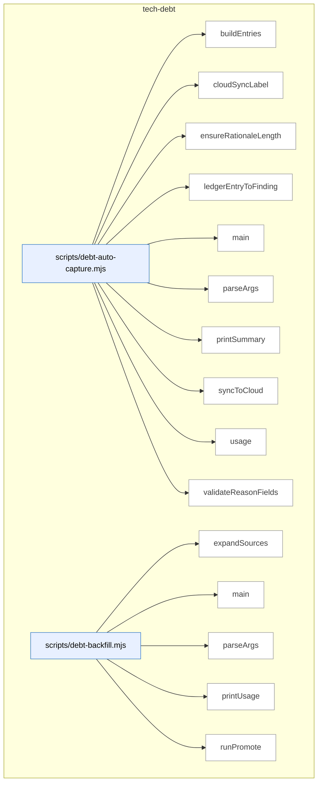

_Domain has 71 symbols (>50). Diagram shows top-15 by file order; see flat table below for the full list._

### Symbols in this domain

| Symbol | Kind | Path | Lines | Purpose | File imported by |
|---|---|---|---|---|---|
| [`buildEntries`](../scripts/debt-auto-capture.mjs#L161) | function | `scripts/debt-auto-capture.mjs` | 161-188 | Builds debt entries from deferred ledger entries with capture arguments. | _(internal)_ |
| [`cloudSyncLabel`](../scripts/debt-auto-capture.mjs#L213) | function | `scripts/debt-auto-capture.mjs` | 213-216 | Returns a label string describing cloud sync status. | _(internal)_ |
| [`ensureRationaleLength`](../scripts/debt-auto-capture.mjs#L120) | function | `scripts/debt-auto-capture.mjs` | 120-128 | Ensures deferred rationale meets minimum length with padding. | _(internal)_ |
| [`ledgerEntryToFinding`](../scripts/debt-auto-capture.mjs#L136) | function | `scripts/debt-auto-capture.mjs` | 136-155 | Transforms an adjudication ledger entry into a finding object. | _(internal)_ |
| [`main`](../scripts/debt-auto-capture.mjs#L247) | function | `scripts/debt-auto-capture.mjs` | 247-325 | <no body> | _(internal)_ |
| [`parseArgs`](../scripts/debt-auto-capture.mjs#L34) | function | `scripts/debt-auto-capture.mjs` | 34-64 | Parses CLI arguments for the debt auto-capture script. | _(internal)_ |
| [`printSummary`](../scripts/debt-auto-capture.mjs#L218) | function | `scripts/debt-auto-capture.mjs` | 218-243 | Prints summary statistics of captured, inserted, and rejected debt entries. | _(internal)_ |
| [`syncToCloud`](../scripts/debt-auto-capture.mjs#L197) | function | `scripts/debt-auto-capture.mjs` | 197-209 | Syncs captured debt entries to cloud via learning store. | _(internal)_ |
| [`usage`](../scripts/debt-auto-capture.mjs#L66) | function | `scripts/debt-auto-capture.mjs` | 66-87 | Prints help text describing debt auto-capture usage and options. | _(internal)_ |
| [`validateReasonFields`](../scripts/debt-auto-capture.mjs#L96) | function | `scripts/debt-auto-capture.mjs` | 96-111 | Validates that required fields match the chosen deferred reason. | _(internal)_ |
| [`expandSources`](../scripts/debt-backfill.mjs#L85) | function | `scripts/debt-backfill.mjs` | 85-107 | Expands glob patterns and file arguments into resolved file paths. | _(internal)_ |
| [`main`](../scripts/debt-backfill.mjs#L265) | function | `scripts/debt-backfill.mjs` | 265-279 | Routes to stage or promote mode based on CLI options. | _(internal)_ |
| [`parseArgs`](../scripts/debt-backfill.mjs#L41) | function | `scripts/debt-backfill.mjs` | 41-56 | Parses CLI arguments for the debt backfill script. | _(internal)_ |
| [`printUsage`](../scripts/debt-backfill.mjs#L58) | function | `scripts/debt-backfill.mjs` | 58-81 | Prints help text describing debt backfill usage and promotion workflow. | _(internal)_ |
| [`runPromote`](../scripts/debt-backfill.mjs#L160) | function | `scripts/debt-backfill.mjs` | 160-261 | <no body> | _(internal)_ |
| [`runStage`](../scripts/debt-backfill.mjs#L111) | function | `scripts/debt-backfill.mjs` | 111-156 | <no body> | _(internal)_ |
| [`loadBudgets`](../scripts/debt-budget-check.mjs#L66) | function | `scripts/debt-budget-check.mjs` | 66-83 | Loads budget limits from external file or ledger's budgets field. | _(internal)_ |
| [`main`](../scripts/debt-budget-check.mjs#L85) | function | `scripts/debt-budget-check.mjs` | 85-136 | <no body> | _(internal)_ |
| [`parseArgs`](../scripts/debt-budget-check.mjs#L33) | function | `scripts/debt-budget-check.mjs` | 33-45 | Parses CLI arguments for the debt budget check script. | _(internal)_ |
| [`printUsage`](../scripts/debt-budget-check.mjs#L47) | function | `scripts/debt-budget-check.mjs` | 47-64 | Prints help text describing budget check usage and configuration. | _(internal)_ |
| [`findTouchedDebt`](../scripts/debt-pr-comment.mjs#L105) | function | `scripts/debt-pr-comment.mjs` | 105-117 | Filters debt entries to those affecting files changed in the PR, using normalized path matching with substring fallback. | _(internal)_ |
| [`groupTouchedByFile`](../scripts/debt-pr-comment.mjs#L120) | function | `scripts/debt-pr-comment.mjs` | 120-128 | Groups touched debt entries by their primary affected file for organized rendering. | _(internal)_ |
| [`loadChangedFiles`](../scripts/debt-pr-comment.mjs#L222) | function | `scripts/debt-pr-comment.mjs` | 222-236 | Loads changed file paths from either a comma-separated string or a newline-delimited file. | _(internal)_ |
| [`main`](../scripts/debt-pr-comment.mjs#L240) | function | `scripts/debt-pr-comment.mjs` | 240-323 | Main entry point that orchestrates reading arguments, loading debt ledger, finding touched and recurring debt, applying thresholds, enriching with git history, and writing output. | _(internal)_ |
| [`parseArgs`](../scripts/debt-pr-comment.mjs#L53) | function | `scripts/debt-pr-comment.mjs` | 53-72 | Parses command-line arguments into a configuration object with flags for changed files, thresholds, output, and options. | _(internal)_ |
| [`printUsage`](../scripts/debt-pr-comment.mjs#L74) | function | `scripts/debt-pr-comment.mjs` | 74-95 | Prints usage documentation explaining the debt-pr-comment tool's purpose, required inputs, options, and exit codes. | _(internal)_ |
| [`renderEntryLine`](../scripts/debt-pr-comment.mjs#L132) | function | `scripts/debt-pr-comment.mjs` | 132-150 | Formats a single debt entry into a markdown line with severity badge, topic ID link, category, owner, occurrences, and deferral date. | _(internal)_ |
| [`renderPrComment`](../scripts/debt-pr-comment.mjs#L152) | function | `scripts/debt-pr-comment.mjs` | 152-218 | Generates a complete PR comment markdown with sections for touched debt and recurring debt, grouped by file and ranked by frequency. | _(internal)_ |
| [`main`](../scripts/debt-resolve.mjs#L73) | function | `scripts/debt-resolve.mjs` | 73-148 | Main entry point that validates arguments, initializes cloud storage, resolves a debt entry by emitting an event and removing it from the ledger. | _(internal)_ |
| [`parseArgs`](../scripts/debt-resolve.mjs#L34) | function | `scripts/debt-resolve.mjs` | 34-52 | Parses command-line arguments into a configuration object with positional topicId and flags for resolution metadata. | _(internal)_ |
| [`printUsage`](../scripts/debt-resolve.mjs#L54) | function | `scripts/debt-resolve.mjs` | 54-71 | Prints usage documentation explaining the debt-resolve tool's purpose, required inputs, options, and exit codes. | _(internal)_ |
| [`main`](../scripts/debt-review.mjs#L332) | function | `scripts/debt-review.mjs` | 332-397 | Main entry point that loads the debt ledger, checks sensitivity constraints, selects clustering mode, and outputs the review report. | _(internal)_ |
| [`parseArgs`](../scripts/debt-review.mjs#L44) | function | `scripts/debt-review.mjs` | 44-60 | Parses command-line arguments into a configuration object with flags for clustering mode, sensitivity inclusion, and output options. | _(internal)_ |
| [`printUsage`](../scripts/debt-review.mjs#L62) | function | `scripts/debt-review.mjs` | 62-80 | Prints usage documentation explaining the debt-review tool's purpose, clustering modes, options, and exit codes. | _(internal)_ |
| [`renderMarkdown`](../scripts/debt-review.mjs#L84) | function | `scripts/debt-review.mjs` | 84-151 | Renders a markdown report of debt clustering results with budget violations, clusters, and ranked refactor candidates. | _(internal)_ |
| [`runLLMClustering`](../scripts/debt-review.mjs#L218) | function | `scripts/debt-review.mjs` | 218-284 | Sends debt entries to an LLM for intelligent clustering and refactor planning, filtering sensitive entries unless explicitly included. | _(internal)_ |
| [`runLocalClustering`](../scripts/debt-review.mjs#L155) | function | `scripts/debt-review.mjs` | 155-183 | Performs deterministic heuristic clustering of debt entries grouped by file/category and generates simple refactor candidates with effort estimates. | _(internal)_ |
| [`writeTopRefactorPlanDoc`](../scripts/debt-review.mjs#L288) | function | `scripts/debt-review.mjs` | 288-328 | Writes the top-ranked refactor plan as a markdown document with modules, effort, risks, and rollback strategy. | _(internal)_ |
| [`buildDebtEntry`](../scripts/lib/debt-capture.mjs#L84) | function | `scripts/lib/debt-capture.mjs` | 84-158 | <no body> | `scripts/debt-auto-capture.mjs`, `scripts/shared.mjs` |
| [`computeSensitivity`](../scripts/lib/debt-capture.mjs#L32) | function | `scripts/lib/debt-capture.mjs` | 32-54 | Scans finding fields for sensitive paths and secret patterns. | `scripts/debt-auto-capture.mjs`, `scripts/shared.mjs` |
| [`suggestDeferralCandidate`](../scripts/lib/debt-capture.mjs#L171) | function | `scripts/lib/debt-capture.mjs` | 171-183 | Determines if a finding is eligible for deferral based on scope and severity. | `scripts/debt-auto-capture.mjs`, `scripts/shared.mjs` |
| [`appendDebtEventsLocal`](../scripts/lib/debt-events.mjs#L34) | function | `scripts/lib/debt-events.mjs` | 34-56 | Appends validated debt events to a local JSONL log file atomically. | `scripts/debt-pr-comment.mjs`, `scripts/debt-resolve.mjs`, `scripts/debt-review.mjs`, +3 more |
| [`deriveMetricsFromEvents`](../scripts/lib/debt-events.mjs#L107) | function | `scripts/lib/debt-events.mjs` | 107-154 | Builds topic-level metrics from event stream including occurrence and escalation counts. | `scripts/debt-pr-comment.mjs`, `scripts/debt-resolve.mjs`, `scripts/debt-review.mjs`, +3 more |
| [`readDebtEventsLocal`](../scripts/lib/debt-events.mjs#L65) | function | `scripts/lib/debt-events.mjs` | 65-87 | Reads and parses debt events from a local JSONL log file. | `scripts/debt-pr-comment.mjs`, `scripts/debt-resolve.mjs`, `scripts/debt-review.mjs`, +3 more |
| [`buildCommitUrl`](../scripts/lib/debt-git-history.mjs#L142) | function | `scripts/lib/debt-git-history.mjs` | 142-144 | Constructs a GitHub commit URL from repo URL and SHA. | `scripts/debt-pr-comment.mjs`, `scripts/shared.mjs` |
| [`countCommitsTouchingTopic`](../scripts/lib/debt-git-history.mjs#L42) | function | `scripts/lib/debt-git-history.mjs` | 42-63 | Counts git commits touching a topic ID in the debt ledger via git log. | `scripts/debt-pr-comment.mjs`, `scripts/shared.mjs` |
| [`deriveOccurrencesFromGit`](../scripts/lib/debt-git-history.mjs#L154) | function | `scripts/lib/debt-git-history.mjs` | 154-161 | Maps debt entries to commit counts using git history. | `scripts/debt-pr-comment.mjs`, `scripts/shared.mjs` |
| [`detectGitHubRepoUrl`](../scripts/lib/debt-git-history.mjs#L119) | function | `scripts/lib/debt-git-history.mjs` | 119-134 | Extracts GitHub repository URL from git remote origin. | `scripts/debt-pr-comment.mjs`, `scripts/shared.mjs` |
| [`findFirstDeferCommit`](../scripts/lib/debt-git-history.mjs#L76) | function | `scripts/lib/debt-git-history.mjs` | 76-108 | Finds the first commit that added a topic ID to the ledger. | `scripts/debt-pr-comment.mjs`, `scripts/shared.mjs` |
| [`findDebtByAlias`](../scripts/lib/debt-ledger.mjs#L273) | function | `scripts/lib/debt-ledger.mjs` | 273-280 | Searches debt entries for a match by topic ID or content alias hash. | `scripts/audit-loop.mjs`, `scripts/debt-auto-capture.mjs`, `scripts/debt-backfill.mjs`, +7 more |
| [`mergeLedgers`](../scripts/lib/debt-ledger.mjs#L252) | function | `scripts/lib/debt-ledger.mjs` | 252-262 | Merges debt and session ledgers by topic ID, with session entries taking precedence on collision. | `scripts/audit-loop.mjs`, `scripts/debt-auto-capture.mjs`, `scripts/debt-backfill.mjs`, +7 more |
| [`readDebtLedger`](../scripts/lib/debt-ledger.mjs#L42) | function | `scripts/lib/debt-ledger.mjs` | 42-89 | Reads and hydrates debt ledger entries with event-derived metrics. | `scripts/audit-loop.mjs`, `scripts/debt-auto-capture.mjs`, `scripts/debt-backfill.mjs`, +7 more |
| [`removeDebtEntry`](../scripts/lib/debt-ledger.mjs#L207) | function | `scripts/lib/debt-ledger.mjs` | 207-236 | Acquires a file lock and removes a debt entry by topic ID from the ledger file. | `scripts/audit-loop.mjs`, `scripts/debt-auto-capture.mjs`, `scripts/debt-backfill.mjs`, +7 more |
| [`writeDebtEntries`](../scripts/lib/debt-ledger.mjs#L107) | function | `scripts/lib/debt-ledger.mjs` | 107-197 | Acquires a file lock, validates and merges debt entries into a JSON ledger, tracking insertions, updates, and rejections. | `scripts/audit-loop.mjs`, `scripts/debt-auto-capture.mjs`, `scripts/debt-backfill.mjs`, +7 more |
| [`appendEvents`](../scripts/lib/debt-memory.mjs#L113) | function | `scripts/lib/debt-memory.mjs` | 113-126 | Appends debt events to cloud or local storage if write permission is enabled. | `scripts/debt-resolve.mjs`, `scripts/openai-audit.mjs`, `scripts/shared.mjs` |
| [`loadDebtLedger`](../scripts/lib/debt-memory.mjs#L83) | function | `scripts/lib/debt-memory.mjs` | 83-100 | Loads debt ledger entries from cloud or local event log depending on the active event source. | `scripts/debt-resolve.mjs`, `scripts/openai-audit.mjs`, `scripts/shared.mjs` |
| [`persistDebtEntries`](../scripts/lib/debt-memory.mjs#L140) | function | `scripts/lib/debt-memory.mjs` | 140-154 | Persists debt entries to local ledger and optionally mirrors them to cloud storage. | `scripts/debt-resolve.mjs`, `scripts/openai-audit.mjs`, `scripts/shared.mjs` |
| [`reconcileLocalToCloud`](../scripts/lib/debt-memory.mjs#L189) | function | `scripts/lib/debt-memory.mjs` | 189-226 | Syncs unreconciled local debt events to cloud, marking them reconciled to avoid duplication. | `scripts/debt-resolve.mjs`, `scripts/openai-audit.mjs`, `scripts/shared.mjs` |
| [`removeDebt`](../scripts/lib/debt-memory.mjs#L159) | function | `scripts/lib/debt-memory.mjs` | 159-168 | Removes a debt entry from both local and cloud storage (if applicable). | `scripts/debt-resolve.mjs`, `scripts/openai-audit.mjs`, `scripts/shared.mjs` |
| [`selectEventSource`](../scripts/lib/debt-memory.mjs#L59) | function | `scripts/lib/debt-memory.mjs` | 59-70 | Selects the event source (disabled, cloud, or local file) based on configuration and write permissions. | `scripts/debt-resolve.mjs`, `scripts/openai-audit.mjs`, `scripts/shared.mjs` |
| [`buildLocalClusters`](../scripts/lib/debt-review-helpers.mjs#L164) | function | `scripts/lib/debt-review-helpers.mjs` | 164-204 | Builds file, principle, and recurrence-based clusters of debt entries for bulk refactoring. | `scripts/audit-loop.mjs`, `scripts/debt-budget-check.mjs`, `scripts/debt-pr-comment.mjs`, +2 more |
| [`computeLeverage`](../scripts/lib/debt-review-helpers.mjs#L45) | function | `scripts/lib/debt-review-helpers.mjs` | 45-57 | Computes a leverage score for a refactor based on effort estimate and cumulative debt impact weights. | `scripts/audit-loop.mjs`, `scripts/debt-budget-check.mjs`, `scripts/debt-pr-comment.mjs`, +2 more |
| [`countDebtByFile`](../scripts/lib/debt-review-helpers.mjs#L213) | function | `scripts/lib/debt-review-helpers.mjs` | 213-221 | Counts debt entries per file. | `scripts/audit-loop.mjs`, `scripts/debt-budget-check.mjs`, `scripts/debt-pr-comment.mjs`, +2 more |
| [`findBudgetViolations`](../scripts/lib/debt-review-helpers.mjs#L238) | function | `scripts/lib/debt-review-helpers.mjs` | 238-264 | Identifies files exceeding configured debt budget limits using glob pattern matching. | `scripts/audit-loop.mjs`, `scripts/debt-budget-check.mjs`, `scripts/debt-pr-comment.mjs`, +2 more |
| [`findRecurringEntries`](../scripts/lib/debt-review-helpers.mjs#L148) | function | `scripts/lib/debt-review-helpers.mjs` | 148-152 | Filters debt entries with occurrence count above a threshold and sorts by distinctRunCount. | `scripts/audit-loop.mjs`, `scripts/debt-budget-check.mjs`, `scripts/debt-pr-comment.mjs`, +2 more |
| [`findStaleEntries`](../scripts/lib/debt-review-helpers.mjs#L83) | function | `scripts/lib/debt-review-helpers.mjs` | 83-92 | Returns topic IDs of debt entries older than a specified TTL threshold. | `scripts/audit-loop.mjs`, `scripts/debt-budget-check.mjs`, `scripts/debt-pr-comment.mjs`, +2 more |
| [`getDefaultMatcher`](../scripts/lib/debt-review-helpers.mjs#L269) | function | `scripts/lib/debt-review-helpers.mjs` | 269-280 | Lazily initializes and returns a glob matcher (micromatch or fallback). | `scripts/audit-loop.mjs`, `scripts/debt-budget-check.mjs`, `scripts/debt-pr-comment.mjs`, +2 more |
| [`groupByFile`](../scripts/lib/debt-review-helpers.mjs#L116) | function | `scripts/lib/debt-review-helpers.mjs` | 116-124 | Groups debt entries by their first affected file. | `scripts/audit-loop.mjs`, `scripts/debt-budget-check.mjs`, `scripts/debt-pr-comment.mjs`, +2 more |
| [`groupByPrinciple`](../scripts/lib/debt-review-helpers.mjs#L131) | function | `scripts/lib/debt-review-helpers.mjs` | 131-139 | Groups debt entries by their first affected principle. | `scripts/audit-loop.mjs`, `scripts/debt-budget-check.mjs`, `scripts/debt-pr-comment.mjs`, +2 more |
| [`oldestEntryDays`](../scripts/lib/debt-review-helpers.mjs#L97) | function | `scripts/lib/debt-review-helpers.mjs` | 97-106 | Calculates the age in days of the oldest debt entry. | `scripts/audit-loop.mjs`, `scripts/debt-budget-check.mjs`, `scripts/debt-pr-comment.mjs`, +2 more |
| [`rankRefactorsByLeverage`](../scripts/lib/debt-review-helpers.mjs#L65) | function | `scripts/lib/debt-review-helpers.mjs` | 65-70 | Ranks refactors by their leverage score in descending order. | `scripts/audit-loop.mjs`, `scripts/debt-budget-check.mjs`, `scripts/debt-pr-comment.mjs`, +2 more |

---

## tests

> The `tests` domain provides test utilities and fixtures for running integration tests across the CLI tools and modules, including helpers for spawning CLI processes, reading/writing test files, and stubbing filesystem operations.

```mermaid
flowchart TB
subgraph dom_tests ["tests"]
  file_tests_ai_context_management_test_mjs["tests/ai-context-management.test.mjs"]:::component
  sym_tests_ai_context_management_test_mjs_rea["readSkillContent"]:::symbol
  file_tests_ai_context_management_test_mjs --> sym_tests_ai_context_management_test_mjs_rea
  file_tests_audit_loop_orchestrator_test_mjs["tests/audit-loop-orchestrator.test.mjs"]:::component
  sym_tests_audit_loop_orchestrator_test_mjs_f["fakeExists"]:::symbol
  file_tests_audit_loop_orchestrator_test_mjs --> sym_tests_audit_loop_orchestrator_test_mjs_f
  file_tests_brainstorm_round_test_mjs["tests/brainstorm-round.test.mjs"]:::component
  sym_tests_brainstorm_round_test_mjs_runHelpe["runHelper"]:::symbol
  file_tests_brainstorm_round_test_mjs --> sym_tests_brainstorm_round_test_mjs_runHelpe
  file_tests_check_context_drift_test_mjs["tests/check-context-drift.test.mjs"]:::component
  sym_tests_check_context_drift_test_mjs_fx["fx"]:::symbol
  file_tests_check_context_drift_test_mjs --> sym_tests_check_context_drift_test_mjs_fx
  file_tests_claudemd_integration_test_mjs["tests/claudemd/integration.test.mjs"]:::component
  sym_tests_claudemd_integration_test_mjs_runL["runLint"]:::symbol
  file_tests_claudemd_integration_test_mjs --> sym_tests_claudemd_integration_test_mjs_runL
  file_tests_code_analysis_test_mjs["tests/code-analysis.test.mjs"]:::component
  sym_tests_code_analysis_test_mjs_writeStub["writeStub"]:::symbol
  file_tests_code_analysis_test_mjs --> sym_tests_code_analysis_test_mjs_writeStub
  file_tests_cross_skill_persona_test_mjs["tests/cross-skill-persona.test.mjs"]:::component
  sym_tests_cross_skill_persona_test_mjs_runCl["runCli"]:::symbol
  file_tests_cross_skill_persona_test_mjs --> sym_tests_cross_skill_persona_test_mjs_runCl
  file_tests_cross_skill_target_domains_test_mj["tests/cross-skill-target-domains.test.mjs"]:::component
  sym_tests_cross_skill_target_domains_test_mj["runCrossSkill"]:::symbol
  file_tests_cross_skill_target_domains_test_mj --> sym_tests_cross_skill_target_domains_test_mj
  file_tests_debt_budget_check_cli_test_mjs["tests/debt-budget-check-cli.test.mjs"]:::component
  sym_tests_debt_budget_check_cli_test_mjs_mak["makeEntry"]:::symbol
  file_tests_debt_budget_check_cli_test_mjs --> sym_tests_debt_budget_check_cli_test_mjs_mak
  sym_tests_debt_budget_check_cli_test_mjs_run["runCli"]:::symbol
  file_tests_debt_budget_check_cli_test_mjs --> sym_tests_debt_budget_check_cli_test_mjs_run
  sym_tests_debt_budget_check_cli_test_mjs_see["seedLedger"]:::symbol
  file_tests_debt_budget_check_cli_test_mjs --> sym_tests_debt_budget_check_cli_test_mjs_see
  file_tests_debt_git_history_test_mjs["tests/debt-git-history.test.mjs"]:::component
  sym_tests_debt_git_history_test_mjs_git["git"]:::symbol
  file_tests_debt_git_history_test_mjs --> sym_tests_debt_git_history_test_mjs_git
  sym_tests_debt_git_history_test_mjs_makeEntr["makeEntry"]:::symbol
  file_tests_debt_git_history_test_mjs --> sym_tests_debt_git_history_test_mjs_makeEntr
  sym_tests_debt_git_history_test_mjs_writeLed["writeLedger"]:::symbol
  file_tests_debt_git_history_test_mjs --> sym_tests_debt_git_history_test_mjs_writeLed
  file_tests_debt_ledger_test_mjs["tests/debt-ledger.test.mjs"]:::component
  sym_tests_debt_ledger_test_mjs_makeEntry["makeEntry"]:::symbol
  file_tests_debt_ledger_test_mjs --> sym_tests_debt_ledger_test_mjs_makeEntry
  file_tests_debt_pr_comment_cli_test_mjs["tests/debt-pr-comment-cli.test.mjs"]:::component
  sym_tests_debt_pr_comment_cli_test_mjs_makeE["makeEntry"]:::symbol
  file_tests_debt_pr_comment_cli_test_mjs --> sym_tests_debt_pr_comment_cli_test_mjs_makeE
  sym_tests_debt_pr_comment_cli_test_mjs_runCl["runCli"]:::symbol
  file_tests_debt_pr_comment_cli_test_mjs --> sym_tests_debt_pr_comment_cli_test_mjs_runCl
  sym_tests_debt_pr_comment_cli_test_mjs_seedL["seedLedger"]:::symbol
  file_tests_debt_pr_comment_cli_test_mjs --> sym_tests_debt_pr_comment_cli_test_mjs_seedL
  file_tests_debt_pr_comment_test_mjs["tests/debt-pr-comment.test.mjs"]:::component
  sym_tests_debt_pr_comment_test_mjs_makeEntry["makeEntry"]:::symbol
  file_tests_debt_pr_comment_test_mjs --> sym_tests_debt_pr_comment_test_mjs_makeEntry
  file_tests_debt_resolve_cli_test_mjs["tests/debt-resolve-cli.test.mjs"]:::component
  sym_tests_debt_resolve_cli_test_mjs_makeEntr["makeEntry"]:::symbol
  file_tests_debt_resolve_cli_test_mjs --> sym_tests_debt_resolve_cli_test_mjs_makeEntr
  sym_tests_debt_resolve_cli_test_mjs_runCli["runCli"]:::symbol
  file_tests_debt_resolve_cli_test_mjs --> sym_tests_debt_resolve_cli_test_mjs_runCli
  file_tests_debt_review_helpers_test_mjs["tests/debt-review-helpers.test.mjs"]:::component
  sym_tests_debt_review_helpers_test_mjs_makeE["makeEntry"]:::symbol
  file_tests_debt_review_helpers_test_mjs --> sym_tests_debt_review_helpers_test_mjs_makeE
  file_tests_debt_suppression_test_mjs["tests/debt-suppression.test.mjs"]:::component
  sym_tests_debt_suppression_test_mjs_debtEntr["debtEntry"]:::symbol
  file_tests_debt_suppression_test_mjs --> sym_tests_debt_suppression_test_mjs_debtEntr
  sym_tests_debt_suppression_test_mjs_makeFind["makeFinding"]:::symbol
  file_tests_debt_suppression_test_mjs --> sym_tests_debt_suppression_test_mjs_makeFind
  sym_tests_debt_suppression_test_mjs_sessionE["sessionEntry"]:::symbol
  file_tests_debt_suppression_test_mjs --> sym_tests_debt_suppression_test_mjs_sessionE
  file_tests_debt_transcript_suppression_test_m["tests/debt-transcript-suppression.test.mjs"]:::component
  sym_tests_debt_transcript_suppression_test_m["reSuppressAgainstDebt"]:::symbol
  file_tests_debt_transcript_suppression_test_m --> sym_tests_debt_transcript_suppression_test_m
  file_tests_file_io_test_mjs["tests/file-io.test.mjs"]:::component
  sym_tests_file_io_test_mjs_makeDiffMap["makeDiffMap"]:::symbol
  file_tests_file_io_test_mjs --> sym_tests_file_io_test_mjs_makeDiffMap
  file_tests_hook_arch_memory_check_test_mjs["tests/hook-arch-memory-check.test.mjs"]:::component
  sym_tests_hook_arch_memory_check_test_mjs_ru["runHook"]:::symbol
  file_tests_hook_arch_memory_check_test_mjs --> sym_tests_hook_arch_memory_check_test_mjs_ru
  file_tests_install_lifecycle_test_mjs["tests/install/lifecycle.test.mjs"]:::component
  sym_tests_install_lifecycle_test_mjs_journal["journalPath"]:::symbol
  file_tests_install_lifecycle_test_mjs --> sym_tests_install_lifecycle_test_mjs_journal
  sym_tests_install_lifecycle_test_mjs_sha12["sha12"]:::symbol
  file_tests_install_lifecycle_test_mjs --> sym_tests_install_lifecycle_test_mjs_sha12
  file_tests_meta_assess_test_mjs["tests/meta-assess.test.mjs"]:::component
  sym_tests_meta_assess_test_mjs_makeOutcome["makeOutcome"]:::symbol
  file_tests_meta_assess_test_mjs --> sym_tests_meta_assess_test_mjs_makeOutcome
  sym_tests_meta_assess_test_mjs_makeOutcomes["makeOutcomes"]:::symbol
  file_tests_meta_assess_test_mjs --> sym_tests_meta_assess_test_mjs_makeOutcomes
  file_tests_neighbourhood_query_test_mjs["tests/neighbourhood-query.test.mjs"]:::component
  sym_tests_neighbourhood_query_test_mjs_tempR["tempRoot"]:::symbol
  file_tests_neighbourhood_query_test_mjs --> sym_tests_neighbourhood_query_test_mjs_tempR
  file_tests_owner_resolver_test_mjs["tests/owner-resolver.test.mjs"]:::component
  sym_tests_owner_resolver_test_mjs_seed["seed"]:::symbol
  file_tests_owner_resolver_test_mjs --> sym_tests_owner_resolver_test_mjs_seed
  file_tests_repo_stack_test_mjs["tests/repo-stack.test.mjs"]:::component
  sym_tests_repo_stack_test_mjs_write["write"]:::symbol
  file_tests_repo_stack_test_mjs --> sym_tests_repo_stack_test_mjs_write
  file_tests_shared_test_mjs["tests/shared.test.mjs"]:::component
  sym_tests_shared_test_mjs_makeLedgerEntry["makeLedgerEntry"]:::symbol
  file_tests_shared_test_mjs --> sym_tests_shared_test_mjs_makeLedgerEntry
  file_tests_skill_packaging_test_mjs["tests/skill-packaging.test.mjs"]:::component
  sym_tests_skill_packaging_test_mjs_write["write"]:::symbol
  file_tests_skill_packaging_test_mjs --> sym_tests_skill_packaging_test_mjs_write
  file_tests_skill_refs_parser_test_mjs["tests/skill-refs-parser.test.mjs"]:::component
  sym_tests_skill_refs_parser_test_mjs_write["write"]:::symbol
  file_tests_skill_refs_parser_test_mjs --> sym_tests_skill_refs_parser_test_mjs_write
  file_tests_snapshot_retention_test_mjs["tests/snapshot-retention.test.mjs"]:::component
  sym_tests_snapshot_retention_test_mjs_classi["classifyForPrune"]:::symbol
  file_tests_snapshot_retention_test_mjs --> sym_tests_snapshot_retention_test_mjs_classi
  file_tests_stores_factory_test_mjs["tests/stores/factory.test.mjs"]:::component
  sym_tests_stores_factory_test_mjs_createMock["createMockDriver"]:::symbol
  file_tests_stores_factory_test_mjs --> sym_tests_stores_factory_test_mjs_createMock
  file_tests_sync_shared_audit_refs_test_mjs["tests/sync-shared-audit-refs.test.mjs"]:::component
  sym_tests_sync_shared_audit_refs_test_mjs_se["setupRepo"]:::symbol
  file_tests_sync_shared_audit_refs_test_mjs --> sym_tests_sync_shared_audit_refs_test_mjs_se
  sym_tests_sync_shared_audit_refs_test_mjs_te["teardown"]:::symbol
  file_tests_sync_shared_audit_refs_test_mjs --> sym_tests_sync_shared_audit_refs_test_mjs_te
end
classDef container fill:#f5f5f5,stroke:#333,stroke-width:2px,color:#000
classDef component fill:#e8f0ff,stroke:#3178c6,color:#000
classDef symbol fill:#fff,stroke:#999,color:#444
classDef dup fill:#ffe8d8,stroke:#c0392b,stroke-width:2px,color:#000
classDef violation fill:#ffd6d6,stroke:#c0392b,stroke-width:2px,color:#000
```

### Symbols in this domain

| Symbol | Kind | Path | Lines | Purpose | File imported by |
|---|---|---|---|---|---|
| [`readSkillContent`](../tests/ai-context-management.test.mjs#L26) | function | `tests/ai-context-management.test.mjs` | 26-28 | Reads skill markdown file content synchronously. | _(internal)_ |
| [`fakeExists`](../tests/audit-loop-orchestrator.test.mjs#L9) | function | `tests/audit-loop-orchestrator.test.mjs` | 9-12 | Creates a function that checks membership in a set of file paths. | _(internal)_ |
| [`runHelper`](../tests/brainstorm-round.test.mjs#L17) | function | `tests/brainstorm-round.test.mjs` | 17-23 | Spawns a helper script with given arguments and stdin, returning execution result. | _(internal)_ |
| [`fx`](../tests/check-context-drift.test.mjs#L16) | function | `tests/check-context-drift.test.mjs` | 16-18 | Joins fixture directory name to base fixtures path. | _(internal)_ |
| [`runLint`](../tests/claudemd/integration.test.mjs#L10) | function | `tests/claudemd/integration.test.mjs` | 10-21 | Runs claudemd CLI linter and returns stdout, stderr, and exit code. | _(internal)_ |
| [`writeStub`](../tests/code-analysis.test.mjs#L336) | function | `tests/code-analysis.test.mjs` | 336-339 | Writes a file filled with repeated characters to reach target byte size. | _(internal)_ |
| [`runCli`](../tests/cross-skill-persona.test.mjs#L8) | function | `tests/cross-skill-persona.test.mjs` | 8-27 | Spawns CLI with isolated environment (no Supabase vars) to test offline mode. | _(internal)_ |
| [`runCrossSkill`](../tests/cross-skill-target-domains.test.mjs#L13) | function | `tests/cross-skill-target-domains.test.mjs` | 13-18 | Runs cross-skill command with JSON payload in offline mode. | _(internal)_ |
| [`makeEntry`](../tests/debt-budget-check-cli.test.mjs#L17) | function | `tests/debt-budget-check-cli.test.mjs` | 17-28 | Creates a test ledger entry with debt fields and deferred reason. | _(internal)_ |
| [`runCli`](../tests/debt-budget-check-cli.test.mjs#L35) | function | `tests/debt-budget-check-cli.test.mjs` | 35-37 | Spawns debt budget CLI script with arguments. | _(internal)_ |
| [`seedLedger`](../tests/debt-budget-check-cli.test.mjs#L30) | function | `tests/debt-budget-check-cli.test.mjs` | 30-33 | Writes ledger JSON to disk with version and optional budgets. | _(internal)_ |
| [`git`](../tests/debt-git-history.test.mjs#L25) | function | `tests/debt-git-history.test.mjs` | 25-36 | Runs git command in temporary directory, optionally suppressing errors. | _(internal)_ |
| [`makeEntry`](../tests/debt-git-history.test.mjs#L43) | function | `tests/debt-git-history.test.mjs` | 43-54 | Creates a test debt ledger entry with deferred metadata. | _(internal)_ |
| [`writeLedger`](../tests/debt-git-history.test.mjs#L38) | function | `tests/debt-git-history.test.mjs` | 38-41 | Writes ledger JSON with entries to .audit/tech-debt.json. | _(internal)_ |
| [`makeEntry`](../tests/debt-ledger.test.mjs#L23) | function | `tests/debt-ledger.test.mjs` | 23-43 | Builds a complete test ledger entry with all required fields. | _(internal)_ |
| [`makeEntry`](../tests/debt-pr-comment-cli.test.mjs#L17) | function | `tests/debt-pr-comment-cli.test.mjs` | 17-28 | Creates a test entry with severity customization for debt testing. | _(internal)_ |
| [`runCli`](../tests/debt-pr-comment-cli.test.mjs#L34) | function | `tests/debt-pr-comment-cli.test.mjs` | 34-39 | Spawns debt PR comment CLI script with arguments. | _(internal)_ |
| [`seedLedger`](../tests/debt-pr-comment-cli.test.mjs#L30) | function | `tests/debt-pr-comment-cli.test.mjs` | 30-32 | Writes ledger JSON to disk containing entries array. | _(internal)_ |
| [`makeEntry`](../tests/debt-pr-comment.test.mjs#L14) | function | `tests/debt-pr-comment.test.mjs` | 14-25 | Creates a simplified debt entry for PR comment display testing. | _(internal)_ |
| [`makeEntry`](../tests/debt-resolve-cli.test.mjs#L20) | function | `tests/debt-resolve-cli.test.mjs` | 20-29 | Creates a test ledger entry for debt resolution CLI testing. | _(internal)_ |
| [`runCli`](../tests/debt-resolve-cli.test.mjs#L31) | function | `tests/debt-resolve-cli.test.mjs` | 31-36 | Spawns debt resolution CLI script with arguments. | _(internal)_ |
| [`makeEntry`](../tests/debt-review-helpers.test.mjs#L24) | function | `tests/debt-review-helpers.test.mjs` | 24-36 | Creates a test debt review entry with optional field overrides. | _(internal)_ |
| [`debtEntry`](../tests/debt-suppression.test.mjs#L42) | function | `tests/debt-suppression.test.mjs` | 42-57 | Creates a debt-sourced ledger entry for suppression matching. | _(internal)_ |
| [`makeFinding`](../tests/debt-suppression.test.mjs#L12) | function | `tests/debt-suppression.test.mjs` | 12-23 | Creates a test finding object with metadata population. | _(internal)_ |
| [`sessionEntry`](../tests/debt-suppression.test.mjs#L25) | function | `tests/debt-suppression.test.mjs` | 25-40 | Creates a session-sourced ledger entry for debt suppression testing. | _(internal)_ |
| [`reSuppressAgainstDebt`](../tests/debt-transcript-suppression.test.mjs#L19) | function | `tests/debt-transcript-suppression.test.mjs` | 19-44 | Matches new findings against deferred debt using Jaccard similarity scoring. | _(internal)_ |
| [`makeDiffMap`](../tests/file-io.test.mjs#L16) | function | `tests/file-io.test.mjs` | 16-20 | Converts array of [path, hunks] pairs into a Map keyed by file path. | _(internal)_ |
| [`runHook`](../tests/hook-arch-memory-check.test.mjs#L25) | function | `tests/hook-arch-memory-check.test.mjs` | 25-40 | Executes architecture memory check hook script and measures latency. | _(internal)_ |
| [`journalPath`](../tests/install/lifecycle.test.mjs#L14) | function | `tests/install/lifecycle.test.mjs` | 14-14 | Returns path to install transaction journal file in temp directory. | _(internal)_ |
| [`sha12`](../tests/install/lifecycle.test.mjs#L13) | function | `tests/install/lifecycle.test.mjs` | 13-13 | Returns first 12 characters of SHA-256 hash of buffer. | _(internal)_ |
| [`makeOutcome`](../tests/meta-assess.test.mjs#L12) | function | `tests/meta-assess.test.mjs` | 12-24 | Creates a mock assessment finding outcome with configurable overrides for test scenarios. | _(internal)_ |
| [`makeOutcomes`](../tests/meta-assess.test.mjs#L26) | function | `tests/meta-assess.test.mjs` | 26-32 | Generates an array of mock outcomes with sequentially adjusted timestamps and finding IDs. | _(internal)_ |
| [`tempRoot`](../tests/neighbourhood-query.test.mjs#L9) | function | `tests/neighbourhood-query.test.mjs` | 9-12 | Creates and returns a temporary directory for test file operations. | _(internal)_ |
| [`seed`](../tests/owner-resolver.test.mjs#L21) | function | `tests/owner-resolver.test.mjs` | 21-25 | Writes a CODEOWNERS file to a temporary directory structure for ownership resolution testing. | _(internal)_ |
| [`write`](../tests/repo-stack.test.mjs#L14) | function | `tests/repo-stack.test.mjs` | 14-17 | Writes a file to a temporary directory, creating parent directories as needed. | _(internal)_ |
| [`makeLedgerEntry`](../tests/shared.test.mjs#L149) | function | `tests/shared.test.mjs` | 149-168 | Creates a mock ledger entry object representing an audited code finding with its metadata. | _(internal)_ |
| [`write`](../tests/skill-packaging.test.mjs#L12) | function | `tests/skill-packaging.test.mjs` | 12-16 | Writes a file to a temporary directory with automatic parent directory creation. | _(internal)_ |
| [`write`](../tests/skill-refs-parser.test.mjs#L14) | function | `tests/skill-refs-parser.test.mjs` | 14-18 | Writes a file to a temporary directory with automatic parent directory creation. | _(internal)_ |
| [`classifyForPrune`](../tests/snapshot-retention.test.mjs#L17) | function | `tests/snapshot-retention.test.mjs` | 17-25 | Classifies test snapshot runs by retention policy and age to determine whether to keep or prune them. | _(internal)_ |
| [`createMockDriver`](../tests/stores/factory.test.mjs#L6) | function | `tests/stores/factory.test.mjs` | 6-25 | Creates a mock database driver object that simulates query and exec operations without actual persistence. | _(internal)_ |
| [`setupRepo`](../tests/sync-shared-audit-refs.test.mjs#L11) | function | `tests/sync-shared-audit-refs.test.mjs` | 11-16 | Initializes a temporary repository structure with audit and skills directories for sync testing. | _(internal)_ |
| [`teardown`](../tests/sync-shared-audit-refs.test.mjs#L18) | function | `tests/sync-shared-audit-refs.test.mjs` | 18-21 | Deletes the temporary test repository and clears the reference variable. | _(internal)_ |

---

## Layering violations

_No violations detected on this snapshot._

---

## How to regenerate

```bash
npm run arch:refresh   # update the index
npm run arch:render    # regenerate this file
```

## How to interpret

- Each domain has a Mermaid diagram (containers → components → symbols) and a flat table.
- **Duplication clusters** appear with `[DUP]` in the table and the `dup` class in Mermaid.
- Layering violations appear in the dedicated section above.
- Anchor links remain stable across regenerations as long as symbol names don't change.
- The "File imported by" column lists the top files that import the file each symbol lives in (alphabetical, top 3, suffix `, +N more` if more exist). All symbols in the same file share the same list — the data is **file-level, not per-symbol** (Plan v6 §2.6).

---

## Plan a change in this area

- **Quick**: `/plan <task description>` — auto-detects scope + consults this index for near-duplicates
- **Onboarding / refactor safety**: `/explain <file:line>` — shows domain + git history + principles
- **Drift triage**: `npm run arch:duplicates` — top cross-file duplicate clusters worth refactoring
- **Full cycle**: `/cycle <task>` — runs plan → audit-plan → impl gate → audit-code → ship end-to-end
